# 毕业于 GAN：从理解生成对抗网络到运行自己的网络

> 原文：[`www.kdnuggets.com/2019/04/graduating-gans-understanding-generative-adversarial-networks.html/2`](https://www.kdnuggets.com/2019/04/graduating-gans-understanding-generative-adversarial-networks.html/2)

 评论

### Inception Score

发明于 Salimans 等人 2016 年的 ‘[改进的 GAN 训练技术](https://arxiv.org/abs/1606.03498)’，Inception Score 基于一个启发式方法，即真实的样本在通过预训练网络（如 ImageNet 上的 Inception）时应能够被分类。技术上，这意味着样本的熵软最大化预测向量应该较低。

除了高可预测性（低熵）外，Inception Score 还根据生成样本的多样性来评估生成对抗网络（GAN）（例如，生成样本分布的方差或熵）。这意味着不应存在任何主导类别。

如果满足这两个特性，那么应该会有一个较大的 Inception Score。结合这两个标准的方法是通过评估样本的条件标签分布与所有样本的边际分布之间的 Kullback-Leibler（KL）散度来实现的。

### Fréchet Inception Distance

由 [Heusel 等人 2017](https://arxiv.org/abs/1706.08500) 提出的 FID 通过测量生成图像分布与真实分布之间的距离来估计现实性。FID 将一组生成样本嵌入到由 Inception Net 的特定层给出的特征空间中。这个嵌入层被视为一个连续的多元高斯分布，然后为生成数据和真实数据估计均值和协方差。这两个高斯分布（也称为 Wasserstein-2 距离）之间的 Fréchet 距离用于量化生成样本的质量。较低的 FID 表示真实样本和生成样本更相似。

一个重要的注意事项是，FID 需要足够的样本量才能给出良好的结果（建议样本量 = 50k 样本）。如果样本过少，你将会高估实际 FID，估计值的方差也会很大。

> 要查看 Inception Scores 和 FID 分数在不同论文中的差异，请参阅 Neal Jean 的帖子 [这里](https://nealjean.com/ml/frechet-inception-distance/)。

### 想要查看更多？

Aji Borji 的论文 ‘[GAN 评估度量的优缺点](http://Pros%20and%20Cons%20of%20GAN%20Evaluation%20Measures)’ 包含了一张包含更全面 GAN 评估度量的优秀表格：

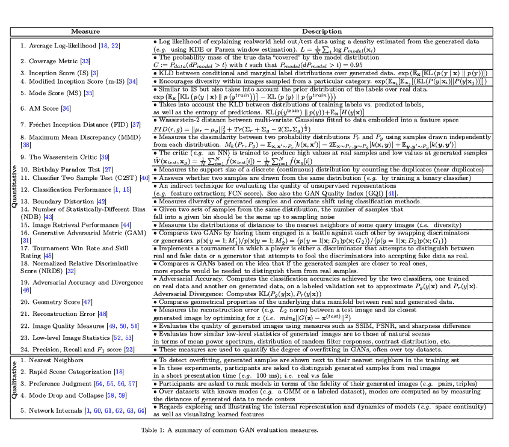

**有趣的是，其他研究者正在通过使用特定领域的评估指标来采取不同的方法。** 对于文本 GAN，Guy Tevet 及其团队在他们的论文‘[Evaluating Text GANs as Language Models](https://arxiv.org/abs/1810.12686)’中提出使用传统的基于概率的语言模型指标来评估 GAN 生成的文本的分布。

在‘[How good is my GAN?](https://arxiv.org/abs/1807.09499)’中，Konstantin Shmelkov 及其团队使用了基于图像分类的两个度量，GAN-train 和 GAN-test，分别近似 GAN 的召回率（多样性）和精确度（图像质量）。你可以在 Google Brain 的研究论文‘[Are GANs created equal](https://arxiv.org/abs/1711.10337)’中看到这些评估指标的实际应用，他们使用了一个三角形数据集来测量不同 GAN 模型的精确度和召回率。

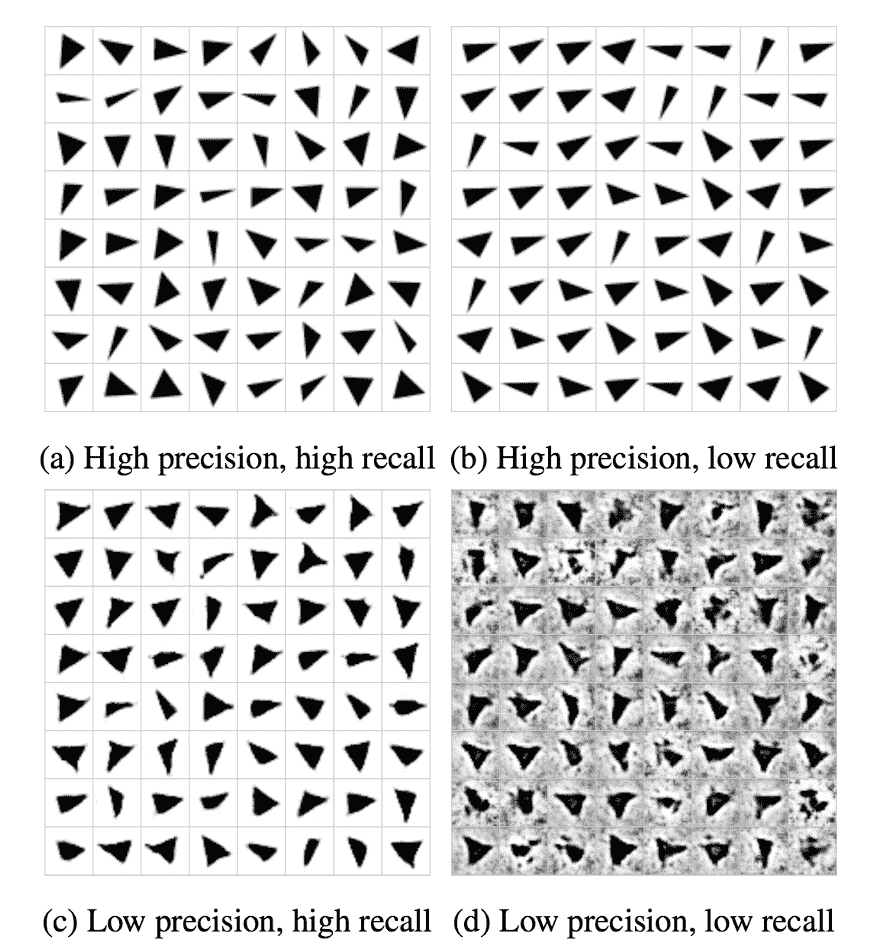

### 运行你自己的 GAN

为了说明 GAN，我们将采用[这个优秀的教程](https://www.wouterbulten.nl/blog/tech/getting-started-with-generative-adversarial-networks/)，该教程使用 Keras 和 MNIST 数据集生成手写数字。

查看完整的教程笔记本 [这里](https://gist.github.com/ceceshao1/935ea6000c8509a28130d4c55b32fcd6)。

我们将通过可视化我们的损失和准确率曲线来跟踪 GAN 的进展，同时通过[Comet.ml](http://bit.ly/2WGduCM)检查测试输出。

这个 GAN 模型将 MNIST 训练数据和随机噪声作为输入（具体来说，是随机噪声向量）来生成：

+   图像（在这种情况下，是手写数字的图像）。*最终，这些生成的图像将类似于 MNIST 数据集的数据分布。*

+   判别器对生成图像的预测

**生成器**和**判别器**模型共同构成了对抗模型——在这个例子中，如果对抗模型将生成的图像分类为真实，那么生成器将表现良好。

查看完整代码 [这里](https://gist.github.com/ceceshao1/935ea6000c8509a28130d4c55b32fcd6) 和完整的 Comet 实验结果 [这里](https://www.comet.ml/ceceshao1/mnist-gan)

### 跟踪模型的进展

我们能够通过[Comet.ml](http://bit.ly/2WGduCM)跟踪我们**生成器**和**判别器**模型的训练进展。

我们绘制了判别器和对抗模型的准确率和损失——这里最重要的指标是：

+   判别器的损失（见右侧图表中的蓝线）——*dis_loss*

+   对抗模型的准确率（见左侧图表中的蓝线）——*acc_adv*

**查看此实验的训练进展** [**这里**](https://www.comet.ml/ceceshao1/mnist-gan/cf310adacd724bf280323e2eef92d1cd/chart)**。**

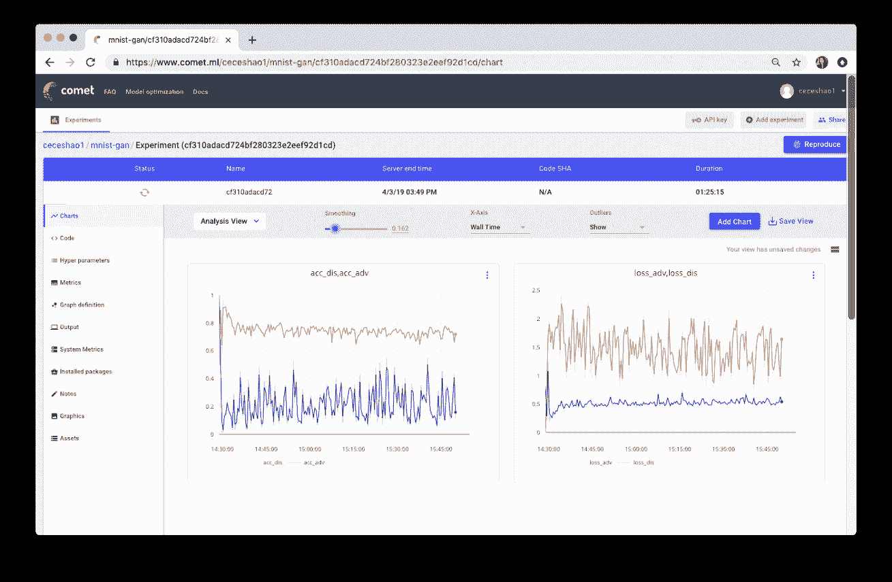

你还需要确认你的训练过程实际上在使用 GPU，你可以在[Comet 系统指标选项卡](https://www.comet.ml/ceceshao1/mnist-gan/cf310adacd724bf280323e2eef92d1cd/systemMetrics)中检查这一点。

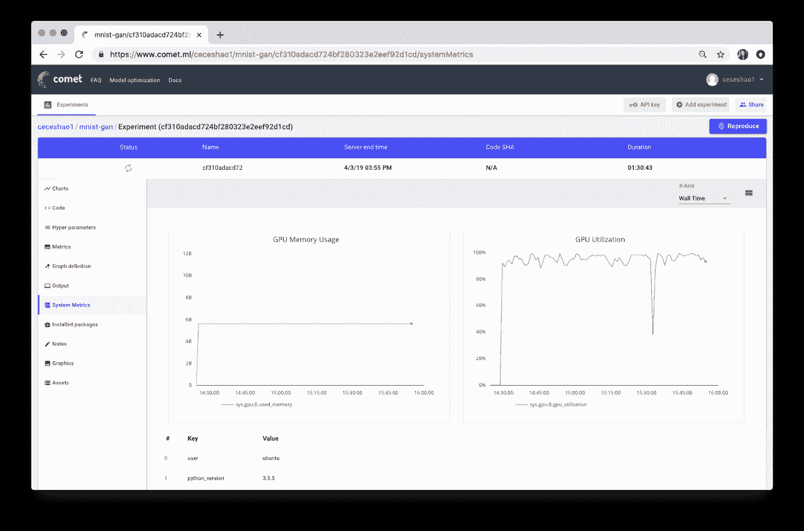

你会注意到我们的训练循环包括报告测试向量图像的代码：

```py

if i % 500 == 0:
        # Visualize the performance of the generator by producing images from the test vector
        images = net_generator.predict(vis_noise)
        # Map back to original range
        #images = (images + 1 ) * 0.5
        plt.figure(figsize=(10,10))

        for im in range(images.shape[0]):
            plt.subplot(4, 4, im+1)
            image = images[im, :, :, :]
            image = np.reshape(image, [28, 28])

            plt.imshow(image, cmap='gray')
            plt.axis('off')

        plt.tight_layout()
        # plt.savefig('/home/ubuntu/cecelia/deeplearning-resources/output/mnist-normal/{}.png'.format(i))

        plt.savefig(r'output/mnist-normal/{}.png'.format(i))

        experiment.log_image(r'output/mnist-normal/{}.png'.format(i))

        plt.close('all')

```

我们每隔几个步骤报告生成的输出部分原因是为了便于我们视觉上分析生成器和判别器模型在生成逼真的手写数字和正确分类生成的数字（分别为‘真实’或‘虚假’）方面的表现。

### 让我们来看看这些生成的输出！

> 在[这个 Comet 实验](https://www.comet.ml/ceceshao1/mnist-gan)中查看生成的输出

你可以看到生成器模型开始时输出的是模糊的灰色图像（见下图 0.png），看起来并不像我们预期的手写数字。

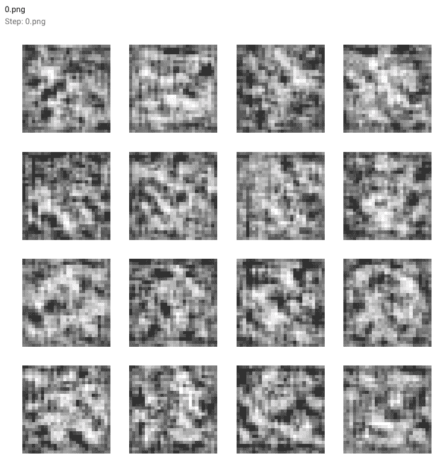

随着训练的进展和模型损失的下降，生成的数字变得越来越清晰。查看生成的输出：

**第 500 步：**

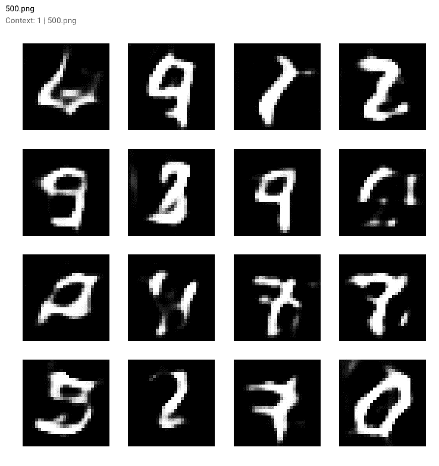

**第 1000 步：**

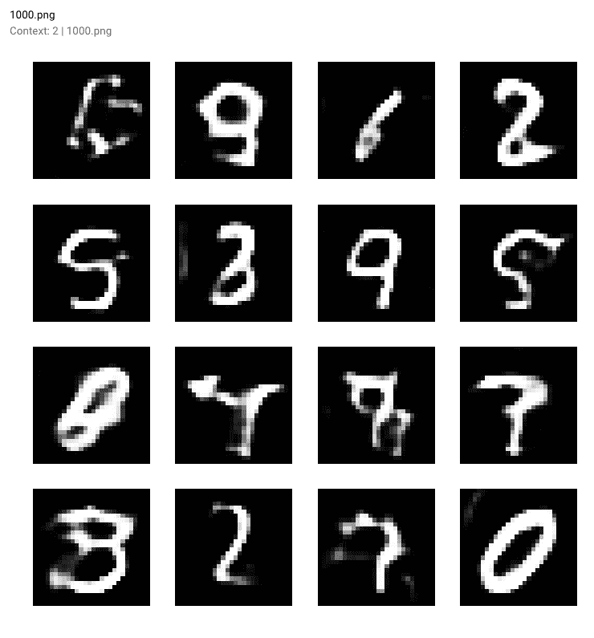

**第 1500 步：**

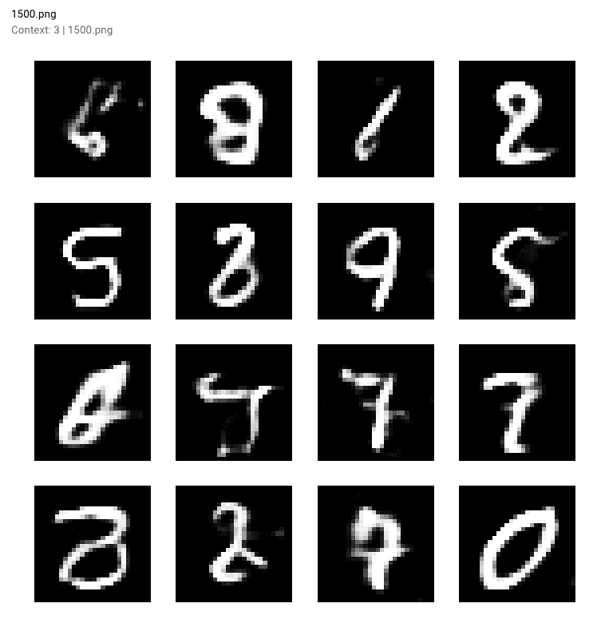

最终在**第 10,000 步**——你可以看到下面红色轮廓框中的一些 GAN 生成的数字样本

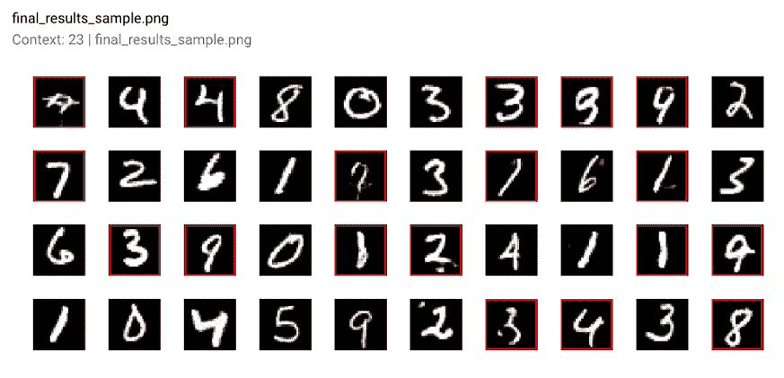

一旦我们的 GAN 模型训练完成，我们甚至可以在[Comet 的图形选项卡](https://www.comet.ml/ceceshao1/mnist-gan/cf310adacd724bf280323e2eef92d1cd/images)中查看我们报告的输出作为一部电影（只需按播放按钮！）。

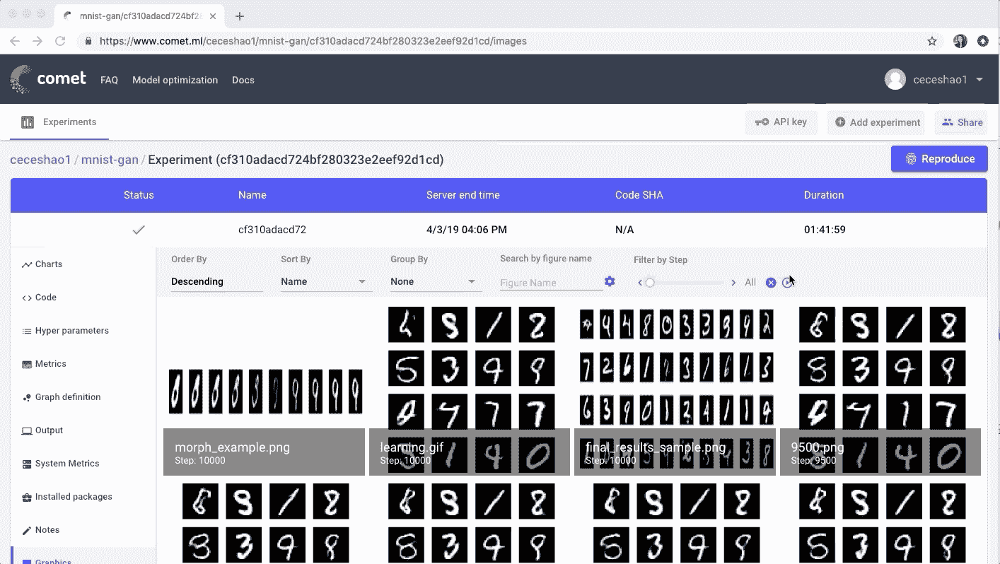

为了完成实验，请确保运行`experiment.end()`以查看有关模型和 GPU 使用的一些总结统计数据。

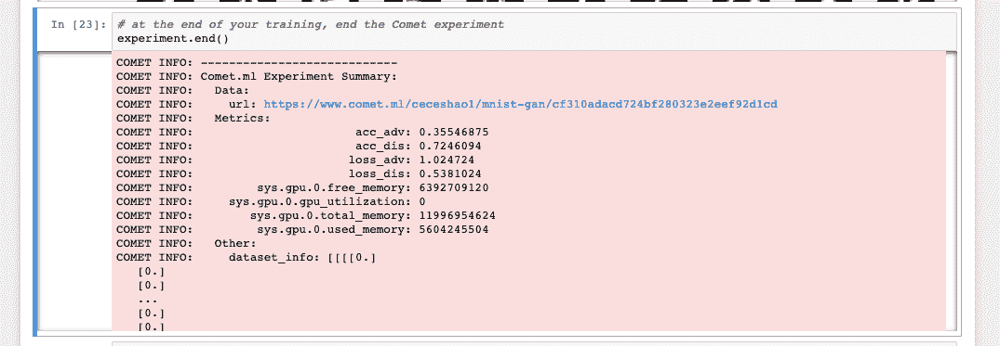

### 用你的模型进行迭代

我们可以将模型训练得更久，看看这对性能的影响，但我们可以尝试使用几个不同的参数进行迭代。

我们尝试的一些参数包括：

+   判别器的优化器

+   学习率

+   dropout 概率

+   批量大小

从 Wouter 的[原始博客文章](https://www.wouterbulten.nl/blog/tech/getting-started-with-generative-adversarial-networks/)中，他提到他在测试参数时的努力：

> 我测试了`SGD`、`RMSprop`和`Adam`作为判别器的优化器，但`RMSprop`表现最佳。`RMSprop`使用了较低的学习率，并且我将值剪裁在-1 和 1 之间。学习率的小幅衰减可以帮助稳定训练过程。

我们将尝试将判别器的丢弃概率从 0.4 提高到 0.5，同时将判别器的学习率（从 0.008 提高到 0.0009）和生成器的学习率（从 0.0004 提高到 0.0006）也提高。很容易看出这些变化可能失控且难以跟踪…????

要创建不同的实验，只需再次运行实验定义单元，[Comet](http://www.comet.ml) 将为你的新实验发出一个新的网址！跟踪你的实验很有用，这样你可以比较不同之处：

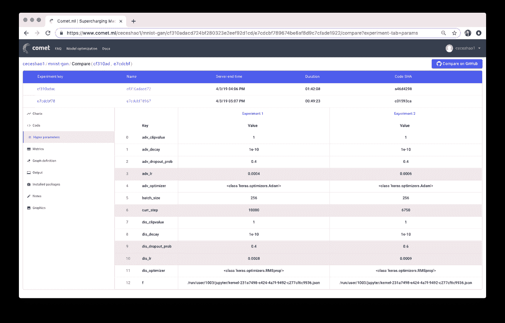[查看两个实验超参数之间的差异](https://www.comet.ml/ceceshao1/mnist-gan/cf310adacd724bf280323e2eef92d1cd/e7cdcbf789674be6af8d9c7cfade1922/compare?experiment-tab=params)。你能找到我们在学习率和丢弃概率方面做出的差异吗？

不幸的是，我们的调整并没有改善模型的表现！实际上，它生成了一些奇怪的输出：

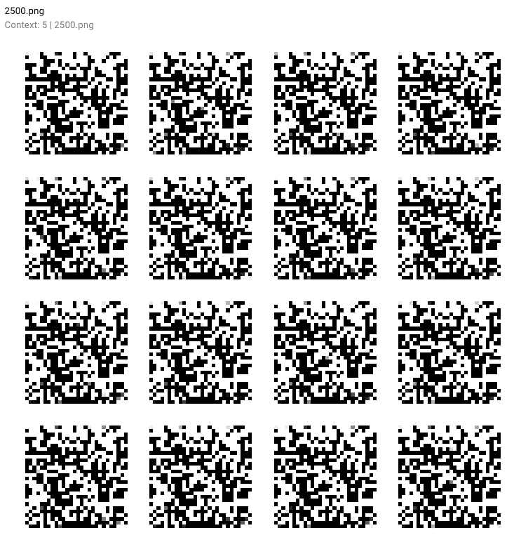

本教程到此为止！如果你喜欢这篇文章，请随时分享给可能觉得有用的朋友????

**简介：[Cecilia Shao](https://www.linkedin.com/in/ceceliashao/)** 负责 [comet.ml](https://www.comet.ml/) 的产品增长。

[原文](https://towardsdatascience.com/graduating-in-gans-going-from-understanding-generative-adversarial-networks-to-running-your-own-39804c283399)。转载经许可。

**相关内容：**

+   Keras 中的 MNIST 生成对抗模型

+   在命令行中使用 TensorFlow 创建你的第一个 GitHub 项目

+   构建一个基本的 Keras 神经网络顺序模型

* * *

## 我们的三大课程推荐

 1\. [谷歌网络安全证书](https://www.kdnuggets.com/google-cybersecurity) - 快速进入网络安全职业。

 2\. [谷歌数据分析专业证书](https://www.kdnuggets.com/google-data-analytics) - 提升你的数据分析能力

 3\. [谷歌 IT 支持专业证书](https://www.kdnuggets.com/google-itsupport) - 支持你的组织 IT

* * *

### 更多相关内容

+   [如何掌握 AI 世界的最新动态](https://www.kdnuggets.com/2022/03/stay-top-going-ai-world.html)

+   [Python 中的情感分析：超越词袋模型](https://www.kdnuggets.com/sentiment-analysis-in-python-going-beyond-bag-of-words)

+   [LangChain 101：构建你自己的 GPT 驱动应用程序](https://www.kdnuggets.com/2023/04/langchain-101-build-gptpowered-applications.html)

+   [使用 LlamaIndex 构建你自己的 PandasAI](https://www.kdnuggets.com/build-your-own-pandasai-with-llamaindex)

+   [使用 ChatGPT 的 GPTs 创建属于你自己的 GPTs！](https://www.kdnuggets.com/make-your-own-gpts-with-chatgpts-gpts)

+   [什么是对抗性机器学习？](https://www.kdnuggets.com/2022/03/adversarial-machine-learning.html)
