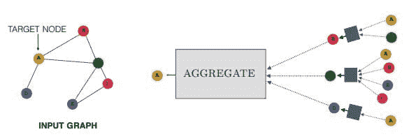

# 图表示学习：免费电子书

> 原文：[`www.kdnuggets.com/2021/01/graph-representation-learning-book-free-ebook.html`](https://www.kdnuggets.com/2021/01/graph-representation-learning-book-free-ebook.html)

评论

近年来，图分析和图在机器学习中的应用迅速增长。如果您需要一个入门点来了解这个领域，我们正好有您需要的免费电子书：**[图表示学习](https://www.cs.mcgill.ca/~wlh/grl_book/)**。

* * *

## 我们的前三大课程推荐

 1\. [谷歌网络安全证书](https://www.kdnuggets.com/google-cybersecurity) - 快速进入网络安全职业轨道。

 2\. [谷歌数据分析专业证书](https://www.kdnuggets.com/google-data-analytics) - 提升您的数据分析技能

 3\. [谷歌 IT 支持专业证书](https://www.kdnuggets.com/google-itsupport) - 支持您组织的 IT 部门

* * *

由麦吉尔大学的威廉·L·汉密尔顿编写，本书目前处于预出版草稿阶段。您可以从网站下载[单本书籍的 PDF](https://www.cs.mcgill.ca/~wlh/grl_book/files/GRL_Book.pdf)或单独章节的 PDF。

从非常高的层面来看，本书旨在完成以下目标：

> 本书旨在简要而全面地介绍图表示学习，包括图数据嵌入方法、图神经网络以及图的深度生成模型。

但为什么选择图？

> 然而，图不仅仅提供了一个优雅的理论框架。它们提供了一个数学基础，我们可以在此基础上分析、理解和学习现实世界的复杂系统。在过去的二十五年里，研究人员可用的图结构数据的数量和质量大幅增加。随着大规模社交网络平台的出现、大规模科学计划对交互组的建模、食物网、分子图结构数据库以及数十亿个互联的网络设备，研究人员可以分析的有意义的图数据源源不断。挑战在于解锁这些数据的潜力。

图与机器学习有何关系，这些内容如何适用于本书？

> 本书讨论了我们如何利用机器学习来应对这一挑战。当然，机器学习并不是分析图数据的唯一方法。然而，考虑到我们要分析的图数据集的规模和复杂性日益增加，显然机器学习将在提升我们建模、分析和理解图数据的能力方面发挥重要作用。

为了更好地理解本书涉及的主题，以下是其目录：

1.  介绍与动机

1.  背景和传统方法

**第一部分：节点嵌入**

1.  第三章：邻域重建方法

1.  第四章：多关系数据和知识图谱

**第二部分：图神经网络**

1.  图神经网络模型

1.  实践中的图神经网络

1.  理论动机

**第三部分：生成图模型**

1.  传统图生成方法

1.  深度生成模型

如果你对图表示感兴趣，或者想了解图在机器学习、数据科学或神经网络中的应用，这本书可能适合你。请务必查看现在免费提供的预出版版。如果你有兴趣购买这本书的实体版或数字版，可以在[这里](https://www.morganclaypoolpublishers.com/catalog_Orig/product_info.php?products_id=1576)进行购买。

**相关**

+   2021 年 15 本免费数据科学、机器学习与统计电子书

+   学习数据科学的 5 本免费统计书籍

+   每个人都应该阅读的 5 本免费机器学习和深度学习电子书

### 更多相关话题

+   [无监督解缠代表学习（在类不平衡数据集上的 Elastic InfoGAN）](https://www.kdnuggets.com/2023/01/unsupervised-disentangled-representation-learning-class-imbalanced-dataset-elastic-infogan.html)

+   [Python 中的稀疏矩阵表示](https://www.kdnuggets.com/2020/05/sparse-matrix-representation-python.html)

+   [自然语言处理任务的数据表示](https://www.kdnuggets.com/2018/11/data-representation-natural-language-processing.html)

+   [机器学习数学：免费电子书](https://www.kdnuggets.com/2020/04/mathematics-machine-learning-book.html)

+   [免费电子书：10 个实用的 Python 编程技巧](https://www.kdnuggets.com/2023/04/free-ebook-10-practical-python-programming-tricks.html)

+   [命令行中的数据科学：免费电子书](https://www.kdnuggets.com/2022/03/data-science-command-line-free-ebook.html)
