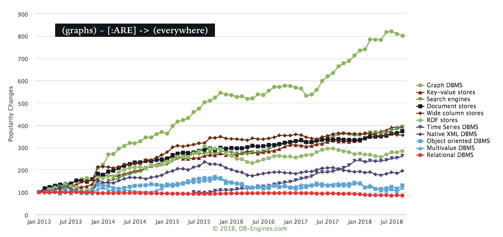

# 图形是数据科学的下一前沿

> 原文：[`www.kdnuggets.com/2018/10/graphs-next-frontier-data-science.html`](https://www.kdnuggets.com/2018/10/graphs-next-frontier-data-science.html)

 评论

### GraphConnect 2018

* * *

## 我们的前三大课程推荐

 1\. [谷歌网络安全证书](https://www.kdnuggets.com/google-cybersecurity) - 快速进入网络安全职业道路。

 2\. [谷歌数据分析专业证书](https://www.kdnuggets.com/google-data-analytics) - 提升你的数据分析技能

 3\. [谷歌 IT 支持专业证书](https://www.kdnuggets.com/google-itsupport) - 支持你的组织的 IT 工作

* * *

[GraphConnect 2018](https://graphconnect.com/)是 Neo4j 每两年举办一次的会议，于 9 月中旬在纽约市举行。会议地点位于美丽的万豪万丽时代广场酒店的曼哈顿中城。我有机会参加了部分会议。

以下是活动日程安排：

+   重点演讲和会议（星期四）

+   培训会议（星期五）

+   生态系统峰会（星期五）

+   社区黑客马拉松（星期六）

### GraphConnect 的历史

第一次 GraphConnect 会议于 2012 年举行。值得注意的是 Neo4j 社区和用户的增长。我与一位参加了 6 年前第一次会议的参与者交谈，他提到当时约有 50 到 100 人参加。今年，参加人数超过了 1000 人。

### 关于 Neo4j

Neo4j 的高效性体现在使用“指针”来连接数据，而不是“索引”。传统的表格数据集可能包含“稀疏矩阵”，如果实体之间的关系不全，这会减慢性能且效率不高。

Neo4j 是[开源的](https://neo4j.com/open-source-project/)。有一个[社区版](https://neo4j.com/download/)是免费的，还有一个企业版提供商业许可。

### 会议

Neo4j 创始人[Emil Eifrem](https://www.linkedin.com/in/emileifrem/)和标志性数据科学家[Hilary Mason](https://twitter.com/hmason)都进行了精彩的演讲。[视频记录](https://neo4j.com/graphconnect-live/)可供公开观看*所有*演讲（大约 90 分钟）。

> 你好，各位 Graphistas 和有志成为 Graphistas 的朋友们！你们是否错过了昨天的[#GraphConnect](https://twitter.com/hashtag/GraphConnect?src=hash&ref_src=twsrc%5Etfw)演讲，由[@emileifrem](https://twitter.com/emileifrem?ref_src=twsrc%5Etfw)和令人惊叹的[@hmason](https://twitter.com/hmason?ref_src=twsrc%5Etfw)主讲？赶快坐下来观看吧！！
> 
> — Neo4j (@neo4j) [2018 年 9 月 21 日](https://twitter.com/neo4j/status/1043217310369112064?ref_src=twsrc%5Etfw)

### Emil Eifrem 的会议亮点 / 关键收获

**将我们的数据视为网络**

> 如果我们的世界是一个网络，我们应该将数据视为互联的。[#neo4j](https://twitter.com/hashtag/neo4j?src=hash&ref_src=twsrc%5Etfw) 在健康保险公司中广泛使用。
> 
> — 瑞莎玛·沙伊克 (@reshamas) [2018 年 9 月 20 日](https://twitter.com/reshamas/status/1042766874134630400?ref_src=twsrc%5Etfw)

**NoSQL 资源密集型 / 图形高效**

> Adobe 拥有一个创意云。用户可以关注其他创意人士。曾经使用 noSQL。资源消耗很大。
> 
> 认识到他们的数据越来越互联，减少了服务器数量，带来了更好的结果。[#neo4j](https://twitter.com/hashtag/neo4j?src=hash&ref_src=twsrc%5Etfw)
> 
> — 瑞莎玛·沙伊克 (@reshamas) [2018 年 9 月 20 日](https://twitter.com/reshamas/status/1042766430851280896?ref_src=twsrc%5Etfw)

**图表的流行程度**

> [#graphconnect](https://twitter.com/hashtag/graphconnect?src=hash&ref_src=twsrc%5Etfw) [#neo4j](https://twitter.com/hashtag/neo4j?src=hash&ref_src=twsrc%5Etfw) 图数据库的流行程度 [pic.twitter.com/Heb1EuveEF](https://t.co/Heb1EuveEF)
> 
> — 贾斯普里特·辛格 (@singhjaspreet) [2018 年 9 月 20 日](https://twitter.com/singhjaspreet/status/1042767644921876481?ref_src=twsrc%5Etfw)
> 
> 我们的首席执行官[@emileifrem](https://twitter.com/emileifrem?ref_src=twsrc%5Etfw)表示，99% 的全球航空票价都通过[#neo4j](https://twitter.com/hashtag/neo4j?src=hash&ref_src=twsrc%5Etfw)处理。[#graphconnect](https://twitter.com/hashtag/graphconnect?src=hash&ref_src=twsrc%5Etfw)
> 
> — 兰斯·沃尔特 (@lancewalter) [2018 年 9 月 20 日](https://twitter.com/lancewalter/status/1042764322080997379?ref_src=twsrc%5Etfw)

**医疗保健应用**

> 医疗保健网络图[#neo4j](https://twitter.com/hashtag/neo4j?src=hash&ref_src=twsrc%5Etfw) [pic.twitter.com/8n0lf1jzEA](https://t.co/8n0lf1jzEA)
> 
> — 瑞莎玛·沙伊克 (@reshamas) [2018 年 9 月 20 日](https://twitter.com/reshamas/status/1042881464189247488?ref_src=twsrc%5Etfw)

### 希拉里·梅森

> 拥挤的房间中，⁦[@hmason](https://twitter.com/hmason?ref_src=twsrc%5Etfw)⁩ 为 [#GraphConnect](https://twitter.com/hashtag/GraphConnect?src=hash&ref_src=twsrc%5Etfw) 纽约站拉开帷幕！ [#neo4j](https://twitter.com/hashtag/neo4j?src=hash&ref_src=twsrc%5Etfw) [pic.twitter.com/gPKCBC6obm](https://t.co/gPKCBC6obm)
> 
> — 赫苏斯·巴拉萨 (@BarrasaDV) [2018 年 9 月 20 日](https://twitter.com/BarrasaDV/status/1042779775625035777?ref_src=twsrc%5Etfw)
> 
> .[@hmason](https://twitter.com/hmason?ref_src=twsrc%5Etfw) 说，“成功的 AI 看起来是什么样的？它很无聊。就像谷歌地图一样，你不需要知道任何东西，也不需要考虑如何可视化到达目的地。这就是[#AI](https://twitter.com/hashtag/AI?src=hash&ref_src=twsrc%5Etfw)成功的样子。”[#graphconnect](https://twitter.com/hashtag/graphconnect?src=hash&ref_src=twsrc%5Etfw)
> 
> — GraphConnect 2018 (@GraphConnect) [2018 年 9 月 20 日](https://twitter.com/GraphConnect/status/1042778457892106240?ref_src=twsrc%5Etfw)

### [培训](https://graphconnect.com/#training)

提供了十三个不同的培训课程，作为独立的会议活动。话题包括建模、开发、数据科学和适合所有 Neo4j 经验水平的分析：

图数据库新手

+   Neo4j 基础

+   Neo4j 新特性

数据科学家和商业智能/分析师

+   图算法

+   数据科学与机器学习

+   使用 Bloom 进行发现和可视化

架构师、数据库管理员和数据建模师

+   图模型入门

+   图模型诊所

开发者

+   Python 网络应用开发

+   基于 GRANDstack 的应用构建

+   针对开发者的建模（重构、演变、动手 Cypher）

+   Cypher 调优与性能

+   用于分析和操作的 APOC 扩展

+   基于图的自然语言理解

> .[@amyhodler](https://twitter.com/amyhodler?ref_src=twsrc%5Etfw) 和 [@JMHReif](https://twitter.com/JMHReif?ref_src=twsrc%5Etfw) 在 [#GraphConnect](https://twitter.com/hashtag/GraphConnect?src=hash&ref_src=twsrc%5Etfw) 讲授中心性算法 [pic.twitter.com/zC4XluvNxV](https://t.co/zC4XluvNxV)
> 
> — M. David Allen (@mdavidallen) [2018 年 9 月 21 日](https://twitter.com/mdavidallen/status/1043223688961839105?ref_src=twsrc%5Etfw)
> 
> 如果你有机会参加 [#neo4j](https://twitter.com/hashtag/neo4j?src=hash&ref_src=twsrc%5Etfw) 算法课程，与 [@amyhodler](https://twitter.com/amyhodler?ref_src=twsrc%5Etfw) 一起上课，一定要去！ [#GraphConnect](https://twitter.com/hashtag/GraphConnect?src=hash&ref_src=twsrc%5Etfw)
> 
> — Clair J. Sullivan, 博士 (@cjIsALock) [2018 年 9 月 21 日](https://twitter.com/cjIsALock/status/1043235299780947970?ref_src=twsrc%5Etfw)

### 生态系统峰会

这是一个私密活动，旨在汇聚顶级 Neo4j 开源贡献者、影响者和鼓舞人心的社区领袖。讨论在一个较小的房间内进行。这是与 Neo4j 高管的亲密和随意的讨论。

> 爱死这些女性了。她们激励了我！！！感谢你们来到 Neo4j 生态系统峰会并演讲！！！！[@gabidavila](https://twitter.com/gabidavila?ref_src=twsrc%5Etfw)（Google 开发者倡导者），[@reshamas](https://twitter.com/reshamas?ref_src=twsrc%5Etfw)（数据科学家和 WiMLDS、PyLadies NYC 的组织者），[@jumokedada](https://twitter.com/jumokedada?ref_src=twsrc%5Etfw)（Tech Women Network 创始人）[#Neo4j](https://twitter.com/hashtag/Neo4j?src=hash&ref_src=twsrc%5Etfw) [#GraphConnect](https://twitter.com/hashtag/GraphConnect?src=hash&ref_src=twsrc%5Etfw) [pic.twitter.com/cpFfXxHsdt](https://t.co/cpFfXxHsdt)
> 
> — Karin Wolok (@askkerush) [2018 年 9 月 21 日](https://twitter.com/askkerush/status/1043205704134414338?ref_src=twsrc%5Etfw)
> 
> 平衡 [#opensource](https://twitter.com/hashtag/opensource?src=hash&ref_src=twsrc%5Etfw) 和战略收入对所有技术创始人来说都是一个挑战 [#GraphConnect](https://twitter.com/hashtag/GraphConnect?src=hash&ref_src=twsrc%5Etfw) [@emileifrem](https://twitter.com/emileifrem?ref_src=twsrc%5Etfw) [pic.twitter.com/iGn4Mf85fH](https://t.co/iGn4Mf85fH)
> 
> — Reshama Shaikh (@reshamas) [2018 年 9 月 21 日](https://twitter.com/reshamas/status/1043210439780454400?ref_src=twsrc%5Etfw)
> 
> - [#neo4j](https://twitter.com/hashtag/neo4j?src=hash&ref_src=twsrc%5Etfw) 的最大竞争对手是所有不知道这个产品的人。
> 
> - 我们需要接触那些能够并且绝对需要使用图表来处理数据的用户。[@emileifrem](https://twitter.com/emileifrem?ref_src=twsrc%5Etfw) [#GraphConnect](https://twitter.com/hashtag/GraphConnect?src=hash&ref_src=twsrc%5Etfw) [pic.twitter.com/VwG3mMTRLX](https://t.co/VwG3mMTRLX)
> 
> — Reshama Shaikh (@reshamas) [2018 年 9 月 21 日](https://twitter.com/reshamas/status/1043212788699734017?ref_src=twsrc%5Etfw)

### 黑客马拉松

9 月 22 日星期六，举办了一个免费的[社区活动](https://www.meetup.com/nycneo4j/events/253585951/)，名为[Neo4j Buzzword Bingo Hackathon](https://buzzword.graph.zone/)，这是一个使用开源软件的黑客马拉松。超过 120 名技术爱好者参加了这次在[Stack Overflow](https://twitter.com/StackOverflow) 举办的活动。

> 在[@StackOverflow](https://twitter.com/StackOverflow?ref_src=twsrc%5Etfw) 的图表工作坊正在如火如荼地进行中 [#networks](https://twitter.com/hashtag/networks?src=hash&ref_src=twsrc%5Etfw) [@wimlds](https://twitter.com/wimlds?ref_src=twsrc%5Etfw) [@NYCPyLadies](https://twitter.com/NYCPyLadies?ref_src=twsrc%5Etfw) [@neo4j](https://twitter.com/neo4j?ref_src=twsrc%5Etfw) [pic.twitter.com/WGJkz3tf2X](https://t.co/WGJkz3tf2X)
> 
> — WiMLDS NYC (@WiMLDS_NYC) [2018 年 9 月 22 日](https://twitter.com/WiMLDS_NYC/status/1043508496136843264?ref_src=twsrc%5Etfw)
> 
> .[@mkheck](https://twitter.com/mkheck?ref_src=twsrc%5Etfw) 看看你女儿有多棒！！！[@JMHReif](https://twitter.com/JMHReif?ref_src=twsrc%5Etfw) 在今年的 [#GraphConnect](https://twitter.com/hashtag/GraphConnect?src=hash&ref_src=twsrc%5Etfw) [#GraphHack](https://twitter.com/hashtag/GraphHack?src=hash&ref_src=twsrc%5Etfw) [#hackathon](https://twitter.com/hashtag/hackathon?src=hash&ref_src=twsrc%5Etfw) 上主持“[Intro to #Neo4j](https://twitter.com/hashtag/Neo4j?src=hash&ref_src=twsrc%5Etfw)”工作坊，[Stack Overflow](https://twitter.com/StackOverflow?ref_src=twsrc%5Etfw) [pic.twitter.com/Rn2eVwInMa](https://t.co/Rn2eVwInMa)
> 
> — Karin Wolok (@askkerush) [2018 年 9 月 22 日](https://twitter.com/askkerush/status/1043495245286187008?ref_src=twsrc%5Etfw)

### 社交媒体

会议标签有：

+   [#GraphConnect](https://twitter.com/hashtag/GraphConnect?src=hash)

+   [#Neo4j](https://twitter.com/hashtag/GraphConnect?src=hash)

推特账号

+   [@neo4j](https://twitter.com/neo4j?lang=en)

+   [@graphconnect](https://twitter.com/graphconnect?lang=en)

+   [@emileifrem](https://twitter.com/emileifrem) (创始人)

### Neo4j [公司里程碑](https://neo4j.com/company/)

+   **2000 年：** Neo 的创始人遇到了 RDBMS 的性能问题，开始构建第一个 Neo4j 原型。

+   **2002 年：** 开发了第一个版本的 Neo4j

+   **2003 年：** 首次进行 24×7 生产部署的 Neo4j

+   **2007 年：** 成立了以瑞典为基地的公司，开发了 Neo4j。同时将首个图数据库 Neo4j 开源，采用 GPL 许可证

+   **2009 年：** 从 Sunstone 和 Conor 获得了 250 万美元种子资金，并继续开发

    +   首位全球 2000 客户

+   **2010 年：** 发布了 Neo4j 1.0 版本

+   **2011 年：** 完成 A 轮融资，并将总部迁至硅谷

+   **2012 年：** 从 Fidelity、Sunstone 和 Conor 获得 1100 万美元 B 轮融资

    +   GraphConnect SF 2012GraphConnect，首个图数据库会议

+   **2015 年：** 从 Creandum 和 Dawn 及现有投资者处获得 2000 万美元 C 轮融资

    +   Neo4j 下载量超过 2M

+   **2016 年：** 获得 3600 万美元 D 轮融资，来自 Greenbridge Investment

+   **2017 年：** Neo4j 宣布了图平台，一种以连接为优先的数据查询、可视化和分析方法

### 资源

+   [图数据库](http://graphdatabases.com/?_ga=2.167459646.1699415370.1537624498-769648181.1535652704)（作者： [Jim Webber](https://twitter.com/jimwebber), [Ian Robinson](https://twitter.com/iansrobinson) 和 [Emil Eifrem](https://twitter.com/emileifrem)）

+   [Neo4j 社区](https://community.neo4j.com/)

+   [Neo4j 认证](https://neo4j.com/graphacademy/neo4j-certification/)

+   [Neo4j 用户 Slack 团队](http://neo4j-users-slack-invite.herokuapp.com/)

+   [成为 Neo4j 社区专家](https://neo4j.com/community/neo4j-community-maven/)

+   [下载 Neo4j 桌面版](https://neo4j.com/download/)

+   [Neo4j 操作手册 v3.4](https://neo4j.com/docs/operations-manual/3.4/)

+   [DB-Engines](https://db-engines.com/en/ranking_categories)

### 趣闻

**在网络会议上的交流**

> 人们在 [#GraphConnect](https://twitter.com/hashtag/GraphConnect?src=hash&ref_src=twsrc%5Etfw) 连接。明年你可能不记得第 15 页幻灯片上的第 3 点，但你可能会和你遇到的人一起做项目。咖啡很重要。 ;) [pic.twitter.com/WS1oqfKmVk](https://t.co/WS1oqfKmVk)
> 
> — M. David Allen (@mdavidallen) [2018 年 9 月 20 日](https://twitter.com/mdavidallen/status/1042789644633559040?ref_src=twsrc%5Etfw)
> 
> “我喝酒的酒吧比你的国家还要古老。” ????
> 
> 一位英国人在 [#GraphConnect](https://twitter.com/hashtag/GraphConnect?src=hash&ref_src=twsrc%5Etfw) 对一位美国人说
> 
> — Reshama Shaikh (@reshamas) [2018 年 9 月 21 日](https://twitter.com/reshamas/status/1043205461141536768?ref_src=twsrc%5Etfw)

**开发者专区的趣闻**

> GraphConnect 变得有些奇怪，主题演讲还没有开始……哈哈 [#GraphConnect2018](https://twitter.com/hashtag/GraphConnect2018?src=hash&ref_src=twsrc%5Etfw) [#Neo4j](https://twitter.com/hashtag/Neo4j?src=hash&ref_src=twsrc%5Etfw) [#DevZone](https://twitter.com/hashtag/DevZone?src=hash&ref_src=twsrc%5Etfw) [#GraphConnect](https://twitter.com/hashtag/GraphConnect?src=hash&ref_src=twsrc%5Etfw) [#GraphDatabases](https://twitter.com/hashtag/GraphDatabases?src=hash&ref_src=twsrc%5Etfw) [pic.twitter.com/BEatese2pL](https://t.co/BEatese2pL)
> 
> — Karin Wolok (@askkerush) [2018 年 9 月 20 日](https://twitter.com/askkerush/status/1042765878000017409?ref_src=twsrc%5Etfw)

### 学习 Neo4j

> .[@jimwebber](https://twitter.com/jimwebber?ref_src=twsrc%5Etfw) 直观展示了“图学习曲线”。一开始看起来陌生和吓人（因为不同），然后人们理解它并最终喜欢它。[#neo4j](https://twitter.com/hashtag/neo4j?src=hash&ref_src=twsrc%5Etfw) [#graphconnect](https://twitter.com/hashtag/graphconnect?src=hash&ref_src=twsrc%5Etfw) [pic.twitter.com/woMX1Ba0F0](https://t.co/woMX1Ba0F0)
> 
> — Lance Walter (@lancewalter) [2018 年 9 月 21 日](https://twitter.com/lancewalter/status/1043164356459077633?ref_src=twsrc%5Etfw)

[原文](https://reshamas.github.io/graphs-are-the-next-frontier-in-data-science/)。经许可转载。

**相关：**

+   理解 NoSQL 数据库的 7 个步骤

+   现代图查询语言 – GSQL

+   如何在经济拮据时学习数据科学

### 更多相关话题

+   [成为优秀数据科学家所需的 5 项关键技能](https://www.kdnuggets.com/2021/12/5-key-skills-needed-become-great-data-scientist.html)

+   [每个初学者数据科学家应掌握的 6 个预测模型](https://www.kdnuggets.com/2021/12/6-predictive-models-every-beginner-data-scientist-master.html)

+   [2021 年最佳 ETL 工具](https://www.kdnuggets.com/2021/12/mozart-best-etl-tools-2021.html)

+   [Inflection-1：个人 AI 的下一前沿](https://www.kdnuggets.com/2023/08/inflection1-next-frontier-personal-ai.html)

+   [超越天网：塑造 AI 进化的下一前沿](https://www.kdnuggets.com/beyond-skynet-crafting-the-next-frontier-in-ai-evolution)

+   [停止学习数据科学以寻找目标，并以…寻找目标](https://www.kdnuggets.com/2021/12/stop-learning-data-science-find-purpose.html)
