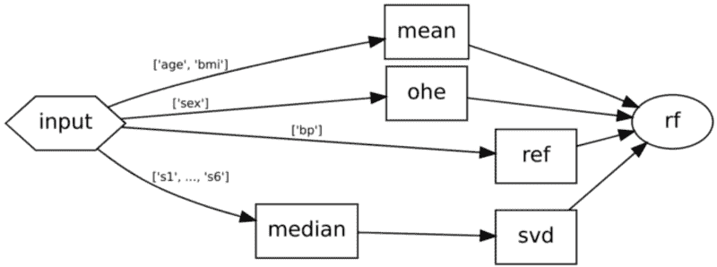
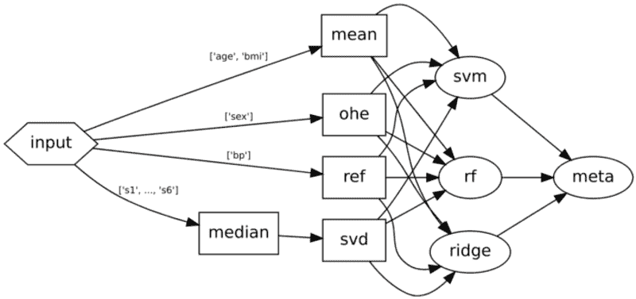

# 超越管道：图作为 Scikit-Learn 元估算器

> 原文：[`www.kdnuggets.com/2022/09/graphs-scikitlearn-metaestimators.html`](https://www.kdnuggets.com/2022/09/graphs-scikitlearn-metaestimators.html)

Scikit-learn 为定义机器学习（ML）任务提供了一个灵活的框架，但其将这些任务组合成更大工作流的支持通常对生产环境中的复杂世界来说过于有限。`[skdag](https://github.com/scikit-learn-contrib/skdag)` 提供了一种更强大的任务组合方法，可以使你从机器学习工具中获得更多收益。

Scikit-Learn 的机器学习方法因其原因而受到欢迎。它为 ML 从业者提供了一个[通用语言](https://scikit-learn.org/stable/developers/develop.html)来描述和实现许多任务。让我们简要介绍一下该语言的一些关键部分：

1.  **估算器** — 估算器是一个对象，它接收数据并在其`fit()`方法中从中学习某些东西。

1.  **变换器** — 一种通过其`transform()`方法以某种方式过滤或修改输入数据的估算器。

1.  **预测器** — 一种通过`predict()`方法从输入数据中推导某种推断的估算器。

1.  **元估算器** — 一种接收一个或多个估算器作为输入参数并对其进行处理的估算器。元估算器可用于一系列任务，包括超参数优化（例如`[GridSearchCV](https://scikit-learn.org/stable/modules/generated/sklearn.model_selection.GridSearchCV.html)`）、模型集成（例如`[StackingClassifier](https://scikit-learn.org/stable/modules/generated/sklearn.ensemble.StackingClassifier.html)`）或工作流组成（`[Pipeline](https://scikit-learn.org/stable/modules/generated/sklearn.pipeline.Pipeline.html)`）。

工作流组成的元估算器关注于简单性：包括组成接口和组成本身的简单性。这里有一个创建小型管道的快速示例：

清晰的接口使得观察这些操作变得容易。我们开始通过用特征均值填补输入数据中的任何缺失值，然后在训练随机森林回归器以进行一些预测之前执行一些 SVD 降维。`Pipeline` 元估算器的美妙之处在于，它可以被视为一个估算器，它只是运行所有相关方法，悄然将每一步的输入和输出链接在一起：

现实问题很少能通过如此简单的模型解决。让我们深入探讨一下用于预测疾病进展测量的[*糖尿病* 数据集](https://scikit-learn.org/stable/datasets/toy_dataset.html#diabetes-dataset)中的特征：

> …年龄、性别、体重指数、平均血压和六项血清测量值

这些特性非常多样。对所有特性进行完全相同的预处理真的有意义吗？可能没有。以下是我们如何仅使用`sklearn`提供的功能来对某些特性进行不同处理：

为了对每个特征进行不同的处理，我们需要引入一个新的估算器，`ColumnTransformer`，并开始嵌套以获得不同插补策略的期望行为，同时对血清测试应用一些 SVD。我们的代码正变得越来越不易读和管理。

# 用图替换管道

即使是这个相对较小的示例也表明，管道在追求简洁的过程中牺牲了太多的灵活性。我们需要的是一种方法，它保持代码简单，但不强迫我们的工作流也简单。这种方法存在：[*有向无环图*](https://en.wikipedia.org/wiki/Directed_acyclic_graph)（DAGs）。

许多工业界使用的生产框架正是出于这些原因将 ML 工作流定义为 DAG，但它们缺乏与 scikit-learn API 的紧密集成，这使得管道使用起来非常方便，并且还附带了许多额外的开销，例如延迟依赖和分布式处理。这些功能对于 scikit-learn 擅长的许多用例是不需要的，例如小规模实验和定义模型架构（这些模型可以在上述框架中运行）。这就是*skdag*的用武之地（`pip install skdag`）。*skdag*是一个针对 scikit-learn 的小扩展，实现了 DAG 元估算器。这使得它能够在多个方面超越管道和列转换器。让我们通过在*skdag*中重建之前的工作流来演示：

使用 DAG 方法，无论我们的工作流多么复杂，代码始终会是一个简单的步骤列表，每个步骤都定义了它的依赖关系。依赖关系可以简单地是步骤名称的列表，或者如果我们只希望从一个步骤的输出中取某些列，我们可以提供一个步骤名称到列的字典。使用*skdag*的另一个好处是它允许你通过`dag.show()`轻松可视化工作流，这对于验证复杂工作流是否符合预期非常有用：

**skdag**生成的工作流可视化。

使用 DAG 的另一个好处是更好地理解依赖关系。在上面的 DAG 中，我们可以看到`mean`、`ohe`、`ref`和`median`彼此之间没有依赖关系，因此理论上没有理由不能同时执行它们。对 DAG 创建进行一次小改动使我们能够在实践中做到这一点。将`make_dag()`替换为`make_dag(n_jobs=-1)`将告诉 DAG 在可能的情况下并行运行步骤。

# 模型堆叠

假设我们想让我们的工作流程变得更加复杂。我们不使用单一的随机森林回归器进行预测，而是使用各种不同的模型，然后将它们[堆叠](https://towardsdatascience.com/simple-model-stacking-explained-and-automated-1b54e4357916)在一起，生成最终的预测。模型堆叠是将多个模型的预测结果作为输入，传递给一个最终的元学习器，这通常是一个非常简单的模型，负责将结果结合在一起，决定每个模型的权重。

在 scikit-learn 中实现堆叠需要另一个元估计器：`[StackingRegressor](https://scikit-learn.org/stable/modules/generated/sklearn.ensemble.StackingRegressor.html)`。然而，DAG 可以原生处理这种模式，所以我们只需在图定义中包含我们的堆叠逻辑：

堆叠模型的 DAG。注意，与管道不同，**skdag** 对预测变量在工作流程中出现没有任何限制。

通过添加几个简单且易读的步骤，我们构建了一个 DAG，而仅使用 scikit-learn 的线性组件则会变得复杂且难以维护。

希望这个小演示能向你展示使用 DAG 而非管道创建可管理、可维护的机器学习工作流的好处——并且*skdag* 将成为你工具包中的另一个有用成员！

[原文](https://medium.com/@big-o/graphs-as-scikit-learn-metaestimators-d05b3300c102)。经许可转载。

**[Big O](https://medium.com/@big-o)** 是一名机器学习工程师和 skdag 的作者。Big O 在技术行业实施机器学习解决方案，专注于人机交互和推荐系统。

* * *

## 我们的三大课程推荐

 1\. [谷歌网络安全证书](https://www.kdnuggets.com/google-cybersecurity) - 快速进入网络安全职业。

 2\. [谷歌数据分析专业证书](https://www.kdnuggets.com/google-data-analytics) - 提升你的数据分析技能

 3\. [谷歌 IT 支持专业证书](https://www.kdnuggets.com/google-itsupport) - 支持你的组织的 IT

* * *

### 更多相关内容

+   [图形：理解数据的自然方式](https://www.kdnuggets.com/2022/10/manning-graphs-natural-way-understand-data.html)

+   [SQL 数据可视化：如何为图表和图形准备数据](https://www.kdnuggets.com/sql-for-data-visualization-how-to-prepare-data-for-charts-and-graphs)

+   [使用 HuggingFace Pipelines 和 Streamlit 回答问题](https://www.kdnuggets.com/2021/10/simple-question-answering-web-app-hugging-face-pipelines.html)

+   [使用 HuggingFace Transformers 构建简单的 NLP 管道](https://www.kdnuggets.com/2023/02/simple-nlp-pipelines-huggingface-transformers.html)

+   [通过特征/训练/推理管道统一批处理和机器学习系统](https://www.kdnuggets.com/2023/09/hopsworks-unify-batch-ml-systems-feature-training-inference-pipelines)

+   [使用 Pandas 构建数据科学管道](https://www.kdnuggets.com/building-data-science-pipelines-using-pandas)
