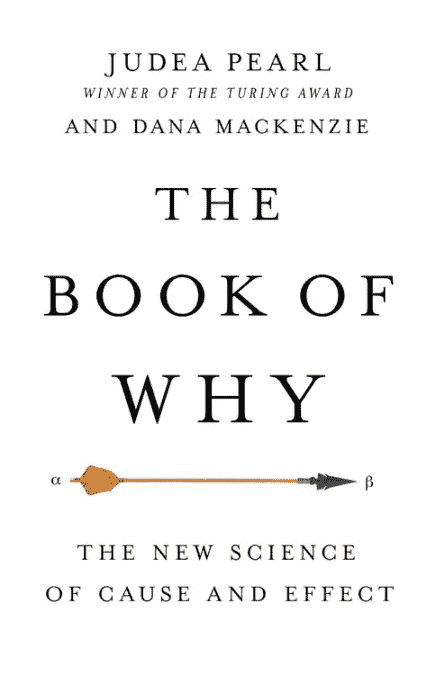

# 《为何之书》

> 原文：[`www.kdnuggets.com/2018/06/gray-pearl-book-of-why.html`](https://www.kdnuggets.com/2018/06/gray-pearl-book-of-why.html)

 评论

UCLA 计算机科学家 **裘德亚·珀尔** 在人工智能、贝叶斯网络和因果分析方面做出了显著贡献。尽管如此，珀尔持有一些许多统计学家可能会觉得奇怪或夸大的观点。以下是他与数学家 Dana Mackenzie 共同编著的最新书籍**《为何之书：因果关系的新科学》**中的几个例子。

* * *

## 我们的前三个课程推荐

 1\. [谷歌网络安全证书](https://www.kdnuggets.com/google-cybersecurity) - 快速进入网络安全职业生涯。

 2\. [谷歌数据分析专业证书](https://www.kdnuggets.com/google-data-analytics) - 提升您的数据分析水平

 3\. [谷歌 IT 支持专业证书](https://www.kdnuggets.com/google-itsupport) - 支持您的组织在 IT 领域

* * *

> *“因果关系经历了重大转变……从一个笼罩在神秘中的概念，变成了一个具有明确语义和充分逻辑的数学对象。悖论和争议已被解决，滑而难以捉摸的概念已被阐明，依赖因果信息的实际问题——长期以来被认为是形而上学的或不可管理的——现在可以通过基础数学来解决。简言之，因果关系已被数学化。”*
> 
> *“尽管遗传学家 Sewall Wright（1889–1988）付出了巨大努力，因果词汇在半个世纪以上几乎被禁止……由于这种禁令，处理因果问题的数学工具被认为是不必要的，统计学完全专注于如何总结数据，而不是如何解释数据。”*
> 
> *“……直到今天，一些统计学家仍然难以理解为什么某些知识超出了统计学的范畴，为什么仅凭数据无法弥补科学知识的缺乏。”*
> 
> *“即使我们随机选择样本，样本中测量的比例也总有可能不代表总体的比例。幸运的是，统计学的学科，通过先进的机器学习技术，为我们提供了许多管理这种不确定性的方法——最大似然估计量、倾向评分、置信区间、显著性测试等。”*
> 
> *“……我们仅在假设因果模型之后、提出我们希望回答的科学问题之后、以及得出估计量之后才收集数据。这与传统的统计方法形成对比……后者甚至没有因果模型。”*
> 
> *“如果[卡尔]皮尔逊今天还活着，生活在大数据时代，他会这样说：答案都在数据中。”*
> 
> *“统计学家对应该控制哪些变量以及不应该控制哪些变量感到极度困惑，因此默认做法是控制所有可以测量的变量。现今大多数研究都遵循这种做法。这是一种方便且简单的程序，但既浪费又充满错误。因果革命的一个关键成就是终结了这种困惑。同时，统计学家们在控制方面大大低估了其重要性，他们甚至不愿谈论因果关系，即使控制已被正确完成。这与本章的信息相悖：如果你在图示中确定了一组充分的去混淆因子，收集了关于它们的数据，并进行了适当的调整，那么你有充分的理由说你已经计算出了因果效应 X->Y（当然，前提是你能在科学上为你的因果图辩护）。”*
> 
> *“…直到最近，继承费舍尔的统计学家们无法证明从 RCT [随机对照试验] 中获得的结果确实是他们所期望的。他们没有一种语言来描述他们所寻找的东西——即 X 对 Y 的因果效应。”*
> 
> *“那些最应该关心‘为什么’问题的人——即科学家——却在一种统计文化下工作，这种文化否认了他们提出这些问题的权利。”*
> 
> *“…当变量数量很大时，统计估计并非简单，而只有大数据和现代机器学习技术才能帮助我们克服维度灾难。”*

珀尔对数据科学也有一些尖锐的评论：

> *“我们生活在一个假设大数据可以解决我们所有问题的时代。大学里的‘数据科学’课程不断增加，而‘数据科学家’的职位在参与‘数据经济’的公司中非常有利可图。但我希望通过这本书让你相信数据本质上是愚蠢的。数据可以告诉你服用药物的人比未服用药物的人恢复得更快，但它们无法告诉你原因。”*
> 
> *“…许多人工智能研究者希望跳过构建或获取因果模型的困难步骤，完全依赖数据来处理所有认知任务。希望——目前这种希望通常是沉默的——是数据本身能够在因果问题出现时引导我们找到正确的答案。”*
> 
> *“因果模型相比数据挖掘和深度学习的另一个优点是适应性。”*
> 
> *“就像柏拉图著名的洞穴比喻中的囚徒一样，深度学习系统探索洞穴墙上的影子，并学会准确预测它们的运动。它们缺乏对观察到的影子只是三维空间中移动的三维物体投影的理解。强人工智能需要这种理解。”*
> 
> *“…因果信息中的主观成分即使在数据量增加的情况下，也不一定会随着时间的推移而减少。两个人相信两个不同的因果图可以分析相同的数据，但可能永远不会得出相同的结论，无论数据有多‘大’。”*

尽管他有时可能被认为是一个象牙塔中的学术人员，其论点有时模糊且自相矛盾，但我怀疑对因果关系主题真正感兴趣的人会认为朱迪亚·珀尔或他的工作乏味或不相关。他总是引人深思，有很多值得关注的内容，并且为统计学家和研究人员提供了另一套用于因果分析的有用工具。他的影响力也使得他的著作值得阅读。特别是，我会推荐他的**《因果性：模型、推理与推断》**给研究人员和统计学家，尽管**《为什么的书》**是他思维的更温和的介绍。

尽管如此，他并没有彻底革新因果关系分析，正如所述，许多统计学家可能会发现他的一些观点与他们自己对统计学及其专业同行的看法，以及他们学科的历史不一致。他对“所有或大多数统计学家”在特定情况下会做什么进行了许多概括，然后向我们展示这些会是错误的。他没有提供支持这些概括的证据，其中许多观点在我看来是一个合格的统计学家*不会*做的。同样，他声称的新或甚至激进的思维可能会让一些统计学家感到困惑，因为这些是他们多年来所做的工作，尽管可能用不同的名字或根本没有名字。

他指责统计学家专注于总结数据，忽视数据生成过程，对理论和因果分析不感兴趣，这在统计学家与其他背景的数据科学家之间有时争论激烈的情况下显得尤为有趣。他还忽视了通过 ANOVA 和 MANOVA 获得的、显式考虑因果框架的各种复杂实验设计和数据分析——这些也可能变得相当复杂——这些设计以及 ANOVA 和 MANOVA 已经使用了几十年。与此相关的是，历史上，统计学家在特定学科领域（如农业、经济学、药理学和心理学）中专门化，因为主题知识对于他们的有效性至关重要——统计学不仅仅是数学。

更根本地，并非所有统计学家都同样称职，或者对能力的定义完全相同。还有学术统计学家和应用统计学家，二者之间常常存在较大差距。这对几乎任何职业都是如此。并非所有律师都是追逐救护车的律师，执业律师也不是他们以前法学院教授的克隆体。

还有一个敏感的问题是，统计学家的建议常常被许多领域的研究人员忽视，这通常是这些学科中可疑实践的原因，而非统计学本身的缺陷。例如，统计学家经常建议研究人员在缺乏可靠理论和基于该理论的因果模型的情况下不要仅仅基于*相关性*得出因果推论，但常常徒劳无功。请注意，这与声称相关性无关或意味着*没有*因果关系存在非常不同。它与认为因果关系无关且不应探索的观点有明显区别。统计学家还参与研究设计，关于因果关系的长时间讨论并不少见。大多数研究人员对“为什么”感兴趣，而那些不关注这一点的统计学家是濒危物种。

此外，实践者的数量远超学术统计学家，他们有时会被提供背景信息很少的数据，并被要求找出一些“有趣”的东西。实际上，他们被指示进行数据挖掘。在这些情况下，任何数量的临时因果模型，无论是手动创建的还是通过自动化软件生成的，可能都能同样适配数据，但却为决策者提出了截然不同的行动建议。这可能变成一场走钢丝的游戏。更常见的是，他们可能会被给定一组交叉表，并被要求解释其含义。可能是数据中的某些内容对研究人员没有意义，或研究人员想要第二意见。

这是我看到的统计学家真实世界的快照，它与 Pearl 所见的世界截然不同。

我的评论不应被解读为暗示 Pearl 对统计学和统计学家的批评完全没有价值，尽管我确实发现其中许多观点很奇怪。（为了明确，他确实对一些统计学家高度评价。）像 Pearl 本人一样，统计学家不应被神化，几十年后现在被广泛接受的良好统计实践中，部分可能会被普遍视为愚蠢的。像任何领域一样，统计学也在不断演变，常常是缓慢且不稳定的。

大萧条、第二次世界大战、朝鲜战争和冷战无疑对其历史发展产生了一些影响。我们也不能忘记，计算还是在不久之前才是手动完成的，统计学家拥有的经验数据有限，无法进行现在对许多统计学家至关重要的蒙特卡罗研究。不过，我同意 Pearl 的观点，如果 Sewall Wright 的贡献，尤其是路径分析，得到了应有的关注，统计学和因果分析的发展可能会更快。

总而言之，Pearl 的著作中蕴含着许多真正的智慧，就我个人的意见而言，我会敦促统计学家和研究人员阅读他的作品。在**《为何之书》**中，尤其是，他提供了许多生动的例子，展示了如何错误地进行研究以及如何改进。除了他对统计学和统计学家的奇特看法之外，我对 Pearl 的主要批评是他夸大了自己的观点。例如，根据我的经验，路径图和有向无环图（DAG）是因果分析的辅助工具，但并非必需。一些人觉得它们令人困惑。他似乎也对抽样和数据质量不太感兴趣，或者对潜在类别可能操作的不同因果模型并不在意。

关于因果分析或与之相关的书籍还有很多。我推荐一些其他书籍，比如**《实验和准实验设计》**（Shadish 等人）、**《因果推断中的解释》**（VanderWeele）、**《反事实与因果推断》**（Morgan 和 Winship）、**《因果推断》**（Imbens 和 Rubin）以及**《元分析方法》**（Schmidt 和 Hunter）。这些书籍都非常技术性。对于哲学倾向的读者，**《牛津因果手册》**（Beebee 等人）可能是首选。具备良好统计背景的统计学家和其他人也可能对这个在*《美国统计学家》*2014 年刊登的[辩论](https://www.tandfonline.com/doi/abs/10.1080/00031305.2014.876829)感兴趣。

最后，我想提出的一个关于因果分析的普遍观察，实际上是一个提醒，即理论通常是在许多独立研究人员的辛勤工作下，通过许多年的一点一滴构建（或拆解）而成的。由于缺乏所需的观测数据，这些小块内容通常只能通过实验来测试。

这些实验大多数只在学术期刊中报告，除了该领域的专家外，鲜有人注意。许多实验相当简单，不需要复杂的数学和高级软件。它们并没有检验直接且广泛影响公共健康和福利的宏大理论。它们是研究中的常客和因果分析的无名英雄。

**简介：凯文·格雷**是[**卡农格雷**](http://cannongray.com/home)的总裁，这是一家市场营销科学和分析咨询公司。他在尼尔森、凯度、麦肯和 TIAA-CREF 拥有超过 30 年的市场研究经验。凯文还共同主持了音频播客系列[**MR Realities**](https://www.linkedin.com/pulse/links-mr-realities-podcasts-kevin-gray)。

[原文](https://www.linkedin.com/pulse/pearls-wisdom-statisticians-kevin-gray/)。经许可转载。

**相关：**

+   为什么之书：因果关系的新科学

+   数据科学：为何大多数人未能交付的 4 个原因

+   科学债务——这对数据科学意味着什么？

*编辑：正如我们的读者 Carlos Cinelli 在下文所指出的，朱迪亚·佩尔已[回复了凯文·格雷的文章](http://causality.cs.ucla.edu/blog/index.php/2018/06/11/statisticians-reaction-to-the-book-of-why/) - 我们在下文中复述了他的回复。*

> 朱迪亚·佩尔：
> 
> 凯文预测许多统计学家可能会觉得我的观点“奇怪或夸张”是准确的。这正是我在过去 30 年中与统计学家进行的众多对话中发现的。然而，如果你更仔细地审视我的观点，你会发现它们并不像乍看上去那样异想天开或轻率。
> 
> 当然，许多统计学家会挠头问：“这不是我们多年来一直在做的事情吗，虽然可能用不同的名称或根本没有名称？”这就是我的观点的精髓所在。以各种名称非正式地进行，同时避免用统一的符号系统进行数学化处理，对因果推断的进展产生了破坏性影响，无论是在统计学中还是在那些依赖统计学指导的众多学科中。缺乏进展的最佳证据是，即使到今天，只有一小部分实践中的统计学家能解决《为什么之书》中提出的因果玩具问题。
> 
> 例如：
> 
> +   选择足够的协变量集来控制混杂因素
> +   
> +   阐明能够实现因果效应一致估计的假设
> +   
> +   查找这些假设是否可测试
> +   
> +   估计因果效应的原因（而不是原因的效应）
> +   
> +   越来越多。
> +   
> 《为什么之书》的每一章都带来了一组统计学家深切关注的问题，这些问题虽然以错误的名称（如 ANOVA 或 MANOVA）或“根本没有名称”的形式存在，但统计学家们已为之挣扎多年。结果是许多深切的担忧，却没有解决方案。
> 
> 现在一个有效的问题是，是什么使我这个谦虚的人敢于如此笼统地声明，在 1980 年代之前，没有统计学家（实际上没有科学家）能够正确解决这些玩具问题。怎么能如此确定某些聪明的统计学家或哲学家没有找到 Simpson 悖论的正确解决方案或区分直接效应与间接效应的正确方法呢？答案很简单：我们可以从 20 世纪科学家使用的方程式的语法中看到。要正确地定义因果问题，更不用说解决它们了，需要一种超越概率论语言的词汇。这意味着所有那些使用联合密度函数、相关分析、列联表、ANOVA 等的聪明而杰出的统计学家，如果没有用图示或反事实符号来丰富这些方法，就只是徒劳无功——在问题的正交方向上——如果没有词汇来提出问题，你是无法回答问题的。（《为何》，第 10 页）
> 
> 正是这种符号上的试金石让我有信心支持你们从《为何》一书中引用的每一个观点。此外，如果你仔细观察这个试金石，你会发现它不仅仅是符号上的，而且也是概念上的和实用的。例如，Fisher 使用 ANOVA 来估计直接效应的错误仍然困扰着当今的中介分析师。许多其他的例子也在《为何》一书中描述了，我希望你能认真考虑每一个例子所传达的教训。
> 
> 是的，你的许多朋友和同事会挠着头说：“嗯……这不是我们多年来一直在做的事情吗，尽管可能是不同的名字或者根本没有名字？”我希望你在阅读《为何》一书后能够抓住一些这些抓头的情况，并告诉他们：“嘿，在你继续挠头之前，你能解决《为何》中的任何玩具问题吗？”你会对结果感到惊讶——我当时就感到惊讶！
> 
> 对我来说，解决问题是对理解的考验，而不是仅仅抓破脑袋。这就是我写这本书的原因。

*编辑：Kevin Gray 注意到[Judea Pearl 的回复](http://causality.cs.ucla.edu/blog/index.php/2018/06/11/statisticians-reaction-to-the-book-of-why/)并提供了以下跟进回应。*

> 我感谢 Judea Pearl 抽出时间阅读和回应我的博客文章。我也感到受宠若惊，因为我多年来一直是 Pearl 的崇拜者和追随者。不知为何——这种情况之前发生过——我在使用 Disqus 时遇到了困难，因此请 Matt Mayo 代我发布这篇（诚然是仓促写的）回应。
> 
> 简而言之，我认为 Pearl 对我帖子中的评论没有实质性内容，因为他本质上只是重复了我在文章中质疑的观点。
> 
> 他开篇评论的暗示是我仅仅是肤浅地了解他的观点。显然，我并不认为情况是这样的。而且，在文章中，我没有将 Pearl 的任何观点描述为异想天开或轻率。我非常认真地对待这些观点，否则我根本不会费心撰写我的博客文章。
> 
> 像许多其他统计学家一样，包括学术界的统计学家，我认为他对统计学家的描述是不准确的，他对谨慎的处理方法过于简单。这是我观点的本质（而且，正如我所指出的，我并不孤单）。这些差异可能有很多原因，我在这里不做猜测。
> 
> “如果你没有词汇来提出问题，就不能回答问题”这点确实是正确的。实践中的统计学家——与专注于理论的学者不同——与他们的客户密切合作，客户通常是特定领域的专家。该领域的语言在很大程度上定义了特定背景下的因果语言。这就是为什么没有普遍的因果框架，以及为什么心理学、医疗保健和经济学等领域的统计学家有不同的方法，常常使用不同的语言和数学。在我自己的经验中，我结合了这三种方法以及 Pearl 的方法。每种方法的实用性，在我超过 30 年的经验中，都是因情况而异的。也存在一些临时的做法（有些值得怀疑）。
> 
> 他声称“即使在今天，只有一小部分从业统计学家能够解决《为什么的书》中提出的任何因果玩具问题”，但没有提供任何证据。这些问题并不难，主张并不是证据。此外，他在《为什么的书》的每一章中给出的统计学失败的例子，通常并不具有说服力，且这些例子本身就是撰写文章的动机之一。
> 
> 不同形式的 Simpson 悖论是几代研究人员和统计学家都被训练去注意的内容。我们确实注意到了，这并没有什么神秘之处。（关于 Simpson 悖论的这场[辩论](https://www.tandfonline.com/doi/abs/10.1080/00031305.2014.876829)，出现在 2014 年的《美国统计学家》上，我在文章中链接了，希望那些不是 ASA 成员的读者能够看到。）
> 
> 中介效应，经常与调节效应混淆，可能是一个难解的问题。简单的路径图或只有少数变量的 DAG 往往是不足够的，可能会严重误导我们。在统计学家的实际工作中，往往有大量潜在的相关变量，包括我们无法观察到的变量。还有一些关键变量由于多种原因没有包含在我们需要处理的数据中，也无法获得。测量误差可能相当大——这并不罕见——不同类别的对象（例如消费者）可能存在不同的因果机制。这些类别通常是我们未观察到和未知的。
> 
> 我应该明确指出，我非常欣赏 Pearl 将因果分析推向前台的努力。我会建议统计学家阅读他的著作，但也要咨询（正如我所做的）其他经验丰富的从业者和学者，听取他们对他的著作和因果分析的看法。有许多方法可以研究因果关系，而 Pearl 的方法只是其中之一。正如 Pearl 自己也会知道的那样，直到今天，哲学家们仍然对因果关系的定义存在分歧，因此我认为他找到答案的说法是不切实际的。真正的统计学家知道不能寻找银弹。

### 更多相关话题

+   [软件错误与权衡：Tomasz Lelek 新书及…](https://www.kdnuggets.com/2021/12/manning-software-mistakes-tradeoffs-book.html)

+   [终于有一本关于注意力的书了！](https://www.kdnuggets.com/2022/11/mlm-finally-book-attention.html)

+   [统计学习导论，Python 版：免费书籍](https://www.kdnuggets.com/2023/07/introduction-statistical-learning-python-edition-free-book.html)

+   [一本将彻底改变您组织数据处理方式的新书…](https://www.kdnuggets.com/2022/02/manning-new-book-revolutionize-way-organization-approaches-data.html)

+   [Pydon'ts - 编写优雅的 Python 代码：免费书评](https://www.kdnuggets.com/2022/05/pydonts-write-elegant-python-code-free-book-review.html)

+   [构建可重复且可维护的数据科学项目：一本免费书…](https://www.kdnuggets.com/2022/08/free-book-build-reproducible-maintainable-data-science-project.html)
