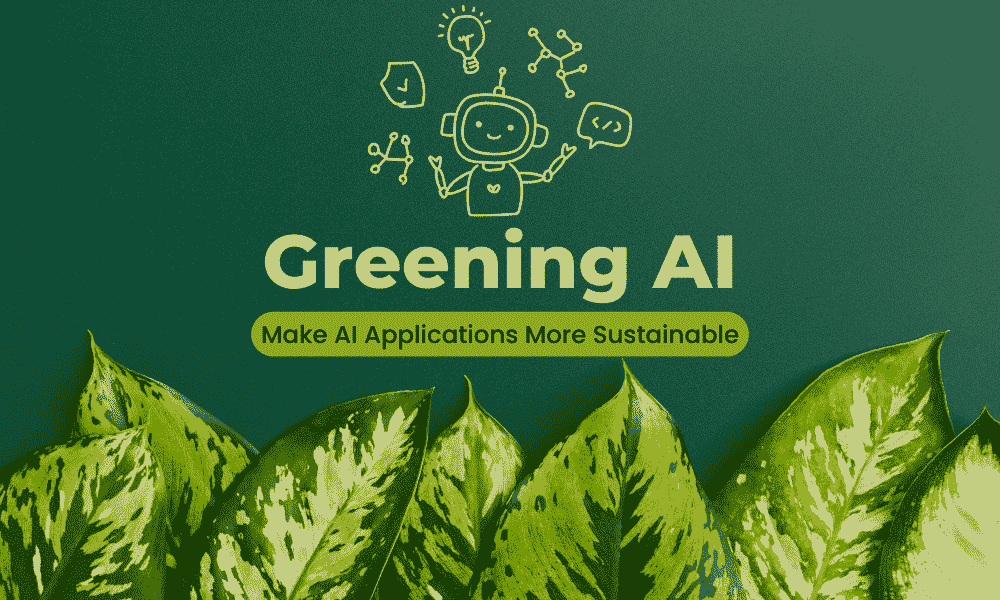
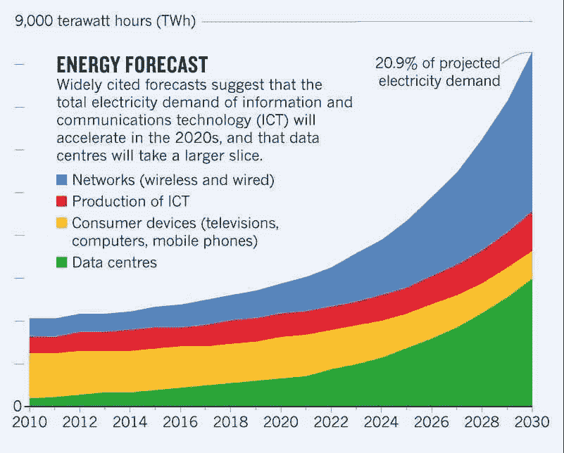
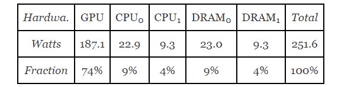

# Greening AI: 7 Strategies to Make Applications More Sustainable

> 原文：[`www.kdnuggets.com/greening-ai-7-strategies-to-make-applications-more-sustainable`](https://www.kdnuggets.com/greening-ai-7-strategies-to-make-applications-more-sustainable)

编辑提供的图片

AI 应用具有无与伦比的计算能力，可以以前所未有的速度推动进步。然而，这些工具高度依赖于耗能的数据中心，从而导致其碳足迹的显著增加。令人惊讶的是，这些 AI 应用已经占据了全球温室气体排放的[2.5 到 3.7](https://8billiontrees.com/carbon-offsets-credits/carbon-ecological-footprint-calculators/carbon-footprint-of-data-centers/#:~:text=Data%20centers%20account%20for%202.5,that%20fuel%20the%20global%20economy)百分比，超过了航空业的排放量。

不幸的是，这一碳足迹正在快速增长。

目前，迫切需要测量机器学习应用的碳足迹，正如彼得·德鲁克的智慧所强调的：“你无法管理你无法测量的东西。”目前，在量化 AI 的环境影响方面存在显著的模糊性，具体数字仍然难以确定。

除了测量碳足迹外，AI 行业的领导者还必须积极关注优化碳足迹。这一双重方法对于解决 AI 应用的环境问题以及确保更加可持续的发展路径至关重要。

# 影响 AI 应用碳足迹的因素

机器学习的使用增加了对数据中心的需求，其中许多数据中心电力消耗巨大，因此具有显著的碳足迹。2021 年，数据中心的全球电力使用量达到了[0.9 到 1.3 百分比](https://www.iea.org/reports/data-centres-and-data-transmission-networks)。

一项[2021 年的研究](https://ris.utwente.nl/ws/portalfiles/portal/252516283/1_s2.0_S0306261921003019_main.pdf)估计，到 2030 年，这一使用比例可能会增加到 1.86%。这个[数字](https://www.akcp.com/blog/the-real-amount-of-energy-a-data-center-use/)代表了由于数据中心导致的能源需求不断增加的趋势

© 数据中心的能源消耗趋势及使用份额

值得注意的是，能源消耗越高，碳足迹也越高。数据中心在处理过程中会发热，可能会因过热而发生故障甚至停止运作。因此，它们需要冷却，这需要额外的能源。大约[40％](https://www.sciencedirect.com/science/article/pii/S1876610215009467)的数据中心电力消耗用于空调。

# 计算 AI 应用程序的碳强度

鉴于 AI 使用的足迹不断增加，这些工具的碳强度需要被考虑。目前，关于这一主题的研究仅限于对几个模型的分析，并没有充分涵盖这些模型的多样性。

这是一个经过改进的方法论以及一些有效的工具，用于计算 AI 系统的碳强度。

# 估算 AI 碳强度的方法论

软件碳强度（SCI）[标准](https://github.com/Green-Software-Foundation/sci) 是估算 AI 系统碳强度的有效方法。与传统的采用归因性碳会计方法的方式不同，它采用了后果性计算方法。

后果性方法尝试计算由于干预或决策（例如生成额外单位）所产生的排放边际变化。而归因则是指计算平均强度数据或排放的静态清单。

一篇由 Jesse Doge 等人撰写的关于“测量云实例中 AI 的碳强度”的[论文](https://dl.acm.org/doi/fullHtml/10.1145/3531146.3533234)运用了这一方法论，以提供更为详尽的研究。由于大量的 AI 模型训练是在云计算实例上进行的，这可能成为计算 AI 模型碳足迹的有效框架。该论文对 SCI 公式进行了改进，用于此类估算：

该方法从以下公式中细化：

 来源于 

其中：

**E:** 软件系统消耗的能源，主要是图形处理单元（GPU），这是一种专用的机器学习硬件。

**I:** 数据中心电网提供的基于位置的边际碳排放。

**M:** 嵌入或体现的碳，即在硬件的使用、制造和处置过程中排放的碳。

**R:** 功能单元，在本例中为一个机器学习训练任务。

**C= O+M，其中 O 等于 E*I**

论文使用公式来估算单个云实例的电力使用。在基于深度学习的 ML 系统中，主要的电力消耗归功于 GPU，该公式中包括了 GPU。他们使用一台配有两个 Intel Xeon E5-2630 v3 CPU（2.4GHz）和 256GB RAM（16x16GB DIMMs）的商品服务器上的单个 NVIDIA TITAN X GPU（12 GB）训练了一个 BERT-base 模型，以实验该公式的应用。下图显示了这个实验的结果：

© 能耗及服务器组件间的分配

GPU 占据了 74%的能耗。尽管论文作者仍然认为这是一个低估，但纳入 GPU 是朝着正确方向迈出的步骤。传统的估算技术没有关注这一点，这意味着碳足迹的一个主要贡献者在估算中被忽视了。显然，SCI 提供了更全面和可靠的碳强度计算。

# 实时测量云计算的碳足迹的方法

AI 模型训练通常在云计算实例上进行，因为云计算使其灵活、可访问且成本高效。云计算提供了大规模部署和训练 AI 模型所需的基础设施和资源。这就是为什么模型训练在云计算上逐渐增加的原因。

测量云计算实例的实时碳强度很重要，以识别适合减排努力的领域。计算单位能源的时间和地点特定的边际排放量可以帮助计算操作碳排放，正如[2022 年论文](https://dl.acm.org/doi/fullHtml/10.1145/3531146.3533234)中所做的那样。

一个[开源](https://www.cloudcarbonfootprint.org/)工具，Cloud Carbon Footprint (CCF) 软件也可以用来计算云实例的影响。

# 提高 AI 应用的碳效率

这里有 7 种方法来优化 AI 系统的碳强度。

## 1\. 编写更好、更高效的代码

优化的代码可以通过减少内存和处理器使用来减少[30 percent](https://www.zuehlke.com/en/insights/green-coding-innovation-for-more-sustainable-it)的能耗。编写碳高效的代码涉及优化算法以加快执行速度，减少不必要的计算，以及选择能效高的硬件以用更少的电力完成任务。

开发人员可以使用性能分析工具来识别代码中的性能瓶颈和优化领域。这个过程可以导致更节能的软件。此外，考虑实施节能编程技术，其中代码设计为适应可用资源并优先考虑节能执行路径。

## 2\. 选择更高效的模型

选择合适的算法和数据结构至关重要。开发人员应选择能最小化计算复杂性的算法，从而减少能源消耗。如果更复杂的模型仅带来 3-5%的提升，但训练时间却增加了 2-3 倍，那么选择简单且更快的模型。

模型蒸馏是将大型模型压缩为小型版本的另一种技术，以提高效率，同时保留核心知识。可以通过训练一个小模型来模仿大型模型，或从神经网络中去除不必要的连接来实现。

## 3\. 调整模型参数

使用双目标优化调整模型的超参数，以平衡模型性能（例如准确性）和能源消耗。这种双目标方法确保你不会为了一个目标而牺牲另一个目标，使你的模型更高效。

利用像[参数高效微调](https://huggingface.co/blog/peft)（PEFT）这样的技术，其目标是实现与传统微调类似的性能，但所需的可训练参数数量更少。这种方法涉及对模型参数的小部分进行微调，同时保持大部分预训练的大型语言模型（LLMs）被冻结，从而显著减少计算资源和能源消耗。

## 4\. 压缩数据并使用低能耗存储

实施数据压缩技术以减少传输的数据量。压缩数据需要更少的能源进行传输，并占用更少的磁盘空间。在模型服务阶段，使用缓存可以帮助减少对在线存储层的调用，从而减少

此外，选择合适的存储技术也能带来显著的收益。例如，AWS Glacier 是一个高效的数据归档解决方案，如果数据不需要频繁访问，使用 Glacier 可能比使用 S3 更可持续。

## 5\. 在更清洁的能源上训练模型

如果你使用云服务进行模型训练，可以选择计算操作的区域。选择一个使用可再生能源的区域，你可以将排放减少多达[30 倍](https://arxiv.org/pdf/2002.05651.pdf)。AWS 的[博客文章](https://aws.amazon.com/blogs/architecture/how-to-select-a-region-for-your-workload-based-on-sustainability-goals/)概述了优化业务和可持续性目标之间的平衡。

另一种选择是选择合适的时间运行模型。在一天中的某些时段，能源更清洁，这类数据可以通过[电力地图](https://www.electricitymaps.com/)等付费服务获取，该服务提供关于不同地区电力碳强度的实时数据和未来预测。

## 6\. 使用专门的数据中心和硬件进行模型训练

选择更高效的数据中心和硬件可以显著降低碳强度。专门用于机器学习的数据中心和硬件比通用数据中心和硬件的能源效率高出[1.4-2](https://arxiv.org/ftp/arxiv/papers/2104/2104.10350.pdf)倍和 2-5 倍。

## 7\. 使用像 AWS Lambda、Azure Functions 这样的无服务器部署

传统部署要求服务器始终开启，这意味着 24x7 的能源消耗。像 AWS Lambda 和 Azure Functions 这样的无服务器部署能以最低的碳强度正常工作。

# 最终说明

人工智能领域正经历指数级增长，渗透到商业和日常生活的各个方面。然而，这种扩张也带来了代价——一个不断增长的碳足迹，这可能使我们离限制全球温升至 1°C 的目标越来越远。

这一碳足迹不仅仅是当前的担忧，其影响可能跨越几代人，影响那些与其创建无关的人。因此，采取决定性措施来减轻与人工智能相关的碳排放并探索可持续的利用途径变得尤为重要。确保人工智能的好处不会以环境和未来世代的福祉为代价是至关重要的。

****[Ankur Gupta](https://www.linkedin.com/in/ankurgupta101)**是拥有十年经验的工程领导者，涉足可持续发展、交通运输、电信和基础设施领域；目前担任 Uber 的工程经理。在这个角色中，他在推动 Uber 车辆平台的发展方面发挥了关键作用，通过整合前沿电动和联网汽车，领导朝着零排放未来迈进。**

### 更多相关话题

+   [利用数据科学使清洁能源更公平](https://www.kdnuggets.com/2022/03/data-science-make-clean-energy-equitable.html)

+   [数据遮蔽：确保 GDPR 及其他监管合规性的核心](https://www.kdnuggets.com/2023/05/data-masking-core-ensuring-gdpr-regulatory-compliance-strategies.html)

+   [2023 年特征商店峰会：部署机器学习模型的实用策略](https://www.kdnuggets.com/2023/09/hopsworks-feature-store-summit-2023-practical-strategies-deploying-ml-models-production-environments)

+   [掌握 Python：编写清晰、有组织和高效代码的 7 种策略](https://www.kdnuggets.com/mastering-python-7-strategies-for-writing-clear-organized-and-efficient-code)

+   [在云中使用大型语言模型时优化性能和成本的策略](https://www.kdnuggets.com/strategies-for-optimizing-performance-and-costs-when-using-large-language-models-in-the-cloud)

+   [优化大型语言模型的最佳策略](https://www.kdnuggets.com/the-best-strategies-for-fine-tuning-large-language-models)
