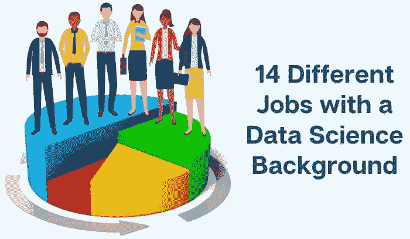
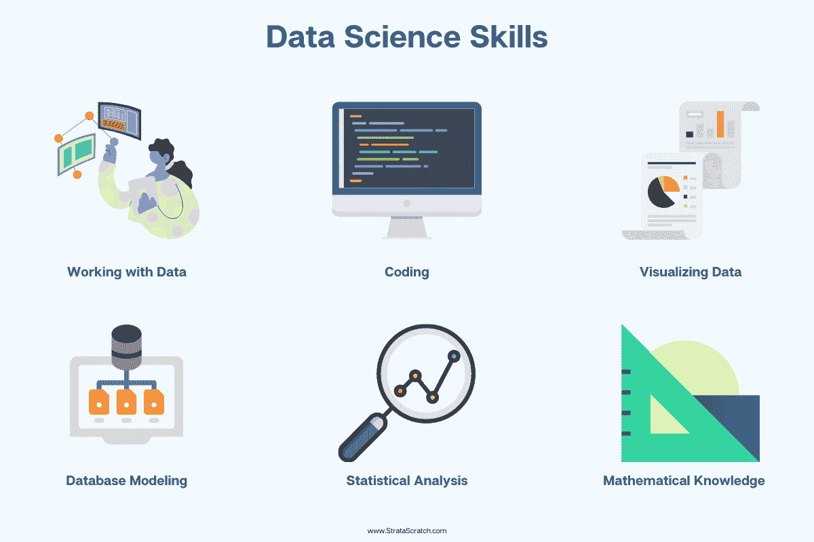
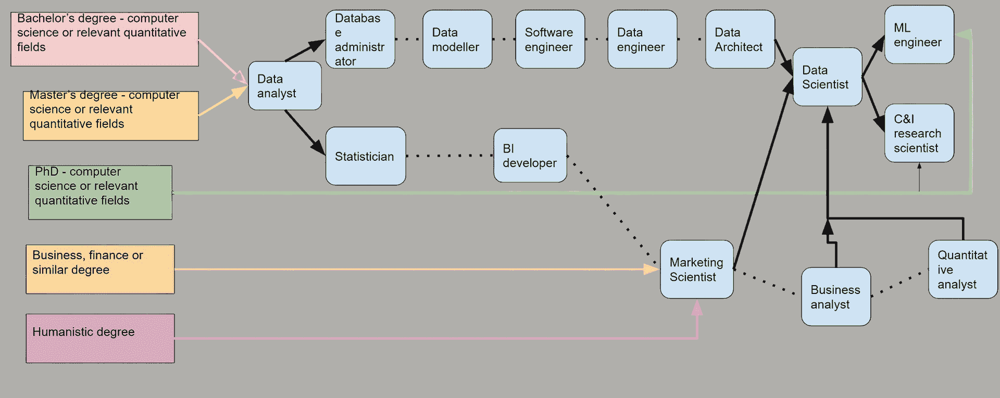

# 14 种不同数据科学职位的指南

> 原文：[`www.kdnuggets.com/2021/10/guide-14-different-data-science-jobs.html`](https://www.kdnuggets.com/2021/10/guide-14-different-data-science-jobs.html)

评论

市场上有大量的职位要求你具备数据科学背景，这有时可能会令人困惑。这使得你很难判断自己是否过度或不足够资格。有时，公司有重叠的职位描述，甚至他们自己对工作任务的理解（和名称）也没有帮助。

* * *

## 我们的前 3 个课程推荐

 1\. [谷歌网络安全证书](https://www.kdnuggets.com/google-cybersecurity) - 快速进入网络安全职业的快车道。

 2\. [谷歌数据分析专业证书](https://www.kdnuggets.com/google-data-analytics) - 提升你的数据分析技能

 3\. [谷歌 IT 支持专业证书](https://www.kdnuggets.com/google-itsupport) - 支持你的组织的 IT 部门

* * *

我们将尽力提供一份指南，帮助你应对所有需要数据科学背景的不同职位。由于许多数据科学职位要求相同或非常相似的技能，我们将首先讨论这些职位之间的相似性。我们还将介绍你需要具备哪些资格和数据科学技能才能获得工作，以及你可能会遇到的面试问题示例。然后，我们将讨论一些职位描述、技术技能以及职业发展轨迹的具体细节，包括薪资。

## 所有数据科学职位的背景

**如何获得它？**

数据科学的定义本身就是多个学科的交汇点。它涉及编程技能，结合了数学和/或统计知识以及业务领域的专业知识。从这个定义出发，我们可以回答数据科学家通常来自哪里。

他们的正式教育通常包括计算机科学、数学、统计学、经济学或任何类似的定量领域的学位。对于一些数据科学职位，人文学科的学位也可能会有所帮助，特别是如果该职位更加关注人类行为的话。

根据职位的资历要求，你可能需要拥有硕士学位甚至博士学位。

**我需要什么技能？**

这取决于许多因素，当然，不同的数据科学职位之间存在差异。然而，对于几乎所有需要数据科学背景的工作来说，有一些技能是必须具备的。唯一的区别在于你在工作中使用这些技能的程度。

+   处理数据——收集、组织、清理和操控数据

+   编程 – 通常是 SQL、Python 或 R，有时也包括 Java、C++…

+   数据可视化 – 通常使用 BI 工具，如 Tableau、Power BI、Looker…

+   数据库建模 – 理解数据库如何工作

+   统计分析 – 在数据分析中应用以获取洞察

+   数学知识 – 应用于数据分析以计算指标

*这是详细的文章 [最受欢迎的数据科学技术技能](https://www.stratascratch.com/blog/most-in-demand-data-science-technical-skills/) ，你会找到需求量最高的技能。*

### 职业发展轨迹

没有唯一的方式 [如何成为数据科学家](https://www.stratascratch.com/blog/how-to-become-a-data-scientist-from-scratch/)。这取决于你的教育背景和以往的工作经验。然而，人们通常会从数据分析师开始。然后，根据他们的兴趣和技能，他们通常会朝两个方向发展：一个是更多地与数据和数据基础设施打交道，另一个则更专注于数据分析。

你可以在下面的插图中看到这一轨迹。有些职位有时需要其他教育背景，如商业或人文学科学位。

所有这些路径都可以使你成为数据科学家。你可以朝多个方向发展；这完全取决于你的公司、职业规划、兴趣等。

### 我能赚多少钱？

以下是数据科学职位名称的列表。表格展示了数据科学职位名称及其平均年总薪酬。我们根据上述职业发展轨迹对职位进行了排序。这样，你就能看到如果你按典型路径成为数据科学家，你的薪资可能会如何上升。

| **职位名称** | **平均总薪酬（$USD）** |
| --- | --- |
| 数据分析师 | $70k |
| 数据库管理员 | $84k |
| 数据建模师 | $94k |
| 软件工程师 | $108k |
| 数据工程师 | $113k |
| 数据架构师 | $119k |
| 统计学家 | $89k |
| 商业智能（BI）开发者 | $92k |
| 营销科学家 | $94k |
| 商业分析师 | $77k |
| 定量分析师 | $112k |
| 数据科学家 | $139k |
| 计算机与信息研究科学家 | $142k |
| 机器学习工程师 | $189k |

*查看我们之前的文章 [数据科学家的薪资有多少](https://www.stratascratch.com/blog/how-much-do-data-scientists-make/) ，了解薪资水平及其受多种因素的影响。*

## 14 种不同的数据科学职位名称分析

### 数据科学家的总体描述

**职位描述**

数据科学家是使用数学、统计和编程技能从数据中获取洞见的人。他们将收集、组织、清洗和分析数据。这部分与数据分析师相同。然而，他们更具前瞻性和预测导向。他们将使用数据来构建机器学习模型。他们通过发现数据中的趋势、模式和行为来帮助做出预测。这样做的目的是解决业务问题，提高公司的销售、客户体验、成本、收入等方面的表现。

这是最通用的角色描述，涵盖了作为数据科学背景人士所需的大部分技能。下面找到的所有其他职位都是这个职位的衍生品，要求具有不同的技术焦点的数据科学知识和技能。

**所需技能**

*编程语言*

+   SQL

+   R

+   Python

+   Java/JavaScript

+   C/C++/C#

*平台工具*

+   数据科学和机器学习平台（例如，Jupyter Notebooks、MATLAB、KNIME、MS Azure-learning Studio、IBM Watson Machine Learning 等）

+   BI 工具（例如，Tableau、Power BI、Looker、QlikSense 等）

+   关系型数据库（例如，MS SQL Server、PostgreSQL、MySQL、Oracle、HIVE、Snowflake 等）

+   云数据库（例如，Amazon Web Service、Microsoft Azure、Google Cloud 等）

*技术技能*

+   编程

+   数据操作、分析和可视化

+   数据建模

+   模型构建、测试和部署

+   机器学习

+   人工智能

+   云计算

+   APIs

+   统计学和数学

### 数据分析师

**技术焦点**

数据分析和报告。

**职位描述**

这个数据科学职位需要在需要时收集、组织和清洗数据。之后，他们需要进行常规和临时分析，并提供报告。这样，他们帮助做出业务决策，并解锁一些业务问题的答案。数据分析师通常需要可视化数据并传达他们分析的结果。从某种程度上说，我们可以说数据分析师使用数据来描述过去和现在，而数据科学家使用数据来预测未来。

**与数据科学家相比所需的额外技能**

*编程语言*

+   与数据科学家相同，但更加数据分析导向，因此 SQL 是主要语言，Python 用于统计工作和自动化

*平台工具*

+   与数据科学家相同，但更多使用编程平台如 Jupyter notebooks 和 SQL IDEs

*技术技能*

+   与数据科学家相同，但重点在于数据操作和分析

### 数据工程师

**技术焦点**

数据基础设施、数据清洗、数据准备和操作。

**职位描述**

数据工程师的主要任务是开发和维护数据基础设施。其目的是将数据转换成“可分析”的格式，并使这些数据对数据科学家和数据分析师可用。这意味着他们必须收集、维护、操作和加载数据供其他人使用。数据工程师比数据分析师和数据科学家更专注于提取、转换和加载（ETL）数据。

**与数据科学家相比所需的额外技能**

*编程语言*

+   Scala

+   Go

*平台工具*

+   ETL 工具（例如，Microsoft SSIS、XPlenty、Talend、Cognos Data Manager 等）

*技术技能*

+   ETL

### 机器学习工程师

**技术焦点**

模型构建和部署到生产环境

**职位描述**

这个数据科学职位要求你设计、构建和维护人工智能（AI）软件和算法，这些软件和算法将自动化预测模型，并使机器能够在不需要为每个动作提供指令的情况下运行。为此，你需要组织和分析用于训练和验证机器学习模型的数据。这说明机器学习工程师与数据科学家的工作类似，只是更加专注于构建和部署机器学习模型。

**与数据科学家相比所需的额外技能**

*编程语言*

+   Julia

+   Scala

+   Go

*平台工具*

+   应用框架（例如，Django、Flask 等）

*技术技能*

+   软件架构

### 研究科学家

**技术焦点**

计算、用户和业务问题的研究。试图理解用户、产品和功能的根本问题和行为。

**职位描述**

这个数据科学职位更多地集中在理论和研究层面，而不是我们之前讨论过的其他职位。研究科学家探索计算问题，然后改进现有的算法或编写新的算法来解决这些问题。他们还创建新的计算语言、工具和软件，以改善计算机的工作方式和用户的使用体验。

通常，你会在专注于硬件、软件或机器人技术的三个领域之一工作。

**与数据科学家相比所需的额外技能**

*编程语言*

+   深入了解编程理论和原则

*平台工具*

+   由于工作的理论性，不需要特定的工具

*技术技能*

+   硬件工程

+   软件架构

### 市场科学家

**技术焦点**

将数据科学应用于市场营销和销售数据，解决与市场营销和销售相关的业务问题（例如，现场人员配置和市场营销投资回报率）

**职位描述**

从事这一数据科学职位的人是通过科学方法处理市场数据的。他们的工作是支持决策，通过正确解读数据，发现数据中的共性模式，揭示客户行为。为实现这一点，他们会进行实验以确认或排除假设。这基本上与数据科学家相同，但处理的是市场类型的数据，如电子邮件互动数据。

**相比数据科学家所需的额外技能**

*编程语言*

+   与数据科学家相同，但主要是使用 SQL 进行数据查询，以及使用 Python/R 进行统计和计量经济建模

*平台工具*

+   与数据科学家相同，但更多关注市场数据，使用如 Google Analytics 或 Heap Analytics 等市场分析工具

*技术技能*

+   市场和商业知识

### 商业智能（BI）开发人员

**技术重点**

建立图形化仪表板

**职位描述**

BI 开发人员是精通数据的工程师，他们开发和维护 BI 接口，并在 BI 工具中工作。这些工具允许查询和可视化数据，创建仪表板、常规和临时报告。从某种程度上说，这结合了数据工程师（ETL）、数据分析师（分析和报告）和软件工程师（软件开发）的职能。

**相比数据科学家所需的额外技能**

*编程语言*

+   与数据科学家相同，但侧重于数据查询，因此 SQL 是主要语言，Python 和 R 用于更复杂的应用和统计建模

*平台工具*

+   与数据科学家相同，但更偏向于 BI（如仪表板工具如 Tableau）

*技术技能*

+   ETL/ELT

+   数据仓储

+   软件开发

+   商业背景

### 业务分析师

**技术重点**

类似于数据分析师，但也可以专注于内部报告，如财务报告，并改进公司的系统和流程。

**职位描述**

这一数据科学职位评估公司的系统和流程。他们分析这些系统，并提出解决方案，通常以改进或新系统和其他技术改进的形式出现。其目的是降低成本，提高公司的效率和决策能力，从而赚取更多的利润。

**相比数据科学家所需的额外技能**

*编程语言*

+   通常只使用 SQL

*平台工具*

+   业务分析工具（例如 Modern Requirements, Axure, Enterprise Architecture 等）

*技术技能*

+   项目管理

+   软件测试

+   商业背景

### 数据建模师

**技术重点**

数据建模和数据库设计

**职位描述**

他们的工作是设计、改进和维护数据模型，然后将其转化为数据库实现。他们这样做的目的是提高数据的可用性和数据库的整体性能。为此，他们需要与数据管理员和数据架构师合作。

**相比数据科学家所需的额外技能**

*编程语言*

+   通常仅需 SQL

*平台工具*

+   数据建模（例如，DbSchema、ER/Studio、Draw.io 等）

*技术技能*

+   数据库设计

+   数据仓库

+   ETL/ELT

### 数据库管理员

**技术重点**

数据库管理和维护

**职位描述**

这个数据科学职位负责数据库管理。这意味着他们与数据建模师和数据架构师一起工作进行数据库实施。但他们更关注实际和技术问题，而不是概念性问题。他们的工作是确保数据库的可用性，包括允许（或不允许）访问数据库，备份和恢复数据，确保数据安全性和完整性，以及数据库的高性能。

**相比数据科学家所需的额外技能**

*编程语言*

+   通常仅需 SQL

*平台工具*

+   数据库管理（例如，PGAdmin4、SQL Server Management Studio、phpMyAdmin 等）

*技术技能*

+   数据库设计

+   数据仓库

+   ETL/ELT

+   数据库管理

### 数据架构师

**技术重点**

数据管理的架构和基础设施

**职位描述**

与数据建模师和数据库管理员相比，数据架构师是一个需要高层次观点的数据科学职位。数据架构师的工作是考虑公司业务需求并开发完整的数据管理架构。这不仅涉及数据库，还包括规划数据的收集、使用、建模、检索、安全等方面的框架。通常，这意味着提供一个从数据进入公司到离开公司的架构。

**相比数据科学家所需的额外技能**

*编程语言*

+   与数据科学家相同，但主要使用 SQL，因为他们专注于数据和数据库，需要时使用 Python 和 Java 来构建应用程序

*平台工具*

+   数据库管理（例如，PGAdmin4、SQL Server Management Studio、phpMyAdmin 等）

+   大数据（Apache Hadoop、Cassandra、MongoDB 等）

+   数据建模（例如，DbSchema、ER/Studio、Draw.io 等）

*技术技能*

+   数据库设计

+   数据仓库

+   ETL/ELT

+   数据库管理

### 软件工程师

**技术重点**

软件开发

**职位描述**

这个数据科学职位与数据工程师相对类似。主要区别在于，他们通常不关注数据基础设施，如数据工程师一样。相反，他们在数据基础设施之上构建软件，使最终用户能够使用底层数据和数据基础设施。

**相比数据科学家所需的额外技能**

编程语言

+   Scala

平台工具

+   DevOps（例如，Docker、Kubernetes 等）

+   持续集成/持续交付（CI/CD）（例如，Jenkins、CircleCI、Bamboo、GitLab 等）

技术技能

+   软件架构、开发和测试

+   数据库设计

+   数据仓库

+   ETL/ELT

+   数据库管理

### 统计学家

**技术重点**

数据统计分析

**职位描述**

这个职位基本上与数据科学家相同。不同之处在于它仅专注于数据科学家工作的统计部分。他们也会分析数据，应用统计方法，并识别出提供商业洞察和支持决策的模式和趋势。

**与数据科学家相比所需的额外技能**

编程语言

+   与数据科学家相同，但更偏重于统计和数据分析（这个领域 R 用户更多，但 Python 也很受欢迎）

平台工具

+   与数据科学家相同，但更多使用统计分析工具（例如 SPSS、MATLAB、SAS）

技术技能

+   与数据科学家相同，但更偏重于统计和数据分析

### 定量分析师

**技术重点**

专注于金融数据的数据科学家

**职位描述**

这个职位基本上与数据科学家相同，但专注于金融数据。定量分析师（或“量化分析师”）将分析数据并构建模型，以帮助公司理解金融市场及其趋势。基于这些分析和模型，公司将决定其投资、外汇和股票交易、贷款审批等。

**与数据科学家相比所需的额外技能**

*编程语言*

+   与数据科学家相同，但专注于 Python/R 用于量化模型原型制作

*平台工具*

+   自动化交易平台（MetaTrader4、eToro 等）

*技术技能*

+   财务数学

+   风险管理

## 摘要

数据科学是一个广泛且不断发展的领域。我们提供的这 14 种不同的数据科学职位名称并不是**终极**列表，因为新的数据科学职位类型几乎每天都在创造。它还取决于公司的组织结构和规模，他们如何称呼某个职位。这可能意味着将几种职位合并成一个，或将一个职位细分为几个子类型和专业，由多人完成。

然而，这些数据科学职位名称涵盖了你可能用数据科学背景做的大多数工作。每个职位描述都是具体的，但我们相信你会在我们的网站上找到所有职位的合适面试问题。你可以选择各种[coding](https://platform.stratascratch.com/coding?questionType=2&company=&curated_filter=&is_correct_solution=&is_bookmarked=&is_freemium=&in_depth_solution=&difficulty=3&python=1&filters=&page=1&page_size=undefined)和[非编码问题](https://platform.stratascratch.com/technical)，随意选择。

**相关：**

+   [数据科学适合我吗？14 个自我检查问题](https://www.kdnuggets.com/2020/11/data-science-14-self-examination-questions.html)

+   [不常见的数据科学职位指南](https://www.kdnuggets.com/2020/08/data-science-job-guide.html)

+   [为什么许多数据科学家离开优秀公司的好工作](https://www.kdnuggets.com/2021/03/why-data-scientists-quit-good-jobs.html)

### 更多相关话题

+   [停止学习数据科学以寻找目标，去寻找目标来…](https://www.kdnuggets.com/2021/12/stop-learning-data-science-find-purpose.html)

+   [学习数据科学统计的顶级资源](https://www.kdnuggets.com/2021/12/springboard-top-resources-learn-data-science-statistics.html)

+   [成功数据科学家的 5 个特征](https://www.kdnuggets.com/2021/12/5-characteristics-successful-data-scientist.html)

+   [每个数据科学家都应该知道的三个 R 语言库（即使你使用 Python）](https://www.kdnuggets.com/2021/12/three-r-libraries-every-data-scientist-know-even-python.html)

+   [一场价值 90 亿美元的 AI 失败，分析](https://www.kdnuggets.com/2021/12/9b-ai-failure-examined.html)

+   [是什么让 Python 成为初创企业的理想编程语言](https://www.kdnuggets.com/2021/12/makes-python-ideal-programming-language-startups.html)
