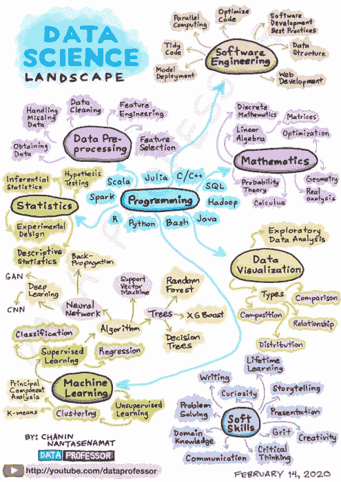
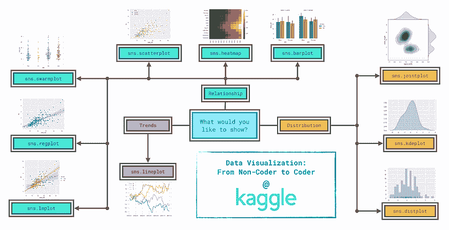
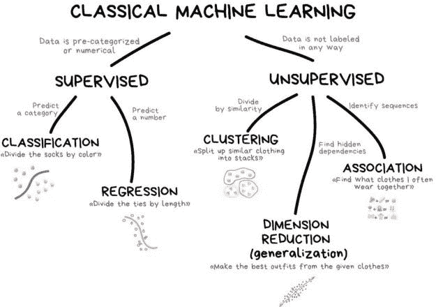

# 成为数据科学家的指南（逐步方法）

> 原文：[`www.kdnuggets.com/2021/05/guide-become-data-scientist.html`](https://www.kdnuggets.com/2021/05/guide-become-data-scientist.html)

有很多资源和链接，但我们经常会困惑选择哪个资源。别担心，我已经为你准备好了。我附上了几个我认为适合初学者的 YouTube 频道、博客、课程和其他网站的链接。

你也可以使用像 Analytics Vidhya 和 Kaggle 这样的数据科学社区网站来实施你的学习，并获得数据科学的实践经验。

* * *

## 我们的前三大课程推荐

 1\. [Google 网络安全证书](https://www.kdnuggets.com/google-cybersecurity) - 快速进入网络安全职业。

 2\. [Google 数据分析专业证书](https://www.kdnuggets.com/google-data-analytics) - 提升你的数据分析技能

 3\. [Google IT 支持专业证书](https://www.kdnuggets.com/google-itsupport) - 支持你的组织的 IT 工作

* * *

数据科学路线图

# 步骤 1：选择编程语言（Python / R）

在开始数据科学之旅时，第一步是熟悉一种编程语言。在两者之间，Python 是最受欢迎的编程语言，大多数数据科学家都采用它。它易于理解、多功能，并支持各种内置库，如 Numpy、Pandas、Matplotlib、Seaborn、Scipy 等。

1.  [FreeCodeCamp 的 Python 教程](https://www.youtube.com/watch?v=rfscVS0vtbwl)（推荐）

1.  [Kaggle 的 Python 课程](https://www.kaggle.com/learn/python)

1.  [Krish Naik 的 Python 教程](https://www.youtube.com/playlist?list=PLZoTAELRMXVNUL99R4bDlVYsncUNvwUBB)（推荐）

1.  [Udemy 的数据科学与机器学习 Python 训练营](https://bit.ly/dataprofessor-udemy-python-ds)

1.  [Coursera Python 课程](https://www.coursera.org/learn/python)

> **注意：** 在学习 Python 时，应了解基本的 Python 变量、数据类型、面向对象的概念、Numpy、Pandas、Matplotlib 和 Seaborn。

# 步骤 2：统计学

对于成为数据科学家来说，了解统计学和概率学就像食物中需要盐一样重要。了解这些知识将帮助数据科学家解读大量数据集，从中获得洞察，并更好地分析数据。

1.  [Krish Naik 的统计学播放列表](https://www.youtube.com/watch?v=zRUliXuwJCQ&list=PLZoTAELRMXVMhVyr3Ri9IQ-t5QPBtxzJO)（推荐）

1.  [Coursera 统计课程](https://www.coursera.org/learn/statistics-for-data-science-python)

1.  [Khan Academy 统计与概率课程](https://www.khanacademy.org/math/statistics-probability)

1.  [FreeCodeCamp 统计学课程](https://www.youtube.com/watch?v=xxpc-HPKN28)（推荐）

> **注意：** 统计学提供了关于均值、中位数、众数、范围、方差、标准差、图表或绘图、总体和样本的概念。

# 第 3 步：学习 SQL

结构化查询语言（SQL）用于从大型数据库中提取和沟通。应专注于理解不同类型的规范化、编写嵌套查询、使用相关查询、分组、执行连接操作等，并以原始格式提取数据。然后，这些数据将在 Microsoft Excel 中或使用 Python 库进一步清理。

1.  [Freecodecamp SQL](https://www.youtube.com/watch?v=HXV3zeQKqGY)（推荐）

1.  [Kaggle 的 SQL 入门](https://www.kaggle.com/learn/intro-to-sql)（推荐）

1.  [Kaggle 的高级 SQL](https://www.kaggle.com/learn/advanced-sql)

1.  [Edureka 的 SQL 播放列表](https://www.youtube.com/watch?v=BPHAr4QGGVE)

> **注意：** 在 SQL 中，应了解创建表、插入数据、更新数据、删除数据以及执行一些基本查询操作。

# 第 4 步：数据清理

当数据科学家接到一个项目时，大多数时间花在清理数据集、删除不必要的值、处理缺失值上。可以通过使用一些内置的 Python 库，如 Pandas 和 Numpy，来实现这一点。

还应了解如何使用 Microsoft Excel 操作数据。

1.  [博客 — 使用 Python 清理数据](https://realpython.com/python-data-cleaning-numpy-pandas/)（推荐）

1.  [Edureka 的 Microsoft Excel 课程](https://www.youtube.com/watch?v=RdTozKPY_OQ&t=2984s)

1.  [Kaggle 的 Pandas 学习](https://www.kaggle.com/learn/pandas)（推荐）

> **注意：** 在 Microsoft Excel 中，你应该了解基本的数据筛选或排序、函数或公式、Vlookup、数据透视表和图表以及表格等。

# 第 5 步：探索性数据分析

探索性数据分析是谈论数据科学时的关键部分。数据科学家有许多任务，包括发现数据模式、分析数据、寻找数据中的适当趋势并获得有价值的见解等，使用各种图形和统计方法，包括：

A) 使用 Pandas 和 Numpy 进行数据分析

B) 数据操作

C) 数据可视化

1.  [Code Heroku 的 EDA 入门](https://www.youtube.com/watch?v=pKsGE7wqQks)（推荐）

1.  [博客 — 对鸢尾花数据集进行探索性数据分析](https://medium.com/analytics-vidhya/exploratory-data-analysis-iris-dataset-4df6f045cda)（推荐）

1.  [Coursera 课程：EDA、统计学、概率](https://www.coursera.org/learn/probability-theory-statistics)

Seaborn Python 库中的图表类型。

# 第 6 步：学习机器学习算法

根据 Google 的说法，“机器学习是一种数据分析方法，它自动化了分析模型的构建。它是基于人工智能的一个分支，其思想是系统可以从数据中学习、识别模式，并在最少的人为干预下做出决策。”

这是数据科学家生命周期中最关键的一步，在这一步中，必须使用机器学习算法构建各种模型，并能够预测并提出最优化的解决方案来解决任何问题。

1.  [安德鲁·吴的机器学习课程](https://www.coursera.org/learn/machine-learning)（推荐）

1.  [克里希·奈克的深度学习课程](https://www.youtube.com/watch?v=9jA0KjS7V_c&list=PLZoTAELRMXVPGU70ZGsckrMdr0FteeRUi)

1.  [Kaggle 的机器学习简介](https://www.kaggle.com/learn/intro-to-machine-learning)（推荐）

1.  [克里希·奈克的机器学习课程](https://www.youtube.com/watch?v=EqRsD3gqeCo&list=PLZoTAELRMXVOnN_g96ayzXX5i7RRO0QhL)（推荐）

1.  [Coursera 深度学习专业课程](https://www.coursera.org/specializations/deep-learning)

机器学习领域。

# 第七步：在 Analytics Vidhya 和 Kaggle 上实践

在掌握数据科学基础知识后，现在是时候获得实践经验了。有许多在线平台，如 Kaggle 和 Analytics Vidhya，可以提供初级和高级数据集的实践经验。它们可以帮助你理解各种机器学习算法、不同的分析技术等。

你可以按照以下方法了解如何有效地使用这些平台。

1.  你可以先下载数据集并分析数据，然后实施你所学的各种技术。

1.  接下来，你可以查看其他人的笔记本，了解他们是如何解决特定问题或从数据中获取见解的。（这种方法将使你更加自信，并帮助你提升知识。）

1.  当你足够自信时，你可以参加 Kaggle 和 Analytics Vidhya 组织的竞赛。这不仅会帮助你提升数据科学技能，还能更好地学习数据科学。

[**阿迪提亚·阿格瓦尔**](https://www.linkedin.com/in/adityaagarwal68/) 是东北大学的研究生。

[原文](https://adi-ag321.medium.com/a-guide-on-how-to-become-a-data-scientist-step-by-step-approach-e5e84f3a0a92)。已获许可转载。

### 更多相关话题

+   [如何构建数据科学项目：逐步指南](https://www.kdnuggets.com/2022/05/structure-data-science-project-stepbystep-guide.html)

+   [用 Python 和 Beautiful Soup 进行网络抓取的逐步指南](https://www.kdnuggets.com/2023/04/stepbystep-guide-web-scraping-python-beautiful-soup.html)

+   [文本到视频生成：逐步指南](https://www.kdnuggets.com/2023/08/text2video-generation-stepbystep-guide.html)

+   [逐步阅读和理解 SQL 查询的指南](https://www.kdnuggets.com/a-step-by-step-guide-to-reading-and-understanding-sql-queries)

+   [解析 DENSE_RANK()：SQL 爱好者的逐步指南](https://www.kdnuggets.com/breaking-down-denserank-a-step-by-step-guide-for-sql-enthusiasts)

+   [像专业人士一样测试：Python Mock 库的逐步指南](https://www.kdnuggets.com/testing-like-a-pro-a-step-by-step-guide-to-pythons-mock-library)
