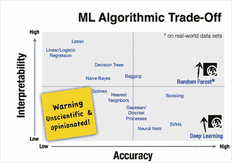
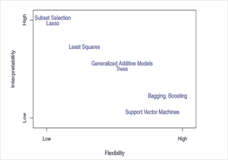
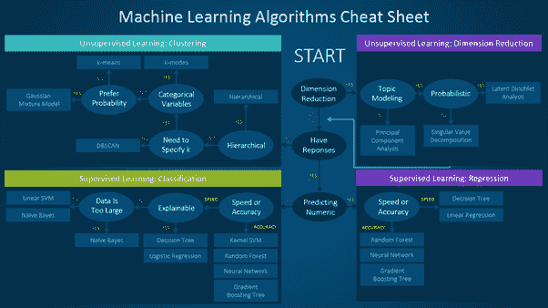
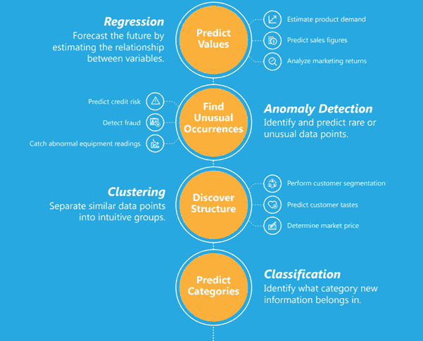
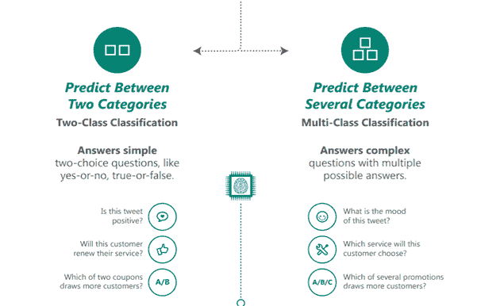

# 选择合适的机器学习算法的简单指南

> 原文：[`www.kdnuggets.com/2020/05/guide-choose-right-machine-learning-algorithm.html`](https://www.kdnuggets.com/2020/05/guide-choose-right-machine-learning-algorithm.html)

由 [Javier Allegue Barros](https://unsplash.com/@soymeraki?utm_source=unsplash&utm_medium=referral&utm_content=creditCopyText) 提供的照片，来源于 [Unsplash](https://unsplash.com/?utm_source=unsplash&utm_medium=referral&utm_content=creditCopyText)

**如何选择合适的机器学习算法？**

* * *

## 我们的前三个课程推荐

 1\. [Google 网络安全证书](https://www.kdnuggets.com/google-cybersecurity) - 快速进入网络安全职业领域。

 2\. [Google 数据分析专业证书](https://www.kdnuggets.com/google-data-analytics) - 提升你的数据分析能力

 3\. [Google IT 支持专业证书](https://www.kdnuggets.com/google-itsupport) - 支持你的组织 IT 工作

* * *

对于这个问题，没有直接和确定的答案。答案取决于许多因素，如问题陈述和你希望的输出类型、数据的类型和大小、可用的计算时间、特征数量和数据中的观察数量等。

选择算法时需要考虑的一些重要因素。

## 1\. 训练数据的大小

通常建议收集大量数据以获得可靠的预测。然而，许多情况下，数据的可用性是一个限制因素。因此，如果训练数据较少，或者数据集中的观察数量较少但特征数量较多，如遗传数据或文本数据，则应选择高偏差/低方差的算法，如线性回归、朴素贝叶斯或线性 SVM。

如果训练数据足够大，并且观察数量相对于特征数量较高，则可以选择低偏差/高方差的算法，如 KNN、决策树或核 SVM。

## 2\. 输出的准确性和/或可解释性

模型的准确性意味着该函数为给定观察值预测的响应值接近该观察值的真实响应值。一个高度可解释的算法（如线性回归这类限制性模型）意味着可以很容易地理解任何单一预测变量与响应的关系，而灵活的模型在牺牲可解释性的情况下提供更高的准确性。

使用不同统计学习方法之间准确性与可解释性权衡的表示。 ([source](https://cdn.oreillystatic.com/en/assets/1/event/105/Overcoming%20the%20Barriers%20to%20Production-Ready%20Machine-Learning%20Workflows%20Presentation%201.pdf))

有些算法被称为限制性算法，因为它们生成的映射函数形状范围较小。例如，线性回归是一种限制性方法，因为它只能生成线性函数，例如直线。

有些算法被称为灵活性高，因为它们可以生成更广泛的映射函数形状。例如，KNN（k=1）非常灵活，因为它会考虑每一个输入数据点以生成映射输出函数。下图展示了灵活性和限制性算法之间的权衡。

使用不同统计学习方法之间灵活性与可解释性权衡的表示。 ([source](https://www-bcf.usc.edu/~gareth/ISL/ISLR%20Sixth%20Printing.pdf))

现在，使用哪种算法取决于业务问题的目标。如果目标是推断，那么限制性模型更好，因为它们更具可解释性。如果目标是更高的准确性，那么灵活性模型更好。一般来说，随着方法的灵活性增加，其可解释性会降低。

## 3\. 速度或训练时间

更高的准确性通常意味着更长的训练时间。此外，算法在大量训练数据上训练时需要更多时间。在实际应用中，算法的选择主要受这两个因素的驱动。

像朴素贝叶斯、线性回归和逻辑回归这样的算法容易实现且运行迅速。像支持向量机（SVM）、涉及参数调优的神经网络以及随机森林这样的算法需要大量的时间来训练数据。

## 4\. 线性

许多算法基于这样一个假设：类别可以通过直线（或其高维类比）分开。例如，逻辑回归和支持向量机。线性回归算法假设数据趋势遵循一条直线。如果数据是线性的，那么这些算法表现得相当好。

然而，数据并不总是线性的，因此我们需要其他能够处理高维和复杂数据结构的算法。例如，核 SVM、随机森林、神经网络。

发现线性关系的最佳方法是拟合一条线性直线，或运行逻辑回归或支持向量机（SVM）并检查残差。较高的误差意味着数据不是线性的，需要复杂的算法进行拟合。

## 5\. 特征数量

数据集可能具有大量特征，而这些特征可能并非全部相关且重要。对于某些类型的数据，例如基因数据或文本数据，相比于数据点数量，特征的数量可能非常大。

大量的特征可能会拖慢某些学习算法的速度，使训练时间变得极其漫长。SVM 在特征空间较大且观测值较少的数据情况下更为适用。应使用 PCA 和特征选择技术来降低维度并选择重要特征。

这里有一个实用的**备忘单**，详细列出了你可以用于不同类型机器学习问题的算法。

[来源](https://blogs.sas.com/content/subconsciousmusings/2017/04/12/machine-learning-algorithm-use/)

[机器学习算法](https://www.kdnuggets.com/2016/08/10-algorithms-machine-learning-engineers.html)可以分为监督学习、无监督学习和强化学习，正如我之前的[博客](https://www.edvancer.in/understanding-artificial-intelligence-machine-learning-and-data-science/)中所讨论的。本文将引导你如何使用这张表格。

备忘单主要分为两种学习类型：

**监督学习算法** 在训练数据中具有与输入变量对应的输出变量时使用。该算法分析输入数据，并学习一个函数来映射输入与输出变量之间的关系。

监督学习还可以进一步分类为回归、分类、预测和异常检测。

**无监督学习** 算法在训练数据没有响应变量时使用。这些算法试图找到数据中的内在模式和隐藏结构。聚类和降维算法是无监督学习算法的类型。

以下信息图简单解释了回归、分类、异常检测和聚类，并举例说明这些方法可以应用的场景。

[来源](https://docs.microsoft.com/en-us/azure/machine-learning/studio/algorithm-choice)

解决新问题时需要考虑的主要要点是：

+   定义问题。问题的目标是什么？

+   探索数据并熟悉数据。

+   从基本模型开始建立基准模型，然后尝试更复杂的方法。

话虽如此，始终记住“**更好的数据往往胜过更好的算法**”，正如我在之前的[博客](https://www.edvancer.in/data-cleaning)中讨论的那样。设计良好的特征同样重要。尝试多种算法并比较它们的表现，以选择最适合你特定任务的算法。此外，尝试集成方法，因为它们通常提供更高的准确性。

[Yogita Kinha](https://www.linkedin.com/in/yogita-kinha/) 是一位经验丰富的专业人士，擅长 R、Python、机器学习以及用于统计计算和图形的软件环境，具备 Hadoop 生态系统的实际操作经验，以及软件测试领域的测试与报告经验。

[原文](https://medium.com/dataseries/an-easy-guide-to-choose-the-right-machine-learning-algorithm-for-your-task-b0f6d77aab75)。经许可转载。

### 主题更多

+   [2024 年你需要选择的 8 个数据工程职位](https://www.kdnuggets.com/8-data-engineering-jobs-you-need-to-choose-from-in-2024)

+   [Python 中的数据预处理简单指南](https://www.kdnuggets.com/2020/07/easy-guide-data-preprocessing-python.html)

+   [OpenAI API 初学者：易于跟随的入门指南](https://www.kdnuggets.com/openai-api-for-beginners-your-easy-to-follow-starter-guide)

+   [为你的数据集选择正确的聚类算法](https://www.kdnuggets.com/2019/10/right-clustering-algorithm.html)

+   [机器学习算法的完整端到端部署到…](https://www.kdnuggets.com/2021/12/deployment-machine-learning-algorithm-live-production-environment.html)

+   [解锁选择完美机器学习算法的秘诀！](https://www.kdnuggets.com/2023/07/ml-algorithm-choose.html)
