# 线性回归模型指南

> 原文：[`www.kdnuggets.com/2020/10/guide-linear-regression-models.html`](https://www.kdnuggets.com/2020/10/guide-linear-regression-models.html)

评论

**由 [Diego Lopez Yse](https://www.linkedin.com/in/lopezyse/), 数据科学家**


图片由 [Drew Beamer](https://unsplash.com/@drew_beamer?utm_source=medium&utm_medium=referral) 提供，来源于 [Unsplash](https://unsplash.com/?utm_source=medium&utm_medium=referral)

* * *

## 我们的前三个课程推荐

 1\. [谷歌网络安全证书](https://www.kdnuggets.com/google-cybersecurity) - 加速你的网络安全职业生涯。

 2\. [谷歌数据分析专业证书](https://www.kdnuggets.com/google-data-analytics) - 提升你的数据分析技能

 3\. [谷歌 IT 支持专业证书](https://www.kdnuggets.com/google-itsupport) - 支持你的组织进行 IT 工作

* * *

可解释性是机器学习中的一个重大挑战。如果一个模型的决策对人类更易于理解，那么它的可解释性就高于其他模型。一些模型复杂到几乎无法理解它们如何得出最终结果。这些黑箱似乎打破了原始数据与最终输出之间的联系，因为中间发生了多个过程。

在机器学习算法的宇宙中，有些模型比其他模型更透明。[决策树](https://towardsdatascience.com/modelling-classification-trees-3607ad43a123)无疑是其中之一，线性回归模型也是另一个。它们的简单性和直接的方法使它们成为处理不同问题的理想工具。让我们来看看。

你可以使用线性回归模型来分析某地的薪资如何依赖于如经验、教育水平、角色、所在城市等特征。同样，你也可以分析房地产价格是否依赖于如面积、卧室数量或距离市中心的因素。

在这篇文章中，我将重点讨论线性回归模型，这些模型检查 **因变量** 和一个（简单线性回归）或多个（多重线性回归） **自变量** 之间的线性关系。

### 简单线性回归（SLR）

当输出变量（目标）只有一个输入变量（预测变量）时，使用最简单形式的线性回归：

+   **输入** 或 **预测变量** 是帮助预测输出变量值的变量。它通常被称为 ***X***。

+   **输出** 或 **目标变量** 是我们想要预测的变量。它通常被称为 ***y***。

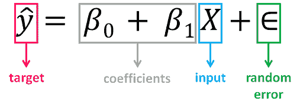

**β0，亦称截距**的值显示了估计回归线与***y***轴交点的位置，而**β1**的值**确定了估计回归线的斜率**。**随机误差**描述了因变量与自变量之间线性关系的随机成分（模型的干扰，即***X***无法解释的***y***部分）。真实的回归模型通常是未知的（因为我们无法捕捉所有影响因变量的因素），因此，实际数据点对应的随机误差项的值仍然未知。然而，通过计算观察数据集的模型参数，可以估计回归模型。

回归的思想是从样本中估计参数**β0**和**β1**。如果我们能够确定这两个参数的最优值，那么我们将得到**最佳拟合线**，可以用来预测***y***的值，给定***X***的值。换句话说，我们尝试拟合一条线，以观察输入和输出变量之间的关系，然后进一步用它来预测未见输入的输出。

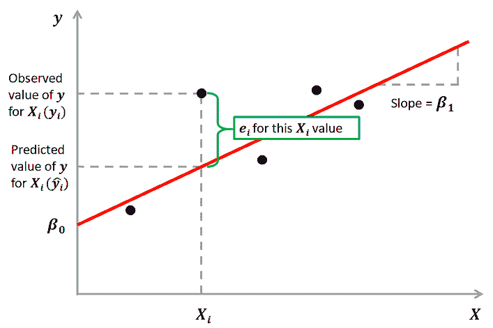

我们如何估计**β0**和**β1**？我们可以使用一种叫做**普通最小二乘法（OLS）**的方法。其目标是尽可能将黑点到红线的距离减小到接近零，这通过最小化实际结果和预测结果之间的平方差来实现。

实际值和预测值之间的差异称为**残差（e）**，它可以是负的或正的，具体取决于模型是否过度预测或低估了结果。因此，为了计算净误差，直接将所有残差相加可能会导致项的相互抵消和净效果的减少。为避免这种情况，我们取这些误差项的平方和，这被称为***残差平方和（RSS）***。

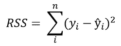

**普通最小二乘法（OLS）最小化残差平方和**，其目标是拟合一条回归线，以最小化观察值与预测值（回归线）之间的距离（以平方值计）。

### 多元线性回归（MLR）

当有两个或更多预测变量或输入变量时使用的线性回归形式。类似于之前描述的 SLR 模型，它包括额外的预测变量：

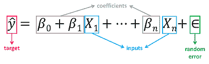

注意这个方程只是简单线性回归方程的扩展，其中每个输入/预测变量都有其相应的斜率系数**(β*)**。第一个**β**项**(β0)**是截距常数，是在没有所有预测变量的情况下***y***的值（即当所有***X***项为 0 时）。

随着特征数量的增加，我们模型的复杂性也增加，数据的可视化和理解变得更加困难。由于这些模型中参数更多，相较于 SLR 模型，需要更多的注意。增加更多的项本质上会改善对数据的拟合，但这些新项可能没有实际意义。这是危险的，因为它可能导致一个适应数据但实际上没有任何有用意义的模型。

### 一个示例

广告数据集包含了在 200 个不同市场中某产品的销售情况，以及对三种不同媒体（电视、广播和报纸）的广告预算。我们将使用这个数据集来预测销售量（因变量），基于电视、广播和报纸广告预算（自变量）。

从数学角度看，我们尝试解决的公式是：

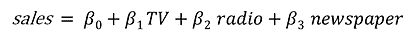

找到这些常数**(β)**的值是回归模型通过最小化误差函数和拟合最佳线或超平面（取决于输入变量的数量）来完成的。让我们开始编码。

### 加载数据并描述数据集

你可以在[this link](https://github.com/dlopezyse/Medium)下载数据集。在加载数据之前，我们将导入必要的库：

```py
import pandas as pd
import numpy as np
import seaborn as sns
import matplotlib.pyplot as plt
from sklearn.model_selection import train_test_split
from sklearn.linear_model import LinearRegression
from sklearn import metrics
from sklearn.metrics import r2_score
import statsmodels.api as sm
```

现在我们加载数据集：

```py
df = pd.read_csv(“Advertising.csv”)
```

让我们了解数据集并描述它：

```py
df.head()
```

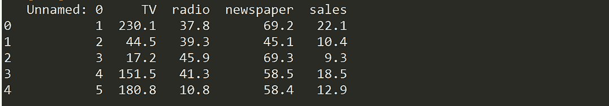

我们将删除第一列（“Unnamed”），因为我们不需要它：

```py
df = df.drop([‘Unnamed: 0’], axis=1)
df.info()
```

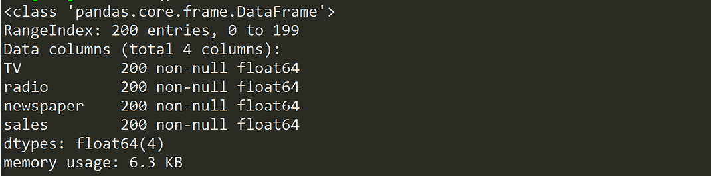

我们的数据集现在包含 4 列（包括目标变量“销售”）、200 个记录和没有缺失值。让我们可视化自变量和目标变量之间的关系。

```py
sns.pairplot(df)
```

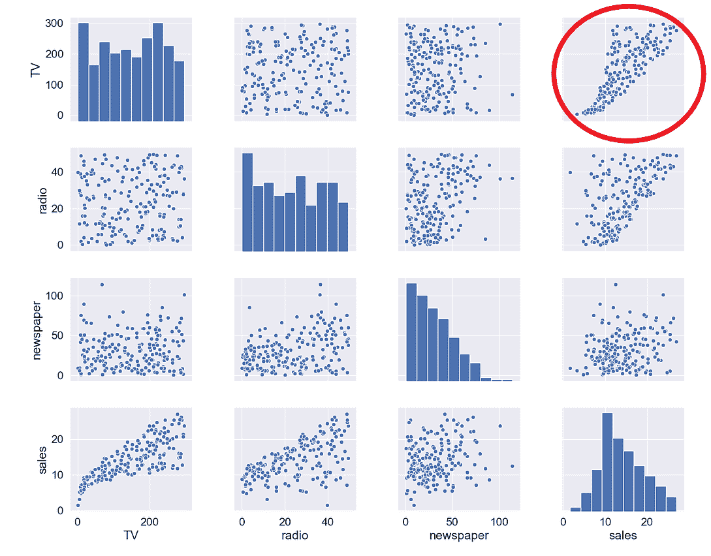

电视与销售之间的关系似乎相当强，而广播与销售之间似乎有一些趋势，但报纸与销售之间的关系似乎不存在。我们还可以通过相关性图来数值验证这一点：

```py
mask = np.tril(df.corr())
sns.heatmap(df.corr(), fmt=’.1g’, annot=True, cmap= ‘cool’, mask=mask)
```

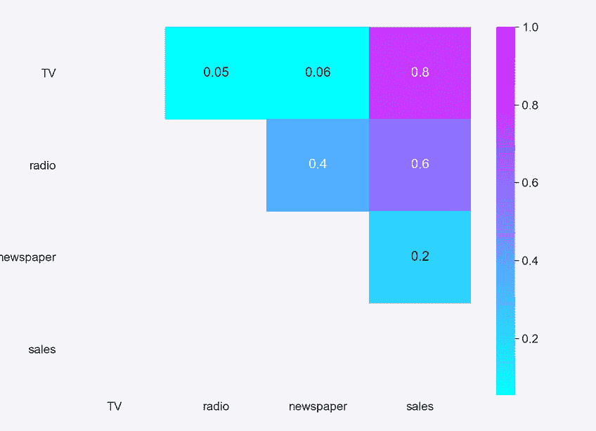

正如我们预期的那样，销售与电视之间的正相关最强，而销售与报纸之间的关系接近于 0。

### 选择特征和目标变量

接下来，我们将变量分为两组：因变量（或目标变量“y”）和自变量（或特征变量“X”）

```py
X = df.drop([‘sales’], axis=1)
y = df[‘sales’]
```

### 拆分数据集

为了理解模型的表现，将数据集分为训练集和测试集是一种良好的策略。通过将数据集分为两个独立的集合，我们可以使用一个集合进行训练，使用另一个集合上的未见数据测试模型的表现。

```py
X_train, X_test, y_train, y_test = train_test_split(X, y, test_size=0.3, random_state=0)
```

我们将数据集拆分为 70%的训练集和 30%的测试集。random_state 参数用于初始化内部随机数生成器，它将决定数据拆分为训练和测试索引。我将 random_state 设置为 0，以便你可以使用相同的参数比较多次运行的输出。

```py
print(X_train.shape,y_train.shape,X_test.shape,y_test.shape)
```

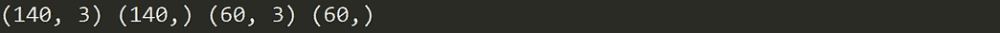

通过打印拆分集的形状，我们可以看到我们创建了：

+   2 个数据集，每个数据集包含 140 条记录（总记录的 70%），一个有 3 个独立变量，一个只有目标变量，将用于 **训练** 和生成线性回归模型。

+   2 个数据集，每个数据集包含 60 条记录（总记录的 30%），一个有 3 个独立变量，一个只有目标变量，将用于 **测试** 线性回归模型的性能。

### 构建模型

构建模型是如此简单：

```py
mlr = LinearRegression()
```

### 训练模型

将模型拟合到训练数据上代表了建模过程中的训练部分。训练后，模型可以用来进行预测，通过调用 predict 方法：

```py
mlr.fit(X_train, y_train)
```

让我们看看模型训练后的输出，并查看 **β0**（截距）的值：

```py
mlr.intercept_
```

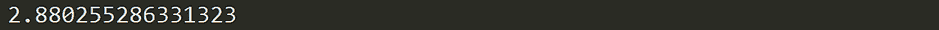

我们还可以打印系数的值 **(β)**：

```py
coeff_df = pd.DataFrame(mlr.coef_, X.columns, columns =[‘Coefficient’])
coeff_df
```

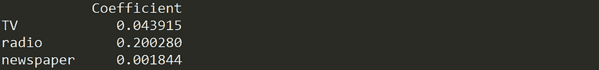

这样我们现在可以根据不同的电视、广播和报纸预算值来估计“销售” 的值：

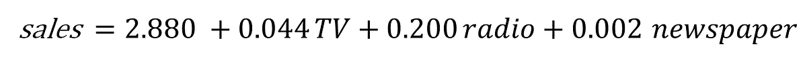

例如，如果我们为电视确定了 50 的预算，为广播 30，为报纸 10，则“销售” 的估计值将是：

```py
example = [50, 30, 10]
output = mlr.intercept_ + sum(example*mlr.coef_)
output
```

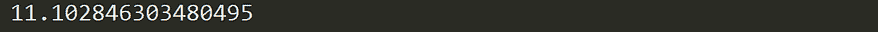

### 测试模型

测试数据集是与训练数据集独立的数据集。这个测试数据集是模型未见过的数据，这将帮助你更好地了解模型的泛化能力：

```py
y_pred = mlr.predict(X_test)
```

### **评估性能**

模型的质量与其预测值与测试数据集的实际值匹配的程度有关：

```py
print(‘Mean Absolute Error:’, metrics.mean_absolute_error(y_test, y_pred))
print(‘Mean Squared Error:’, metrics.mean_squared_error(y_test, y_pred))
print(‘Root Mean Squared Error:’, np.sqrt(metrics.mean_squared_error(y_test, y_pred)))
print(‘R Squared Score is:’, r2_score(y_test, y_pred))
```

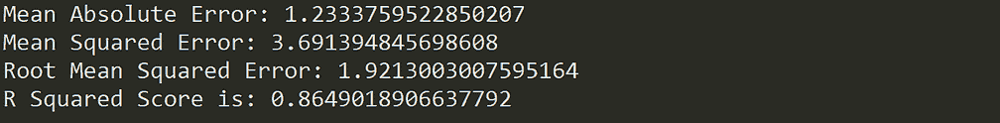

在用测试集验证我们的模型后，我们得到的 R² 值为 0.86，这似乎是一个相当不错的性能得分。但虽然更高的 R² 表示模型拟合得更好，但高的测量值不总是正面的。我们将在下文中看到一些解读和改进回归模型的方法。

### **如何解读和改进你的模型？**

好了，我们创建了模型，接下来呢？让我们查看训练数据上的模型统计数据，以获得一些答案：

```py
X2 = sm.add_constant(X_train)
model_stats = sm.OLS(y_train.values.reshape(-1,1), X2).fit()
model_stats.summary()
```

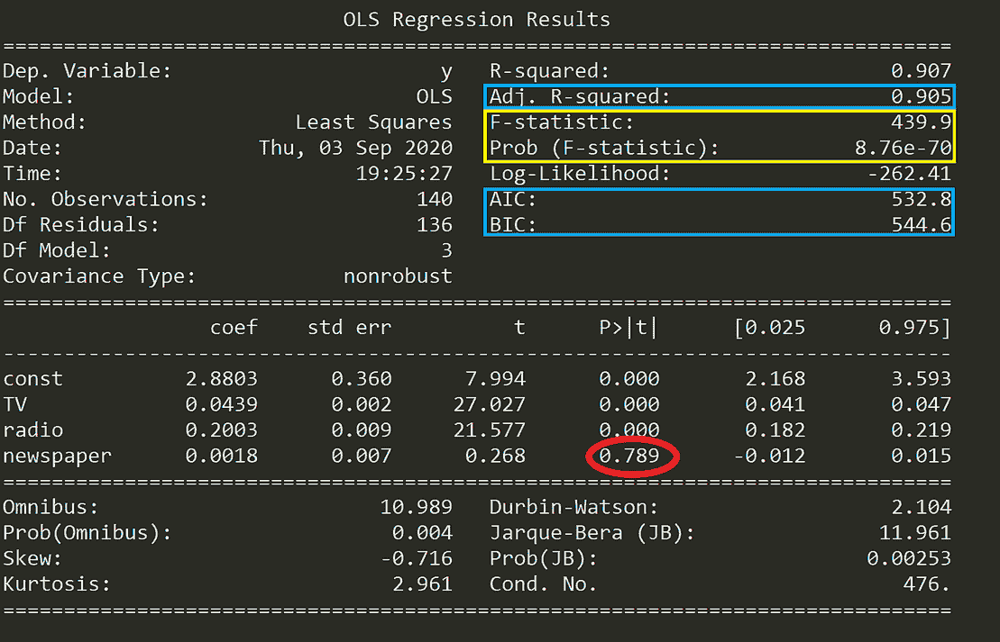

让我们看看这些数字的含义。

### **假设检验**

在运行多元线性回归模型时，您应该回答的基本问题之一是，[至少一个预测变量是否对预测输出有用](https://towardsdatascience.com/multiple-linear-regression-8cf3bee21d8b)。如果自变量与目标之间的关系只是偶然的，并且任何预测变量对销售没有实际影响，该怎么办？

我们需要进行假设检验来回答这个问题并检查我们的假设。首先形成**原假设 (H0)**，即所有系数等于零，预测变量与目标之间没有关系（意味着一个没有自变量的模型与您的模型一样好）：

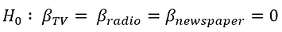

多元线性回归。来源: [Towards Data Science](https://towardsdatascience.com/multiple-linear-regression-8cf3bee21d8b)

另一方面，我们需要定义**备择假设 (Ha)**，即至少一个系数不为零，且预测变量与目标之间存在关系（意味着您的模型比仅有截距的模型更好地拟合数据）：

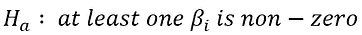

多元线性回归。来源: [Towards Data Science](https://towardsdatascience.com/multiple-linear-regression-8cf3bee21d8b)

如果我们想要拒绝原假设并对我们的回归模型有信心，我们需要找到强有力的统计证据。为此，我们进行假设检验，其中使用**F 统计量**。

> *如果 F 统计量的值等于或非常接近 1，则结果支持原假设，我们无法拒绝它。*

如上表所示（标记为黄色），F 统计量为 439.9，因此提供了强有力的证据来反驳原假设（即所有系数为零）。接下来，我们还需要检查在原假设为真的情况下**F 统计量出现的概率**（也标记为黄色），其值为 8.76e-70，这是一个远小于 1%的极小数字。这意味着在假设原假设有效的情况下，F 统计量 439.9 出现的概率远低于 1%。

话虽如此，我们可以拒绝原假设，并确信至少一个预测变量对预测输出是有用的。

### 生成模型

运行包含许多变量（包括无关变量）的线性回归模型会导致模型过于复杂。哪些预测变量是重要的？它们都对我们的模型重要吗？要找出这一点，我们需要进行一个叫做**特征选择**的过程。特征选择的两种主要方法是：

1.  **前向选择：** 从与因变量相关性最高的预测变量开始，逐个添加预测变量。然后，按照理论重要性将变量顺序地纳入模型，直到达到停止规则。

1.  **后向淘汰：** 从模型中包含所有变量开始，移除那些统计显著性最低（p 值较大）的变量，直到达到停止规则。

尽管可以使用这两种方法，但除非预测变量的数量大于样本量（或事件数量），否则通常更倾向于使用后向淘汰方法。

你可以在 [this link](https://towardsdatascience.com/multiple-linear-regression-8cf3bee21d8b)找到这些方法的完整示例和实现。

### **比较模型**

每次你向模型中添加一个自变量时，R² 都会增加，即使该自变量并不显著。在我们的模型中，所有预测变量是否都在增加销售额？如果是，它们的贡献程度是否相同？

与 R² 相对，**调整后的 R²** 是一个只有在自变量显著且影响因变量时才会增加的指标。因此，如果你的 R² 分数增加但调整后的 R² 分数下降，那么说明一些特征没有用处，你应该将其移除。

上表中的一个有趣发现是，**p 值** 对于报纸的值非常高（0.789，标记为红色）。找出每个系数的 p 值将告诉你该变量是否对预测目标具有统计学意义。

> 一般来说，如果某个变量的 p 值小于 0.05，那么该变量与目标之间有很强的关系。

这样的话，包含报纸变量似乎不适合达到一个稳健的模型，移除它可能会提高模型的表现和泛化能力。

除了调整后的 R² 分数，你还可以使用其他标准来比较不同的回归模型：

+   **赤池信息准则 (AIC)：** 是一种用于估计模型预测/估计未来值可能性的技术。它奖励那些拟合度高的模型，并对过于复杂的模型进行惩罚。一个好的模型是所有模型中 AIC 最小的模型。

+   **贝叶斯信息准则 (BIC)：** 是另一种模型选择标准，衡量模型拟合度与复杂性之间的权衡，对过于复杂的模型进行更多惩罚。

### 假设

因为线性回归模型是对任何事件的长期序列的近似，因此它们需要对其代表的数据做出一些假设，以保持适用性。大多数统计测试依赖于对分析中使用的变量的某些假设，当这些假设不成立时，结果可能不可靠（例如，导致 I 型或 II 型错误）。

线性回归模型在输出是输入变量的线性组合的意义上是线性的，并且仅适用于建模线性可分的数据。线性回归模型在各种假设下工作，这些假设必须存在以生成适当的估计，并且不能仅仅依赖于准确性评分：

+   **线性关系**：特征与目标之间的关系必须是线性的。检查线性关系的一种方法是通过可视化散点图来观察线性。如果散点图中显示的关系不是线性的，则需要进行非线性回归或转换数据。

+   **同方差性**：残差的方差在任何 x 值下都必须相同。多元线性回归假设残差中的误差量在每个线性模型点处是类似的。这种情况称为同方差性。散点图是一种检查数据是否同方差性的方法，还有几种测试可以在数值上验证这一假设（例如 Goldfeld-Quandt 测试、Breusch-Pagan 测试、White 测试）。

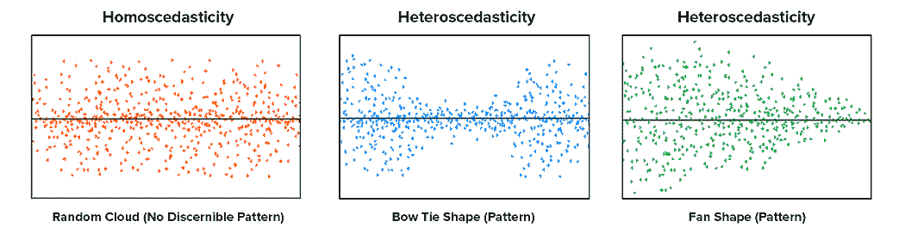

线性回归算法的假设。来源：[Towards Data Science](https://towardsdatascience.com/assumptions-of-linear-regression-algorithm-ed9ea32224e1)

+   **无多重共线性**：数据不应显示多重共线性，即当自变量（解释变量）之间高度相关时发生。如果发生这种情况，将会在确定哪个特定变量对因变量的方差有贡献时出现问题。可以通过方差膨胀因子（VIF）方法或相关矩阵来测试这一假设。解决此问题的替代方案包括对数据进行中心化（减去均值），或进行因子分析并旋转因子以确保线性回归分析中的因子独立性。

+   **无自相关性**：残差的值应彼此独立。残差中的相关性会显著降低模型的准确性。如果误差项相关，估计的标准误差往往会低估真实的标准误差。可以使用 Durbin-Watson 统计量来检验这一假设。

+   **残差的正态性**：残差必须呈正态分布。可以通过拟合优度检验（例如 Kolmogorov-Smirnov 检验或 Shapiro-Wilk 检验）来检查正态性，如果数据不呈正态分布，可以通过非线性变换（例如对数变换）来解决此问题。

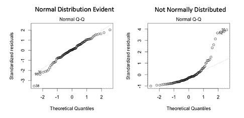

线性回归算法的假设。来源：[数据科学探索](https://towardsdatascience.com/assumptions-of-linear-regression-algorithm-ed9ea32224e1)

假设是关键的，因为如果它们不成立，那么分析过程可以被认为是不可靠、不可预测和失控的。未能满足假设可能导致得出无效或科学上未得到数据支持的结论。

你可以在[this link](https://www.kaggle.com/shrutimechlearn/step-by-step-assumptions-linear-regression)找到假设的全面测试。

### 最后的想法

尽管 MLR 模型扩展了 SLR 模型的范围，但它们仍然是线性模型，这意味着模型中包含的项无法显示彼此之间的任何非线性关系或表示任何非线性趋势。你在预测观察范围之外的点时也应该小心，因为随着你移动到观察范围之外，变量之间的关系可能会发生变化（这是你无法知道的，因为你没有数据）。

> 观察到的关系可能在局部是线性的，但在数据的外部范围可能存在未观察到的非线性关系。

**线性模型也可以通过包括非线性变量如多项式和变换指数函数来建模曲率**。线性回归方程在[*参数*](https://statisticsbyjim.com/glossary/parameter/)上是*线性的*，这意味着你可以通过指数提高自变量来拟合曲线，仍然保持在“线性世界”中。线性回归模型可以包含对数项和倒数项来跟随不同类型的曲线，并且仍然在参数上保持线性。


当自变量被平方时，模型仍然在参数上是线性的。

像[**多项式回归**](https://towardsdatascience.com/machine-learning-with-python-easy-and-robust-method-to-fit-nonlinear-data-19e8a1ddbd49)这样的回归可以建模*非线性关系*，而线性方程有一个基本形式，非线性方程可以采取许多不同的形式。你可能会考虑使用[**非线性回归模型**](https://towardsdatascience.com/how-to-choose-between-a-linear-or-nonlinear-regression-for-your-dataset-e58a568e2a15)，因为虽然线性回归可以建模曲线，但它可能无法建模数据中存在的特定曲线。

你还应该知道，最小二乘法（OLS）并不是拟合线性回归模型的唯一方法，其他优化方法如[**梯度下降**](https://towardsdatascience.com/linear-regression-simplified-ordinary-least-square-vs-gradient-descent-48145de2cf76)更适合拟合大数据集。将 OLS 应用于复杂和非线性算法可能不具备可扩展性，而梯度下降在找到解时可能计算成本更低（更快）。*梯度下降是一种最小化函数的算法*，在给定一组参数定义的函数时，算法从一组初始参数值开始，迭代地朝向最小化函数的参数值移动。这种**迭代最小化**是通过使用导数来实现的，沿函数梯度的负方向采取步骤。


使用梯度下降的线性回归。来源：[数据科学之路](https://towardsdatascience.com/linear-regression-using-gradient-descent-97a6c8700931)

另一个需要考虑的关键点是**离群值可能对回归线**和相关系数产生重大影响。为了识别它们，必须进行[探索性数据分析（EDA）](https://towardsdatascience.com/the-basics-of-data-prep-7bb5f3af77ac)，检查数据以检测异常观察，因为它们可能会对我们的分析和统计建模结果产生极大的影响。如果识别出任何离群值，可以对其进行插补（例如用均值/中位数/众数）、截断（替换超出某些限制的值），或用缺失值和预测值替代。

最后，一些[线性回归模型的局限性](https://www.imf.org/external/pubs/ft/fandd/2006/03/basics.htm)包括：

+   **遗漏变量**。需要有一个良好的理论模型来建议解释因变量的变量。在简单的双变量回归中，必须考虑其他可能解释因变量的因素，因为可能存在其他“未观察到”的变量来解释输出。

+   **反向因果关系**。许多理论模型预测双向因果关系——即一个因变量可以引起一个或多个解释变量的变化。例如，较高的收入可能使人们能够在自己的教育上投资更多，这反过来又提高了他们的收入。这使得回归的估计方式变得复杂，需采用特殊技术。

+   **测量误差**。因素可能被错误测量。例如，能力很难测量，而 IQ 测试存在已知的问题。因此，使用 IQ 的回归可能无法正确控制能力，从而导致教育和收入等变量之间的相关性不准确或有偏。

+   **关注点过于有限**。回归系数仅提供有关一个变量的微小变化如何与另一个变量的变化相关的信息——而非大变化。它会显示教育的小变化如何可能影响收入，但不会使研究者对大变化的影响做出概括。如果每个人同时接受大学教育，新毕业的大学生不太可能赚到更多，因为大学毕业生的总供应量将大幅增加。

> 对这些话题感兴趣？关注我在[Linkedin](https://www.linkedin.com/in/lopezyse/)或[Twitter](https://twitter.com/lopezyse)

**个人简介：[Diego Lopez Yse](https://www.linkedin.com/in/lopezyse/)**是一位经验丰富的专业人士，在不同的行业（资本市场、生物技术、软件、咨询、政府、农业）中积累了扎实的国际背景。始终是团队的一员。擅长商业管理、分析、金融、风险、项目管理和商业运营。拥有数据科学和企业金融硕士学位。

[原文](https://towardsdatascience.com/your-guide-to-linear-regression-models-df1d847185db)。经许可转载。

**相关：**

+   解决线性回归应使用哪些方法？

+   概率分布之前

+   时间复杂度：如何衡量算法的效率

### 相关主题更多内容

+   [使用线性回归模型而非…的 3 个理由](https://www.kdnuggets.com/2021/08/3-reasons-linear-regression-instead-neural-networks.html)

+   [预测：Python 中线性回归的初学者指南](https://www.kdnuggets.com/2023/06/making-predictions-beginner-guide-linear-regression-python.html)

+   [线性回归与逻辑回归的比较](https://www.kdnuggets.com/2022/11/comparing-linear-logistic-regression.html)

+   [线性回归与逻辑回归：简明解释](https://www.kdnuggets.com/2022/03/linear-logistic-regression-succinct-explanation.html)

+   [KDnuggets 新闻 22:n12，3 月 23 日：最佳数据科学书籍…](https://www.kdnuggets.com/2022/n12.html)

+   [数据科学中的线性回归](https://www.kdnuggets.com/2022/07/linear-regression-data-science.html)
