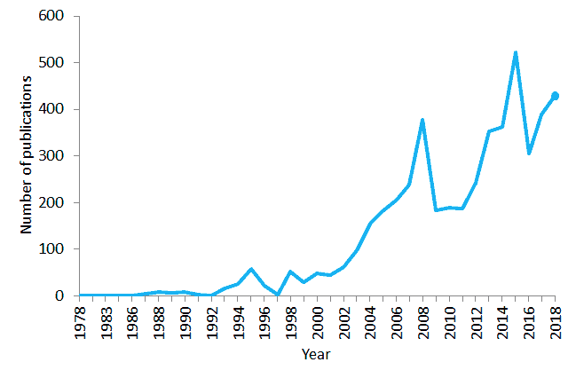
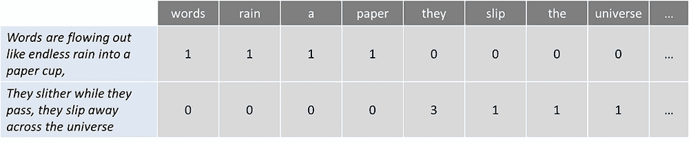
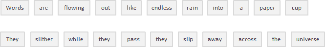
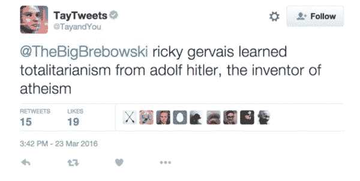

# 你在自然语言处理（NLP）方面的指南

> 原文：[`www.kdnuggets.com/2019/05/guide-natural-language-processing-nlp.html`](https://www.kdnuggets.com/2019/05/guide-natural-language-processing-nlp.html)

 评论

**由[Diego Lopez Yse](https://twitter.com/LopezYse)，穆迪 LATAM 运营**。

* * *

## 我们的前三大课程推荐

 1\. [Google 网络安全证书](https://www.kdnuggets.com/google-cybersecurity) - 快速进入网络安全职业生涯。

 2\. [Google 数据分析专业证书](https://www.kdnuggets.com/google-data-analytics) - 提升你的数据分析技能

 3\. [Google IT 支持专业证书](https://www.kdnuggets.com/google-itsupport) - 支持你的组织的 IT

* * *

我们表达的每一件事（无论是口头的还是书面的）都携带大量的信息。我们选择的话题、语气、词汇选择，一切都增加了一些可以被解释并从中提取价值的信息。从理论上讲，我们可以利用这些信息来理解甚至预测人类行为。

但有一个问题：一个人可能在声明中生成数百或数千个单词，每句话都有其对应的复杂性。如果你想在特定地理区域内扩展并分析数百、数千或数百万人或声明，那么情况就会变得难以管理。

从对话、声明甚至推文中生成的数据是非结构化数据的例子。**非结构化数据**不适合传统的关系数据库中的行列结构，代表了现实世界中绝大多数的数据。它是杂乱的，难以操作。然而，得益于机器学习等学科的进步，这个话题正经历一场巨大的革命。如今，不再是尝试基于关键词（传统的机械方式）来解释文本或语音，而是理解这些词汇背后的含义（认知方式）。这样可以检测到修辞手法，如讽刺，甚至进行情感分析。

> ***自然语言处理***或 NLP 是人工智能的一个领域，它赋予机器阅读、理解和推断人类语言含义的能力。

这是一个专注于数据科学与人类语言之间互动的学科，并且正在扩展到许多行业。如今，由于对数据获取的巨大改进和计算能力的提升，NLP 正在蓬勃发展，这使得从业者能够在医疗保健、媒体、金融和人力资源等领域取得有意义的成果。

### **NLP 的使用案例**

简单来说，NLP 代表了对自然人类语言（如语音或文本）的自动处理，虽然这个概念本身很迷人，但这种技术的真正价值来自于它的实际应用场景。

NLP 可以帮助您完成许多任务，其应用领域似乎每天都在增加。让我们举一些例子：

+   NLP 使得基于电子健康记录和患者自身语音的疾病**识别和预测**成为可能。这项能力正在被探索用于从心血管疾病到抑郁症甚至精神分裂症的健康状况。例如，Amazon Comprehend Medical 是一项利用 NLP 来[提取疾病状况](https://www.thenewsminute.com/article/tech-giants-india-join-ai-bandwagon-focus-healthcare-93833)、药物和治疗结果的服务，从患者笔记、临床试验报告和其他电子健康记录中提取信息。

+   组织可以通过识别和提取社交媒体等来源的信息来确定客户对服务或产品的评价。这种[**情感分析**](https://towardsdatascience.com/sentiment-analysis-concept-analysis-and-applications-6c94d6f58c17)可以提供关于客户选择及其决策驱动因素的大量信息。

+   [IBM 的一位发明家开发了一种**认知助手**](https://www.theatlantic.com/technology/archive/2016/01/sorry-dave-afraid-i-cant-do-that/431559/)，它像个个性化搜索引擎，通过了解您的所有信息，然后在您需要时提醒您一个名字、一首歌或任何您记不起来的东西。

+   像 Yahoo 和 Google 这样的公司通过分析流经其服务器的电子邮件文本来过滤和分类您的邮件，并**阻止垃圾邮件**，即使在它们到达您的收件箱之前。

+   为了帮助**识别虚假新闻**，[麻省理工学院的 NLP 小组](http://nlp.csail.mit.edu/)开发了一种新系统，用于判断信息源是否准确或具有政治偏见，检测新闻源是否值得信赖。

+   亚马逊的 Alexa 和苹果的 Siri 是**语音驱动接口**的例子，它们使用 NLP 来响应语音提示，并完成所有任务，如查找特定商店、告诉我们天气预报、建议最佳路线或打开家里的灯。

+   了解发生了什么以及人们在谈论什么对[**金融交易员**](https://news.efinancialcareers.com/nl-en/331386/charles-elkan-goldman-sachs-machine-learning)来说非常宝贵。NLP（自然语言处理）被用来追踪新闻、报告、关于公司可能合并的评论，一切都可以被纳入交易算法中以产生巨额利润。记住：买入谣言，卖出新闻。

+   NLP 也被应用于[**人才招聘**](https://www.forbes.com/sites/forbeshumanresourcescouncil/2018/09/27/how-ai-makes-recruiting-more-human/#7531fc116ba4)的搜索和筛选阶段，识别潜在雇员的技能，并在他们进入就业市场之前发现有潜力的候选人。

+   由 IBM Watson NLP 技术支持，[LegalMation](https://www.legalmation.com/)开发了一个平台，自动化日常**诉讼任务**，帮助法律团队节省时间，降低成本，并转移战略重点。

NLP 在**医疗行业**特别蓬勃发展。这项技术改善了护理服务、疾病诊断，并降低了成本，同时医疗机构在电子健康记录的采用上也在不断增长。临床文档的改进意味着患者可以通过更好的医疗得到更好的理解和利益。目标应是优化他们的体验，许多组织已经在这方面进行工作。

PubMed 在 1978–2018 年期间包含“自然语言处理”这句话的出版物数量。到 2018 年，PubMed 包含了超过 2900 万条生物医学文献引用。

像[Winterlight Labs](https://winterlightlabs.com/)这样的公司，通过语音监测认知障碍在阿尔茨海默病治疗方面取得了巨大进展，他们还可以支持各种中枢神经系统疾病的临床试验和研究。采用类似的方法，斯坦福大学开发了[Woebot](https://woebot.io/)，一个**聊天机器人治疗师**，旨在帮助有焦虑和其他障碍的人。

但围绕这一主题存在严重的[争议](https://www.bmj.com/content/358/bmj.j3159)。几年前，微软演示了通过分析大量搜索引擎查询样本，他们可以[识别出正在遭受胰腺癌的互联网用户](https://www.nytimes.com/2016/06/08/technology/online-searches-can-identify-cancer-victims-study-finds.html)，即使在他们收到疾病诊断之前。用户对这种诊断会有何反应？如果你被错误地标记为阳性（即使你没有该疾病）会发生什么？这让人想起 Google Flu Trends，在 2009 年宣布能够预测流感，但由于准确性低和未能达到预期而消失。

NLP 可能是未来有效临床支持的关键，但短期内仍面临许多挑战。

### **基础 NLP 技术让你的非 NLP 朋友刮目相看**

当前我们面临的主要缺点与自然语言处理（NLP）相关，语言本身非常复杂。理解和处理语言的过程极其复杂，因此通常需要使用不同的技术来应对不同的挑战，然后再将一切结合起来。像 Python 或 R 这样的编程语言被广泛用于执行这些技术，但在深入代码行之前（这将是另一篇文章的主题），理解其背后的概念非常重要。让我们总结并解释一些在定义术语词汇表时最常用的 NLP 算法：

#### **词袋模型**

是一种常用模型，允许你计算一段文本中的所有词汇。基本上，它为句子或文档创建一个发生矩阵，忽略语法和词序。这些词汇的频率或出现次数随后被用作训练分类器的特征。

为了举一个简单的例子，我取了披头士乐队歌曲《Across the Universe》的第一句：

> *词汇像无尽的雨水流入纸杯，*
> 
> *他们滑过时，他们滑离宇宙*

现在让我们计算一下词汇数量：

这种方法可能会反映出一些缺点，比如缺乏语义意义和上下文，停用词（如“the”或“a”）会给分析带来噪声，有些词的权重也不相应（“universe” 的权重低于“they”）。

为了解决这个问题，一种方法是通过词汇在所有文本中出现的频率（不仅仅是我们正在分析的文本）来重新调整词频，以使像“the”这样的频繁词汇在其他文本中也很常见，得到惩罚。这种评分方法称为**“词频—逆文档频率”**（**TFIDF**），它通过权重改进了词袋模型。通过 TFIDF，文本中的频繁词汇（如我们的例子中的“they”）会得到“奖励”，但如果这些词汇在其他文本中也很频繁，它们也会被“惩罚”。相反，这种方法突出了并“奖励”独特或稀有的术语，考虑了所有文本。然而，这种方法仍然没有上下文或语义。

#### **分词**

是将连续文本划分为句子和单词的过程。实质上，这就是将文本切割成称为*tokens*的片段，同时丢弃某些字符，如标点符号。以我们的例子为例，分词的结果是：

很简单，对吧？虽然在这种情况下以及像英语这样通过空格分隔单词的语言（称为分段语言）中，这可能看起来相当基础，但并非所有语言都是如此。如果你仔细考虑一下，仅靠空格在英语中也不足以进行准确的分词。基于空格的分割可能会将本应视为一个标记的内容拆开，例如某些名字（如旧金山或纽约）或借用的外语短语（如 laissez faire）。

**分词也可以去除标点符号**，这有助于进行准确的单词分割，但也可能引发一些问题。例如，在缩写（如 dr.）后的句点，句点应视为同一标记的一部分，而不是被去除。

在处理包含大量连字符、括号和其他标点符号的生物医学文本领域时，分词过程可能特别棘手。

有关分词的更详细信息，你可以在 [这篇文章](https://www.ibm.com/developerworks/community/blogs/nlp/entry/tokenization?lang=en)中找到很好的解释。

#### **停用词删除**

包括去除常见的语言文章、代词和介词，如英语中的“and”、“the”或“to”。在此过程中，一些非常常见的单词，因为对自然语言处理目标几乎没有价值，被过滤并排除在处理文本之外，从而去除那些广泛且频繁但没有信息量的词。

通过查阅预定义的关键词列表，可以安全地忽略停用词，从而节省数据库空间并提高处理速度。

**没有通用的停用词列表**。这些可以是预先选择的，也可以从头开始建立。一种潜在的方法是从采用预定义的停用词开始，然后逐步添加新的词。然而，似乎最近的总体趋势是从使用大型标准停用词列表转向不使用任何列表。

问题在于，停用词的删除可能会抹去相关信息并改变句子的上下文。例如，如果我们在进行情感分析时删除像“not”这样的停用词，可能会让我们的算法偏离方向。在这种情况下，你可能需要选择一个最小的停用词列表，并根据具体目标添加额外的术语。

#### **词干提取**

指的是通过切割单词的前部或后部来去除词缀（词根的附加部分）。

*附加在单词开头的词缀称为前缀（例如单词“astrobiology”中的“astro”），而附加在单词结尾的词缀称为后缀（例如单词“helpful”中的“ful”）。*

问题是词缀可以创造或扩展相同词的新形式（称为*屈折*词缀），甚至创造新的词（称为*派生*词缀）。在英语中，前缀总是派生性的（词缀创造了一个新词，例如“ecosystem”中的前缀“eco”），但后缀可以是派生性的（词缀创造了一个新词，例如“guitarist”中的后缀“ist”）或屈折性的（词缀创造了一个新形式的词，例如“faster”中的后缀“er”）。

那么，我们如何区分并剪切正确的部分呢？

一种可能的方法是考虑一个常见词缀和规则的列表（Python 和 R 语言有不同的库包含词缀和方法），并根据这些进行词干提取，但这种方法显然也存在局限性。由于词干提取器使用算法方法，词干提取过程的结果可能不是一个实际的词，甚至可能改变词（和句子）的含义。为了抵消这种效果，你可以通过添加或删除词缀和规则来编辑这些预定义的方法，但你必须考虑你可能会在一个领域提高性能，同时在另一个领域产生退化。始终考虑整体情况并测试模型的性能。

如果词干提取有严重的局限性，那我们为什么还要使用它呢？首先，它可以用来纠正词汇中的拼写错误。**词干提取器使用简单且运行非常快速**（它们对字符串进行简单操作），如果在 NLP 模型中速度和性能很重要，那么词干提取无疑是合适的选择。记住，我们使用它的目的是提高性能，而不是作为语法练习。

#### **词形还原**

其目的是将一个词简化为其基本形式，并将同一词的不同形式归为一类。例如，过去时动词被转化为现在时（例如，“went”被转化为“go”），同义词被统一（例如，“best”被转化为“good”），从而将具有相似意义的词标准化为其词根。尽管它似乎与词干提取过程密切相关，但词形还原使用不同的方法来达到词根形式。

> *词形还原将单词解析为其词典形式（称为**词元**），这需要详细的词典，算法可以查阅并将单词链接到其对应的词元。*

例如，“*running*”，“*runs*” 和 “*ran*” 都是“*run*”的不同形式，因此“*run*”是所有这些词的词元。

词形还原也考虑了词的上下文，以**解决其他问题，如歧义消解**，这意味着它可以区分在特定上下文中具有不同含义的相同词汇。想想“bat”一词（可以指动物或用于棒球的金属/木制球棒）或“bank”一词（可以指金融机构或水体旁的土地）。通过为词提供词性参数（例如名词、动词等），可以定义该词在句子中的角色，从而消除歧义。

正如你可能已经想象的那样，词形还原是一个比词干提取过程更为资源密集的任务。同时，由于它比词干提取方法需要更多的语言结构知识，它**需要更多的计算能力**，而不是设置或调整词干提取算法。

#### **话题建模**

作为一种揭示文本或文档中隐藏结构的方法，本质上，它将文本聚类以发现基于其内容的潜在话题，处理单个词并根据其分布分配值。这项技术基于每个文档由一组话题混合组成，每个话题由一组词组成的假设，这意味着如果我们能够识别这些隐藏的话题，就能解锁文本的意义。

在话题建模技术的宇宙中，**潜在狄利克雷分配（LDA）**可能是最常用的。这种相对较新的算法（发明不到 20 年）作为一种无监督学习方法，发现文档集合中的不同话题。在**无监督学习**方法中，没有输出变量来引导学习过程，数据由算法探索以发现模式。更具体地说，LDA 通过以下方式找到相关词的组：

1.  将每个词分配给一个随机话题，用户定义希望揭示的话题数量。你不需要定义具体的话题（只定义话题数量），算法会将所有文档映射到这些虚拟话题上，以便每个文档中的词大多数都被这些虚拟话题所捕捉。

1.  算法逐词迭代，重新分配词到某个话题，考虑到该词属于某话题的概率，以及文档由某话题生成的概率。这些概率会被多次计算，直到算法收敛。

与其他执行硬聚类（主题之间互不重叠）的聚类算法如[*K-means*](https://towardsdatascience.com/the-anatomy-of-k-means-c22340543397)不同，LDA 将每个文档分配给一个或多个主题的混合，这意味着每个文档可以由一个或多个主题来描述（例如，文档 1 由 70%的主题 A、20%的主题 B 和 10%的主题 C 来描述），从而反映出更现实的结果。

主题建模对于分类文本、构建推荐系统（例如，根据过去的阅读推荐书籍）或甚至检测在线出版物中的趋势非常有用。

### **未来看起来怎么样？**

目前，NLP 正在努力检测语言意义的细微差别，无论是由于缺乏上下文、拼写错误还是方言差异。

2016 年 3 月，微软推出了*Tay*，这是一个作为 NLP 实验在 Twitter 上发布的人工智能（AI）聊天机器人。其想法是，随着更多用户与 Tay 对话，它会变得更聪明。结果是，经过 16 小时后，Tay 因其种族主义和辱骂性评论而被移除：

微软从自身经验中吸取了教训，并在几个月后发布了[*Zo*](https://www.zo.ai/)，这是其第二代英语语言聊天机器人，不会再犯与其前身相同的错误。Zo 使用了一系列创新的方法来识别和生成对话，其他公司也在探索能够记住特定个人对话细节的机器人。

尽管未来对 NLP 看起来极具挑战性且充满威胁，但这一学科正在以前所未有的速度发展，我们很可能在未来几年达到一种使复杂应用看起来可行的进步水平。

[原文](https://towardsdatascience.com/your-guide-to-natural-language-processing-nlp-48ea2511f6e1)。经授权转载。

**简介**：[Diego Lopez Yse](https://twitter.com/LopezYse)是一位经验丰富的专业人士，拥有在不同领域（生物技术、软件、咨询、政府、农业）获得的扎实国际背景。

**资源：**

+   [在线和基于网络：分析、数据挖掘、数据科学、机器学习教育](https://www.kdnuggets.com/education/online.html)

+   [分析、数据科学、数据挖掘和机器学习软件](https://www.kdnuggets.com/software/index.html)

**相关：**

+   [使用 Facebook 的 Pytorch-BigGraph 从知识图谱中提取知识](https://www.kdnuggets.com/2019/05/extracting-knowledge-graphs-facebook-pytorch-biggraph.html)

+   [完整的文本数据探索性分析和可视化：结合可视化和 NLP 以生成见解](https://www.kdnuggets.com/2019/05/complete-exploratory-data-analysis-visualization-text-data.html)

+   [使用 Python 和 NLTK 构建你的第一个聊天机器人](https://www.kdnuggets.com/2019/05/build-chatbot-python-nltk.html)

### 了解更多相关话题

+   [自然语言处理中的 N-gram 语言建模](https://www.kdnuggets.com/2022/06/ngram-language-modeling-natural-language-processing.html)

+   [顶级自然语言处理库指南](https://www.kdnuggets.com/2023/04/guide-top-natural-language-processing-libraries.html)

+   [自然语言处理关键术语解释](https://www.kdnuggets.com/2017/02/natural-language-processing-key-terms-explained.html)

+   [自然语言处理任务的数据表示](https://www.kdnuggets.com/2018/11/data-representation-natural-language-processing.html)

+   [图像识别和自然语言处理中的迁移学习](https://www.kdnuggets.com/2022/01/transfer-learning-image-recognition-natural-language-processing.html)

+   [如何使用 PyTorch 开始自然语言处理](https://www.kdnuggets.com/2022/04/start-natural-language-processing-pytorch.html)
