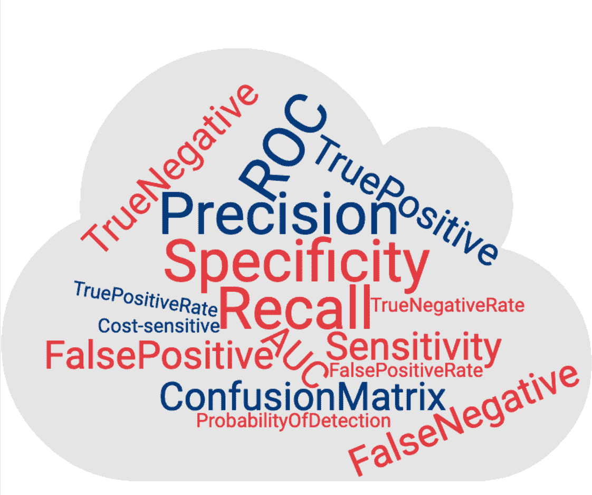
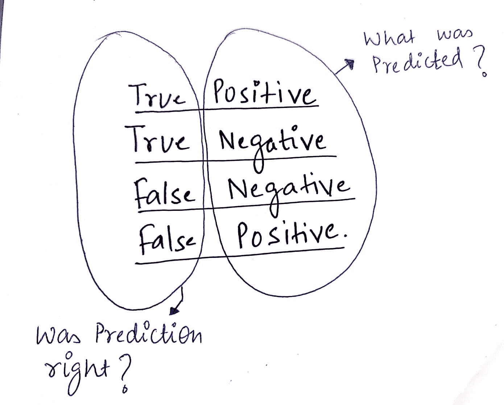
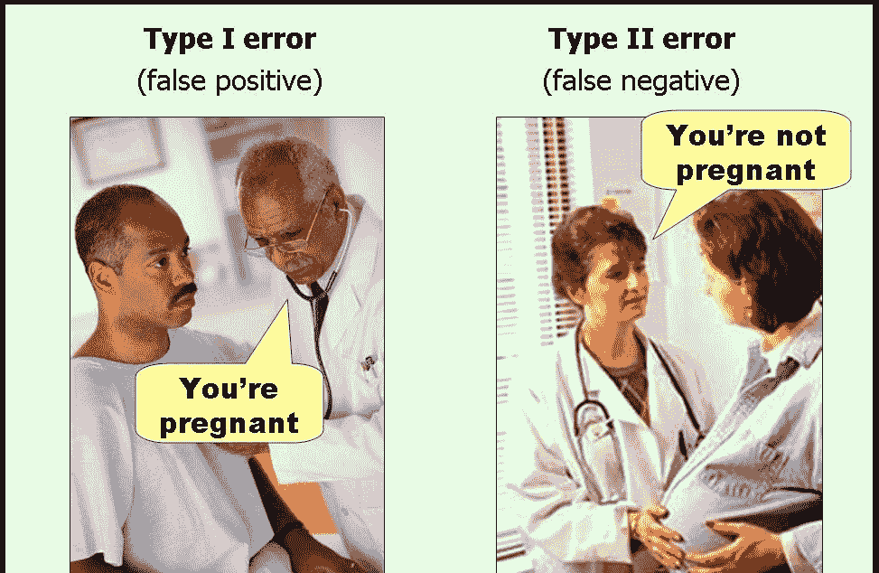
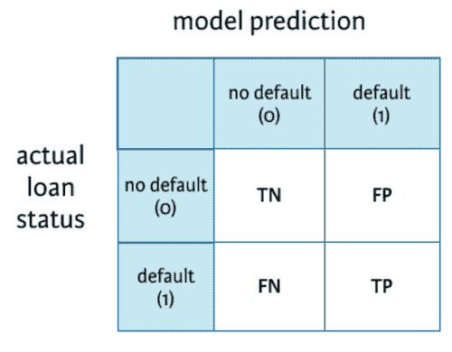
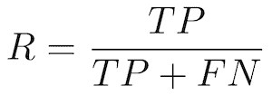
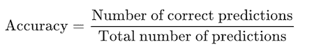
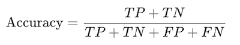
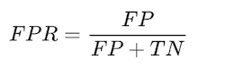

# 傻瓜指南：精确度、召回率和混淆矩阵

> 原文：[`www.kdnuggets.com/2020/01/guide-precision-recall-confusion-matrix.html`](https://www.kdnuggets.com/2020/01/guide-precision-recall-confusion-matrix.html)

# 评估机器学习模型

* * *

## 我们的三大课程推荐

 1\. [Google 网络安全证书](https://www.kdnuggets.com/google-cybersecurity) - 快速进入网络安全职业生涯。

 2\. [Google 数据分析专业证书](https://www.kdnuggets.com/google-data-analytics) - 提升你的数据分析技能

 3\. [Google IT 支持专业证书](https://www.kdnuggets.com/google-itsupport) - 支持你的组织 IT

* * *

## 回归模型

RMSE 是评估[machine learning](https://hackernoon.com/tagged/machine-learning)模型表现的一个好指标。

如果测试集的 RMSE 显著高于训练集——模型很可能是过拟合了。（确保训练集和测试集来自相同/类似分布）

# 分类模型怎么样？

说出来你可能不信，评估分类模型并不像看起来那么简单

**但是为什么呢？**

你一定在想*‘难道我们不能把**准确率**作为终极指标吗？’*

准确率非常重要，但可能并不是总是最好的指标。让我们通过一个例子来看看为什么——

**假设我们正在构建一个预测银行贷款是否会违约的模型**

（S&P/Experian 消费者信贷违约综合指数报告的违约率为 0.91%）

让我们有一个虚拟模型，它总是预测贷款不会违约。你猜这个模型的准确率是多少？

**===> 99.10%**

印象深刻，对吧？不过，银行购买这个模型的概率绝对是零。????

虽然我们的模型有惊人的准确率，但这是一个准确率绝对不是合适指标的恰当例子。

**如果不是准确率，还有什么呢？**

除了准确率，还有许多其他方法来评估分类模型的性能

+   混淆[matrix](https://hackernoon.com/tagged/matrix)，

+   精确度、召回率

+   ROC 和 AUC

在继续之前，我们将了解一些常见的术语，如果没有清晰理解，可能会让整个事情变成一个难以理解的迷宫。

**简单吧？**

看完这些后感觉完全不同????

但正如他们所说——每朵乌云都有银边

让我们逐一了解，从基本术语开始。

### 积极和消极——TP、TN、FP、FN

我用这个技巧来正确记住每个术语的含义。

（二分类问题。例如——预测银行贷款是否会违约）

那么**真正的负类**是什么意思呢？

*真负例*：我们在预测贷款不会违约时是正确的。

*假阳性*：我们错误地预测贷款会违约。

**让我们巩固所学知识**

*另一张让我印象深刻的图片。*

# 混淆矩阵

既然我们已经熟悉了 TP、TN、FP、FN——那么理解混淆矩阵将变得非常简单。

这是一个总结表，显示了我们模型在预测各种类别样本时的表现。这里的坐标轴是预测标签与实际标签。

*用于分类模型预测贷款是否会违约的混淆矩阵。*

# 精确率和召回率

**精确率**——也称为正预测值

正确预测的正例比例与所有预测为正例的总比例。

**召回率**——也称为敏感性、检测概率、真正例率

正确预测的正例比例与所有正例样本的总比例。

**理解**

为了理解*精确率*和*召回率*，让我们以搜索为例。想想亚马逊主页上的搜索框。

> *“**精确率**”是所有返回搜索结果中相关结果的比例。**召回率**是搜索引擎返回的相关结果与本应返回的相关结果总数的比率。*

在我们预测贷款是否违约的情况下——拥有较高的召回率会更好，因为银行不想亏损，即使有轻微的违约疑虑，提醒银行也是一个好主意。

在这种情况下，低精确率可能是可以接受的。

*注意*：通常，我们必须在精确率和召回率之间做出选择。几乎不可能同时拥有高精确率和高召回率。

# 准确率

说到准确率，我们最喜欢的指标！

准确率定义为正确预测样本与总样本的比例。

就混淆矩阵而言，它的计算方法是：

记住，当所有类别同样重要时，准确率是一个非常有用的指标。但如果我们在预测病人是否有癌症时，这可能不适用。在这种情况下，我们可能能容忍假阳性，但不能容忍假阴性。

# ROC 曲线

ROC 曲线（接收器操作特征曲线）图显示了分类模型在所有分类阈值下的表现。

（使用阈值：例如，如果你想计算 TPR 和 FPR，对于阈值 0.7，你需要将模型应用于每个样本，得到分数，如果分数大于或等于 0.7，则预测为正类；否则，预测为负类）

它绘制了 2 个参数：

+   **真正例率**（召回率）

+   **假阳性率**

*表示未违约的人中，有多少百分比被识别为违约者。*

预测与总预测正例的比例。

*典型的 ROC 曲线。*

降低分类阈值会将更多项目分类为正例，从而增加假阳性和真阳性的数量。

# AUC

**AUC**代表*ROC 曲线下面积。*它提供了所有可能分类阈值下性能的综合测量。

**ROC 曲线下面积**（AUC）越高，分类器的表现越好。一个完美的分类器 AUC 为 1。通常，如果你的模型表现良好，你可以通过选择使 TPR 接近 1 而 FPR 接近 0 的阈值来获得一个好的分类器。

# 总结

在这篇文章中，我们了解了如何有效评估分类模型，特别是在单独查看准确率不足的情况下。我们理解了 TP、TN、FP、FN、精确度、召回率、混淆矩阵、ROC 和 AUC 等概念。希望这能让事情更清楚！

[原文](https://medium.com/swlh/idiots-guide-to-precision-recall-and-confusion-matrix-b32d36463556)。经许可转载。

**[Vipul Jain](https://www.linkedin.com/in/jnvipul/)**是一位数据科学家，专注于机器学习，拥有从构思到生产的端到端数据产品开发经验。

### 更多相关话题

+   [混淆矩阵、精确度和召回率解释](https://www.kdnuggets.com/2022/11/confusion-matrix-precision-recall-explained.html)

+   [KDnuggets 新闻，11 月 16 日：LinkedIn 如何使用机器学习 •…](https://www.kdnuggets.com/2022/n45.html)

+   [分类指标逐步讲解：逻辑回归与…](https://www.kdnuggets.com/2022/10/classification-metrics-walkthrough-logistic-regression-accuracy-precision-recall-roc.html)

+   [在 Scikit-learn 中可视化混淆矩阵](https://www.kdnuggets.com/2022/09/visualizing-confusion-matrix-scikitlearn.html)

+   [使用 NumPy Linalg Norm 的向量和矩阵范数](https://www.kdnuggets.com/2023/05/vector-matrix-norms-numpy-linalg-norm.html)

+   [Python 中的稀疏矩阵表示](https://www.kdnuggets.com/2020/05/sparse-matrix-representation-python.html)
