# 生存分析在 Python 中的完整指南，第二部分

> 原文：[`www.kdnuggets.com/2020/07/guide-survival-analysis-python-part-2.html`](https://www.kdnuggets.com/2020/07/guide-survival-analysis-python-part-2.html)

评论

**由 [Pratik Shukla](https://medium.com/@shuklapratik22)，有志的机器学习工程师**。

在 [这一三部分系列的第一篇文章](https://www.kdnuggets.com/2020/07/complete-guide-survival-analysis-python-part1.html)中，我们了解了 Kaplan-Meier 估计器的基础知识。现在，是时候实现我们在第一部分讨论的理论了。

* * *

## 我们的前三个课程推荐

 1\. [谷歌网络安全证书](https://www.kdnuggets.com/google-cybersecurity) - 快速入门网络安全职业。

 2\. [谷歌数据分析专业证书](https://www.kdnuggets.com/google-data-analytics) - 提升你的数据分析技能

 3\. [谷歌 IT 支持专业证书](https://www.kdnuggets.com/google-itsupport) - 支持你组织的 IT

* * *

### 示例 1：Kaplan-Meier 估计器（没有任何分组）

让我们编写代码：

**(1) 导入所需的库：**

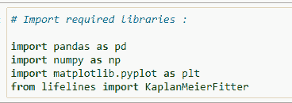

**(2) 读取数据集：**

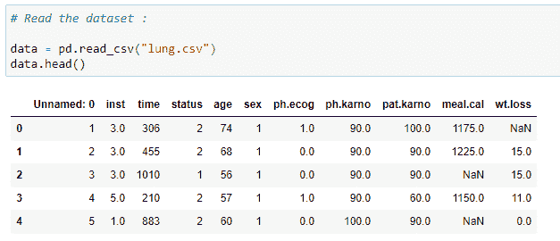

**(3) 数据集的列：**

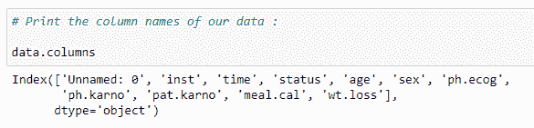

**(4) 数据集的附加信息：**

这提供了有关数据类型和每列中具有空值的行数的信息。对于生存分析中的某些方法，去除具有空值的行非常重要。

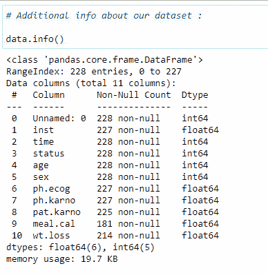

**(5) 数据集的统计信息：**

这提供了一些统计信息，如总行数、均值、标准差、最小值、第 25 百分位数、第 50 百分位数、第 75 百分位数和每列的最大值。

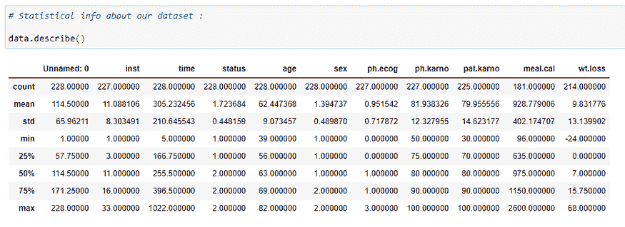

**(6) 使用直方图查看性别分布：**

这让我们对数据的分布有一个总体了解。在下面的图表中，你可以看到大约有 139 个值的状态为 1，大约 90 个值的状态为 2。这意味着在我们的数据集中，有 139 名男性和约 90 名女性。

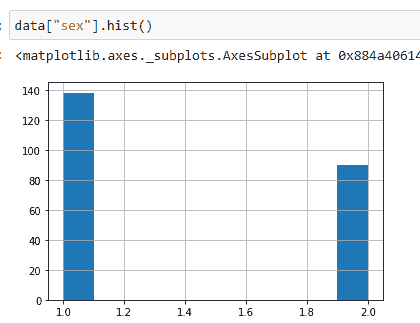

**(7) 为 KaplanMeierFitter 创建对象：**

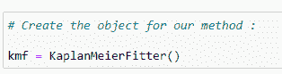

**(8) 组织数据：**

现在我们需要组织数据。我们将在数据集中添加一个名为“dead”的新列。它存储有关实验中人员是否生存的数据（基于状态值）。如果我们的状态值为 1，则该人活着；如果状态值为 2，则该人已死。这是我们在下一步需要做的非常关键的一步。因为我们将把数据存储在名为 censored 和 observed 的列中。观察数据存储特定时间线中死者的值，而 censored 数据存储活人或我们在该时间点不会调查的人的值。

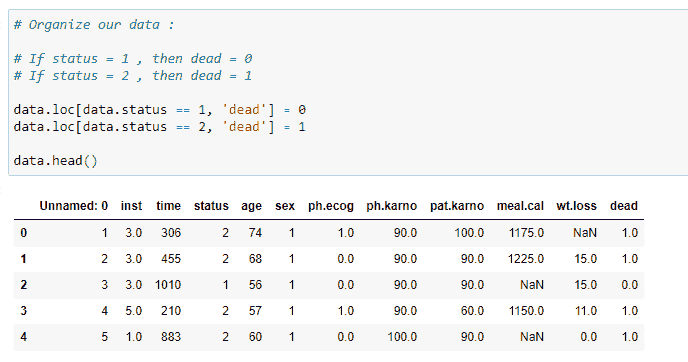

**(9) 将数据拟合到对象中:**

我们的目标是找到患者在死亡前存活的天数。因此，我们感兴趣的事件将是“死亡”，它存储在“dead”列中。它接受的第一个参数是我们实验的时间线。

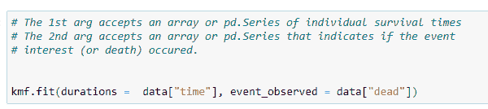

**(10) 事件表:**

*kmf*对象的一个最重要的方法是“event_table”。它为我们提供了适配数据的各种信息。让我们逐列查看。

(1) *事件时间*: 存储数据集中时间线的值，即患者在实验中被观察到的时间或实验进行的时间。可以是分钟、天、月、年等。在我们的案例中，它将是天数。它基本上存储患者的生存天数。

(2) *风险中*: 存储当前患者的数量。一开始，它将是我们在实验中要观察的总患者数。如果在某个时间点新增患者，我们需要相应地增加它的值。基本上，我们可以这样说：

*at_risk = 当前患者 at_risk + 入口 — 移除*

(3) *入口*: 存储特定时间线中新患者的值。在我们有其他患者时，也可能有一些新患者被诊断出癌症。因此我们将其添加在这里。

(4) *审查*: 我们的终极目标是找到患者的生存概率。如果在特定时间线上，实验中的人仍然活着，则该人进入审查类别。如果我们没有关于患者死亡时间的信息，则将其添加到审查数据中。其他可能性是如果患者选择搬到另一个无法进行实验的城镇，我们将该患者添加到审查类别中。

(5) *观察到*: 实验期间死亡的患者数量。

(6) *移除*: 存储不再参与实验的患者的值。如果一个人死亡或被审查，则他们属于这一类别。简而言之，

*移除 = 观察 + 审查*

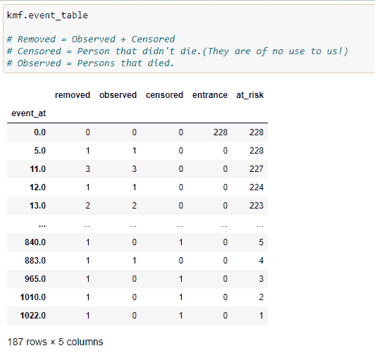

**(11) 计算单个时间线的生存概率:**

我们将使用以下公式手动计算：

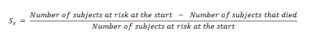

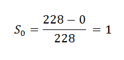

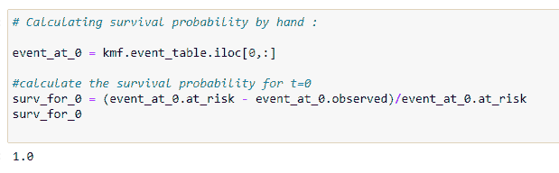

**(12) Event_At_5:**

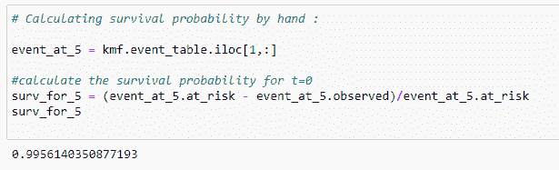

**(13) Event_At_11:**

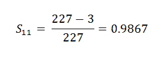

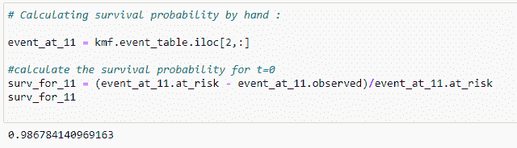

现在我们在这里找到的是某一特定时间段的概率。我们想要的是患者在整个时间段内的概率，即患者在所有实验回合中存活的概率。

这似乎很令人困惑，对吗？

让我们用一个非常简单的例子来理解条件概率的概念。

假设我们在一个不透明的盒子里总共有 15 个球。在这 15 个球中，有 7 个黑球、5 个红球和 3 个绿球。这是一个图示视图。

现在让我们找出一些概率吧！

选择红球的概率：

注意，我们总共有 15 个球中的 5 个是红球。

选择第二个红球的概率：

由于我们已经移除了一个红球，因此我们剩下的红球总数是 4，总球数是 14。

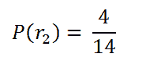

现在我的意思是：如果我们想找出两个选中的球都是红色的概率。这就是我们的情况。比如我们想找出一个患者在第一次时间区间存活的情况下，第二次时间区间存活的概率。我的意思是我们不仅仅想找出第二个时间区间的概率，我们想要的是他们在这个时间段内存活的总概率。

在这种情况下，我们想找出选中的两个球都是红色的概率是多少？

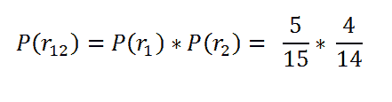

*两个红球的概率。*

在这里，我们的目标是找出这个人整个时间线上的概率。比如他们在第一次、第二次和第三次时间线中存活，那么他们的生存概率将是：

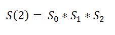

回到我们的主要示例：

**(14) Surv_After_probability:**

我们想找出一个患者到目前为止存活的概率。现在我们需要找出患者的实际生存概率。

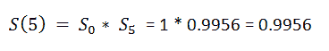

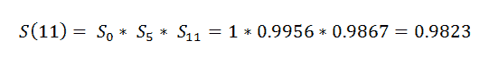

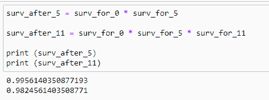

**(15) Predict function:**

现在，*kmf*对象的预测函数会为我们完成所有这些工作。但了解其背后的逻辑总是好的。

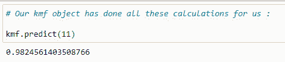

**(16) Finding survival probability for an array of the timeline:**

我们可以找到一系列时间的概率。

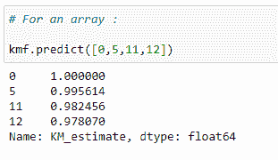

**（17）获取整个时间线的生存概率：**

*kmf* 对象的 *survival_function_* 提供了我们时间线的完整数据。

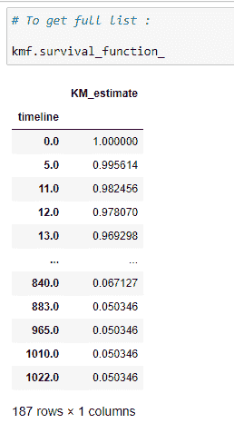

解释：

在时间线 0 时，患者的生存概率为 1。如果你仔细考虑，就会明白在诊断后的第 1 天一个人死亡的概率几乎为 0。因此，我们可以说生存概率尽可能高。随着时间线的增加，患者的生存概率会降低。

**（18）中位数：**

它提供了在平均情况下，50% 的患者存活的天数。

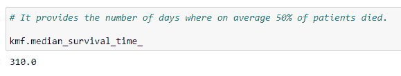

从上述代码中，我们可以说，平均来说，一个人在诊断后的 310 天后生存。

**（19）绘制图表：**

在这里，我们可以绘制生存概率的图表。

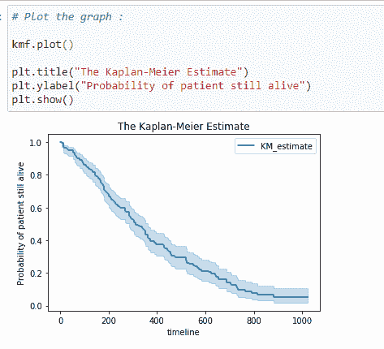

**（20）置信区间：**

置信区间给出了我们较为确定的真实值所在的范围。你可以在上面的图表中看到，浅蓝色阴影表示生存的置信区间。从中我们可以说该时间线上的概率确实位于该置信区间之间。

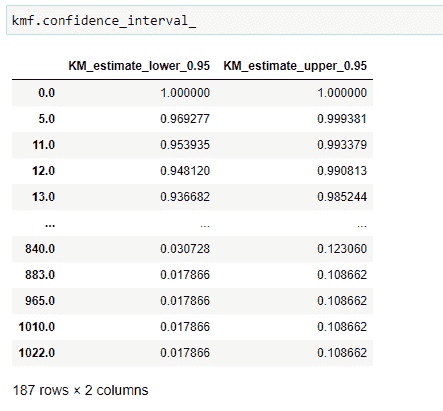

现在我们掌握的所有信息都是关于一个人的生存。现在我们将查看某个时间线上的人死亡的概率。在这里要注意，高生存概率对一个人来说是好的，但更高的累积分布密度（死亡概率）则不那么好！

**（21）一个人死亡的概率：**

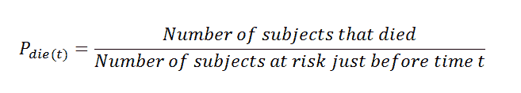

在这里注意到，分母值是时间 (t) 之前的风险对象。简单来说，我们可以说前一行的对象 *at_risk*。

累积分布密度的公式：

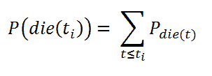

累积分布密度。

手动计算概率：

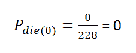

*t = 0*

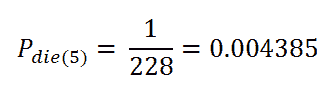

*t = 5*

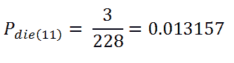

*t = 11*

查找累积分布密度：

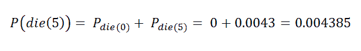

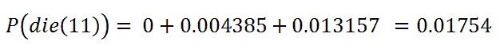

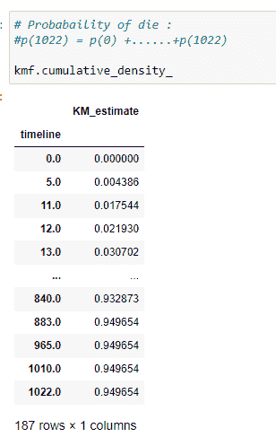

**（22）绘制图表：**

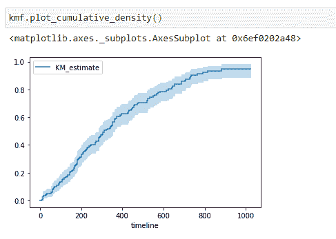

注意到，随着生存天数的增加，死亡概率也增加。

### 示例 2：使用 Nelson-Aalen 估计风险率

**风险函数：**

生存函数是总结和可视化生存数据集的好方法。然而，这并不是唯一的方法。如果我们对一个人群的危险函数 h(t) 感到好奇，不幸的是，我们不能转化 Kaplan-Meier 估计。为此，我们使用 Nelson-Aalen 危险函数：

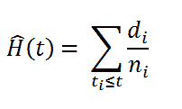

*危险函数*

其中，

*di* = 时间 *ti* 的死亡人数

*ni* = 开始时的患者数量。

**(23) 导入库：**

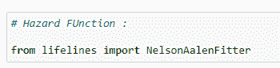

**(24) 拟合数据：**

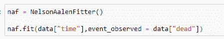

**(25) 累积危险度：**

请记住我们考虑当前行的 *at_risk*：

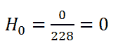

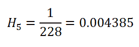

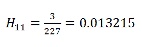

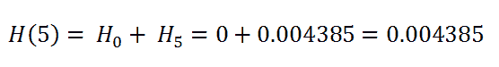

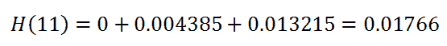

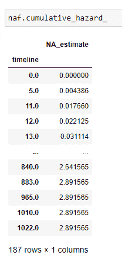

**(26) 绘制数据：**

累积危险度不如生存函数那么直观易懂，但危险函数是更高级生存分析技术的基础。

**(27) 预测一个值：**

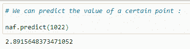

综合起来：

**[你可以从这里下载 Jupyter 笔记本。](https://drive.google.com/open?id=1Vj9UNMfcsqP3S7D3-oQRjEuc2Gnw43dF)**

在[下一篇文章](https://www.kdnuggets.com/2020/07/guide-survival-analysis-python-part-3.html)中，我们将讨论对数秩检验和 Cox 回归，并提供示例。

[原始](https://medium.com/@shuklapratik22/a-complete-guide-to-survival-analysis-in-python-b0e6354d599d)。已获许可转载。

**简介：** [Pratik Shukla](https://medium.com/@shuklapratik22) 是一位有抱负的机器学习工程师，喜欢将复杂理论以简单的方式呈现。Pratik 在计算机科学专业完成了本科，并正在南加州大学攻读计算机科学硕士学位。 “向月亮射击。即使错过，你也会落在星星之间。 -- Les Brown”

**相关：**

+   [Python 中生存分析的完整指南，第一部分](https://www.kdnuggets.com/2020/07/complete-guide-survival-analysis-python-part1.html)

+   [商业分析中的生存分析](https://www.kdnuggets.com/2017/11/survival-analysis-business-analytics.html)

+   [构建预测流失模型的挑战](https://www.kdnuggets.com/2017/03/datascience-building-predictive-churn-model.html)

### 更多相关信息

+   [数据科学备忘单的完整集合 - 第一部分](https://www.kdnuggets.com/2022/02/complete-collection-data-science-cheat-sheets-part-1.html)

+   [数据科学备忘单的完整集合 - 第二部分](https://www.kdnuggets.com/2022/02/complete-collection-data-science-cheat-sheets-part-2.html)

+   [数据仓库完整合集 - 第一部分](https://www.kdnuggets.com/2022/04/complete-collection-data-repositories-part-1.html)

+   [数据仓库完整合集 - 第二部分](https://www.kdnuggets.com/2022/04/complete-collection-data-repositories-part-2.html)

+   [数据科学书籍完整合集 - 第一部分](https://www.kdnuggets.com/2022/05/complete-collection-data-science-books-part-1.html)

+   [数据科学书籍完整合集 - 第二部分](https://www.kdnuggets.com/2022/05/complete-collection-data-science-books-part-2.html)
