# H2O 机器学习框架

> 原文：[`www.kdnuggets.com/2020/01/h2o-framework-machine-learning.html`](https://www.kdnuggets.com/2020/01/h2o-framework-machine-learning.html)

评论

**由 [ActiveWizards](https://activewizards.com/) 提供**


* * *

## 我们的三大课程推荐

 1\. [谷歌网络安全证书](https://www.kdnuggets.com/google-cybersecurity) - 快速进入网络安全职业生涯。

 2\. [谷歌数据分析专业证书](https://www.kdnuggets.com/google-data-analytics) - 提升你的数据分析技能

 3\. [谷歌 IT 支持专业证书](https://www.kdnuggets.com/google-itsupport) - 支持你的组织的 IT 需求

* * *

H2O 是一个可扩展且快速的开源机器学习平台。我们将应用它来执行分类任务。我们使用的数据集是 [银行营销数据集](https://archive.ics.uci.edu/ml/datasets/Bank+Marketing)。在这里，我们需要训练一个模型，该模型能够根据客户的个人特征、营销活动特征和当前的宏观经济条件，预测银行客户是否会开设定期存款。

在模型创建过程中，我们探索了 H2O 工具包中的各种核心组件和功能。你应该明白，虽然本文涵盖了一些 H2O 的基本概念，但如果你需要更详细的信息，应该访问 H2O 网站并阅读 [文档](http://docs.h2o.ai/h2o/latest-stable/h2o-docs/index.html)。

*注意：有关安装说明，请使用 [官方网站](https://www.h2o.ai/download/)。*

### 准备工作

我们需要首先导入所需的库：

```py
import pandas as pd
import numpy as np
import h2o
pd.set_option('display.width', 5000)
```

首先，你应该启动 H2O。你可以运行方法 `h2o.init()` 来初始化 H2O。可以向 `h2o.init()` 方法传递许多不同的参数，以根据需要设置 H2O。因此，你可以在这里更改 H2O 的一些全局设置。然而，在大多数情况下，调用该方法时不带任何参数就足够了，正如我们下面所做的那样：

```py
h2o.init()
```

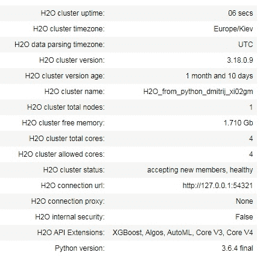

你可以看到，这种方法的输出包含有关 H2O 集群的一些元信息。

下一步我们应该导入将要使用的数据集。这是一个 .csv 文件，H2O 具有 `upload_file()` 函数，可以将数据集加载到内存中。值得一提的是，H2O 可以处理多种数据源（本地和远程），并支持不同的文件格式。

```py
bank_df = h2o.upload_file("bank-additional-full.csv")
```

要查看数据集，你可以简单地输入其名称并运行单元格。默认显示前 10 行。

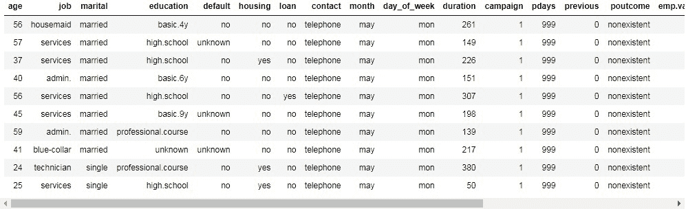

从这个变量的类型来看，我们可以看到类型是 h2o.frame.H2OFrame。因此，这不是 pandas 对象，而是 H2O 的对象。

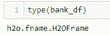

然而，你可以以熟悉的方式对这个 H2OFrame 进行索引和切片：

```py
# show 6th row
print(bank_df[5,:])
# show 6-7 rows
print(bank_df[5:7,:])
# show first 4 columns from 6-7 rows
print(bank_df[5:7,0:4])
# show job,education and y columns from 6-7 rows
print(bank_df[5:7, ['job', 'education', 'y']])
```

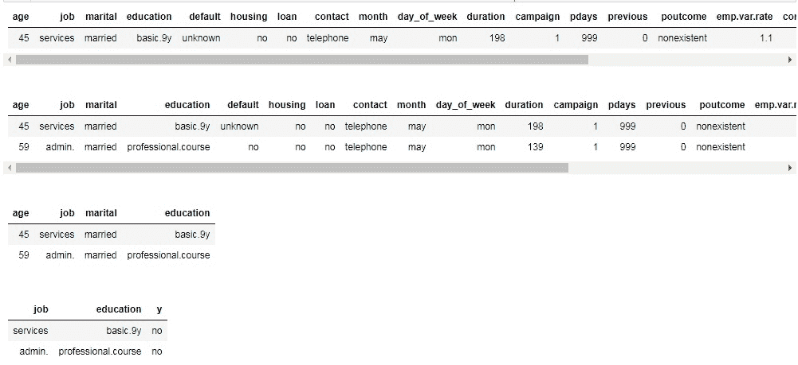

你可以通过访问 .shape 属性来检查 H2OFrame 的形状。此外，一些有用的信息（列类型、最小值、平均值、最大值、标准差、零值数量、缺失值）可以通过 .describe() 方法生成。

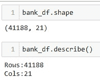


正如我们所见，我们的数据集中没有缺失数据。我们有 20 列不同的分类、整数和实数特征以及 1 列目标变量 (y)。目标变量是二元的，如果客户希望订阅定期存款，则值为 "yes"，否则为 "no"。

在下一个单元格中，我们将列名提取到变量 x 中。然后，我们从这个列表中移除目标列名 (y)。另外，我们将目标变量的名称写入变量 y 中。

```py
x = bank_df.names
x.remove("y")
print(x)
Y = "y"
```

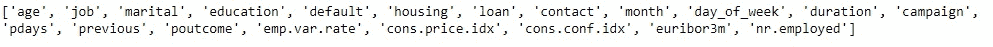

### 第一个模型

现在让我们训练某个模型。首先，我们需要将数据集拆分为训练集和测试集。H2O 允许通过使用函数 split_frame() 来完成。如果你只传递一个元素作为第一个参数（或参数 ratios），这个元素定义了训练数据集的比例。其余部分是测试集。如果你传递两个元素，第一个表示训练集，第二个表示测试集，剩余部分是验证集。这里我们希望将 70% 的样本作为训练集，30% 作为测试集。我们还固定了随机状态以获得可重复的结果。

```py
train, test = bank_df.split_frame([0.7], seed=42)

```

一开始，我们希望使用随机森林模型来分类数据点。 H2ORandomForestEstimator 可以在模块 h2o.estimators 中找到。

```py
from h2o.estimators import H2ORandomForestEstimator
```

然后我们创建一个估计器的实例。这里你可以指定许多不同的参数。我们通过将 200 分配给 ntrees 参数来设置树的数量为 200。在此之后，我们在估计器的实例上调用 train 方法。我们应该将特征的列名传递给变量 x，将目标列名传递给变量 y。我们还指定训练和验证样本。在我们运行这个单元格之后，可以看到下面的进度条，反映训练过程的状态。

```py
rf = H2ORandomForestEstimator(ntrees=200)
rf.train(x=x,
         y=y,
         training_frame=train,
         validation_frame=test)
```

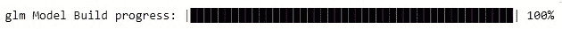

可以通过查看估计器的实例来访问模型详细信息：

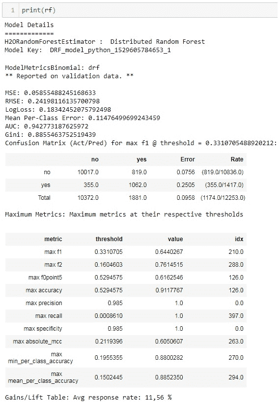

这里有很多有趣和有用的信息。你可以注意到两个信息块。第一个是关于训练集的，第二个是关于测试集的。有不同的模型性能指标（MSE、RMSE、LogLoss、AUC、Gini 等）。混淆矩阵是一个非常有趣的错误分析指标。H2O 允许查看训练集和测试集的混淆矩阵。混淆矩阵中也显示了每个标签的错误总比例。

有趣的表格是关于在各自错误下的最大指标。在二分类中，模型返回实例属于正类的概率。然后这个概率应与某个阈值进行比较，以决定这是正类还是负类。H2O 在这个表格中显示了不同指标的最大值，并指定了在达到这些最大值时使用的阈值。例如，在我们的案例中，通过选择阈值 0.985 可以在测试集上实现完美的精确度。测试集上的最大准确率是 0.911，当你选择 0.5294 作为阈值时可以达到。最高的 F1 分数对应于阈值 0.331。

在实现解决方案中的模型时，你可以选择最适合你需求的阈值。同时，你可以尝试一些更高级的操作，例如通过结合训练集和测试集的不同指标的最大值报告的阈值来选择阈值。

另一个有趣的表格是特征重要性的表格。最具信息量的列是`scaled_importance`和`percentage`。你可以看到，`duration`特征在这个任务和数据集中具有最大的预测能力。这个特征表示与客户通话的持续时间。除了`duration`之外，排名前五的其他重要特征是宏观经济指标`euribor3m`和`nr.employed`，以及客户的`age`和`job`。

现在我们想要手动计算测试集上的准确率。

在下一个单元格中，我们进行预测。你可以看到方法`predict()`返回一个数据框，其中第一列是答案（是或否），接下来的两列是“否”和“是”的概率。

```py
rf = H2ORandomForestEstimator(ntrees=200)
rf.train(x=x,
         y=y,
         training_frame=train,
         validation_frame=test
```

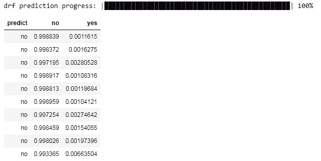

在下一个单元格中，我们统计预测结果与实际答案相等的案例数量，然后计算均值，这将成为预测的准确性。我们可以看到准确率是 0.9041，或者大约 90.4%。如果你回到混淆矩阵，可以注意到，如果你从 1 中减去测试集的总错误（0.0958），你将得到约 0.9041，这就是我们手动计算得到的准确率。

```py
(predictions["predict"] == test["y"]).mean()
```

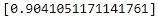

### 其他算法

H2O 提供了几种不同的训练模型。让我们尝试其中的一些。

我们想要使用神经网络训练的第一个算法。要使用这个模型，我们需要从 h2o.estimators.deeplearning 模块中导入 H2ODeepLearningEstimator。然后，我们需要创建这个估计器的实例。与之前的随机森林示例类似，你可以传递许多不同的参数来控制模型和训练过程。重要的是要设置神经网络的架构。在参数 hidden 中，我们传递一个包含隐藏层神经元数量的列表。因此，这个参数同时控制隐藏层的数量和这些层中的神经元数量。我们设置了 3 个隐藏层，分别有 100、10 和 4 个神经元。同时，我们将激活函数设置为 Tanh。

```py
from h2o.estimators.deeplearning import H2ODeepLearningEstimator
dl = H2ODeepLearningEstimator(hidden=[100, 10, 4],activation='Tanh')
dl.train(x=x, y=y, training_frame=train, validation_frame=test)
predictions_dl = dl.predict(test)
print((predictions_dl["predict"] == test["y"]).mean())
```

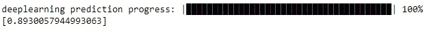

我们可以看到，准确率略低于随机森林。也许我们可以调整模型的参数以获得更好的性能。

在接下来的几个单元格中，我们将训练线性模型。Binomial family 表示我们想要执行逻辑回归分类。 lambda_search 允许搜索最优的正则化参数 lambda。

```py
from h2o.estimators.glm import H2OGeneralizedLinearEstimator
lm = H2OGeneralizedLinearEstimator(family="binomial",
                                   lambda_search=True)
lm.train(x=x,
         y=y,
         training_frame=train,
         validation_frame=test)
```


```py
predictions_lm = lm.predict(test)
print((predictions_lm["predict"] == test["y"]).mean())
```

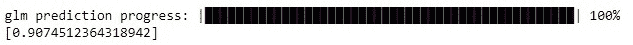

我们在这里想要使用的最后一个模型是梯度提升算法。使用默认参数，它在所有其他算法中可能表现最佳。

```py
from h2o.estimators.gbm import H2OGradientBoostingEstimator
gb = H2OGradientBoostingEstimator()
gb.train(x=x,
         y=y,
         training_frame=train,
         validation_frame=test)
```

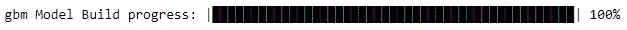

```py
predictions_gb = gb.predict(test)
print((predictions_gb["predict"] == test["y"]).mean())
```

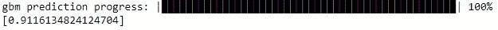

值得一提的是 H2O 平台中 XGBoost 的集成。XGBoost 是实现梯度提升思想的最强大算法之一。你可以单独安装它，但在 H2O 中使用 XGBoost 也非常方便。在下面的单元格中，你可以看到如何创建 `H2OXGBoostEstimator` 的实例以及如何训练它。你应该理解，XGBoost 使用许多参数，且这些参数的变化常常会非常敏感。

```py
param = {
         "ntrees" : 400,
         "max_depth" : 4,
         "learn_rate" : 0.01,
         "sample_rate" : 0.4,
         "col_sample_rate_per_tree" : 0.8,
         "min_rows" : 5,
         "seed": 4241,
         "score_tree_interval": 100
         }
predictions_xgb = xgb.predict(test)
print((predictions_xgb["predict"] == test["y"]).mean())
```

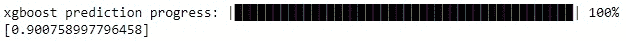

H2O 中还提供了其他几种模型。如果你想了解更多，请查看文档。

### H2O 中的交叉验证

交叉验证是机器学习中核心技术之一。基本思想是将数据集拆分为几个部分（折叠），然后在除了一个折叠的所有部分上训练模型，该折叠将用于后续的测试。在此，当前迭代完成，下一次迭代开始。在下一次迭代中，测试折叠被纳入训练样本。相反，来自之前训练集的某个折叠将用于测试。

例如，我们将数据集拆分为 3 个折叠。在第一次迭代中，我们使用第 1 和第 2 个折叠进行训练，第 3 个折叠用于测试。在第二次迭代中，使用第 1 和第 3 个折叠进行训练，第 2 个折叠用于测试。在第三次迭代中，第 1 个折叠用于测试，第 2 和第 3 个折叠用于训练。

交叉验证允许以更准确和可靠的方式评估模型的性能。

在 H2O 中进行交叉验证很简单。如果模型支持，有一个可选参数 nfolds 可以在创建模型实例时传递。你应使用此参数指定交叉验证的折数。

H2O 构建了 nfolds + 1 个模型。一个额外的模型是在所有可用数据上训练的。这是你训练结果的主要模型。

让我们训练随机森林并进行 3 折交叉验证。注意我们没有传递验证（测试）集，而是使用整个数据集。

```py
rf_cv = H2ORandomForestEstimator(ntrees=200, nfolds=3)
rf_cv.train(x=x, y=y, training_frame=bank_df)
```

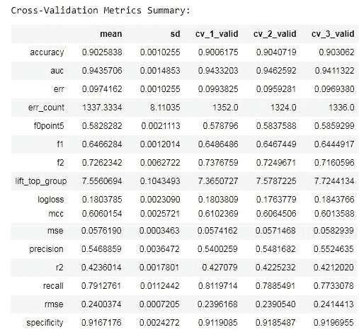

如果你查看上面的单元格输出，你会注意到一些差异。

第一个是模型不是在验证数据上进行报告，而是在交叉验证数据上进行报告。

第二点是有一个交叉验证指标总结表。在这里你可以看到许多不同的指标、每个折作为测试折的指标值，这些值的均值以及每个指标的标准偏差。例如，对于第一折我们得到的准确率是 0.9006，第二折是 0.904，第三折是 0.903。这些值的均值是 0.9025，标准偏差是 0.001。你应该理解，拥有“良好”的指标值固然重要，但低标准偏差也很重要。这意味着你的模型在数据集中不同样本上的表现都很好。但交叉验证结果的解释实际上不是本文的目标，因此我们继续下一章节！

### 使用 GridSearch 调整模型

通常，你需要尝试许多不同的参数及其组合，以找到最佳模型性能的配置。手动完成所有这些工作是困难且有时乏味的。GridSearch 可以自动化这一过程。你只需指定想要尝试的一组超参数，并运行 GridSearch 实例。系统将尝试所有可能的参数组合（为每个组合训练和测试模型）。让我们看看如何在 H2O 中使用这个工具。

首先，你需要导入 GridSearch 对象的实例：

```py
from h2o.grid.grid_search import H2OGridSearch
```

现在，你需要指定所有可能的参数。我们将搜索之前构建的 XGBoost 模型的最佳参数组合。参数被放置在一个 Python 字典中，其中键是参数的名称，值是这些参数的可能值的列表。

```py
xgb_parameters = {'max_depth': [3, 6],
                  'sample_rate': [0.4, 0.7],
                  'col_sample_rate': [0.8, 1.0],
                  'ntrees': [200, 300]}
```

下一步是创建 GridSearch 实例。你应该传递一个模型、网格的 ID 和包含超参数的字典。

```py
xgb_grid_search = H2OGridSearch(model=H2OXGBoostEstimator,
                                grid_id='example_grid',
                                hyper_params=xgb_parameters)
```

最终，你可以运行网格搜索。注意我们设置了较高的学习率，因为网格搜索是一个非常耗时的过程。随着超参数数量的增长，训练的模型数量迅速增加。因此，考虑到这只是一个学习示例，我们不想测试太多的超参数。

```py
xgb_grid_search.train(x=x,
                      y=y,
                      training_frame=train,
                      validation_frame=test,
                      learn_rate=0.3,
                      seed=42)
```

我们可以通过使用 GridSearch 实例的 get_grid()方法来获取网格搜索的结果。我们希望按准确率指标的降序对结果进行排序。

```py
grid_results = xgb_grid_search.get_grid(sort_by='accuracy',
                                        decreasing=True)
print(grid_results)
```

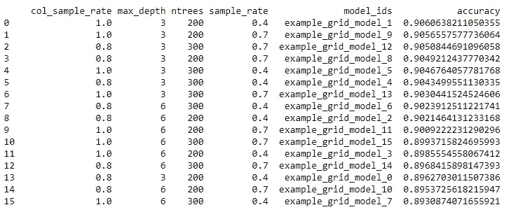

你可以看到，使用 1.0 列样本率、0.4 样本率、200 棵树和每棵树的最大深度为 3 的组合可以获得最高的准确率。

### AutoML

H2O 提供了自动化机器学习的能力。这个过程非常简单，面向那些在机器学习方面知识和经验较少的用户。AutoML 将遍历不同的模型和参数，尝试找到最佳方案。需要指定几个参数，但大多数情况下，你只需要设置最大运行时间（以秒为单位）或最大模型数。你可以将 AutoML 视为类似于 GridSearch，但它是在模型层级而不是参数层级上进行的。

```py
from h2o.automl import H2OAutoML
autoML = H2OAutoML(max_runtime_secs=120)
autoML.train(x=x,
             y=y,
             training_frame=bank_df)
```

我们可以通过检查 autoML 实例的.leaderboard 属性来查看所有尝试过的模型及其对应的性能。具有 0.94 AUC 指标的 GBM 模型似乎是这里表现最好的模型。

```py
leaderboard = autoML.leaderboard
print(leaderboard)
```

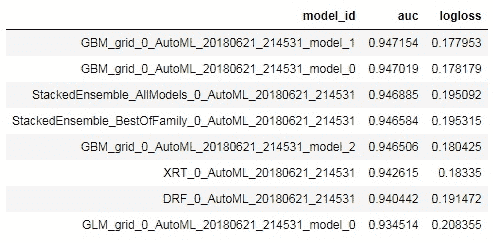

查看最佳模型：

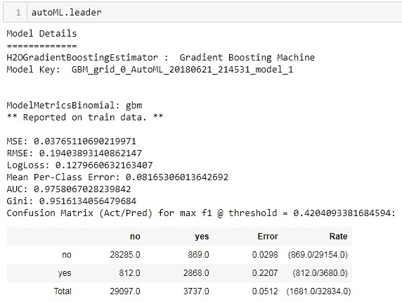

你可以直接从 autoML 实例上对测试集进行预测。

```py
predictionAML = autoML.predict(test)
```

### 结论

这篇文章只是 H2O 功能的简要介绍。这是一个出色的机器学习平台，可以使一些机器学习领域的工程师工作变得更简单。它是一个不断发展的框架。在我们看来，它不能单独使用。相反，与 H2O 一起使用的其他工具可以使机器学习过程更快、更便捷。

在本文中，我们介绍了 H2O 中的一些基本数据操作，查看了 H2O 提供的几种机器学习模型，学习了如何进行交叉验证和网格搜索，并熟悉了 H2O 中的自动化机器学习。

你应该了解 H2O 的一些功能超出了本文的范围。因此，如果你有兴趣了解更多，请阅读官方文档。

**[ActiveWizards](https://activewizards.com/)** 是一个由数据科学家和工程师组成的团队，专注于数据项目（大数据、数据科学、机器学习、数据可视化）。核心专长领域包括数据科学（研究、机器学习算法、可视化和工程）、数据可视化（d3.js、Tableau 等）、大数据工程（Hadoop、Spark、Kafka、Cassandra、HBase、MongoDB 等）以及数据密集型网页应用开发（RESTful APIs、Flask、Django、Meteor）。

[原文](https://activewizards.com/blog/h2o-framework-for-machine-learning/)。经许可转载。

**相关：**

+   自动化机器学习：团队如何在 AutoML 项目中协作？

+   自动化机器学习项目实施的复杂性

+   顶级 6 个 Python NLP 库的比较

### 更多相关话题

+   [AI/ML 模型风险管理框架](https://www.kdnuggets.com/2022/03/risk-management-framework-aiml-models.html)

+   [Django 框架中的社交用户认证](https://www.kdnuggets.com/2023/01/social-user-authentication-django-framework.html)

+   [适用于每种用途的唯一提示框架](https://www.kdnuggets.com/the-only-prompting-framework-for-every-use)

+   [每位机器学习工程师应具备的 5 个机器学习技能](https://www.kdnuggets.com/2023/03/5-machine-learning-skills-every-machine-learning-engineer-know-2023.html)

+   [KDnuggets 新闻，12 月 14 日：3 个免费的机器学习课程…](https://www.kdnuggets.com/2022/n48.html)

+   [学习数据科学、机器学习和深度学习的可靠计划](https://www.kdnuggets.com/2023/01/mwiti-solid-plan-learning-data-science-machine-learning-deep-learning.html)
