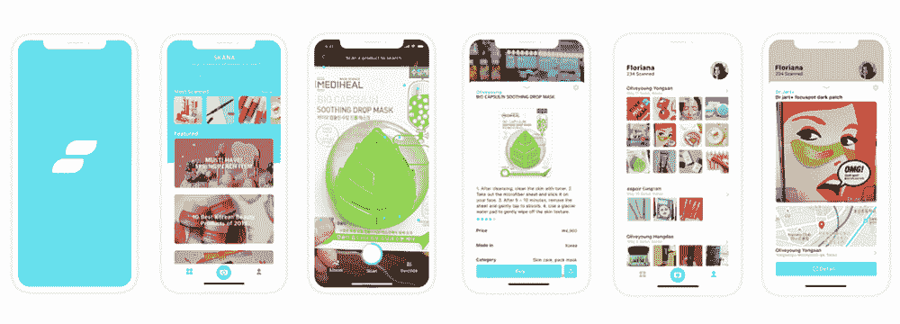
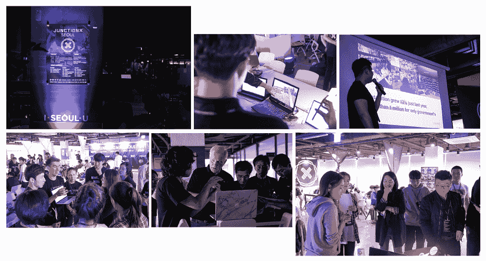

# 对有志数据科学家的黑客马拉松指南

> 原文：[`www.kdnuggets.com/2019/07/hackathon-guide-aspiring-data-scientists.html`](https://www.kdnuggets.com/2019/07/hackathon-guide-aspiring-data-scientists.html)

 评论

**由 [Jiwon Jeong](https://www.linkedin.com/in/jiwon-jeong/)，数据科学研究员**

* * *

## 我们的前三个课程推荐

 1\. [谷歌网络安全证书](https://www.kdnuggets.com/google-cybersecurity) - 快速进入网络安全职业领域。

 2\. [谷歌数据分析专业证书](https://www.kdnuggets.com/google-data-analytics) - 提升你的数据分析技能

 3\. [谷歌 IT 支持专业证书](https://www.kdnuggets.com/google-itsupport) - 支持你的组织在 IT 方面

* * *

黑客马拉松是一种竞赛，各种人员，包括程序员、开发者和图形设计师，密集合作以在短时间内设计软件项目。黑客马拉松的目标是在活动结束时创建一个功能性产品。

上个月，我有机会参加由 Junction Ltd. 举办的 [JunctionX Seoul](https://seoul.hackjunction.com/) 黑客马拉松。我们的团队开发了一个 iOS 应用，利用图像搜索引擎为韩国美容产品提供优化的购物服务体验。这个应用可以帮助想要探索韩国美容产品的旅行者，因为他们可能因为明显的语言障碍而不知道尝试什么。用户只需扫描产品即可找到有用的数据，这些信息会被翻译成他们的本地语言。还有一个搜索历史页面，可以用于进一步的定制服务。你可以在 [**这里**](https://devpost.com/software/skana#_=_) 了解更多信息。

这个应用，[Skana](https://drive.google.com/open?id=1NZ7DESxk2QWhWprcv5n5ZWlmr8x5J4DI)

然而，我更愿意分享我在过程中学到的东西，而不是我做了什么。所以今天，我将讨论你应该申请黑客马拉松的 4 个理由（特别是如果你是一个有抱负的数据科学家），你应该如何准备以及我的一些小贴士。我希望这篇文章能激励你走出舒适区，像我一样获得深刻的灵感。

### 1\. 为什么参加黑客马拉松

如果你之前从未尝试过黑客马拉松或编程比赛，并问我是否值得尝试，我会毫不犹豫地点头。以下是你应该参加黑客马拉松的 4 个理由。

### 超越“建模”

我们，数据科学学习者，往往倾向于独自工作或学习。我们往往将大部分时间投入到数据预处理和数据处理上。我们将大部分精力投入到学习机器学习或深度学习算法中。我们的项目通常从导入数据（有时是自己构建数据）开始，以评估预测结果结束。

不幸的是，几乎所有现实世界的项目并不是这样运作的。我们并不孤单工作。我们与其他团队成员合作。从数据库到部署和产品管理，所有过程都应通过协作完成。拥有超越“建模”领域的工具包对有志者来说是一个很大的加分项。（许多文章指出了这一点，你可以在[**这里**](https://towardsdatascience.com/the-third-wave-data-scientist-1421df7433c9)找到一篇）现在重要的问题是，我们在哪里可以学习和体验这些？

> “*与比赛不同，没有人给你两个叫做 train 和 test 的 .csv 文件以及一个写得很好的评估指标。几乎 80% 的努力投入在定义问题和获取及处理数据上。剩下的 20% 努力用于纯建模和部署。*” - [AnalyticsVidhya](https://www.analyticsvidhya.com/blog/2019/05/exclusive-interview-sonny-laskar-kaggle-master-analytics-vidhya-hackathon-expert/)

黑客马拉松可以是一个与他人合作并实现实际项目的绝佳机会。尽管有一些限制，你仍然可以学习如何与他人（他们对机器学习的了解不如你）沟通，并理解发布实际产品的整体工作流程。如果你有机会与比你在机器学习方面更了解的人一起工作，我相信这将是推动你极限的绝佳时机。

### 商业思维比你想象的更为重要

项目的第一步是决定构建什么。我可以告诉你，成功的机会有一半在这里决定。你应该从一开始就走在正确的道路上。实施也是一个关键点，但商业价值扮演着至关重要的角色。如果被忽视，你的工作可能只是展示你在技术上的能力。

> “*同样，数据科学家被雇佣来创造商业价值，而不仅仅是建立模型。问问自己：我的工作成果将如何影响公司的决策？我需要做些什么来最大化这一影响？怀着这种企业家精神，第三波数据科学家不仅产生可操作的见解，还寻求这些见解带来真正的改变。*” - [Towards Data Science](https://towardsdatascience.com/the-third-wave-data-scientist-1421df7433c9)

你可能已经见过很多人指出商业思维的重要性。发现用户的隐藏需求和观察市场中的问题。利用你的技术知识提出解决方案。开发可以盈利的服务。在黑客马拉松中，你被要求从这个角度深入思考和讨论。

我听说过一个人，他赢得了超过 15 次编程比赛。他在赢得一次 Google 比赛后，退休于他的“奖品猎人”生涯。你知道他的秘密是什么吗？只是商业头脑和一点机智。通过创造一个聪明而有创意的产品，他让人们喊出“精彩！”这无疑给评委留下了深刻的印象。所以，如果你在寻找额外的获胜提示，具备商业价值和一些机智可能是一个很好的加分项。

### 处理极端压力的绝佳机会

黑客马拉松的目标是在短时间内（通常是 2 或 3 天）创建一个功能产品。你被要求在这些日子里展示你的产品原型或演示。这一切都涉及到有限的时间、资源和精力问题。有时候，你可能会遇到事情出错的情况，你必须立刻找到解决方案。有时候你需要优先处理工作，这意味着什么先做，什么时候停止。你可能会感受到强烈的压力来完成所有任务，而不成为团队的负担。随着时间的推移，彻底疲惫和精疲力竭几乎是不可避免的！（更像是能量耗竭，直到最终“跌入”睡眠。）

如果你像我一样，容易在极端压力时僵住，你甚至会被比赛大厅的空气所压倒。这是我第一次参加黑客马拉松，所以我经历了几次大脑瘫痪。我不得不去呼吸新鲜空气，放松一下以缓解紧张。但这也是一个很好的机会，让我学会如何应对压力。因为在工作中遇到那些意想不到的问题是不可避免的，我们必须管理那些要求很高的时刻。

### “Hello, world”的实时

结识新朋友也是一种很大的乐趣，特别是当他们是志同道合的人时。在黑客马拉松中，你可以遇到来自不同地区和具有不同专业但有相同兴趣的各种人。他们可以是网页开发者、应用开发者或设计师，但他们都是愿意花费周末开发一些酷东西的人。

我遇到了从俄罗斯专程来韩国参加这个活动的人。我还遇到了一位在韩国学习计算机科学的乌克兰女士。还有来自丹麦、法国、中国和日本的人。结识新朋友本身就是一种乐趣。但更重要的是，我可以了解他们遇到的痛点以及他们真正热衷的事物。通过与其他参与者聊天，我的编程视野得到了拓展。这也是我认为你应该尝试有宽泛主题的黑客马拉松，而不是过于集中在数据科学领域的原因。

此外，关注其他人的工作也很重要。虽然你会忙得无暇顾及他人，但这将帮助你理解整个过程。毕竟，我们在这里是为了学习新东西！

照片来自[JunctionXSeoul](https://seoul.hackjunction.com/)和我在进行演讲（右下角）

### 2\. 如何准备

现在，黑客马拉松听起来值得一试吗？如果是的话，你接下来的问题可能是如何准备。实际上，什么都不需要。只管去尝试。无论你具备什么技能，都不要犹豫去申请。黑客马拉松不仅仅是专业人士的舞台。但如果你想在活动前做一些准备，那么我想列出一些我认为有用且适用的技能。

### 后端和部署

这不是一个从导入数据开始、以一些评估图表结束的项目。你需要收集数据并根据团队项目建立数据库。在你完成数据分析或建模部分后，你需要将模型传递给前端。或者你可能需要自己将工作部署到网站上。因此，拥有数据库和 Flask 在你的工具包中可以是这个活动的巨大资产。

如果你对数据库完全陌生，你可以从理解[*SQL 和 NoSQL 的区别*](https://medium.com/xplenty-blog/the-sql-vs-nosql-difference-mysql-vs-mongodb-32c9980e67b2)开始学习。这里有一个紧凑的[*初学者 SQL 课程*](https://www.youtube.com/watch?v=xaWlS9HtWYw&list=PL-osiE80TeTsKOdPrKeSOp4rN3mza8VHN)，但除了这个，还有大量的数据库教程可以选择。所以，根据你的兴趣去挑选吧。

[Flask](http://flask.pocoo.org/)是一个用 Python 编写的微框架，易于学习，非常适合模型部署。这里有一个关于[*如何用 Flask 部署 Keras 深度学习模型*](https://towardsdatascience.com/deploying-keras-deep-learning-models-with-flask-5da4181436a2)的优秀教程，由[Ben Weber](https://towardsdatascience.com/u/a80e1f69e782)提供。你也可以在这里找到[*一系列 Flask 视频课程*](https://www.youtube.com/playlist?list=PL-osiE80TeTs4UjLw5MM6OjgkjFeUxCYH)。

### API 和云服务

每个黑客松的条件可能不同，但我参与的那个非常依赖于 API 和云服务。比赛中有几个子轨道，参赛者被要求使用特定的 API 来参与给定的轨道。但除了这个条件，你无论如何都需要自己收集数据。你会从哪里获取数据？那训练的计算能力呢？你可能会把你的“超级计算机”留在家里。

因此，最好有从 API 获取数据和处理 JSON 格式数据的经验。如果你对 API 不熟悉， [*这篇文章*](https://towardsdatascience.com/what-is-api-and-how-to-use-youtube-api-65525744f520?source=friends_link&sk=eedcecef15f918954df8ff6fbec0334a)可以向你解释 API 的相关内容。

使用像 AWS 或 Google Cloud GPU 这样的云服务的能力也是必要的。这里是 [*AWS EC2 的官方指南*](https://aws.amazon.com/ec2/getting-started/)，此外还有[*一段友好的视频*](https://www.notion.so/Junction-X-Seoul-9320fbe9fee94e0aac0b705bbbd7e17f)由 AI 学校提供。你还可以找到[*一个针对初学者的更详细教程*](https://www.datacamp.com/community/tutorials/aws-ec2-beginner-tutorial)由 [Michael Galarnyk](https://towardsdatascience.com/u/c07aac64b6e1)提供。

### 充分充电的自己

充足的睡眠。掌控好你的状态。这不是开玩笑。在比赛期间，我总共睡了 4 小时。虽然少睡觉可能是一个好的策略，但你在进入比赛场地时需要保持良好的状态。此外，颈枕和猫毯对于小憩来说可能和“Flask”或“AWS”一样重要。??????? 

图片来源于 [JunctionXSeoul](https://seoul.hackjunction.com/)

### 3\. 我的最后一些小建议

最后，这里有一些我的小建议。

### 如何组建你的团队

如果你是单独申请者，你需要从头开始组建你的团队。可以通过类似 Slack 这样的社交网络平台从其他申请者那里获取信息，并在活动开始前组建团队。你可能有机会加入一个已经组建好的团队，前提是有一个空缺。

如果你有一个开发的想法，将其分解成几个部分，并寻找能够承担每部分的团队成员。你需要找到那些技能与我们不同的人（例如数据建模）。你需要的常见成员包括后端工程师、网页/应用开发者以及 UI/UX 设计师。

### 对于你能做的事情要诚实

你可能会觉得自己的能力不足以完成这个任务。所以你可能想隐藏自己的水平或者假装知道得比实际更多。但你真的不需要这样。黑客松对每个人开放。无论你对编程了解多少，总有一些部分只有你能填补！旁边的人比你知道得多？太棒了！你有更多学习的机会。寻求帮助是“帮助”你的团队的更好方式，而不是独自挣扎并浪费宝贵的时间。

### 尽情享受，尽情享受，再尽情享受！

这不仅仅是关于赢得胜利。虽然你应该在比赛中尽全力，但不要忘记脸上的微笑。享受学习的时光，结识新朋友并与他们一起工作。享受创造的时光，开发一些世界上不存在的新事物。享受面对压力并突破极限的时光。这将极具挑战性。然而，活动结束时，即使你没有赢得奖项，你也会带着新的想法和教训回到家中。你会像我一样期待下一次黑客马拉松。????

这个故事与你产生共鸣了吗？请与我们分享你的见解。我总是愿意交流，所以请随时在下方留言分享你的想法。我还在[**LinkedIn**](https://www.linkedin.com/in/jiwon-jeong/)上分享有趣且有用的资源，欢迎关注并与我联系。我下次会带来另一个有趣的故事。敬请关注！

**个人简介: [Jiwon Jeong](https://www.linkedin.com/in/jiwon-jeong/)** 是一名数据科学研究员，数据迷，书虫和旅行爱好者。

[原文](https://towardsdatascience.com/hackathon-get-ready-with-me-3192c7690cb7)。经授权转载。

**相关:**

+   构建一个 Flask API 来自动提取命名实体，使用 SpaCy

+   将你的 PyTorch 模型部署到生产环境

+   可持续数据科学、机器学习和人工智能产品开发的核心原则：研究作为核心驱动因素

### 更多相关内容

+   [停止学习数据科学以寻找目标，并寻找目标来...] (https://www.kdnuggets.com/2021/12/stop-learning-data-science-find-purpose.html)

+   [数据科学学习统计学的顶级资源](https://www.kdnuggets.com/2021/12/springboard-top-resources-learn-data-science-statistics.html)

+   [成功数据科学家的五个特征](https://www.kdnuggets.com/2021/12/5-characteristics-successful-data-scientist.html)

+   [每个数据科学家都应该知道的三个 R 库（即使你使用 Python）](https://www.kdnuggets.com/2021/12/three-r-libraries-every-data-scientist-know-even-python.html)

+   [一个 90 亿美元的人工智能失败案例分析](https://www.kdnuggets.com/2021/12/9b-ai-failure-examined.html)

+   [是什么让 Python 成为初创企业理想的编程语言](https://www.kdnuggets.com/2021/12/makes-python-ideal-programming-language-startups.html)
