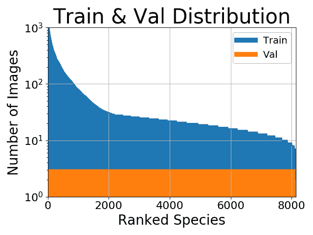
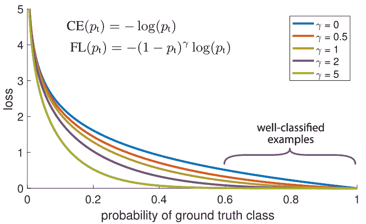

# 处理深度学习中的不平衡数据集

> 原文：[`www.kdnuggets.com/2018/12/handling-imbalanced-datasets-deep-learning.html`](https://www.kdnuggets.com/2018/12/handling-imbalanced-datasets-deep-learning.html)

 评论

像**灭霸**一样为你的数据集带来平衡

并不是所有数据都是完美的。实际上，如果你能获得一个完美平衡的现实世界数据集，你将非常幸运。大多数情况下，你的数据会有某种程度的类别不平衡，即每个类别的示例数量不同。

### 为什么我们希望数据平衡？

在投入时间进行任何可能漫长的深度学习项目之前，理解*为什么*我们应该这样做是很重要的，以确保这是一个有价值的投资。类别平衡技术只有在我们*真正关心*少数类时才是必要的。

比如，假设我们要预测是否应该根据市场的当前状况、房子的属性和我们的预算来购买一栋房子。在这种情况下，如果我们决定买房，那么这个决定是否正确是非常重要的，因为这是一个巨大的投资。同时，如果我们的模型说不买而实际上应该买，这也不是大问题。即使错过了某一栋房子，仍然会有其他房子可供选择，但对如此大的资产做出错误投资会很糟糕。

在这个例子中，我们绝对**需要**我们的少数“买”类别非常准确，而对于“不要买”类别则不是那么重要。然而在实际情况中，由于在数据中购买会比不购买少得多，我们的模型会倾向于非常好地学习“不要买”类别，因为它有最多的数据，并可能在“买”类别上表现不佳。这就需要平衡数据，以便我们可以更重视“买”预测的正确性！

那么如果我们不太关心少数类呢？例如，假设我们正在做图像分类，并且你的类别分布如下：

初看起来，平衡数据似乎有帮助。但也许我们对那些少数类不太感兴趣。也许我们的主要目标是获得**最高可能的百分比准确度**。在这种情况下，进行任何平衡并没有太大意义，因为我们的百分比准确度大部分来自于训练示例更多的类别。其次，即使数据集不平衡，分类交叉熵损失在追求最高百分比准确度时也往往表现良好。总的来说，我们的少数类对实现主要目标贡献不大，因此平衡并不是必要的。

说到这里，当我们遇到需要平衡数据的情况时，我们可以使用两种技术来帮助我们。

### (1) 权重平衡

权重平衡通过调整每个训练样本在计算损失时所承载的*权重*来平衡我们的数据。通常，我们的损失函数中的每个样本和类别将承担相等的权重，即 1.0。但是有时我们可能希望某些类别或某些训练样本承载更多的权重，如果它们更为重要。再次以我们买房的例子为例，由于“买入”类别的准确性对我们最为重要，因此该类别中的训练样本应该对损失函数有显著影响。

我们可以通过根据类别的不同，将每个样本的损失乘以某个因子来给类别赋权。在 Keras 中，我们可以这样做：

我们创建了一个字典，其中基本上规定了我们的“买入”类别应在损失函数中占据 75%的权重，因为“买入”类别比“不要买”类别更为重要，而“不要买”类别的权重则相应设置为 25%。当然，这些值可以很容易地调整，以找到最适合您应用的设置。如果我们的某个类别的样本显著多于其他类别，我们也可以使用这种权重平衡的方法。与其花费时间和资源去收集更多的少数类样本，不如尝试使用权重平衡，使所有类别对我们的损失函数的贡献相等。

另一种平衡训练样本权重的方法是[*焦点损失*](https://arxiv.org/pdf/1708.02002.pdf)。其主要思想是：在我们的数据集中，某些训练样本自然比其他样本更容易分类。在训练过程中，这些样本将以 99%的准确率被分类，而其他更具挑战性的样本可能仍表现较差。问题在于，那些容易分类的训练样本*仍然在贡献损失*。为什么我们还要对它们给予相同的权重，而在其他更具挑战性的数据点上，如果正确分类，能对我们的整体准确率贡献更多？！

这正是焦点损失可以解决的问题！焦点损失*降低了对已分类样本的权重*，而不是对所有训练样本给予相等的权重。这有助于将更多的训练重点放在那些难以分类的数据上！在数据不平衡的实际设置中，由于我们拥有更多的数据，我们的多数类很快就会被良好分类。因此，为了确保我们在少数类上也能实现高准确率，我们可以使用焦点损失在训练过程中给予这些少数类样本更多的相对权重。焦点损失可以很容易地在 Keras 中作为自定义损失函数实现：

### (2) 过采样与欠采样

选择合适的类别权重有时可能会很复杂。简单的逆频率方法可能效果不好。焦点损失可以提供帮助，但即便如此，它也会平等地减少*每个类别*的所有良好分类示例的权重。因此，平衡数据的另一种方式是通过*直接*采样。请查看下面的图示。

欠采样和过采样

在上图的左侧和右侧，我们的蓝色类别样本远多于橙色类别。在这种情况下，我们有两个预处理选项可以帮助训练我们的机器学习模型。

欠采样意味着我们只会从多数类中选择*一部分*数据，只使用与少数类相同数量的样本。这种选择应保持类别的概率分布。这样很简单！我们通过减少样本数量平衡了数据集！

过采样意味着我们会*创建副本*以使少数类的样本数量与多数类相同。这些副本的生成会保持少数类的分布。我们没有获取更多数据，但依然平衡了数据集！如果发现类别权重难以有效设置，采样可以是平衡类别的一个好替代方案。

### 想学习更多吗？

关注我的[推特](https://twitter.com/GeorgeSeif94)，我会发布最新最前沿的 AI、技术和科学内容！

**简介: [George Seif](https://towardsdatascience.com/@george.seif94)** 是一名认证极客及 AI/机器学习工程师。

[原文](https://towardsdatascience.com/handling-imbalanced-datasets-in-deep-learning-f48407a0e758). 经许可转载。

**相关内容:**

+   数据科学家必知的 5 种聚类算法

+   三种提高不平衡数据集上机器学习模型性能的技术

+   使用 Python 提升数据预处理速度 2-6 倍

* * *

## 我们的前三大课程推荐

 1\. [谷歌网络安全证书](https://www.kdnuggets.com/google-cybersecurity) - 快速进入网络安全职业。

 2\. [谷歌数据分析专业证书](https://www.kdnuggets.com/google-data-analytics) - 提升您的数据分析技能

 3\. [谷歌 IT 支持专业证书](https://www.kdnuggets.com/google-itsupport) - 支持您的组织 IT 工作

* * *

### 更多相关内容

+   [使用 SQL 处理时间序列中的缺失值](https://www.kdnuggets.com/2022/09/handling-missing-values-timeseries-sql.html)

+   [在类别不平衡数据集上进行无监督的解耦表示学习…](https://www.kdnuggets.com/2023/01/unsupervised-disentangled-representation-learning-class-imbalanced-dataset-elastic-infogan.html)

+   [处理不平衡数据的 7 种技术](https://www.kdnuggets.com/2017/06/7-techniques-handle-imbalanced-data.html)

+   [克服现实世界场景中的不平衡数据挑战](https://www.kdnuggets.com/2023/07/overcoming-imbalanced-data-challenges-realworld-scenarios.html)

+   [KDnuggets 新闻，8 月 31 日：完整的数据科学学习路线图…](https://www.kdnuggets.com/2022/n35.html)

+   [管理深度学习数据集的新方法](https://www.kdnuggets.com/2022/03/new-way-managing-deep-learning-datasets.html)
