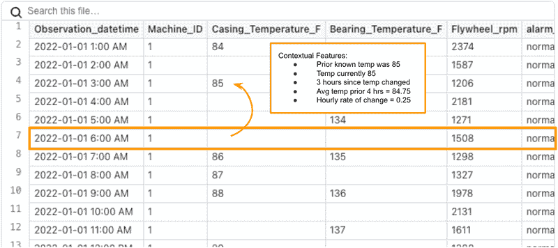

# 使用 SQL 处理时间序列中的缺失值

> 原文：[`www.kdnuggets.com/2022/09/handling-missing-values-timeseries-sql.html`](https://www.kdnuggets.com/2022/09/handling-missing-values-timeseries-sql.html)

今天早上我阅读了[Madison Schott](https://medium.com/u/3ed0ce2dcf93?source=post_page-----a910b5f481fe--------------------------------)的[文章](https://medium.com/towards-data-science/optimize-your-sql-code-with-this-window-function-409d3341cb20)，她在其中强调了这个鲜为人知的 SQL 函数`LAST_VALUE`的实用性。

这激励我写了一篇关于处理时间序列数据时经常遇到的特定用例的后续文章。

* * *

## 我们的前三个课程推荐

 1\. [谷歌网络安全证书](https://www.kdnuggets.com/google-cybersecurity) - 快速进入网络安全职业生涯。

 2\. [谷歌数据分析专业证书](https://www.kdnuggets.com/google-data-analytics) - 提升你的数据分析能力

 3\. [谷歌 IT 支持专业证书](https://www.kdnuggets.com/google-itsupport) - 支持你的组织的 IT

* * *

# 示例

让我们假设你正在使用传感器数据构建一个预测性维护模型。

经过一些整理，你最终得到的每小时数据如下所示：

一些预处理的传感器数据示例

到目前为止，我们已经进行了一些相当重要的数据工程，以在每小时创建这些均匀间隔的观测数据。*如何*做到这一点是另一个文章的主题。然而，请注意，温度测量中存在一些间隙。这时`LAST_VALUE`就派上用场了。

缺失值的原因通常是传感器只在值发生变化时报告。这减少了机器需要传输的数据量，但这为我们创建了一个数据问题需要解决。

# 原因

如果我们直接使用这些数据构建模型，当特定值缺失时，模型的准确性会受到影响，因为没有历史上下文*写入到行本身*。为了获得尽可能准确的模型，我们应该添加如下一些特征：

+   最后一次温度读取

+   过去 6 小时的平均温度

+   自上次温度读取以来的小时数（温度上升/下降）

+   过去 12 小时的温度变化率



将对预测模型有用的特征类型的说明

我们的第一步应该是用最后一个已知的值替换缺失值。我们选择*首先*这样做的原因是其他特征会变得更容易创建。

例如，如果我们将其留作缺失并尝试计算滚动平均值，那么平均值将被错误计算（它会忽略缺失值，仅计算非缺失值的平均值）。

**过去 4 小时的平均温度（有缺失值）**

(null + 85 + null + null) / 1 = **85**

**过去 4 小时的平均温度（替换后）**

(84 + 85 + 85 + 85) / 4 = **84.75**

# 如何修复

在 Python 中，我们会从 [前向填充](https://pandas.pydata.org/docs/reference/api/pandas.DataFrame.ffill.html) 开始。然而，在 SQL 中这样做意味着我们可以利用我们数据仓库的强大功能。

在 SQL 中，我们使用 `LAST_VALUE`。有关更多深入解释，请参阅 [这篇文章](https://towardsdatascience.com/optimize-your-sql-code-with-this-window-function-409d3341cb20)。

这里是语法：

```py
SELECT 
  MACHINE_ID, 
  OBSERVATION_DATETIME, 
  LAST_VALUE(
    CASING_TEMPERATURE_F ignore NULLS
  ) OVER (
    PARTITION BY MACHINE_ID 
    ORDER BY 
      OBSERVATION_DATETIME ROWS BETWEEN UNBOUNDED PRECEDING 
      AND CURRENT ROW
  ) AS LATEST_CASING_TEMPERATURE_F, 
  LAST_VALUE(
    BEARING_TEMPERATURE_F ignore NULLS
  ) OVER (
    PARTITION BY MACHINE_ID 
    ORDER BY 
      OBSERVATION_DATETIME ROWS BETWEEN UNBOUNDED PRECEDING 
      AND CURRENT ROW
  ) AS LATEST_BEARING_TEMPERATURE_F, 
  LAST_VALUE(FLYWHEEL_RPM ignore NULLS) OVER (
    PARTITION BY MACHINE_ID 
    ORDER BY 
      OBSERVATION_DATETIME ROWS BETWEEN UNBOUNDED PRECEDING 
      AND CURRENT ROW
  ) AS LATEST_FLYWHEEL_RPM, 
--8<-- snip --8<--
FROM 
  hourly_machine_data
```

用 LAST_VALUE 替换缺失值后的结果

就这样！

# 结论

希望我能为 `LAST_VALUE` 及其表亲 `FIRST_VALUE` 提供一些启示，它们是较不为人知的 SQL 窗口函数。

**[Josh Berry](https://www.linkedin.com/in/joshberry022/)** ([**@Twitter**](https://mobile.twitter.com/itsamejoshabee)) 领导了 Rasgo 的客户数据科学团队，并自 2008 年以来一直从事数据和分析行业。Josh 在 Comcast 工作了 10 年，期间他建立了数据科学团队，并且是内部开发的 Comcast 特征库的关键负责人——这是市场上第一个特征库之一。在 Comcast 之后，Josh 在 DataRobot 构建客户数据科学团队中发挥了关键作用。在业余时间，Josh 对棒球、F1 赛车、住房市场预测等有趣的主题进行复杂分析。

[原文](https://medium.com/@jberry_33001/handling-missing-values-in-time-series-with-sql-a910b5f481fe)。已获许可转载。

### 更多相关主题

+   [机器学习并不像你的大脑 第四部分：神经元的……](https://www.kdnuggets.com/2022/06/machine-learning-like-brain-part-4-neuron-limited-ability-represent-precise-values.html)

+   [使用 SHAP 值进行机器学习模型可解释性分析](https://www.kdnuggets.com/2023/08/shap-values-model-interpretability-machine-learning.html)

+   [使用 Datawig，一个用于缺失值插补的 AWS 深度学习库](https://www.kdnuggets.com/2021/12/datawig-aws-deep-learning-library-missing-value-imputation.html)

+   [使用 Pandas fillna() 输入缺失数据的最佳方法](https://www.kdnuggets.com/2023/02/optimal-way-input-missing-data-pandas-fillna.html)

+   [如何识别时间序列数据集中的缺失数据](https://www.kdnuggets.com/how-to-identify-missing-data-in-timeseries-datasets)

+   [语义层是 AI 驱动分析的缺失环节](https://www.kdnuggets.com/2024/02/cube-semantic-layers-missing-piece-ai-enabled-analytics)
