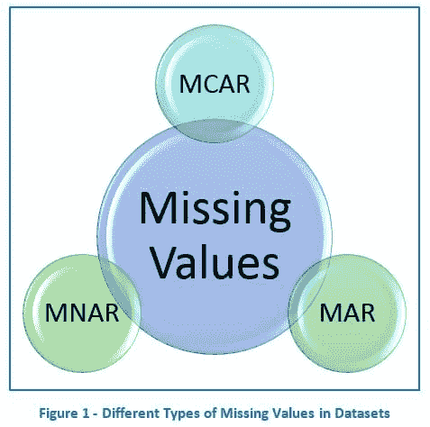

# 适当处理统计建模和预测中的缺失值

> 原文：[`www.kdnuggets.com/2020/05/handnling-missing-values-statistical-modelling-prediction.html`](https://www.kdnuggets.com/2020/05/handnling-missing-values-statistical-modelling-prediction.html)

评论[来源](https://datascience.foundation/datatalk/methods-for-dealing-with-missing-values-in-datasets)

缺失值几乎在每个数据集中都是一个不可避免的现实。有时，如果没有缺失值，可能会引起担忧，因为你期望数据中会有缺失值。由于缺失值会影响样本研究的可靠性，处理缺失值已成为统计学家几十年来争论的主题。如果处理不当或未加检查，缺失值可能会损害样本研究的可靠性。在许多大学课程中，学生通常被教导用均值填补连续数据的缺失值，用中位数填补分类数据的缺失值，或简单地删除缺失值所占比例较小的行（启发式地，少于 10%被认为是阈值）。许多业内统计学家认为，盲目填补数据集中的缺失值是一个危险的举动，应避免在没有首先了解数据缺失原因的情况下进行。

* * *

## 我们的前三大课程推荐

 1\. [Google 网络安全证书](https://www.kdnuggets.com/google-cybersecurity) - 快速入门网络安全职业生涯。

 2\. [Google 数据分析专业证书](https://www.kdnuggets.com/google-data-analytics) - 提升你的数据分析技能

 3\. [Google IT 支持专业证书](https://www.kdnuggets.com/google-itsupport) - 支持你的组织进行 IT 工作

* * *

1976 年，Donald B. Rubin（《推断与缺失数据》）的论文提出，数据集中缺失值的存在有 3 个假设：

+   完全随机缺失（MCAR）

+   完全随机缺失（MCAR）定义为数据缺失的概率与应获取的具体值或观察到的响应集合无关。然而，如果数据因设计原因、设备故障、样本在运输过程中丢失或技术不合格而缺失，则这些数据被视为 MCAR。MCAR 数据的统计优势在于分析保持不偏倚。设计可能会失去效能，但估计的参数不会因数据缺失而产生偏差。

+   **示例：** 如果我们考察年龄与收入之间的关系，并且收入数据缺失，当缺失的收入数据与参与者的年龄之间没有关系时，缺失的数据是 MCAR。缺失数据没有模式。

+   随机缺失（MAR）

+   当数据的缺失概率依赖于已观察到的响应集，但与预计得到的具体缺失值无关时，数据被视为 MAR。由于我们倾向于认为随机性不会产生偏差，我们可能认为 MAR 不会带来问题。然而，MAR 并不意味着缺失数据可以被忽略。如果一个脱落变量是 MAR，我们可能期望在每个案例中该变量的脱落概率在条件上独立于当前获得的变量及预计将来获得的变量，前提是考虑到该案例之前获得的变量的历史。

+   缺失非随机（MNAR）

+   如果数据的缺失特征不符合 MCAR 或 MAR，则属于缺失非随机（MNAR）类别。MNAR 数据的情况是有问题的。在这种情况下，获得无偏估计的唯一方法是对缺失数据进行建模。然后，该模型可以被纳入一个更复杂的模型中，以估计缺失值。

### 如何处理缺失值

+   列删除法（完整案例分析）

+   这是所有方法中最简单且最省时的方法。这意味着仅对没有缺失值的数据行进行分析。这在大多数学术环境中是默认行为，当学生学习数据预处理时尤为如此。如果我们不能确认缺失数据是 MCAR 的，那么我们的分析结果可能会有偏差。在实际中，这在制药等行业比其他行业更为重要。如果样本量足够大，且功效不是问题，并且 MCAR 假设得到满足，则列删除法可能是一个合理的策略。然而，当样本量不大或 MCAR 假设不满足时，列删除法不是最佳策略。

+   成对删除法（可用案例分析）

+   在这种情况下，与列删除法不同，成对删除法要求使用没有缺失值的行和列进行分析，省略那些有缺失值的行和列。这有助于保留数据并提高统计功效，但由于样本大小不同和标准误差偏倚，现在的分析无法进行比较。成对删除法对于 MCAR 或 MAR 数据的偏倚较小。然而，如果缺失观测值很多，分析将会不足。

+   统计插补

+   插补涉及用统计分析得到的替代值替换缺失值，从而生成一个完整的数据集以供分析。插补可以通过显式或隐式建模方法创建。显式建模方法假设变量具有某种预测分布，并估计每个分布的参数，用于插补。这包括通过均值、中位数、概率、比率、回归、预测回归和分布假设等不同的插补方法。

+   在这些情况下，使用均值和中位数等点估计是常见的，但由于数据偏斜性，这些估计方法往往不可靠，并且这种方法更适合于类似于正态分布的数据（这在实际数据中不太可能）。实际数据往往是偏斜的，这使得像均值和中位数这样的描述统计量的实用性降低。

**相关内容**

+   执行机器学习和数据科学时的常见错误

+   数据科学家应采纳的 6 条建议

+   神经网络 201：关于自编码器的全部内容

### 更多相关内容

+   [用 SQL 处理时间序列中的缺失值](https://www.kdnuggets.com/2022/09/handling-missing-values-timeseries-sql.html)

+   使用 SHAP 值进行机器学习模型解释

+   [机器学习与大脑不同 第四部分：神经元的…](https://www.kdnuggets.com/2022/06/machine-learning-like-brain-part-4-neuron-limited-ability-represent-precise-values.html)

+   [烂番茄电影评分预测的数据科学项目：…](https://www.kdnuggets.com/2023/06/data-science-project-rotten-tomatoes-movie-rating-prediction-first-approach.html)

+   [烂番茄电影评分预测的数据科学项目：…](https://www.kdnuggets.com/2023/07/data-science-project-rotten-tomatoes-movie-rating-prediction-second-approach.html)

+   [使用 BQML 进行多变量时间序列预测](https://www.kdnuggets.com/2023/07/multivariate-timeseries-prediction-bqml.html)
