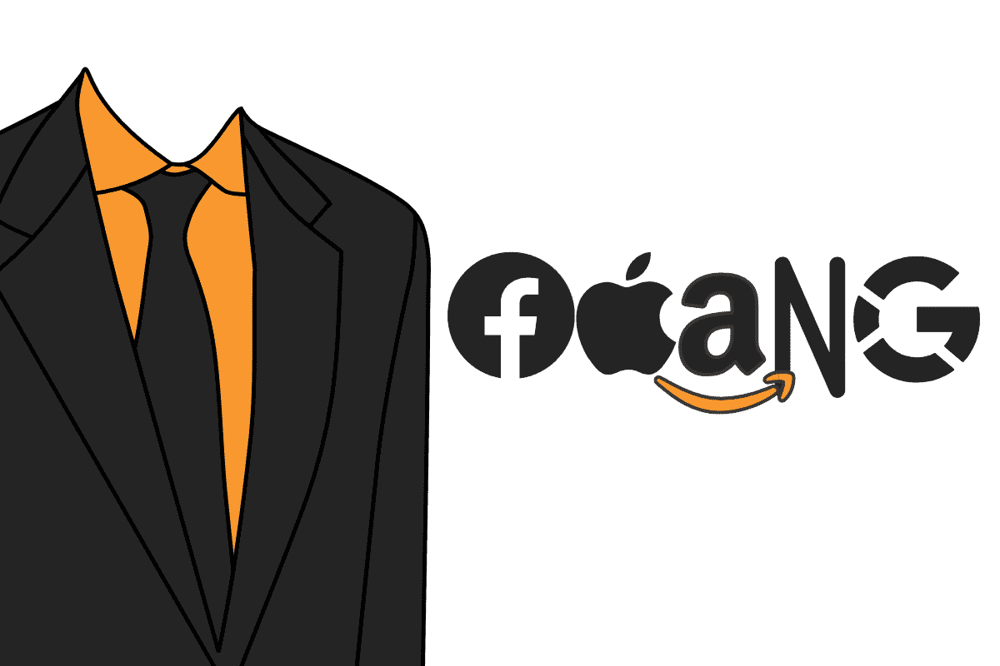
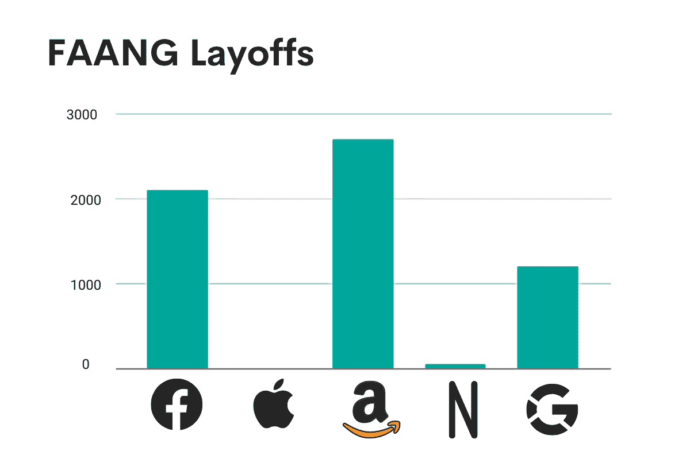
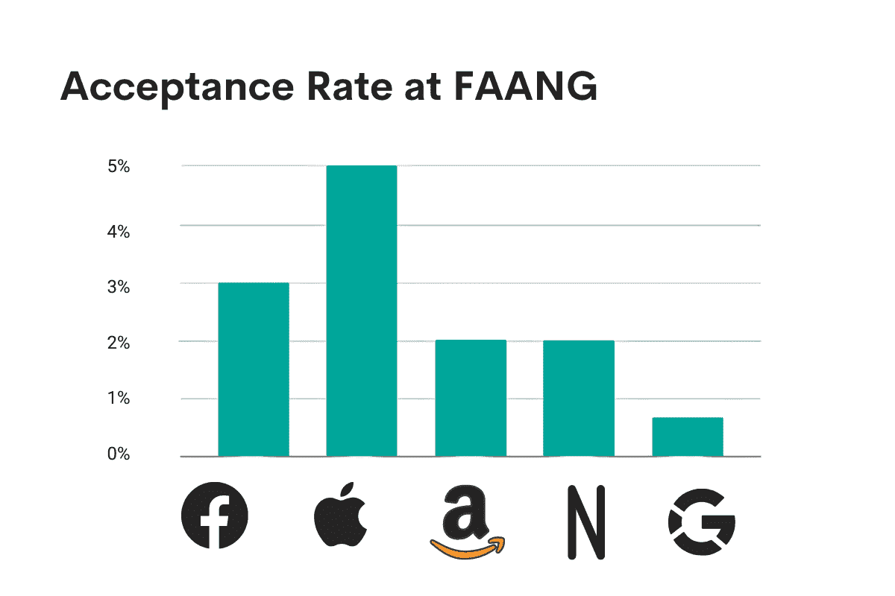

# 进入 FAANG 公司有多难

> 原文：[`www.kdnuggets.com/2023/05/hard-get-faang-companies.html`](https://www.kdnuggets.com/2023/05/hard-get-faang-companies.html)

作者提供的图片

提醒音乐进入戏剧性的末日氛围。在过去两年里，仅 FAANG 公司就[负责](http://layoffs.fyi)了超过 50,000 次裁员（Meta 裁员[10,000](https://about.fb.com/news/2023/03/mark-zuckerberg-meta-year-of-efficiency/)加[11,000](https://www.cnbc.com/2022/11/09/meta-to-lay-off-more-than-11000-thousand-employees.html)；苹果公司没有裁员；亚马逊裁员超过 27,000 人，分[四](https://www.geekwire.com/2022/amazon-makes-staff-cuts-at-amp-the-app-it-launched-this-year-to-reimagine-radio/) [次](https://www.wsj.com/articles/amazon-to-lay-off-over-17-000-workers-more-than-first-planned-11672874304) [批次](https://www.nytimes.com/2022/11/14/technology/amazon-layoffs.html) [进行](https://www.cnbc.com/2023/03/20/amazon-layoffs-company-to-cut-off-9000-more-workers.html)；Netflix 裁员 500 人，分[四](https://www.cnbc.com/2022/06/23/netflix-lays-off-300-more-employees-as-revenue-growth-continues-to-slow.html) [批次](https://deadline.com/2022/09/netflix-animation-layoff-30-staffers-overhaul-continues-1235118700/) [进行](https://www.cnbc.com/2022/05/17/netflix-lays-off-150-employees-as-the-streaming-service-contends-with-big-subscriber-losses.html)；以及[12,000](https://www.nytimes.com/2023/01/20/business/google-alphabet-layoffs.html)人来自 Google）。这对这些公司的低录取率意味着什么？从 FAANG 公司获得录取通知书有多困难？

作者提供的图片

在这篇文章中，我将探讨为什么在历史和当前背景下，获得 FAANG 工作的难度如此之高。我还将描述增加你在 FAANG 公司以及其他公司的成功几率的方法。最终，这并不像你想象的那么困难。我还鼓励你拓宽视角，考虑接受科技公司录取的可能性。

# 什么是 FAANG？

我在这里用 FAANG 有两个含义。首先是指负责这个首字母缩写的公司：Facebook（现在的 Meta）、Apple、Amazon、Netflix 和 Google（实际上是 Alphabet）。这个首字母缩写是 CNBC 的 Jim Cramer 在 2013 年创造的。这些公司当时表现优于大盘，因此 FAANG 逐渐流行开来。

但将 FAANG 视为科技公司总体的代表也是有用的——比如 Microsoft、AirBnb 和 Spotify。当我说 FAANG 的录取率很低时，我真正的意思是这些大而响亮的科技公司很难进入，包括 Facebook、Amazon、Netflix、Apple 和 Google，也包括许多其他炫目的科技公司。

总体而言，FAANG 公司在各方面都以快速增长、不惜一切代价、市场主导地位和创新产品而闻名。它们在整个 2010 年代吸引了大量技术人才——申请者们真的认为他们可以帮助打造出更好的世界。

当然，在 2023 年的科技寒冬中，情况有所不同。

# 你的机会有多低？

虽然没有官方数据表明 FAANG 的录取率，但我查阅了多篇文章，这些文章引用了 FAANG 在这些裁员期间的录取率为个位数百分比（或更低）。

+   苹果公司仅接受了 [3%](https://theorg.com/iterate/how-to-get-a-job-at-apple) 的申请者。

+   Facebook 在现场面试后的 [5% 录取率](https://www.teamblind.com/post/FB-onsite-success-rate-Za2gx5O1)，这意味着所有职位申请的接受率更低。

+   亚马逊接受了 [不到 2%](https://www.pathmatch.com/blog/why-people-want-to-work-at-amazon-and-how-you-can-prepare) 的申请者。

+   Netflix 在 2019 年接受了 [不到 2%](https://www.linkedin.com/pulse/exactly-what-takes-get-job-netflix-according-its-head-daniella-conesa) 的申请者。我是通过将员工总数（2019 年为 6,800）除以申请者总数（350,000）得到这个数字的。这意味着即使每个职位都重新填补，Netflix 的录取率仍然不到 2%。实际上，这个比例可能更低。

+   谷歌接受了一个微不足道的 [0.67%](https://www.pathmatch.com/blog/the-pathmatch-guide-to-getting-hired-at-google) 的申请者。

作者图像

现在考虑到，在 60,000 人裁员之后，这些公司可能有大量的有才华的申请者和更少的空缺职位。

# 为什么进入 FAANG 公司这么难？

当我申请大学时，我惊讶于像耶鲁、普林斯顿和布朗这样的大学的录取率不到 20 人中有 1 人。但 FAANG 的录取率则让这些黯然失色。为什么获得那封录取通知书这么困难？

## 竞争

当你申请 FAANG 时，你面临着激烈的竞争。每个人都希望为 FAANG 或 FAANG 相邻公司工作。特别是在 2010 年代，FAANG 有一种非常酷的氛围——想象一下乒乓球桌、免费午餐以及其他令人惊叹的福利，除了工作稳定性和极高的薪水之外。每个有一点技术才能的人都希望能进入其中。

## 高标准

FAANG 有很高的标准。由于申请量的激增，这些科技公司能够只聘用顶尖的技术人才。候选人需要拥有出色的简历、惊人的推荐信和相关的教育及工作经验——或者一个令人震撼的作品集来弥补这些要求。

## 技术面试

FAANG 公司及类似的科技公司设立了严格的技术面试。即使是经验丰富的工程师，在三名招聘经理冷峻的目光下进行白板编码面试时，也可能会出现失误。这真的很难。

这篇文章 "[FAANG 公司的招聘和知道何时准备好](https://www.stratascratch.com/blog/hiring-in-faang-companies-and-knowing-when-you-re-ready/?utm_source=blog&utm_medium=click&utm_campaign=kdn+get+into+faang)" 讨论了 FAANG 公司的招聘流程。

## 文化契合

FAANG 在招聘时挑剔的不仅仅是编码技能。文化契合度非常重要。Netflix [不想要](https://www.businessinsider.com/netflix-culture-deck-top-most-impactful-slides-2019-10)“聪明的混蛋”。Apple [只招聘](https://blog.grovehr.com/apple-company-culture)核心合作者。Facebook [希望](https://www.metacareers.com/facebook-life/)招募前瞻性思维的人。因此，这不仅仅是关于你的简历，而是你如何证明你是该公司良好的“文化契合者”。

# 那些数字令人沮丧，但具有误导性

回到那些微小的接受率百分比。它们微不足道，但具有误导性。

首先，如今的环境已不同以往。大型科技公司的全盛时期，无论好坏，都经历了波折。FAANG 公司不再被普遍认为是最好的工作场所。随着风险投资资金的枯竭以及它们在努力实现盈利转型时，薪资和福利在较小的公司也可能一样好。而且，显然 FAANG 并没有提供任何工作保障，因为他们在某些情况下裁员了 5-10%的员工。

此外，即使 FAANG 的招聘有所放缓，科技行业仍在招聘。ZipRecruiter [发现](https://www.ziprecruiter.com/blog/laid-off-tech-workers/)79%的被裁员的科技工作者在三个月内找到新工作。仍然有人在寻找顶尖的科技人才。

最后，请记住，大量申请 FAANG 的申请基本上都是垃圾。正如我所说，每个人都申请 FAANG，因为在那里工作会非常棒。但招聘经理能够丢弃大量这些申请，因为它们实在不够好。做一点额外的工作。建立网络可以极大地提高你的机会。参加会议结识人脉。针对每个申请量身定制你的简历和求职信。仅此一点就能帮助你在大多数 FAANG 申请者中脱颖而出。

# 如何增加获得 FAANG 或其他地方好技术工作的机会

图片来源：作者

是的，获得这些公司的录取很难。但并没有你想象的那么困难。以下是四种方法，帮助你增加获得梦想中的技术工作的机会，无论是在 FAANG 还是其他优秀的科技公司。

## 打磨你的简历

你可能已经知道这一点，但值得重复的是，大型科技公司的招聘经理会自动化大量的求职申请筛选。他们通过匹配关键词来过滤和丢弃大量的简历和求职信。确保你的简历与职位发布尽可能匹配，包括相关的技能、经验和才能。

## 练习面试

练习面试题目至关重要，确保你熟悉最新的面试题目，可以通过像 [Stratascratch](https://www.stratascratch.com/?utm_source=blog&utm_medium=click&utm_campaign=kdn+get+into+faang) 这样的网站进行准备，这样你在面试时就不会在白板上卡壳。这不仅能让你掌握打破面试的技巧，还能在准备过程中缓解你的紧张情绪。

## 构建、部署、重复

如果没有学位或工作经验，你需要证明你具备成为好雇员的能力。构建并部署那些你个人感兴趣的项目。不要仅仅做典型的 Kaggle 竞赛——招聘经理见得多了。参与一些大胆而有趣的项目，讲述为什么大型科技公司应该雇佣你的故事。

## 多走一步

最后，一个好的建议是 [在简历中添加库和包](https://blog.boot.dev/jobs/libraries-and-packages-in-coding-portfolio/)。面向终端用户的应用程序是一个好的起点，但并不是很多其他技术申请者会构建库和包。这些可以帮助：

+   展示你对软件工程和架构的深刻理解。

+   向招聘经理展示一些有用的东西。

+   在 GitHub 上获得一些关注作为一个库，这可以作为社会证明。

还有很多其他好的面试技巧，但这四个建议是一个很好的起点。

# 看看 FAANG 之外的机会

我想通过请你考虑把 FAANG 之外的公司也视为潜在的工作机会来结束这篇文章。如今的较小初创公司可以提供与 FAANG 相媲美的薪资、福利、工作稳定性和公司文化。

即使如此，大规模裁员也证明这些大型科技公司并不像 2010 年代那样稳定或优秀。许多在疫情期间没有过度招聘的优秀科技公司正在寻找优秀的候选人，所以如果你在获得 FAANG 工作方面遇到困难，可以先去较小的公司展示自己，然后再带着工作经验重新申请 FAANG。

# FAANG 公司很难进入，但也并非完全不可能。

总之，进入 FAANG 公司确实很难，这是毋庸置疑的。但许多申请者忘记了，即使在当前的技术寒冬环境下，这比你想象的要容易。所有 FAANG 公司目前都有技术职位空缺（[Meta](https://www.metacareers.com/areas-of-work/data/?p%5Bteams%5D%5B0%5D=Data+%26+Analytics&teams%5B0%5D=Data+%26+Analytics)，[Amazon](https://www.amazon.jobs/en/landing_pages/tech-roles)，[Apple](https://jobs.apple.com/en-us/search?location=United-States-USA&team=Cloud-and-Infrastructure-SFTWR-CLD)，[Netflix](https://jobs.netflix.com/search) 和 [Alphabet](https://www.glassdoor.com/Jobs/Google-data-scientist-Jobs-EI_IE9079.0,6_KO7,21.htm)），不仅如此，整体技术公司尽管就业市场寒冷，仍在招聘。

为了提高成功的几率，确保你的简历与职位描述尽可能接近。多练习面试问题直到你感到疲惫不堪。多做项目、部署、再做项目。并考虑通过在你的作品集中加入一些包或库来多走一步。

如果你仍然觉得困难，可以扩大求职范围。确保每份申请都量身定制，不要害怕点击申请按钮。无论是 FAANG 公司还是其他优秀组织，科技公司都会非常欢迎你。

**[内特·罗斯迪](https://www.stratascratch.com)** 是一名数据科学家，专注于产品策略。他还是一名兼职教授，教授分析学，并且是 [StrataScratch](https://www.stratascratch.com/) 的创始人，该平台帮助数据科学家通过顶级公司的真实面试问题准备面试。你可以在 [Twitter: StrataScratch](https://twitter.com/StrataScratch) 或 [LinkedIn](https://www.linkedin.com/in/nathanrosidi/) 上与他联系。

### 了解更多相关话题

+   [停止在数据科学项目中硬编码 - 使用配置文件](https://www.kdnuggets.com/2023/06/stop-hard-coding-data-science-project-config-files-instead.html)

+   [数据科学的 3 个难题 Python 编码面试问题](https://www.kdnuggets.com/2023/03/3-hard-python-coding-interview-questions-data-science.html)

+   [想成为数据科学家？第一部分：你需要的 10 项硬技能](https://www.kdnuggets.com/want-to-become-a-data-scientist-part-1-10-hard-skills-you-need)

+   [如果你没有合适的学位，如何进入数据分析领域](https://www.kdnuggets.com/2021/12/how-to-get-into-data-analytics.html)

+   [进入数据科学的 3 种可能途径](https://www.kdnuggets.com/2022/03/3-possible-ways-get-data-science.html)

+   [数据科学家最佳工作公司前 11 名](https://www.kdnuggets.com/2021/12/11-best-companies-work-data-scientist.html)
