# TensorFlow 的“Hello World”

> 原文：[`www.kdnuggets.com/2022/05/hello-world-tensorflow.html`](https://www.kdnuggets.com/2022/05/hello-world-tensorflow.html)

TensorFlow 是一个开源的端到端机器学习框架，使得训练和部署模型变得简单。

由两个词组成 - tensor 和 flow。tensor 是一个向量或多维数组，是深度学习模型中表示数据的标准方式。flow 意味着数据如何通过图进行流动，经过称为节点的操作。

* * *

## 我们的三大课程推荐

 1\. [Google 网络安全证书](https://www.kdnuggets.com/google-cybersecurity) - 快速进入网络安全职业。

 2\. [Google 数据分析专业证书](https://www.kdnuggets.com/google-data-analytics) - 提升你的数据分析技能

 3\. [Google IT 支持专业证书](https://www.kdnuggets.com/google-itsupport) - 支持你所在组织的 IT

* * *

它通过将各种算法打包在一起用于数值计算和大规模机器学习。此外，它还允许使用高级 Keras API 灵活地构建模型并进行控制。

在本文中，我们将使用 TensorFlow 构建一个适合初学者的机器学习模型。

我们将使用来自 [Kaggle](https://www.kaggle.com/datasets/mlg-ulb/creditcardfraud?datasetId=310&sortBy=voteCount) 的信用卡欺诈检测数据。

## **本文结构如下：**

+   理解问题陈述

+   加载数据和所需的库

+   理解数据和用于模型选择的评估指标

    +   缺失值

    +   数据转换

    +   检查类别不平衡

+   构建带有类别不平衡的 TensorFlow 模型

    +   评估模型性能

+   处理类别不平衡并训练模型

+   比较有无类别不平衡的模型性能

# 问题陈述

信用卡交易面临欺诈风险，即这些交易是在客户不知情的情况下进行的。机器学习模型被部署在各种信用卡公司，用于识别和标记潜在的欺诈交易，并及时采取行动。

# 加载数据和所需的库

我们从 TensorFlow 中导入了两个模块：

+   密集层，其中当前层的每个神经元都与前一层的所有神经元相连

+   另一个导入是 Sequential 模型，它用于构建神经网络。

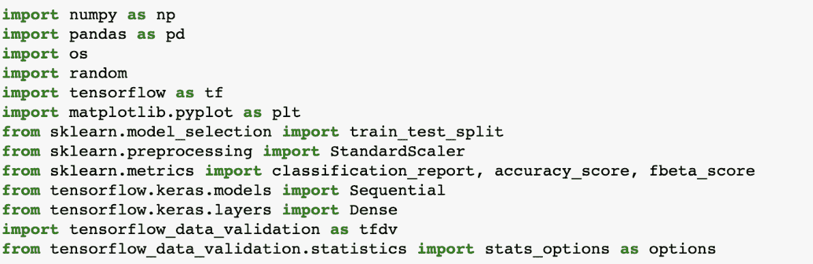

# 获取数据

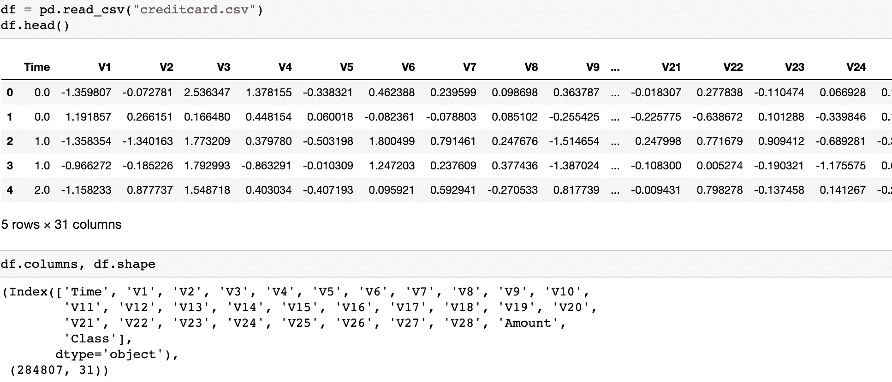

# 划分训练数据和测试数据

我们保留了 20% 的数据用于评估模型性能，并将开始探索训练数据。测试数据将以与训练数据相同的方式进行准备，包括所有的转换。

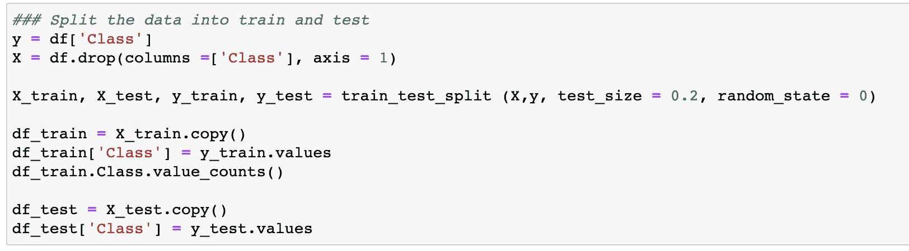

# 理解数据

数据包括经过 PCA 转换的数值输入变量，这些变量被掩盖，因此从业务角度理解属性的范围有限。

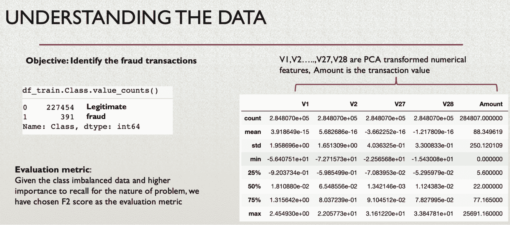

我们使用了 [tensorflow data validation](https://www.tensorflow.org/tfx/data_validation/get_started) 库来可视化属性，它通过计算描述性统计数据和检测异常来帮助理解训练数据和测试数据。

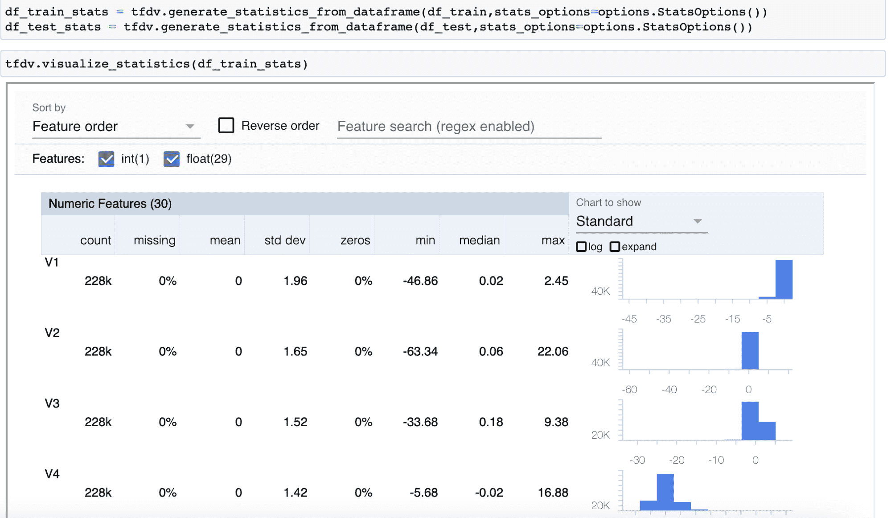

此外，属性没有缺失值并且经过 PCA 转换，因此我们不会对这些属性执行任何数据转换。在上述可视化中，你还可以选择进行对数转换，以可视化转换后的数据分布。

# 缺失数据

如上图中的缺失列所示，所有属性中没有缺失值，你也可以通过以下方式快速检查所有属性的空值总和：

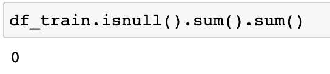

# 训练和测试特征

在机器学习数据建模中，最关键的假设之一是训练数据和测试数据集属于相似的分布，这在下面的图表中很明显。训练数据和测试数据分布的重叠程度使我们有信心训练的模型能够很好地在测试数据上进行泛化。如果服务数据分布偏离了机器学习模型训练的数据，重要的是要继续监控，然后决定何时 [重新训练模型](https://towardsdatascience.com/when-are-you-planning-to-retrain-your-machine-learning-model-5349eb0c4706) 以及使用哪个数据分区。

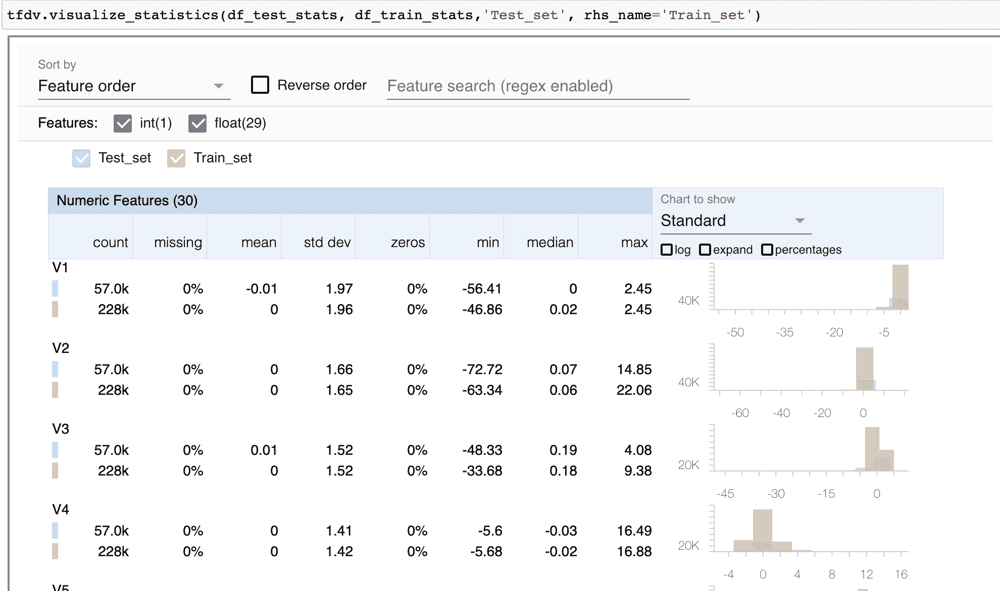

你还可以检查领域外的值并检测错误或异常：

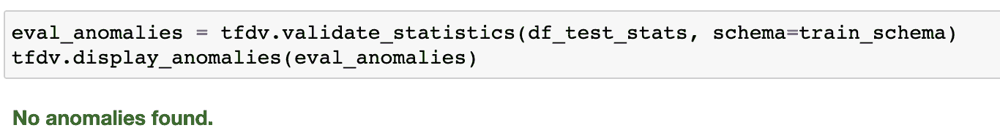

# 数据转换

由于除“Amount”之外的所有属性都进行了 PCA 转换，我们将重点关注“Amount”，并按照如下进行标准化：

# 准备测试数据

我们将通过对训练数据进行的相同转换来准备测试数据：

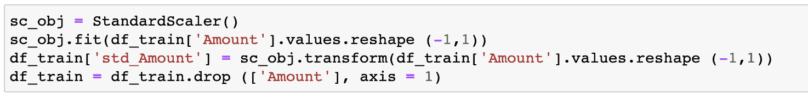

# 构建基线 TensorFlow 模型

除了神经元的单位和 [激活函数](https://towardsdatascience.com/activation-functions-neural-networks-1cbd9f8d91d6) 的类型，第一层还需要额外的输入，即输入变量的数量。前两层使用 ReLU 激活，它是一种非线性函数，你可以在 [这里](https://deepai.org/machine-learning-glossary-and-terms/relu) 了解更多。我们需要输出作为交易属于哪个类别的概率，因此在最后一层选择了 sigmoid 激活函数。

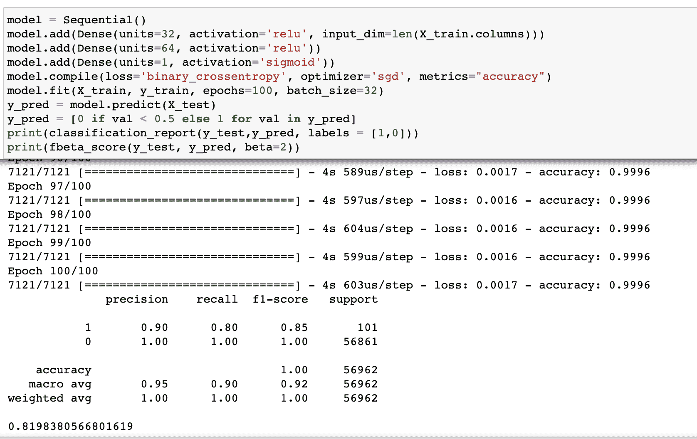

# 评估指标

我们的目标是减少假阴性，即如果模型将一笔交易声明为非欺诈性和合法性，但实际上是错误的，那么建立模型的整个目的就会失效。模型已经通过了欺诈交易，这比将合法交易标记为欺诈更糟糕。

让我们看看生态系统为假阳性付出了什么代价：如果客户进行了一笔真实的交易，但由于假阳性率很高，模型错误地将其标记为欺诈，导致交易被拒绝。客户必须经历额外的身份验证步骤，以确认交易是由他/她触发的。这种麻烦也是一种成本，但比让欺诈通过的成本要低。也就是说，一个好的模型不能阻止每一笔交易，这会给真实客户带来麻烦，因此一定程度的准确性也很重要。

F1 是准确率和召回率的调和平均数。根据业务指标哪个更重要，可以给予一个比另一个更多的权重。这可以通过 [fbeta_score](https://scikit-learn.org/stable/modules/generated/sklearn.metrics.fbeta_score.html#:~:text=Compute%20the%20F%2Dbeta%20score,recall%20in%20the%20combined%20score.) 实现，它是准确率和召回率的加权调和平均数，其中 beta 是召回率在综合得分中的权重。

| beta < 1 | 更重视准确率 |
| --- | --- |
| beta < 1 | 更重视召回率 |
| beta = 0 | 仅考虑准确率 |
| beta = inf | 仅考虑召回率 |

因此，出于本文的目的，我们使用 F2 得分，它给召回率提供了两倍的权重。

# 处理类别不平衡

我们通过随机抽取 10%的样本并将其与少数类（即欺诈交易）连接，来下采样多数类。

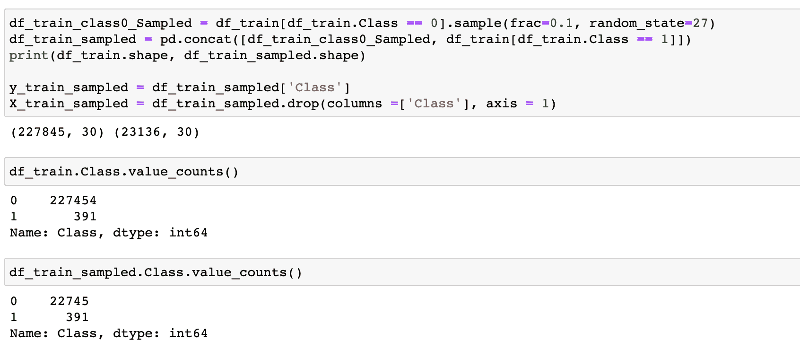

请注意，我们之前已将训练数据和测试数据分开，并将测试数据单独保留，以比较模型在有和没有处理类别不平衡的两个版本中的输出。

# 处理了类别不平衡的模型

新模型在如下所示的数据分布上进行训练：

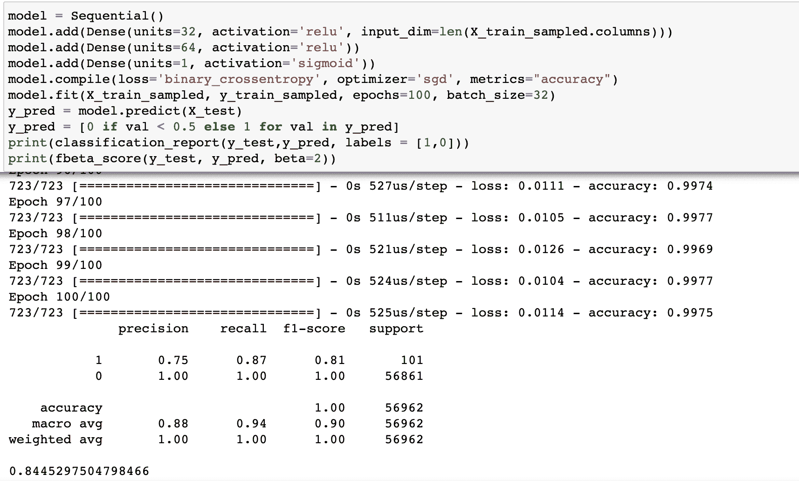

如上所示，尽管精确度有所下降，但第 1 类的召回率已从 80%提高到 87%。此外，使用改进的类平衡数据分布训练的修订模型中的 F2 分数已从 82%提高到 84.5%。

请注意，你可以调整截止值以实现目标召回率和精确度值。

在这篇文章中，我们建立了一个神经网络模型来识别欺诈交易。由于数据集不平衡，我们对多数类进行了欠采样，以改善类分布。这导致了第 1 类的召回值（主要指标）和 F2 分数的改善。

**[Vidhi Chugh](https://vidhi-chugh.medium.com/)** 是一位获奖的 AI/ML 创新领导者和 AI 伦理学家。她在数据科学、产品和研究的交叉点上工作，提供商业价值和见解。她是数据中心科学的倡导者，并在数据治理方面是一位领先的专家，致力于构建可信赖的 AI 解决方案。

### 更多相关主题

+   [TensorFlow 计算机视觉 - 转移学习轻松实现](https://www.kdnuggets.com/2022/01/tensorflow-computer-vision-transfer-learning-made-easy.html)

+   [PyTorch 还是 TensorFlow？比较流行的机器学习框架](https://www.kdnuggets.com/2022/02/packt-pytorch-tensorflow-comparing-popular-machine-learning-frameworks.html)

+   [使用 Tensorflow 训练图像分类模型的指南](https://www.kdnuggets.com/2022/12/guide-train-image-classification-model-tensorflow.html)

+   [使用 TensorFlow 和 Keras 构建和训练你的第一个神经网络](https://www.kdnuggets.com/2023/05/building-training-first-neural-network-tensorflow-keras.html)

+   [免费的 TensorFlow 2.0 完整课程](https://www.kdnuggets.com/2023/02/free-tensorflow-20-complete-course.html)
