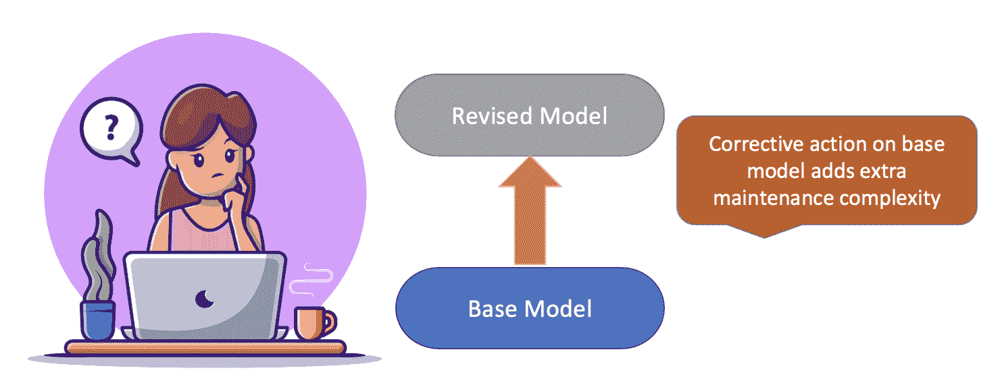

# 每位 AI 从业者应注意的隐性技术债务

> 原文：[`www.kdnuggets.com/2022/07/hidden-technical-debts-every-ai-practitioner-aware.html`](https://www.kdnuggets.com/2022/07/hidden-technical-debts-every-ai-practitioner-aware.html)

# 介绍

* * *

## 我们的三大课程推荐

 1\. [Google 网络安全证书](https://www.kdnuggets.com/google-cybersecurity) - 快速进入网络安全职业的快车道。

 2\. [Google 数据分析专业证书](https://www.kdnuggets.com/google-data-analytics) - 提升你的数据分析技能

 3\. [Google IT 支持专业证书](https://www.kdnuggets.com/google-itsupport) - 支持你的组织的 IT

* * *

随着新软件包和库的出现，建立你的第一个机器学习模型现在变得相当快捷。尽管乍看之下可能很美好，但在维护这些机器学习系统方面，它实际上是在积累[隐性技术债务](https://proceedings.neurips.cc/paper/2015/file/86df7dcfd896fcaf2674f757a2463eba-Paper.pdf)。

但首先让我们理解一下什么是[技术债务](https://en.wikipedia.org/wiki/Technical_debt)：

> “在[软件开发](https://en.wikipedia.org/wiki/Software_development)中，技术债务（也称为设计债务或代码债务）是指由于现在选择简单（有限）解决方案而需要额外返工的隐含成本，而不是使用更好的方法，这种方法虽然需要更长时间。” – 维基百科

根据沃德·坎宁安的说法，技术债务是指在软件工程中快速推进所带来的长期成本。这可能在将代码推向生产时看起来是正确的做法，但在后续阶段需要处理，例如编写全面的单元测试、移除冗余和未使用的代码、文档编写、代码重构等。处理这些任务的团队并不是在交付新功能，而是在及时处理积累的债务，以减少错误的范围并促进代码的易维护性。

# 从机器学习的角度看技术债务

考虑到机器学习系统中的技术债务会导致机器学习相关问题的额外开销，这些问题加在了典型的软件工程问题之上。

机器学习技术债务的很大一部分归因于系统级交互和接口。

## 了解你的用户

确定机器学习预测的用户对于评估模型新版本的影响至关重要。模型预测的反馈为模型修订提供了基础，并融入了对用户的潜在影响。

Coffee work vector created by catalyststuff; Web analytics vector created by storyset

为了消除来自未预期用户的要求模糊或理解不清所带来的风险，重要的是记录和签署声明的用户集，并解耦隐藏的反馈循环和广泛用户的期望。

## 没有任何变化是微小的

机器学习系统在模型训练时，若所有影响目标变量的属性都存在，则效果最佳。实质上，模型可以看到一个人类专家会看到的内容，从而评估结果。数据科学家的工作会更简单，如果所有变量都是独立的，但现实事件并非如此。变量的任何单一变化不仅改变其分布，还影响所有输入（或独立）变量的特征重要性和权重。这是由于交互属性，即变量变化影响所有变量的联合分布。

添加或删除变量时可以观察到类似的效果。信号的混合和纠缠精细地改变了整个模型学习过程。

请注意，这不仅限于任何变量的添加或删除，主要是任何超参数的变化、数据整理、标记过程、阈值选择或采样过程，这些都可能导致称为“改变任何事物就会改变一切”的效果。

## 相关数据与变化数据

输入数据的分布可能随时间变化，需要评估其对模型结果的影响。这就是数据版本控制重要的地方，以便定性和定量变化在数据中得到良好捕捉和记录。然而，这也会导致额外的成本，需要关注数据的新鲜度并维护多个版本。

许多数据科学家会添加很多包或对代码进行临时修改，以迅速适应最新版本的运行代码以进行实验或分析。问题出在他们忘记保持代码的相关性，去除未使用或不必要的代码块，这些代码块在需要时成为后续更改的障碍。这种情况经常发生在多个开发者协作同一脚本时，他们不断添加更改而不去除冗余或不相关的部分，担心会破坏他人的代码或需要额外时间来测试向后兼容的更改。

## 何时添加与何时不添加的权衡

每个数据科学家都需要接受这样一个事实：在添加特征时，“更多并非更好”。在假设每个特征对模型学习都很重要的前提下，除非它导致数据维度过大，否则数据科学家不会考虑维护具有剩余价值的特征的成本。此外，如果某个特征后来被宣布为不重要，他们宁愿不去更改模型管道，因此继续保留在早期模型开发阶段工程化的遗留特征。

这看起来仍然相当简单，直到所有特征都直接从一个单一的表中插入到模型中。当属性来源于多个数据流并经过多次联接和转换，导致额外的中间步骤时，复杂性会大幅增加。管理这样的管道，以及检测和调试这些系统，成为团队继续开发创新解决方案的障碍。

## 限制的级联效应

管理单一模型本身就是一场艰难的战斗，因此许多组织倾向于构建一个一般化模型。尽管它看起来是一场胜利的游戏，但这是一把双刃剑。

Coffee work vector created by catalyststuff

一般化模型是否适用于所有用例？如果不适用，那么通常会选择在基础模型之上构建一个修正模型层，以更好地服务于略有不同但类似的问题陈述。在这种情况下，修正模型以基础模型为输入，这就增加了一层依赖关系和额外的分析与监控。

# 摘要

在这篇文章中，我们讨论了处理机器学习系统中隐性技术债务的成本和收益。优先发布新模型版本或端到端测试管道的短视观点会迅速将事物推向生产。但这也会不断增加隐藏成本，从而在长期内减缓团队创新的速度。

研究论文的作者提出了一些深思熟虑的问题供人工智能从业者在考虑隐性债务影响时思考：

+   在全规模下测试新的算法方法有多容易

+   我们如何衡量每次更改的影响？我们是否在管道中建立了检查点，以捕捉和归因诊断因素？

+   通过对系统进行一次更改所带来的改进是否对系统的其他部分产生负面影响？

+   新成员理解整个管道的细微差别和复杂性有多快和多容易？

## 参考文献

+   [`proceedings.neurips.cc/paper/2015/file/86df7dcfd896fcaf2674f757a2463eba-Paper.pdf`](https://proceedings.neurips.cc/paper/2015/file/86df7dcfd896fcaf2674f757a2463eba-Paper.pdf)

**[Vidhi Chugh](https://vidhi-chugh.medium.com/)** 是一位获奖的 AI/ML 创新领袖和 AI 伦理学家。她在数据科学、产品和研究的交汇处工作，旨在提供商业价值和洞察。她是数据驱动科学的倡导者，也是数据治理领域的领先专家，致力于构建值得信赖的 AI 解决方案。

### 更多相关内容

+   [Nota AI 发布了 NetPresso 模型搜索的测试版，他们的…](https://www.kdnuggets.com/2022/04/nota-ai-releases-beta-version-netpresso-model-search-hardwareaware-automl-tool.html)

+   [我每天使用 ChatGPT 5 个月。这些隐藏的宝石...](https://www.kdnuggets.com/2023/07/used-chatgpt-every-day-5-months-hidden-gems-change-life.html)

+   [数据科学的 30 年：数据科学从业者的回顾](https://www.kdnuggets.com/30-years-of-data-science-a-review-from-a-data-science-practitioner)

+   [ChatGPT 驱动的数据探索：解锁数据集中的隐藏洞察](https://www.kdnuggets.com/2023/07/chatgptpowered-data-exploration-unlock-hidden-insights-dataset.html)

+   [揭示隐藏的模式：层次聚类简介](https://www.kdnuggets.com/unveiling-hidden-patterns-an-introduction-to-hierarchical-clustering)

+   [微积分：机器学习的隐藏基石](https://www.kdnuggets.com/2022/02/mlm-hidden-building-block-machine-learning.html)
