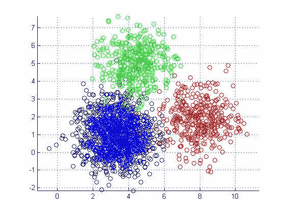
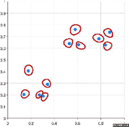
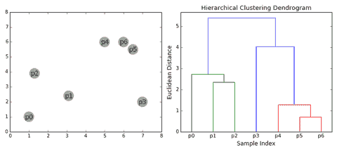
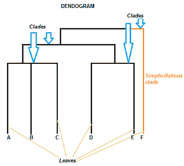
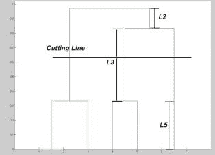
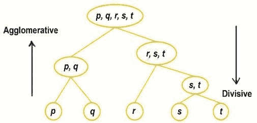
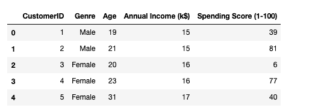
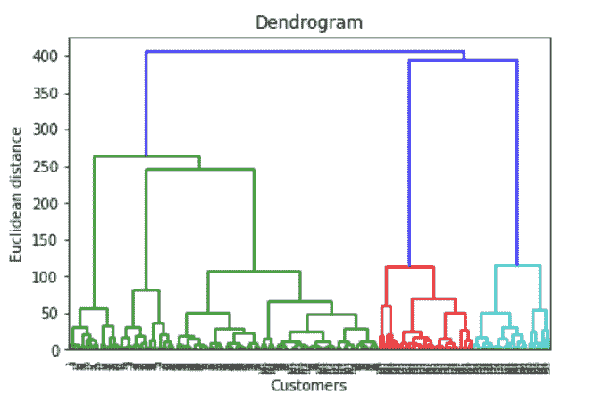
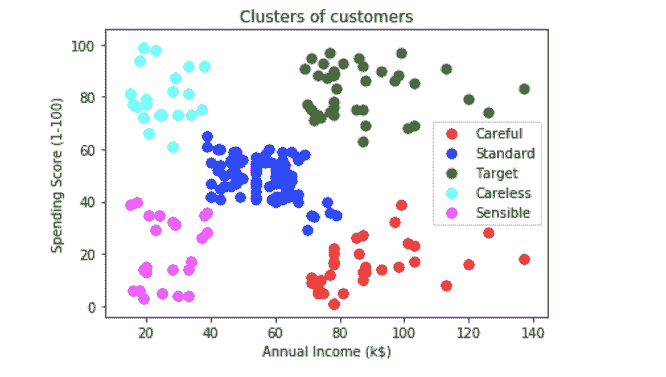

# 什么是层次聚类？

> 原文：[`www.kdnuggets.com/2019/09/hierarchical-clustering.html`](https://www.kdnuggets.com/2019/09/hierarchical-clustering.html)

评论

**什么是聚类？？**

**聚类**是一种将相似对象分组的技术，使得同一组中的对象比其他组中的对象更相似。相似对象的组称为**簇**。



聚类的数据点

* * *

## 我们的前三大课程推荐

 1\. [谷歌网络安全证书](https://www.kdnuggets.com/google-cybersecurity) - 快速进入网络安全职业生涯。

 2\. [谷歌数据分析专业证书](https://www.kdnuggets.com/google-data-analytics) - 提升你的数据分析技能

 3\. [谷歌 IT 支持专业证书](https://www.kdnuggets.com/google-itsupport) - 支持你的组织的 IT 工作

* * *

数据科学家需要了解 5 种流行的聚类算法：

1.  **K-均值聚类**：欲了解更多信息，请点击[这里](https://towardsdatascience.com/introduction-to-image-segmentation-with-k-means-clustering-83fd0a9e2fc3)。

1.  **层次聚类**：我们将在这里详细讨论该算法。

1.  **均值漂移聚类：** 欲了解更多信息，请点击[这里](https://spin.atomicobject.com/2015/05/26/mean-shift-clustering/)。

1.  **基于密度的空间聚类应用于噪声（DBSCAN）：** 欲了解更多信息，请点击[这里](https://en.wikipedia.org/wiki/DBSCAN)。

1.  **期望最大化（EM）聚类使用高斯混合模型（GMM）：** 欲了解更多信息，请点击[这里](https://towardsdatascience.com/gaussian-mixture-models-d13a5e915c8e)。

**层次聚类算法**

也称为**层次聚类分析**或**HCA**，是一种无监督的聚类算法，涉及创建从上到下具有主导顺序的簇。

例如：我们硬盘上的所有文件和文件夹都以层次结构组织。

该算法将相似的对象分组成称为***簇***的组。最终结果是一组簇或组，其中每个簇彼此不同，而每个簇中的对象在广义上彼此相似。

这种聚类技术分为两种类型：

1.  凝聚层次聚类

1.  分裂层次聚类

### **凝聚层次聚类**

凝聚层次聚类是最常见的层次聚类类型，用于根据对象的相似性将对象分组。它也称为 AGNES（凝聚嵌套）。它是一种“[自下而上](https://en.wikipedia.org/wiki/Top-down_and_bottom-up_design)”的方法：***每个观察从自己的簇开始，随着层次的上升，簇对簇被合并。***

**它是如何工作的？**

1.  将每个数据点作为单点簇 → 形成 N 个簇

1.  取两个最接近的数据点并将它们合并成一个簇 → 形成 N-1 个簇

1.  取两个最接近的簇并将它们合并成一个簇 → 形成 N-2 个簇。

1.  重复步骤 3，直到只剩下一个簇。

查看聚合层次聚类的可视化表示以便更好地理解：



[聚合层次聚类](https://gfycat.com/somelonelycaterpillar)

有多种方法可以测量簇之间的距离，以决定聚类的规则，这些方法通常称为链接方法。一些常见的链接方法包括：

+   **完全链接**：两个簇之间的距离定义为两个簇中各点之间的*最长*距离。

+   **单链接**：两个簇之间的距离定义为两个簇中各点之间的*最短*距离。此链接方法可用于检测数据集中可能存在的异常值，因为它们会在最后合并。

+   **平均链接**：两个簇之间的距离定义为一个簇中每个点到另一个簇中每个点的平均距离。

+   **中心点链接**：找到簇 1 和簇 2 的中心点，然后计算它们之间的距离，再进行合并。

选择链接方法完全取决于你，没有一种固定的方法总是能给你带来好的结果。不同的链接方法会导致不同的簇。

做这些的目的在于展示层次聚类的工作原理，它保留了我们如何进行这个过程的记忆，这种记忆存储在**树状图**中。

**什么是树状图？**

树状图是一种显示不同数据集之间层次关系的树形图。

如前所述，树状图包含层次聚类算法的记忆，因此仅通过查看树状图，你可以了解簇是如何形成的。



[树状图](https://giphy.com/explore/dendrogram)

**注意：-**

1.  数据点之间的距离表示不相似性。

1.  块的高度表示簇之间的距离。

从上面的图可以观察到，最初 P5 和 P6 由于彼此之间的距离最小，被合并成一个簇，然后 P4 被合并到同一个簇 (C2)。接着 P1 和 P2 合并成一个簇，然后 P0 被合并到同一个簇 (C4)。现在 P3 被合并到簇 C2，最后这两个簇合并成一个。

**树状图的组成部分**



[图片来源](https://www.statisticshowto.datasciencecentral.com/hierarchical-clustering/)

树状图可以是柱状图（如下面的图片所示）或条形图。一些树状图是圆形的或具有流动形状，但软件通常会生成行或列图。不论形状如何，基本图形包含相同的部分：

+   ***谱系*** 是分支，按照它们的相似度（或差异度）进行排列。相近高度的谱系彼此相似；高度不同的谱系彼此不同 —— **高度差异越大，差异越明显。**

+   每个谱系都有一个或多个***叶子***。

+   叶子 A、B 和 C 彼此之间的相似度高于它们与叶子 D、E 或 F 的相似度。

+   叶子 D 和 E 彼此间的相似度高于它们与叶子 A、B、C 或 F 的相似度。

+   叶子 F 与其他所有叶子有显著不同。

一个谱系理论上可以有无限多的叶子。然而，叶子越多，图形在裸眼下阅读的难度越大。

**到现在为止，可能引起你兴趣的一个问题是如何决定何时停止合并簇？**

你可以在树状图上用水平线进行切割，选择一个高度，在该高度上线可以在上下方向上最大程度地穿越而不交叉合并点。

例如，在下图中，L3 可以在上下方向上最大程度地穿越而不交叉合并点。因此，我们画一条水平线，线与垂直线的交点数就是最佳簇数。



[选择最佳簇数。](https://www.google.com/imgres?imgurl=https%3A%2F%2Fars.els-cdn.com%2Fcontent%2Fimage%2F3-s2.0-B978012811654800004X-f04-03-9780128116548.jpg&imgrefurl=https%3A%2F%2Fwww.sciencedirect.com%2Ftopics%2Fcomputer-science%2Fagglomerative-algorithm&docid=4v7-F4YYs4wofM&tbnid=ZDsxb9kaKxWmWM%3A&vet=12ahUKEwizmMT5vtTkAhWHad4KHXc5ByQ4rAIQMygvMC96BAgBEDE..i&w=314&h=226&bih=691&biw=1440&q=dendrogram%20explained&ved=2ahUKEwizmMT5vtTkAhWHad4KHXc5ByQ4rAIQMygvMC96BAgBEDE&iact=mrc&uact=8)

**此案例中的簇数 = 3。**

### 分裂层次聚类

*分裂* 或 DIANA（DIvisive ANAlysis Clustering）是一种自顶向下的聚类方法，我们将所有观测分配到一个簇中，然后将该簇分割成两个最不相似的簇。最后，我们在每个簇上递归地进行，直到每个观测都有一个簇。所以这种聚类方法正好与凝聚聚类相反。



[图片来源](https://www.researchgate.net/figure/Conceptual-dendrogram-for-agglomerative-and-divisive-Hierarchical-based-clustering-19_fig2_321399805)

有证据表明，在某些情况下，分裂算法比凝聚算法生成的层次结构更准确，但其概念上更复杂。

在聚合层次聚类和分裂层次聚类中，用户需要指定期望的簇数量作为终止条件（何时停止合并）。

### 衡量簇的优劣

好吧，有很多方法可以做到这一点，也许最流行的就是`Dunn's Index`。Dunn's Index 是最小簇间距离与最大簇内直径的比率。簇的直径是其两个最远点之间的距离。为了获得良好的分离和紧凑的簇，你应该追求更高的 Dunn's Index。

现在让我们使用聚合层次聚类算法实现一个用例场景。数据集包含一个特定购物中心的客户详细信息及其消费评分。

你可以从[这里](https://www.kaggle.com/shwetabh123/mall-customers)下载数据集。

让我们从导入 3 个基本库开始：

```py
import numpy as np
import matplotlib.pyplot as plt
import pandas as pd
```

加载数据集：

```py
dataset = pd.read_csv('/.../Mall_Customers.csv')
```



原始数据集

所以我们的目标是根据他们的消费评分对客户进行聚类。

在所有特征中，`CustomerID`和`Genre`是不相关的字段，可以去掉，只保留`Age`和`Annual Income`来创建独立变量矩阵。

```py
X = dataset.iloc[:, [3, 4]].values
```

接下来，我们需要选择簇的数量，为此我们将使用树状图（Dendrograms）。

```py
import scipy.cluster.hierarchy as sch
dendrogrm = sch.dendrogram(sch.linkage(X, method = 'ward'))
plt.title('Dendrogram')
plt.xlabel('Customers')
plt.ylabel('Euclidean distance')
plt.show()
```



正如我们之前讨论的，选择簇的数量时，我们绘制一条水平线，穿过最大上下距离而不与合并点相交的最长线段。因此，我们绘制水平线，它所交叉的垂直线数量就是最优的簇数量。

在这种情况下，是 5。因此，让我们用 5 个簇来拟合我们的聚合模型。

```py
from sklearn.cluster import AgglomerativeClustering
hc = AgglomerativeClustering(n_clusters = 5, affinity = 'euclidean', linkage = 'ward')
y_hc = hc.fit_predict(X)
```

可视化结果。

```py
# Visualising the clusters
plt.scatter(X[y_hc == 0, 0], X[y_hc == 0, 1], s = 50, c = 'red', label = 'Careful')
plt.scatter(X[y_hc == 1, 0], X[y_hc == 1, 1], s = 50, c = 'blue', label = 'Standard')
plt.scatter(X[y_hc == 2, 0], X[y_hc == 2, 1], s = 50, c = 'green', label = 'Target')
plt.scatter(X[y_hc == 3, 0], X[y_hc == 3, 1], s = 50, c = 'cyan', label = 'Careless')
plt.scatter(X[y_hc == 4, 0], X[y_hc == 4, 1], s = 50, c = 'magenta', label = 'Sensible')
plt.title('Clusters of customers')
plt.xlabel('Annual Income (k$)')
plt.ylabel('Spending Score (1-100)')
plt.legend()
plt.show()
```



根据他们的年收入和消费评分对客户进行聚类。

### 结论

层次聚类是一种非常有用的分割方法。它的优势在于不需要预定义簇的数量，这使其相比于 k-Means 更具优势。然而，当我们有大量数据时，它表现不佳。

好了，这篇文章到此为止。希望你们喜欢阅读。请在评论区分享你的想法/评论/疑问。

你可以通过[LinkedIn](https://www.linkedin.com/in/nagesh-singh-chauhan-6936bb13b/?source=post_page---------------------------)联系我，有任何疑问都可以问我。


感谢阅读 !!!

**简介：[Nagesh Singh Chauhan](https://www.linkedin.com/in/nagesh-singh-chauhan-6936bb13b/)** 是 CirrusLabs 的大数据开发人员。他在电信、分析、销售、数据科学等多个领域拥有超过 4 年的工作经验，并在各种大数据组件方面具有专业知识。

[原文](https://medium.com/swlh/what-is-hierarchical-clustering-c04e9972e002)。转载许可。

**相关：**

+   使用卷积神经网络和 OpenCV 预测年龄和性别

+   K-Means 聚类的图像分割简介

+   使用 K-最近邻分类心脏病

### 更多相关内容

+   [揭示隐藏模式：层次聚类简介](https://www.kdnuggets.com/unveiling-hidden-patterns-an-introduction-to-hierarchical-clustering)

+   [聚类解密：理解 K-Means 聚类](https://www.kdnuggets.com/2023/07/clustering-unleashed-understanding-kmeans-clustering.html)

+   [如何在 Pandas 中使用 MultiIndex 进行层次数据组织](https://www.kdnuggets.com/how-to-use-multiindex-for-hierarchical-data-organization-in-pandas)

+   [机器学习中的 DBSCAN 聚类算法](https://www.kdnuggets.com/2020/04/dbscan-clustering-algorithm-machine-learning.html)

+   [什么是 K-Means 聚类及其算法如何工作？](https://www.kdnuggets.com/2023/05/kmeans-clustering-algorithm-work.html)

+   [使用 scikit-learn 进行聚类：无监督学习教程](https://www.kdnuggets.com/2023/05/clustering-scikitlearn-tutorial-unsupervised-learning.html)
