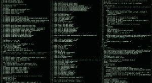

# 维护机器学习系统的高成本

> 原文：[`www.kdnuggets.com/2015/01/high-cost-machine-learning-technical-debt.html`](https://www.kdnuggets.com/2015/01/high-cost-machine-learning-technical-debt.html)

 评论

去年 12 月，一组由 D. Sculley 领导的谷歌研究人员在 NIPS 上发表了一篇立场论文，描述了[维护依赖于机器学习的软件的成本](https://research.google.com/pubs/pub43146.html)。作者利用**技术债务**的概念，建议虽然机器学习提供了快速工程复杂系统的途径，但这种便利性带来了巨大的下游成本。

技术债务是一个比喻，将糟糕的软件设计后果与偿还财务债务联系起来。就像贷款最终必须偿还，并带有复利一样，草率的设计决策也必须通过重构、调试和复杂的测试来弥补。当然，复利的概念在软件开发中的应用更多是诗意的，而不是精确的。在软件开发中，技术债务的比喻通常用来讨论快速交付代码与工程高质量可持续解决方案之间的权衡。必须决定如何权衡现在的速度与未来的开发成本。

尽管将这一概念扩展到机器学习系统是有趣的，但需要注意传统上讨论的技术债务与机器学习应用之间的根本差异。与大多数传统的软件设计决策不同，应用机器学习的决策通常不会明确表达为权衡。**可以通过机器学习解决的问题通常是其他方法无法解决的**。另一方面，正如作者所解释的，考虑到许多不同的算法（即使是微妙的不同），算法性能与所承担的技术债务之间可能存在权衡。不过，最令人担忧的成本似乎在所有机器算法中都是普遍存在的。

**债务的类型**

所有机器学习算法在某种程度上都会承担技术债务，其中之一就是**边界的侵蚀**。作者指出，好的软件设计实践通常是模块化的。模块隔离了相关代码区域，这些代码区域执行明确定义的任务，并将其与其他交互的模块分开。这种代码库的解耦使得可以严格测试代码，并且使得代码库的不同部分可以由不同的人维护。然而，机器学习算法的性能依赖于从外部数据源获取的输入，性能也只能通过外部数据源来评估。这种算法和数据的紧密耦合意味着外部数据的变化通常会改变我们希望算法的行为。在现实世界中，数据获取、预处理和模型调整可能由不同的人管理。这种不舒服的紧密耦合可能很难维护，特别是在面对底层数据源的变化时。

如前所述，这个问题可能是机器学习固有的，可能唯一的选择是接受这种债务或完全放弃任务。相比之下，作者称之为**纠缠**的问题可能实际上可以通过设计决策来解决。这指的是模型对所有特征的依赖。特征的突然丧失、新特征的引入或特征值的扰动可能会使整个模型失效。D. Sculley 等人将这种现象称为**改变任何东西就会改变一切**。他们引用了几篇其他论文，提供了减少纠缠的策略，包括一种使用集成学习的方法。

几种其他策略虽然未被讨论，但似乎也很合适。缺失数据的问题通过贝叶斯网络得到优雅的处理。去噪自动编码器和其他降维/矩阵分解技术也提供了处理缺失数据的策略。关于特征空间的持续和渐进增长，John Langford 在 Vowpal Rabbit 中实现的哈希方法似乎适合于缓解这个问题。

论文中讨论的最有趣的观点之一是算法与外部世界之间形成的反馈回路。基于点击数据（而点击数据本身又依赖于显示的链接）进行调整的搜索引擎就是一个明确的例子。似乎从任何基于机器学习的推荐系统中获取的用户数据可能都会受到类似的动态影响。例如，Pandora 可能会试图确定用户的偏好，但获得的反馈高度依赖于推荐的歌曲。

从抽象的角度来看，这些反馈循环可能类似于社交网络和网页搜索中的过滤气泡。**过滤气泡**描述了这样一种现象：人们只看到与自己观点一致的视图和帖子，很少遇到异议，因此被困在意识形态泡沫中，无法与对立观点互动。

最后，作者集中讨论了数据科学家通常生成的代码所带来的问题。与前面的例子不同，这些情况确实符合传统的技术债务概念。其中一个问题是**死实验代码路径**，指的是为实验设计但却投入生产的代码。这类代码通常实现了许多不同的实验，变体由条件语句控制。任何细微的更改或意外导致选择不同的实验分支都可能造成灾难性的后果，而不会表现出任何容易检测的软件错误（编译时或运行时错误）。作者提到，这种错误是 Knight Capital 公司交易算法失控的原因。

Sculley 等人描述的一个最终软件权衡是**胶水代码**的问题。当发布机器学习代码时，高级机器学习算法通常在提供通用解决方案的包中实现。因此，工程师通常编写由这些包构建的胶水代码。胶水代码可能处理数据、设置超参数的值、选择合适的算法、报告结果等。与所有对外部库的依赖一样，这也带来了对基础库任何变更的持续脆弱性。作者建议，构建实时系统的工程师应认真考虑在更广泛的系统架构中重新实现机器学习算法。

本文具有一篇优秀的挑衅性操作系统论文的风格。作者坦率地表达了观点，读者能够感受到作者在这些问题上经历了许多挫折。通常，机器学习方法的系统实现和持续软件维护挑战是一个未被充分研究的领域，随着机器学习系统在商业和开源软件中的普及，这个领域将继续增长。本文描述了问题的高层次分类，类似于 Butler Lampson 在其**保护**论文中尝试统一安全讨论的方式。未来希望看到更多描述大型组织在部署主要机器学习系统时遇到的具体软件工程和持续维护挑战的论文。

 **[扎克里·蔡斯·利普顿](http://zacklipton.com)** 是加州大学圣地亚哥分校计算机科学工程系的博士生。由[生物医学信息学部](http://healthsciences.ucsd.edu/som/medicine/divisions/dbmi/pages/default.aspx)资助，他对机器学习的理论基础和应用都很感兴趣。除了在 UCSD 的工作外，他还曾在微软研究院实习。

**相关：**

+   IBM Watson Analytics 与微软 Azure 机器学习（第一部分）

+   差分隐私：如何让隐私和数据挖掘兼容

+   Geoff Hinton AMA：神经网络、大脑与机器学习

* * *

## 我们的前三名课程推荐

 1\. [谷歌网络安全证书](https://www.kdnuggets.com/google-cybersecurity) - 快速进入网络安全职业生涯的捷径。

 2\. [谷歌数据分析专业证书](https://www.kdnuggets.com/google-data-analytics) - 提升你的数据分析技能

 3\. [谷歌 IT 支持专业证书](https://www.kdnuggets.com/google-itsupport) - 支持你的组织在 IT 方面

* * *

### 更多相关内容

+   [你应该了解的 5 个关于梯度下降和成本函数的概念](https://www.kdnuggets.com/2020/05/5-concepts-gradient-descent-cost-function.html)

+   [HuggingChat Python API：你的零成本替代方案](https://www.kdnuggets.com/2023/05/huggingchat-python-api-alternative.html)

+   [学术界是否过于关注方法论而忽视真正的洞见？](https://www.kdnuggets.com/is-academia-obsessing-over-methodology-at-the-cost-of-true-insights)

+   [数据科学家的高薪副业](https://www.kdnuggets.com/2022/01/high-paying-side-hustles-data-scientists.html)

+   [人工智能人员管理：构建高速增长的人工智能团队](https://www.kdnuggets.com/2022/03/people-management-ai-building-highvelocity-ai-teams.html)

+   [7 个高薪的数据科学副业](https://www.kdnuggets.com/7-high-paying-side-hustles-for-data-scientists)
