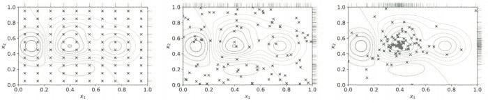
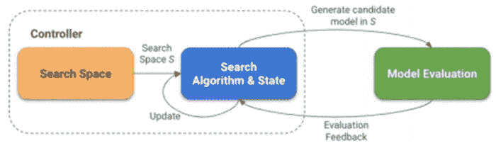
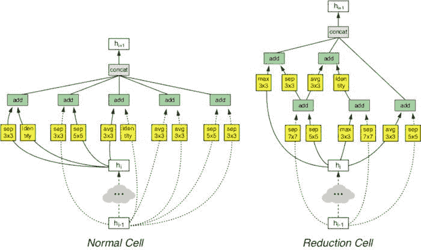
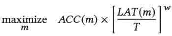
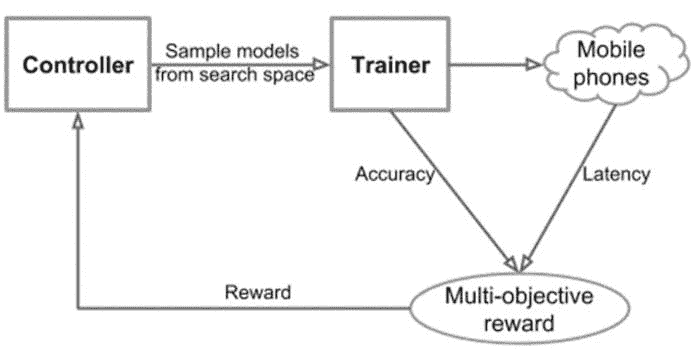
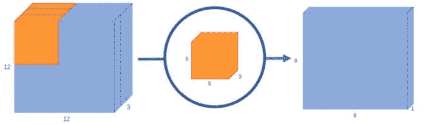
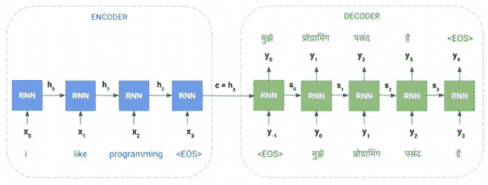
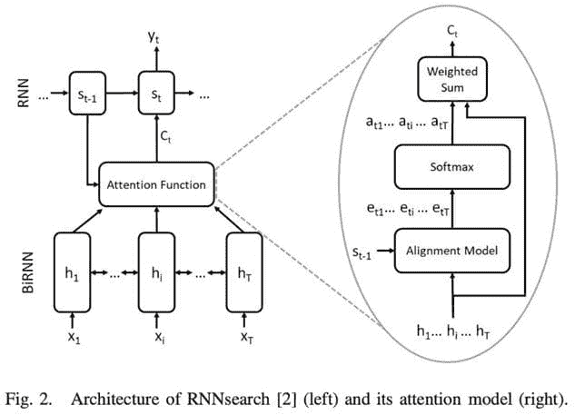
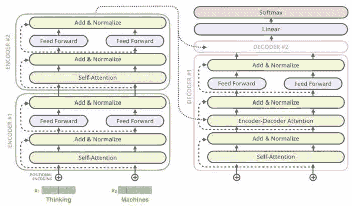

# 高性能深度学习：如何训练更小、更快、更好的模型 – 第四部分

> 原文：[`www.kdnuggets.com/2021/07/high-performance-deep-learning-part4.html`](https://www.kdnuggets.com/2021/07/high-performance-deep-learning-part4.html)

评论

在之前的部分（[第一部分](https://www.kdnuggets.com/2021/06/efficiency-deep-learning-part1.html)，[第二部分](https://www.kdnuggets.com/2021/06/high-performance-deep-learning-part2.html)，[第三部分](https://www.kdnuggets.com/2021/07/high-performance-deep-learning-part3.html)），我们讨论了为什么效率对深度学习模型实现高性能模型和帕累托最优模型至关重要，以及深度学习中效率的关注领域。我们还涵盖了两个关注领域（压缩技术和学习技术）。让我们继续花更多时间讨论其他关注领域。您也可以阅读我们的[深度学习效率调研论文](https://arxiv.org/abs/2106.08962)。

### 自动化

另一种努力方向是将部分效率的手动工作委托给自动化。如果我们让自动化帮助进行网络设计和调整，它将减少人类的参与以及随之而来的偏见。然而，这种权衡是计算成本的增加。

**超参数优化（HPO）**：这一类别下常用的方法之一是**超参数优化（HPO）** [1]。我们知道，调整如初始学习率、权重衰减等超参数对于更快的收敛至关重要 [2]。还可以有决定网络结构的参数，如全连接层的数量、卷积层中的滤波器数量等。

虽然我们可以通过实验建立直觉，但找到最佳超参数值需要手动搜索以优化给定的目标函数（通常是验证集上的损失值）的确切值。

如果用户对要调整的超参数有先验经验，可以使用的简单自动化超参数优化算法是网格搜索（也称为参数扫描）。在这种情况下，我们根据用户提供的每个超参数的有效范围，搜索所有不同且有效的超参数组合。例如，如果学习率（lr）的可能值为{0.01, 0.05}，权重衰减（decay）的可能值为{0.1, 0.2}，则会有 4 种可能的组合{lr=0.01, decay=0.1}，{lr=0.01, decay=0.2}，{lr=0.05, decay=0.1}和{lr=0.05, decay=0.2}。

上述每种组合都是一个*试验*，每个试验可以并行运行。所有试验完成后，将找到超参数的最佳组合。由于这种方法尝试所有可能的组合，因此总试验数量增长非常快，因此遭遇了维度灾难 [3]。

另一种方法是随机搜索 [4]，其中试验是从搜索空间中随机抽样的，搜索空间是使用用户提供的可能值的范围构建的。类似于网格搜索，每个试验仍然是独立并行运行的。然而，随机搜索易于根据可用的计算能力进行扩展，因为试验是独立同分布的（iid），因此找到最佳试验的可能性随着试验数量的增加而增加。这允许在到目前为止的最佳试验足够好时预先终止搜索。还有类似于随机搜索的方法，如 Successive Halving (SHA) [5] 和 HyperBand [6]，但它们将更多资源分配给表现良好的试验。

*网格搜索、随机搜索和贝叶斯优化。[来源](https://en.wikipedia.org/w/index.php?title=Hyperparameter_optimization)*

基于贝叶斯优化（BO）的搜索 [7] 是一种更复杂的方法，它保持一个单独的模型来预测给定试验是否可能改进到目前为止找到的最佳试验。该模型基于过去试验的表现来预测这种可能性。BO 相对于随机搜索的改进在于搜索是有指导的，而不是随机的。因此，达到最优解所需的试验更少。由于试验的选择依赖于过去试验的结果，因此这种方法是顺序的。然而，可以基于相同的估计同时生成多个试验，这可能会导致比纯顺序 BO 更快的收敛，但代价是某些试验可能会浪费。

在实际应用方面，HPO 可供用户在几个软件工具包中使用，这些工具包集成了算法本身以及易于使用的界面（UI 用于指定超参数及其范围），包括 Vizier [8]（一个内部的 Google 工具，也可以通过 Google Cloud 进行黑箱调优）。亚马逊提供了 Sagemaker [9]，功能类似，也可以作为 AWS 服务访问。NNI [10]、Tune [11] 和 Advisor [12] 是其他可以本地使用的开源 HPO 软件包。这些工具包还提供了对未有前景的试验进行早期停止的选项。Vizier 使用中位数停止规则，如果某个试验在时间步* t* 的表现低于到目前为止所有试验的中位数表现，则终止该试验。

**神经架构搜索 (NAS)**：我们可以把 NAS 看作是超参数优化 (HPO) 的扩展，目标是寻找改变网络架构本身的参数。NAS 可以被认为包括以下几个部分：

1.  *搜索空间*：这些是图中允许的神经网络操作（卷积 (1×1, 3×3, 5×5)、全连接、池化等），以及它们之间的连接方式。这由用户提供。

1.  *搜索算法与状态*：这是控制架构搜索本身的算法。通常适用于 HPO 的标准算法（网格搜索、随机搜索、贝叶斯优化、进化算法）也可以用于 NAS，同时也包括强化学习 (RL) [13] 和梯度下降 [14]。

1.  *评估策略*：这定义了我们用来评估模型 *适应度* 的指标。它可以是简单的传统指标，如验证损失、准确率等。也可以是复合指标，例如 MNasNet [15] 中创建的基于准确性和模型延迟的自定义单一指标。

*神经架构搜索：控制器负责基于搜索空间和从模型评估中收到的反馈生成候选模型。*

搜索算法与搜索空间和状态可以视为一个‘控制器’，它生成样本候选网络。评估阶段训练和评估生成的候选网络的适应度。这个适应度值然后作为反馈传递给搜索算法，后者会用它来生成更好的候选网络。

Zoph 等人 2016 年的论文 [13] 演示了可以使用强化学习生成端到端的神经网络架构。在这种情况下，控制器本身是一个递归神经网络 (RNN)，它逐层生成前馈网络的架构超参数，如滤波器数量、步幅、滤波器大小等。然而，训练控制器本身的代价很高（需要 22,400 个 GPU 小时 [16]），因为整个候选网络必须从头开始训练才能进行一次梯度更新。在后续的论文 [16] 中，作者将搜索空间细化为搜索 *单元*：一种“正常单元”接收输入，处理后返回相同空间维度的输出。而“缩减单元”处理其输入，返回的输出空间维度缩小了 2 倍。每个单元是 ???? 块的组合。控制器的 RNN 一次生成一个块，它选择过去两个块的输出、应用于它们的操作以及如何将它们组合成一个输出。正常单元和缩减单元交替堆叠（???? 个正常单元后跟 1 个缩减单元，其中 ???? 是可调的）以构建一个用于 CIFAR-10 和 ImageNet 的端到端网络。

与 [13] 中的端到端网络搜索相比，单独学习这些单元似乎将搜索时间提高了 7 倍，同时在当时击败了 CIFAR-10 中的最新技术。

*普通和缩减单元。来源：[16]*

其他方法如进化技术 [17]、可微分架构搜索 [14]、渐进搜索 [18]、参数共享 [19] 等，试图降低架构搜索的成本（在某些情况下，将计算成本降低到几天 GPU 而不是几千天 GPU）。这些方法在 [20] 中有详细介绍。

在评估候选网络时，也可以关注不仅仅是质量，还包括模型大小、延迟等足迹指标。架构搜索可以帮助进行多目标搜索以优化两者。例如，MNasNet [15] 直接将模型在目标移动设备上的延迟纳入目标函数，如下所示：

*MNasNet 中的多目标奖励函数。*

*生成 MNASNet 中的候选模型，同时优化移动设备上的延迟。来源：[15]*

其中 ???? 是候选模型， ???????????? 是准确性指标，???????????? 是所给模型在目标设备上的延迟。 ???? 是目标延迟。建议 ???? 为 −0.07。

总体而言，自动化在模型效率中扮演了关键角色。HPO 现在是训练模型中的自然步骤，可以在最小化人工干预的同时提取显著的质量改进。HPO 也可以在独立的软件库中使用，或者通过云服务获取。类似地，最近的神经架构搜索（NAS）进展也使得在对质量和足迹都有约束的情况下以学习的方式构建架构成为可能。假设 NAS 运行所需的计算量为几百小时的 GPU，且领先云计算服务的成本约为每小时 $3 GPU，这使得使用 NAS 方法在财务上是可行的，并且与优化多个目标时手动实验模型架构的成本不同。

### 高效架构（模型与层）

另一个常见的主题是重新设计比基线更好的高效层和模型，这些模型可以用于特定任务或作为通用黑箱。在本节中，我们展示了一些这样的高效层和模型的示例，以说明这一思想。

**视觉：** 视觉领域中一个经典的高效层例子是卷积层的使用，它相对于全连接（FC）层在视觉模型中有所改进。FC 层存在两个主要问题：

（1）FC 层忽略输入像素的空间信息。从直观上讲，仅通过查看单个像素值很难建立对给定输入的理解。它们还忽略了附近区域的空间局部性。

（2）使用 FC 层还会导致参数数量的爆炸，尤其是在处理中等大小的输入时。一个 100 × 100 的 RGB 图像有 3 个通道，会导致第一层中的每个神经元有 3 × 10⁴个连接。这也使得网络容易过拟合。

卷积层通过学习滤波器来避免这个问题，每个滤波器是一个固定大小的 3D 权重矩阵（3x3, 5x5 等），第三维度与输入的通道数相同。每个滤波器在输入上进行卷积，以生成该滤波器的*特征图*。每个滤波器可以学习检测诸如边缘（水平、垂直、对角线等）之类的特征，从而在特征图中该特征存在的地方值更高。单个卷积层的特征图可以从图像中提取有意义的信息。叠加在上面的卷积层将使用前一层生成的特征图作为输入，逐步学习更复杂的特征（特征图中的每个像素是从图像的逐渐更大部分生成的，随着层的叠加，*感受野*也会增加）。

*二维输入（蓝色）上的卷积操作的示意图，使用了 2x2 的滤波器（绿色）。[来源](https://github.com/vdumoulin/conv_arithmetic)。*

*卷积操作的 3D 可视化。[来源](https://towardsdatascience.com/a-basic-introduction-to-separable-convolutions-b99ec3102728)*

卷积层高效性的核心思想是相同的滤波器在图像的任何位置上使用，无论滤波器应用于何处，从而实现空间不变性，同时共享参数。回到一个 100×100 RGB 图像的例子，它有 3 个通道，一个 5 × 5 的滤波器将意味着总共 75（5 × 5 × 3）个参数。每一层可以学习多个独特的滤波器，并且仍然在非常合理的参数预算范围内。这也具有正则化效果，即显著减少的参数数量使得优化更容易，泛化更好。

**深度可分离卷积层**：在卷积操作中，每个滤波器用于在两个空间维度和第三个通道维度上进行卷积。因此，每个滤波器的大小是 s[x] x s[y] x input_channels，其中 s[x]和 s[y]通常相等。这是对每个滤波器执行的，使得卷积操作在* x *和* y *维度上空间上进行，并在 z 维度上进行深度卷积。

深度可分离卷积将其分解为两个步骤：

1.  使用 `1 x 1` 的滤波器进行逐点卷积，使得结果特征图的深度现在具有输出通道数。

1.  在 x 和 y 维度上使用 `s[x] x s[y]` 的滤波器进行空间卷积。

将这两个操作叠加在一起（没有任何中间的非线性激活）会得到与常规卷积相同形状的输出，但参数显著更少（`1 x 1 x input_channels x output_channels + s[x] x s[y] x output_channels`，相比常规卷积的 `s[x] x s[y] x input_channels x output_channels`）。同样，计算量也减少了一个数量级，因为逐点卷积在每个输入通道深度上卷积要便宜得多（更多计算见 [这里](https://www.geeksforgeeks.org/depth-wise-separable-convolutional-neural-networks/) 和 [这里](https://arxiv.org/pdf/1704.04861.pdf)）。 Xception 模型架构 [21] 展示了在 Inception 架构中使用深度可分离卷积，从而在步骤上更早收敛，并在 ImageNet 数据集上获得更高的准确性，同时保持参数数量不变。

针对移动和嵌入式设备设计的 MobileNet 模型架构 [22]，也使用深度可分离层而非常规卷积层。这有助于将参数数量以及乘加操作的数量减少 7-10 倍，并允许在移动设备上部署计算机视觉任务。用户可以根据模型预期 10-100 毫秒的延迟。MobileNet 还通过深度乘数提供一个旋钮，用于调整网络规模，从而让用户在准确性和延迟之间做出权衡。

**注意机制**：在自然语言领域，我们也见证了快速进展。对于序列到序列模型，持久的问题是信息瓶颈。这些模型通常有一个编码器层，它对输入序列进行编码，以及一个解码序列，对应生成另一个序列。例如，机器翻译任务中，输入序列是源语言的句子，输出序列是目标语言的句子。

传统上，使用 RNN 在编码器和解码器中完成这项工作。然而，第一个解码器层只能看到最终编码器步骤的隐藏状态。这是一个“瓶颈”，因为第一个解码器步骤必须从最终隐藏状态中提取所有信息。

*机器翻译任务中从英语到印地语的解码器信息瓶颈。*

注意力机制在 Bahdanau 等人[23]中被引入，允许解码器能够看到所有的编码器状态。这是一种突出输入序列相关部分并将输入序列压缩为*上下文向量*的方法，基于序列与另一个向量（称为查询向量）的相似性。在像机器翻译这样的序列到序列任务中，这使得可以根据所有编码器状态（表示为键和值）和解码器的先前隐藏状态（查询向量）来调整输入到解码器。上下文向量是基于解码器的先前隐藏状态对编码器状态的加权和。由于注意力机制生成了编码器状态的加权和，这些权重也可以用于可视化网络的行为。

*注意力在解码器中的使用。 [来源](https://arxiv.org/pdf/1902.02181.pdf#:~:text=The%20attention%20mechanism%20is%20a,to%20its%20higher%20level%20representation.)*

**Transformer 及其朋友**：Transformer 架构[24]在 2017 年提出，首次引入了对解码器和编码器都使用注意力机制。在编码器中，他们使用自注意力机制，其中键、值和查询向量都来源于先前的编码器层。Transformer 网络的训练成本比当时的可比替代方案低两个数量级。

*Transformer 架构。 [来源](https://jalammar.github.io/illustrated-transformer/)*

另一个核心思想是自注意力机制允许对输入序列中标记之间的关系进行并行化处理。RNNs 本质上要求逐步处理。例如，在 RNN 中，一个标记的上下文可能在整个序列处理完之前无法完全理解。而有了注意力机制，所有标记可以一起处理，并且可以学习成对的关系。这使得利用优化训练设备如 GPU 和 TPU 变得更加容易。

如第三部分介绍的那样，BERT 模型架构[25]在多个自然语言理解基准测试中超越了当时的最先进技术。BERT 是一个堆叠的 Transformer 编码器层，通过双向掩蔽语言模型训练目标进行预训练。它也可以作为一个通用编码器，然后用于其他任务。其他类似的模型，如 GPT 家族[26]，也被用于解决许多自然语言理解任务。

### 参考文献

[1] Tong Yu 和 Hong Zhu. 2020\. 超参数优化：算法和应用的回顾。arXiv 预印本 arXiv:2003.05689 (2020)。

[2] Jeremy Jordan. 2020\. 设定神经网络的学习率。Jeremy Jordan (2020 年 8 月)。 [`www.jeremyjordan.me/nn-learning-rate`](https://www.jeremyjordan.me/nn-learning-rate)

[3] [`en.wikipedia.org/wiki/Curse_of_dimensionality`](https://en.wikipedia.org/wiki/Curse_of_dimensionality)

[4] James Bergstra 和 Yoshua Bengio. 2012\. 随机搜索超参数优化。机器学习研究杂志 13, 2 (2012)。

[5] Kevin Jamieson 和 Ameet Talwalkar. 2016\. 非随机最优臂识别与超参数优化。见于人工智能与统计。PMLR, 240–248。

[6] Lisha Li, Kevin Jamieson, Giulia DeSalvo, Afshin Rostamizadeh 和 Ameet Talwalkar. 2017\. Hyperband：一种新型基于赌博的超参数优化方法。机器学习研究杂志 18, 1 (2017), 6765–6816。

[7] Apoorv Agnihotri 和 Nipun Batra. 2020\. 探索贝叶斯优化。Distill 5, 5 (2020), e26。

[8] Daniel Golovin, Benjamin Solnik, Subhodeep Moitra, Greg Kochanski, John Karro 和 D Sculley. 2017\. Google Vizier：一个黑箱优化服务。见于第 23 届 ACM SIGKDD 国际知识发现与数据挖掘会议论文集。1487–1495。

[9] Valerio Perrone, Huibin Shen, Aida Zolic, Iaroslav Shcherbatyi, Amr Ahmed, Tanya Bansal, Michele Donini, Fela Winkelmolen, Rodolphe Jenatton, Jean Baptiste Faddoul 等. 2020\. 亚马逊 SageMaker 自动模型调优：可扩展的黑箱优化。arXiv 预印本 arXiv:2012.08489 (2020)。

[10] 微软研究院. 2019\. 神经网络智能 - 微软研究院。https://www.microsoft.com/enus/research/project/neural-network-intelligence [在线; 访问日期：2021 年 6 月 3 日]。

[11] Richard Liaw, Eric Liang, Robert Nishihara, Philipp Moritz, Joseph E Gonzalez 和 Ion Stoica. 2018\. Tune：一个用于分布式模型选择和训练的研究平台。arXiv 预印本 arXiv:1807.05118 (2018)。

[12] Dihao Chen. 2021\. advisor. https://github.com/tobegit3hub/advisor [在线; 访问日期：2021 年 6 月 3 日]。

[13] Barret Zoph 和 Quoc V Le. 2016\. 通过强化学习进行神经网络架构搜索。arXiv 预印本 arXiv:1611.01578 (2016)。

[14] Hanxiao Liu, Karen Simonyan 和 Yiming Yang. 2018\. Darts：可微分架构搜索。arXiv 预印本 arXiv:1806.09055 (2018)。

[15] Mingxing Tan, Bo Chen, Ruoming Pang, Vijay Vasudevan, Mark Sandler, Andrew Howard 和 Quoc V Le. 2019\. Mnasnet：面向平台的移动神经网络架构搜索。见于 IEEE/CVF 计算机视觉与模式识别会议论文集。2820–2828。

[16] Barret Zoph, Vijay Vasudevan, Jonathon Shlens 和 Quoc V Le. 2018\. 学习可转移的架构以实现可扩展的图像识别。见于 IEEE 计算机视觉与模式识别会议论文集。8697–8710。

[17] Esteban Real, Alok Aggarwal, Yanping Huang 和 Quoc V Le. 2019\. 用于图像分类器架构搜索的正则化进化。见于 AAAI 人工智能会议论文集，第 33 卷。4780–4789。

[18] Chenxi Liu, Barret Zoph, Maxim Neumann, Jonathon Shlens, Wei Hua, Li-Jia Li, Li Fei-Fei, Alan Yuille, Jonathan Huang, 和 Kevin Murphy. 2018\. 进阶神经架构搜索。欧洲计算机视觉会议 (ECCV) 论文集。19–34。

[19] Hieu Pham, Melody Guan, Barret Zoph, Quoc Le, 和 Jeff Dean. 2018\. 通过参数共享进行高效神经架构搜索。国际机器学习会议。PMLR, 4095–4104。

[20] Thomas Elsken, Jan Hendrik Metzen, Frank Hutter 等. 2019\. 神经架构搜索：综述。J. Mach. Learn. Res. 20, 55 (2019), 1–21。

[21] François Chollet. 2017\. Xception：深度学习与深度可分离卷积。IEEE 计算机视觉与模式识别会议论文集。1251–1258

[22] Mark Sandler, Andrew Howard, Menglong Zhu, Andrey Zhmoginov, 和 Liang-Chieh Chen. 2018\. Mobilenetv2：倒置残差和线性瓶颈。IEEE 计算机视觉与模式识别会议论文集。4510–4520。

[23] Dzmitry Bahdanau, Kyunghyun Cho, 和 Yoshua Bengio. 2014\. 通过联合学习对齐和翻译进行神经机器翻译。arXiv 预印本 arXiv:1409.0473 (2014)。

[24] Ashish Vaswani, Noam Shazeer, Niki Parmar, Jakob Uszkoreit, Llion Jones, Aidan N Gomez, Lukasz Kaiser, 和 Illia Polosukhin. 2017\. 注意力机制就是你需要的全部。arXiv 预印本 arXiv:1706.03762 (2017)。

[25] Jacob Devlin, Ming-Wei Chang, Kenton Lee, 和 Kristina Toutanova. 2018\. Bert：用于语言理解的深度双向变换器预训练。arXiv 预印本 arXiv:1810.04805 (2018)。

[26] Tom B Brown, Benjamin Mann, Nick Ryder, Melanie Subbiah, Jared Kaplan, Prafulla Dhariwal, Arvind Neelakantan, Pranav Shyam, Girish Sastry, Amanda Askell 等. 2020\. 语言模型是少样本学习者。arXiv 预印本 arXiv:2005.14165 (2020)。

**相关：**

+   [自动化机器学习模型优化](https://www.kdnuggets.com/2021/03/automating-machine-learning-model-optimization.html)

+   [高级超参数优化/调优算法](https://www.kdnuggets.com/2020/11/algorithms-for-advanced-hyper-parameter-optimization-tuning.html)

+   [深度学习中的注意力机制详解](https://www.kdnuggets.com/2021/01/attention-mechanism-deep-learning-explained.html)

* * *

## 我们的前三推荐课程

 1\. [谷歌网络安全证书](https://www.kdnuggets.com/google-cybersecurity) - 快速进入网络安全职业道路。

 2\. [谷歌数据分析专业证书](https://www.kdnuggets.com/google-data-analytics) - 提升你的数据分析能力

 3\. [谷歌 IT 支持专业证书](https://www.kdnuggets.com/google-itsupport) - 支持你所在组织的 IT 需求

* * *

### 更多相关话题

+   [7 种 ChatGPT 让你编写代码更快更好的方法](https://www.kdnuggets.com/2023/06/7-ways-chatgpt-makes-code-better-faster.html)

+   [oBERT: 复合稀疏化为 NLP 提供更快更准确的模型](https://www.kdnuggets.com/2022/05/obert-compound-sparsification-delivers-faster-accurate-models-nlp.html)

+   [如何从头开始构建和训练一个 Transformer 模型……](https://www.kdnuggets.com/how-to-build-and-train-a-transformer-model-from-scratch-with-hugging-face-transformers)

+   [通过参加竞赛将机器学习速度提高 4 倍](https://www.kdnuggets.com/2022/01/learn-machine-learning-4x-faster-participating-competitions.html)

+   [为什么我们总是需要人类来训练 AI——有时是在实时](https://www.kdnuggets.com/2021/12/why-we-need-humans-training-ai.html)

+   [使用 Tensorflow 训练图像分类模型指南](https://www.kdnuggets.com/2022/12/guide-train-image-classification-model-tensorflow.html)
