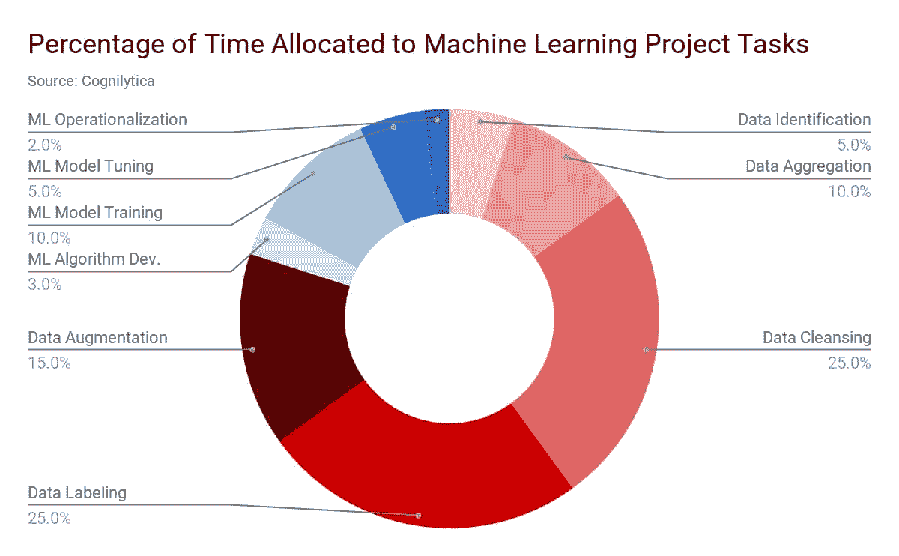

# 大规模高质量 AI 和机器学习数据标注：简要研究报告

> 原文：[`www.kdnuggets.com/2019/07/high-quality-ai-machine-learning-data-labeling-research-report.html`](https://www.kdnuggets.com/2019/07/high-quality-ai-machine-learning-data-labeling-research-report.html)

赞助文章。

**作者：Damian Rochman，CloudFactory 产品和平台战略副总裁**

* * *

## 我们的三大课程推荐

 1\. [谷歌网络安全证书](https://www.kdnuggets.com/google-cybersecurity) - 快速进入网络安全职业生涯。

 2\. [谷歌数据分析专业证书](https://www.kdnuggets.com/google-data-analytics) - 提升您的数据分析能力

 3\. [谷歌 IT 支持专业证书](https://www.kdnuggets.com/google-itsupport) - 支持您的组织进行 IT 管理

* * *

在各行各业，工程师和科学家正在争分夺秒地准备大量数据，以推动 AI 和机器学习（ML）的进步。分析公司 Cognilytica 估计，[80%的机器学习项目时间](https://www.cognilytica.com/2019/04/19/infographic-data-prep-and-labeling/)用于汇总、清理、标注和增强机器学习模型数据。而仅有 20%的 ML 项目时间用于算法开发、模型训练和调整，以及 ML 的操作化。

**主要数据标注挑战**

尽管创新似乎无边无际，但团队面临的困境在于，准备好的数据很难获得。这个问题有两个成熟的考虑因素：

1.  高质量的数据标注可以带来更好的模型性能，但当数据标注质量低时，机器学习模型则难以学习。

1.  最好将顶尖和高薪人才如数据科学家和机器学习工程师部署在需要深厚专业知识、协作和分析技能的任务上。

**十亿美金的问题**

那么，创新的机器学习团队是如何准备数据，以确保其质量、准备成本以及交付速度的呢？

**关键要点：比较机器学习数据标注员**

越来越多的组织正在使用*这四种选择*中的一种或多种来为机器学习项目寻找数据标注员。每种选择都有其优点和挑战，这取决于项目需求，但对大多数组织来说，理解这些权衡有助于为明确的战略数据标注路线图铺平道路。

[阅读全文](https://www.cloudfactory.com/white-papers/scaling-quality-training-data?utm_source=kdnuggets&utm_medium=sponsoredarticle&utm_campaign=sqtdjuly2019&utm_content=Scaling%20Quality%20Training%20Data%20Optimize%20Your%20Workforce%20and%20Avoid%20the%20Cost%20of%20the%20Crowd)

**标注团队采购时需提出的关键问题**

阅读[完整研究](https://www.cloudfactory.com/white-papers/scaling-quality-training-data?utm_source=kdnuggets&utm_medium=sponsoredarticle&utm_campaign=sqtdjuly2019&utm_content=Scaling%20Quality%20Training%20Data%20Optimize%20Your%20Workforce%20and%20Avoid%20the%20Cost%20of%20the%20Crowd)仅需 10-15 分钟，但如果你没有时间，我们强烈建议你在比较数据标注劳动力选项时向潜在的劳动力供应商提出这些问题：

+   规模 – 根据需求，你的标注团队能否增加或减少为我们做的任务数量？

+   质量 – 你能提供有关工作质量和工人生产力的可见性吗？

+   [获取完整问题列表的研究](https://www.cloudfactory.com/white-papers/scaling-quality-training-data?utm_source=kdnuggets&utm_medium=sponsoredarticle&utm_campaign=sqtdjuly2019&utm_content=Scaling%20Quality%20Training%20Data%20Optimize%20Your%20Workforce%20and%20Avoid%20the%20Cost%20of%20the%20Crowd)

[阅读全文](https://www.cloudfactory.com/white-papers/scaling-quality-training-data?utm_source=kdnuggets&utm_medium=sponsoredarticle&utm_campaign=sqtdjuly2019&utm_content=Scaling%20Quality%20Training%20Data%20Optimize%20Your%20Workforce%20and%20Avoid%20the%20Cost%20of%20the%20Crowd)

### 更多相关话题

+   [机器学习的数据标注：市场概况、方法和工具](https://www.kdnuggets.com/2021/12/data-labeling-ml-overview-and-tools.html)

+   [我如何使用 Grounding DINO 进行自动图像标注](https://www.kdnuggets.com/2023/05/automatic-image-labeling-grounding-dino.html)

+   [KDnuggets 新闻，4 月 27 日：论文与代码简介；…](https://www.kdnuggets.com/2022/n17.html)

+   [了解数据隐私，学习实施技术隐私解决方案……](https://www.kdnuggets.com/2022/04/manning-data-privacy-learn-implement-technical-privacy-solutions-tools-scale.html)

+   [论文与代码简介](https://www.kdnuggets.com/2022/04/brief-introduction-papers-code.html)

+   [卡尔曼滤波器简介](https://www.kdnuggets.com/2022/12/brief-introduction-kalman-filters.html)
