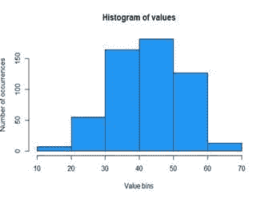
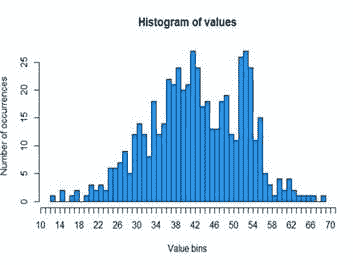
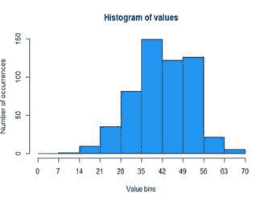
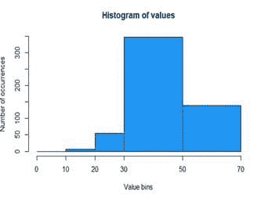
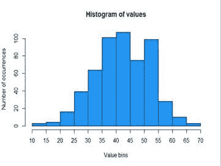
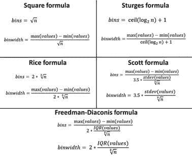

# 直方图 202：更好的数据科学技巧与窍门

> 原文：[`www.kdnuggets.com/2018/02/histogram-tips-tricks.html`](https://www.kdnuggets.com/2018/02/histogram-tips-tricks.html)

 评论

**作者：[Norbert Obsuszt](https://www.linkedin.com/in/obsusztnorbert/)，AnswerMiner。**

与其他总结方法相比，直方图具有最丰富的描述能力，同时也是解释数据最快的方式——人脑更喜欢视觉感知。然而，如果不小心，观众可能无法理解你的直方图，或者你可能无法充分利用它。特别重要的是要指定最佳的分箱大小。

* * *

## 我们的前三个课程推荐

 1\. [Google 网络安全证书](https://www.kdnuggets.com/google-cybersecurity) - 快速进入网络安全职业

 2\. [Google 数据分析专业证书](https://www.kdnuggets.com/google-data-analytics) - 提升你的数据分析技能

 3\. [Google IT 支持专业证书](https://www.kdnuggets.com/google-itsupport) - 支持你所在组织的 IT

* * *

**为什么选择直方图？**

如果你有一组数据值，你可能想要与老板或同事分享这些信息，以便基于这些数据中的信息建立更好的业务。这些数据值可能是以下任何一种：

+   客户年龄

+   月度收入

+   访客在你的网站上停留的时间

+   经销商销售的汽车数量

你应该以简洁的方式分享信息，因为没人愿意逐一阅读数字值。

**替代方案是错误的**

假设你有一组数字：1、23、24、25、25、25、26、27、30、32、999

**均值**（112.45）对离群值非常敏感。几乎所有实际数据都有离群值，因此均值可能非常误导。

**中位数**（25）不能告诉你关于分布的任何信息。

**完整范围**（1 – 999）仅显示了离群值。

**标准差**（294.1436）没有统计背景很难解释。

**方差**（86520.47）没有统计背景很难解释。

**四分位距（IQR）**（24.5 – 28.5）是你值的中央 50%，不能告诉你其他 50% 的信息。

**你认为哪种方式最能描述这些数字？答案是它们都不行，因为这些数字总结技术没有包含关于峰值或分布形状的信息。因此，你应该总是使用直方图。**

**小心分箱**

直方图是柱状图，每个柱子代表一个值的范围，柱子的高度对应于该范围内的值的数量。

你使用的范围（分箱宽度）越宽，柱子（分箱）就会越少。

过宽的区间可能隐藏有关分布的重要细节，而过窄的区间可能会产生大量噪声，并隐藏有关分布的重要信息。区间的宽度应该相等，并且你应该只使用诸如 1、2、5、10、20、25、50、100 等整数值，以便观众更容易解释数据。

这些直方图是从包含 550 个值的相同示例数据集中创建的，这些值在 12 到 69 之间。

**过宽**：区间过宽，无法检测到大约 53 处的异常峰值

**过窄**：区间过窄，巧合中出现很多峰值

**不美观**：难以阅读，因为区间宽度为不美观的 7

**不均等**：难以阅读，因为区间宽度不相等

**理想**：这个很不错。

**提示**

如果你有少量数据，使用较宽的区间来消除噪声。如果你有大量数据，使用较窄的区间，因为直方图的噪声不会那么大。

**可以使用的方法**

****

对于上述数据集（包含 550 个值在 12 到 69 之间），我们得到以下结果：

|  | **平方根** | **斯特吉斯** | **赖斯** | **斯科特** | **弗里德曼-迪阿科尼斯** |
| --- | --- | --- | --- | --- | --- |
| 区间数量 | 23 | 11 | 17 | 14 | 16 |
| 区间宽度 | 2 | 5 | 3 | 4 | 4 |

**开启或关闭**

这并不容易决定。现在问题来了。如果你查看 10-15-20-25…的分箱直方图，值“20”的出现是表示在第二列、第三列还是两者都有？显然，你需要将每个具体值放入一个精确的区间中。

有两个选项可以做到这一点：

**选项 A - 所有区间应为左开右闭的区间**

| 第一个区间： | (10,15] | 包含这些值： | 11 | 12 | 13 | 14 | 15 |
| --- | --- | --- | --- | --- | --- | --- | --- |
| 第二个区间： | (15,20] | 包含这些值： | 16 | 17 | 18 | 19 | 20 |
| 第三个区间： | (20,25] | 包含这些值： | 21 | 22 | 23 | 24 | 25 |

**选项 B - 所有区间应为左闭右开的区间**

| 第一个区间： | [10,15) | 包含这些值： | 10 | 11 | 12 | 13 | 14 |
| --- | --- | --- | --- | --- | --- | --- | --- |
| 第二个区间： | [15,20) | 包含这些值： | 15 | 16 | 17 | 18 | 19 |
| 第三个区间： | [20,25) | 包含这些值： | 20 | 21 | 22 | 23 | 24 |

**避免陷阱**

你可以自由选择这些选项中的任何一个，但要小心！使用这两个选项中的任何一个，都有一个值不会包含在直方图中。如果你选择选项#1，那么值“10”将不会包含在任何区间中。如果你选择选项#2，那么值“25”将不会包含在任何区间中。

**解决方案**是强制直方图的第一个或最后一个箱子为完全闭合区间。我们建议在使用选项#2 时选择最后一个箱子，因为均匀的箱子在左侧通常比右侧更重要。如果你有整数值，建议将箱子标记为“10-14”，“15-19”，和“20-25”，而不是写“10”，“15”，“20”，“25”。这样，直方图的观众会更容易理解。

**简历： [诺伯特·奥布苏茨特](https://www.linkedin.com/in/obsusztnorbert/)** 是 AnswerMiner（www.answerminer.com）的创始人、数据科学家和程序员。他获得了数学和编程学位。诺伯特对数据分析、预测分析和数据科学充满热情。他可以通过 norbert.obsuszt@answerminer.com 或 [LinkedIn](https://www.linkedin.com/in/obsusztnorbert/) 联系到。

**相关**

+   [**命令行中的数据科学：探索数据**](https://www.kdnuggets.com/2018/02/data-science-command-line-book-exploring-data.html)

+   [**使用 Excel 与 Pandas**](https://www.kdnuggets.com/2018/01/using-excel-pandas.html)

+   [**R 中的倾向得分匹配**](https://www.kdnuggets.com/2018/01/propensity-score-matching-r.html)

### 更多相关主题

+   [快速数据科学技巧和窍门学习 SAS](https://www.kdnuggets.com/2022/05/sas-quick-data-science-tips-tricks-learn.html)

+   [数据科学家的 10 个 Jupyter Notebook 技巧](https://www.kdnuggets.com/2023/06/10-jupyter-notebook-tips-tricks-data-scientists.html)

+   [12 个 VSCode Python 开发技巧](https://www.kdnuggets.com/2023/05/12-vscode-tips-tricks-python-development.html)

+   [在 Heroku Cloud 上部署深度学习 Web 应用的技巧与窍门](https://www.kdnuggets.com/2021/12/tips-tricks-deploying-dl-webapps-heroku.html)

+   [编写更好 Python 函数的 5 个技巧](https://www.kdnuggets.com/5-tips-for-writing-better-python-functions)

+   [在 Kaggle 竞争的 4 个顶级技巧及为何应立即开始](https://www.kdnuggets.com/2022/05/packt-top-4-tricks-competing-kaggle-start.html)
