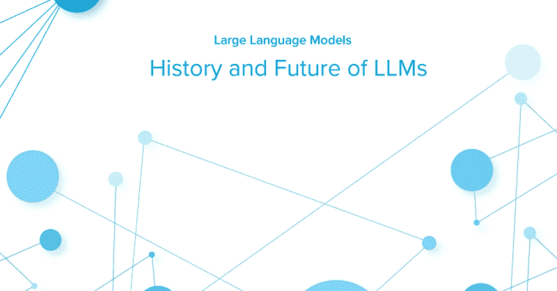
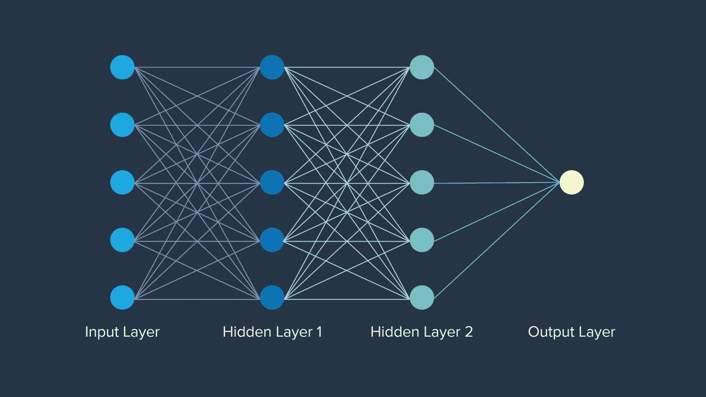
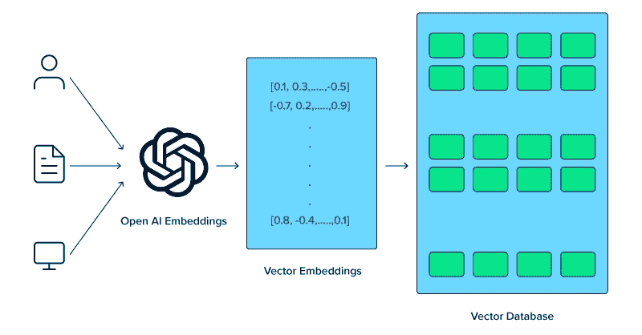
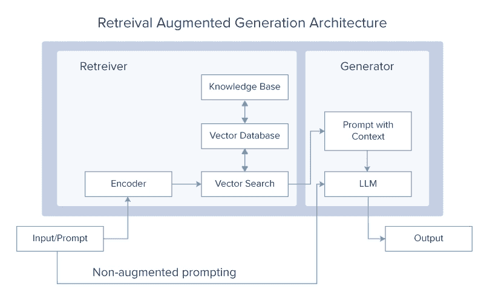

# LLMs 的历史与未来

> 原文：[`www.kdnuggets.com/history-and-future-of-llms`](https://www.kdnuggets.com/history-and-future-of-llms)

## LLMs 的起源 - NLP 与神经网络

大型语言模型的创建并非一蹴而就。值得注意的是，语言模型的第一个概念起源于被称为自然语言处理的规则基础系统。这些系统遵循预定义规则，根据文本输入做出决策和推断结论。这些系统依赖于 if-else 语句处理关键词信息并生成预定的输出。想象一个决策树，其中输出是如果输入包含 X、Y、Z 或无，则响应的预定回答。例如：如果输入包括关键词“母亲”，则输出“你的母亲怎么样？”否则，输出“你能详细说明一下吗？”

* * *

## 我们的前三个课程推荐

 1\. [谷歌网络安全证书](https://www.kdnuggets.com/google-cybersecurity) - 快速进入网络安全职业生涯。

 2\. [谷歌数据分析专业证书](https://www.kdnuggets.com/google-data-analytics) - 提升您的数据分析能力

 3\. [谷歌 IT 支持专业证书](https://www.kdnuggets.com/google-itsupport) - 支持您的组织 IT

* * *

最早的重大进展是神经网络，最初由数学家沃伦·麦卡洛赫于 1943 年提出，受到人脑神经元功能的启发。神经网络甚至在“人工智能”这一术语出现之前大约有 12 年的历史。每层的神经元网络以特定的方式组织，每个节点都有一个权重，决定了它在网络中的重要性。最终，神经网络打开了封闭的门，创建了人工智能将永远建立的基础。

## LLMs 的发展 - 嵌入、LSTM、注意力机制与变换器

计算机无法像人类一样理解句子中单词的意义。为了提高计算机对语义分析的理解，必须首先应用词嵌入技术，这种技术允许模型捕捉相邻单词之间的关系，从而提高各种 NLP 任务的性能。然而，需要一种方法来将词嵌入存储在内存中。

[长短期记忆网络 (LSTM)](https://www.exxactcorp.com/blog/Deep-Learning/5-types-of-lstm-recurrent-neural-networks-and-what-to-do-with-them) 和门控循环单元 (GRUs) 是神经网络领域的重要进展，能够比传统神经网络更有效地处理序列数据。虽然 LSTM 现在已经不再使用，但这些模型为更复杂的语言理解和生成任务铺平了道路，最终催生了 Transformer 模型。

## 现代 LLM - 注意力机制、Transformer 及 LLM 变体

注意力机制的引入是一次革命性的改变，使得模型在进行预测时能够关注输入序列的不同部分。2017 年发表的开创性论文《Attention is All You Need》介绍了 Transformer 模型，这些模型利用注意力机制同时处理整个序列，极大地提高了效率和性能。八位谷歌科学家并未意识到他们的论文会在创建当今 AI 领域中产生如此深远的影响。

紧随其后，谷歌的 BERT（2018 年）被开发并被誉为所有 NLP 任务的基准，作为一个开源模型被用于众多项目，使 AI 社区能够开展项目并成长。其对上下文理解的敏感性、预训练的特性和微调的选项，以及 Transformer 模型的展示为更大模型的出现奠定了基础。

除了 BERT，OpenAI 还发布了 GPT-1，这是他们 Transformer 模型的第一个迭代版本。GPT-1（2018 年）起始于 1.17 亿个参数，随后 GPT-2（2019 年）大幅跃升至 15 亿个参数，GPT-3（2020 年）则拥有 1750 亿个参数。OpenAI 的突破性聊天机器人 ChatGPT 基于 GPT-3，于 2022 年 11 月 30 日发布，引发了巨大关注，并真正实现了强大 AI 模型的民主化。了解[difference between BERT and GPT-3](https://www.exxactcorp.com/blog/deep-learning/gpt-3-vs-bert-llm-comparison)。

## 什么技术进步正在推动 LLM 的未来？

硬件的进步、算法和方法的改进，以及多模态的整合都促进了大语言模型的发展。随着行业找到利用 LLM 的有效方法，持续的进步将根据每个应用的需求进行调整，并最终彻底改变计算领域的格局。

### 硬件的进步

提升 LLM 的最简单直接的方法是改进模型运行的实际硬件。专用硬件如[图形处理单元 (GPUs)](https://www.exxactcorp.com/category/Deep-Learning-NVIDIA-GPU-Workstations)的开发显著加快了大语言模型的训练和推理速度。GPU 凭借其并行处理能力，已成为处理 LLM 所需的大量数据和复杂计算的必备工具。

OpenAI 使用 NVIDIA GPUs 来驱动其 GPT 模型，并且是首批 NVIDIA DGX 客户之一。他们的关系从 AI 的出现延续到 AI 的持续发展，CEO 亲自交付了第一台 NVIDIA DGX-1 以及最新的 NVIDIA DGX H200。这些 GPUs 集成了大量内存和并行计算，用于训练、部署和推理性能。

### 算法和架构的改进

变换器架构已被证实能够支持 LLM。该架构的引入对 LLM 的进步至关重要，因为它们现在就是这样。其能够同时处理整个序列而非按顺序处理，显著提高了模型的效率和性能。

尽管如此，变换器架构仍有很大的发展空间，以及它如何继续进化大型语言模型。

+   对变换器模型的持续改进，包括更好的注意机制和优化技术，将带来更准确、更快速的模型。

+   对新型架构的研究，例如稀疏变换器和高效注意机制，旨在减少计算需求，同时保持或增强性能。

### 多模态输入的集成

LLM 的未来在于其处理多模态输入的能力，整合文本、图像、音频以及其他数据形式，以创建更丰富和更具上下文意识的模型。像 OpenAI 的 CLIP 和 DALL-E 这样的多模态模型展示了结合视觉和文本信息的潜力，使图像生成、图像标注等应用成为可能。

这些集成使 LLM 能够执行更复杂的任务，例如理解来自文本和视觉线索的上下文，这*最终使它们更具多功能性和强大*。

## LLM 的未来

进展并未停止，LLM 创建者计划在他们的工作中融入更多创新技术和系统。并非所有 LLM 的改进都需要更高的计算需求或更深的概念理解。一个关键的提升是开发更小、更易用的模型。

虽然这些模型可能不如像 GPT-4 和 LLaMA 3 这样的“巨型 LLM”有效，但重要的是要记住，并非所有任务都需要庞大而复杂的计算。尽管体积庞大，像 Mixtral 8x7B 和 Mistal 7B 这样的先进小型模型仍能提供令人印象深刻的表现。以下是一些预计将推动 LLM 发展和改进的关键领域和技术：

### 1\. 专家混合（MoE）

[MoE 模型](https://www.exxactcorp.com/blog/deep-learning/why-new-llms-use-moe-mixture-of-experts-architecture)使用动态路由机制，为每个输入仅激活模型参数的一个子集。这种方法使模型能够高效扩展，根据输入上下文激活最相关的“专家”，如下面所示。MoE 模型提供了一种在不成比例增加计算成本的情况下扩展 LLM 的方法。通过在任何给定时间仅利用整个模型的一小部分，这些模型能够使用更少的资源，同时仍提供卓越的性能。

### 2\. 检索增强生成（RAG）系统

[检索增强生成系统](https://www.exxactcorp.com/blog/deep-learning/how-retrieval-augment-generation-makes-llms-smarter-than-before)目前在 LLM 社区中是一个非常热门的话题。这个概念质疑为什么要在更多数据上训练 LLM 时，你可以简单地让它从外部来源检索所需的数据。然后使用这些数据生成最终答案。

RAG 系统通过在生成过程中从大型外部数据库检索相关信息来增强 LLM。这种集成使模型能够访问和融入最新的领域特定知识，提高其准确性和相关性。将 LLM 的生成能力与检索系统的精确性结合，产生了一种强大的混合模型，能够生成高质量的回应，同时保持对外部数据源的了解。

### 3\. 元学习

元学习方法允许 LLM 学习如何学习，使其能够快速适应新的任务和领域，所需的训练最少。

元学习的概念依赖于几个关键概念，如：

1.  少样本学习：LLM 被训练以理解和执行仅凭少量示例的新任务，显著减少了有效学习所需的数据量。这使它们在处理各种场景时非常多才多艺且高效。

1.  自监督学习：LLM 使用大量未标记的数据生成标签并学习表示。这种学习方式使模型能够深入理解语言结构和语义，然后针对特定应用进行微调。

1.  强化学习：在这种方法中，LLM 通过与环境互动并接收奖励或惩罚的反馈来学习。这有助于模型优化其行为并随着时间的推移改善决策过程。

## 结论

LLMs 是现代技术的奇迹。它们的运作复杂、规模庞大、进展突破性。在这篇文章中，我们探索了这些非凡进展的未来潜力。从它们在人工智能领域的早期起步开始，我们还深入探讨了神经网络和注意力机制等关键创新。

我们接着审视了多种提升这些模型的策略，包括硬件的进步、内部机制的改进以及新架构的发展。到现在为止，我们希望你对大型语言模型（LLMs）及其在不久的将来充满希望的发展轨迹有了更清晰、更全面的理解。

**[Kevin Vu](https://blog.exxactcorp.com/)** 管理着 [Exxact Corp 博客](https://blog.exxactcorp.com/)，并与许多才华横溢的作者合作，这些作者撰写关于深度学习的不同方面。

### 更多相关话题

+   [神经网络简史](https://www.kdnuggets.com/a-brief-history-of-the-neural-networks)

+   [预测未来事件：人工智能和机器学习的能力与局限](https://www.kdnuggets.com/2023/06/forecasting-future-events-capabilities-limitations-ai-ml.html)

+   [提示工程的兴衰：潮流还是未来？](https://www.kdnuggets.com/the-rise-and-fall-of-prompt-engineering-fad-or-future)

+   [生成性人工智能游乐场：Camel-5b 和 Open LLaMA 3B 的 LLMs](https://www.kdnuggets.com/2024/02/intel-generative-ai-playground-llms-with-camel-5b-and-open-llama-3b)

+   [LLMs、生成性人工智能和深度学习的向量数据库](https://www.kdnuggets.com/vector-database-for-llms-generative-ai-and-deep-learning)

+   [量化与 LLMs：将模型浓缩至可管理的大小](https://www.kdnuggets.com/quantization-and-llms-condensing-models-to-manageable-sizes)
