# 特征提取的《搭便车指南》

> 原文：[`www.kdnuggets.com/2019/06/hitchhikers-guide-feature-extraction.html`](https://www.kdnuggets.com/2019/06/hitchhikers-guide-feature-extraction.html)

 评论

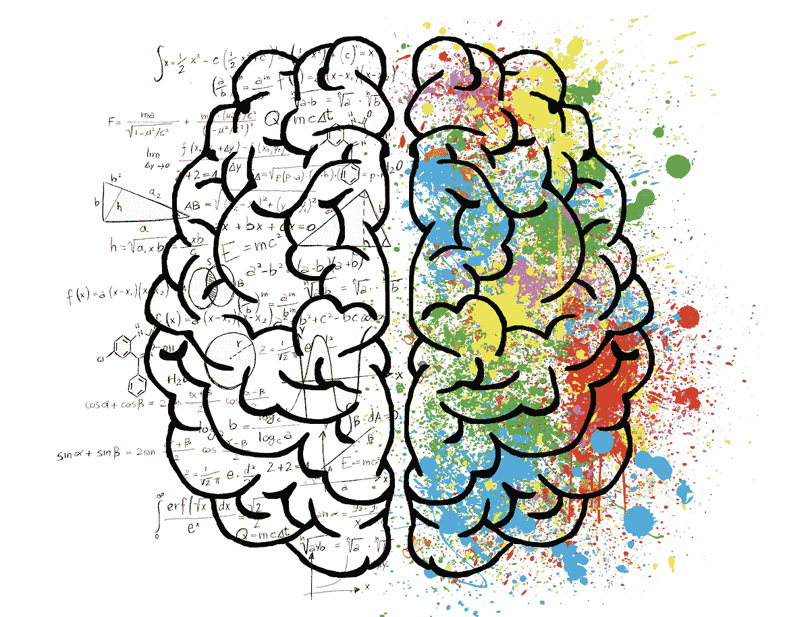

优质特征是任何机器学习模型的核心。

优质特征创建通常需要领域知识、创造力和大量时间。

在这篇文章中，我将讨论：

+   特征创建的各种方法 - 自动化和手动

+   处理分类特征的不同方法

+   经度和纬度特征

+   一些 Kaggle 技巧

+   以及一些关于特征创建的其他想法。

***TLDR; 本文介绍了我学习并经常使用的有用特征工程方法和技巧。***

### 1\. 使用 featuretools 自动创建特征：


自动化是未来

你读过 featuretools 吗？如果没有，你将会感到惊喜。

**Featuretools** 是一个执行自动特征工程的框架。它擅长将时间和关系数据集转换为机器学习的特征矩阵。

怎么做？让我们通过一个玩具示例来展示 featuretools 的强大功能。

假设我们在数据库中有三个表：**Customers、Sessions 和 Transactions。**

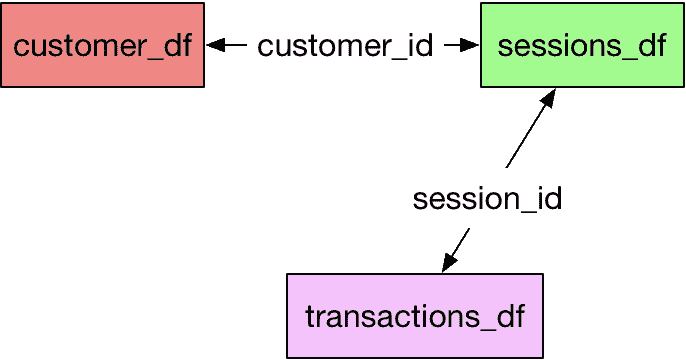

数据集和关系

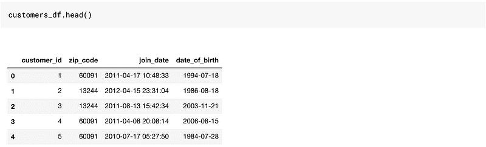

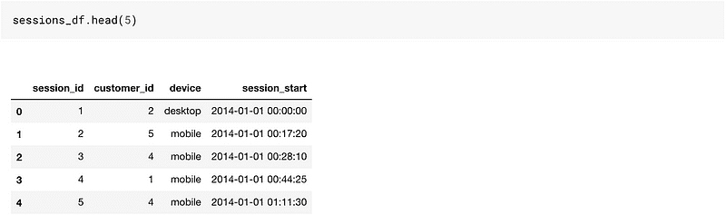

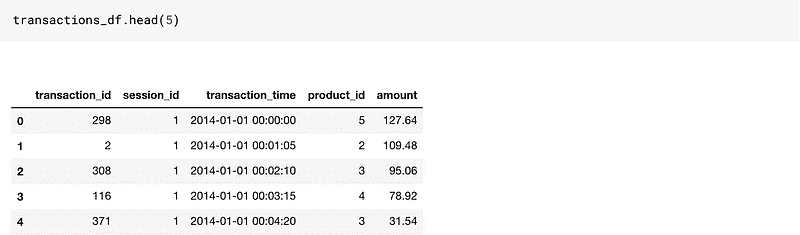

这是一个相当好的玩具数据集，因为它包含了基于时间的列以及分类和数值列。

如果我们要在这些数据上创建特征，我们需要使用 Pandas 进行大量的合并和聚合。

Featuretools 使我们的工作变得如此简单。虽然有一些东西我们需要学习，才能让生活变得更轻松。

Featuretools 与实体集一起工作。

***你可以理解实体集为数据框以及它们之间关系的容器。***


实体集 = 数据框和关系的集合

那么，事不宜迟，让我们创建一个空的实体集。我只是将名称设为 customers。你可以在这里使用任何名称。目前它只是一个空桶。

```py
# Create new entityset
es = ft.EntitySet(id = 'customers')
```

让我们将数据框添加到其中。添加数据框的顺序不重要。要将数据框添加到现有的实体集，我们执行以下操作。

```py
# Create an entity from the customers dataframe

es = es.entity_from_dataframe(entity_id = 'customers', dataframe = customers_df, index = 'customer_id', time_index = 'join_date' ,variable_types = {"zip_code": ft.variable_types.ZIPCode})
```

所以这里是我们在将数据框添加到空实体集桶时所做的一些事情。

1.  提供了 `entity_id`：这只是一个名称。设置为 customers。

1.  `dataframe` 名称设置为 customers_df

1.  `index`：该参数作为输入主键

1.  `time_index`：**时间索引**被定义为可以使用行中任何信息的第一次时间。对于客户，它是加入日期。对于交易，它将是交易时间。

1.  `variable_types`：用于指定特定变量是否需要不同的处理。在我们的数据框中，我们有一个`zip_code`变量，我们希望对其进行不同的处理，所以我们使用这个。以下是我们可以使用的不同变量类型：

```py
[featuretools.variable_types.variable.Datetime,
 featuretools.variable_types.variable.Numeric,
 featuretools.variable_types.variable.Timedelta,
 featuretools.variable_types.variable.Categorical,
 featuretools.variable_types.variable.Text,
 featuretools.variable_types.variable.Ordinal,
 featuretools.variable_types.variable.Boolean,
 featuretools.variable_types.variable.LatLong,
 featuretools.variable_types.variable.ZIPCode,
 featuretools.variable_types.variable.IPAddress,
 featuretools.variable_types.variable.EmailAddress,
 featuretools.variable_types.variable.URL,
 featuretools.variable_types.variable.PhoneNumber,
 featuretools.variable_types.variable.DateOfBirth,
 featuretools.variable_types.variable.CountryCode,
 featuretools.variable_types.variable.SubRegionCode,
 featuretools.variable_types.variable.FilePath]
```

这就是我们当前的实体集桶的样子。它里边只有一个数据框，并且没有任何关系。

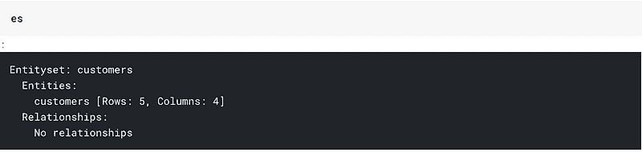

让我们添加所有的数据框：

```py
# adding the transactions_df
es = es.entity_from_dataframe(entity_id="transactions",
                                 dataframe=transactions_df,
                                 index="transaction_id",
                               time_index="transaction_time",
                               variable_types={"product_id": ft.variable_types.Categorical})

# adding sessions_df
es = es.entity_from_dataframe(entity_id="sessions",
            dataframe=sessions_df,
            index="session_id", time_index = 'session_start')
```

这就是我们当前的实体集桶的样子。

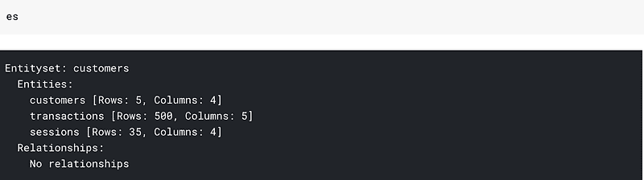

所有三个数据框，但没有关系。这里所说的关系是指我的桶并不知道`customers_df`和`session_df`中的`customer_id`是相同的列。

我们可以将这些信息提供给我们的实体集：

```py
# adding the customer_id relationship
cust_relationship = ft.Relationship(es["customers"]["customer_id"],
                       es["sessions"]["customer_id"])

# Add the relationship to the entity set
es = es.add_relationship(cust_relationship)

# adding the session_id relationship
sess_relationship = ft.Relationship(es["sessions"]["session_id"],
                       es["transactions"]["session_id"])

# Add the relationship to the entity set
es = es.add_relationship(sess_relationship)
```

在此之后，我们的实体集看起来像这样：

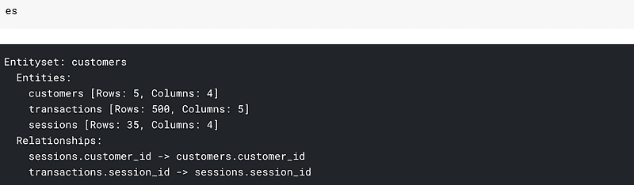

我们可以看到数据集以及它们之间的关系。我们在这里的大部分工作已经完成。我们准备好生成特征了。


特征工程和烹饪没有什么不同。把特征当作配料来看待。

创建特征很简单，如下所示：

```py
feature_matrix, feature_defs = ft.dfs(entityset=es, target_entity="customers",max_depth = 2)

feature_matrix.head()
```

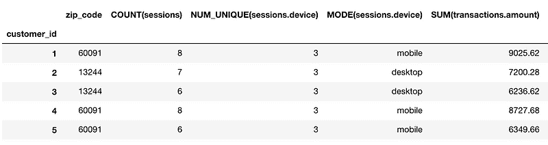

我们最终得到***73 个新特征。**** 你可以从*`*feature_defs.*`*中看到特征名称。一些我们最终创建的特征包括：

```py
[<Feature: NUM_UNIQUE(sessions.device)>,
 <Feature: MODE(sessions.device)>,
 <Feature: SUM(transactions.amount)>,
 <Feature: STD(transactions.amount)>,
 <Feature: MAX(transactions.amount)>,
 <Feature: SKEW(transactions.amount)>,
 <Feature: DAY(join_date)>,
 <Feature: YEAR(join_date)>,
 <Feature: MONTH(join_date)>,
 <Feature: WEEKDAY(join_date)>,
 <Feature: SUM(sessions.STD(transactions.amount))>,
 <Feature: SUM(sessions.MAX(transactions.amount))>,
 <Feature: SUM(sessions.SKEW(transactions.amount))>,
 <Feature: SUM(sessions.MIN(transactions.amount))>,
 <Feature: SUM(sessions.MEAN(transactions.amount))>,
 <Feature: SUM(sessions.NUM_UNIQUE(transactions.product_id))>,
 <Feature: STD(sessions.SUM(transactions.amount))>,
 <Feature: STD(sessions.MAX(transactions.amount))>,
 <Feature: STD(sessions.SKEW(transactions.amount))>,
 <Feature: STD(sessions.MIN(transactions.amount))>,
 <Feature: STD(sessions.MEAN(transactions.amount))>,
 <Feature: STD(sessions.COUNT(transactions))>,
 <Feature: STD(sessions.NUM_UNIQUE(transactions.product_id))>]
```

你可以得到像***金额标准差的总和(***`SUM(sessions.STD(transactions.amount))`***)****或****金额总和的标准差(***`STD(sessions.SUM(transactions.amount))`***)***这样的特征。这就是函数调用中`max_depth`参数的含义。我们在这里将其指定为 2，以获取两个层次的汇总。

***如果我们将`*max_depth*`*改为 3，我们可以得到像:* `MAX(sessions.NUM_UNIQUE(transactions.YEAR(transaction_time)))`

想象一下，如果你需要编写代码来获得这样的特征，你需要花费多少时间。此外，增加`max_depth`可能需要更长的时间。

### 2. 处理类别特征：标签/二进制/哈希和目标/均值编码

创建自动化特征有其好处。但是，如果一个简单的库可以完成我们的所有工作，那我们数据科学家还需要做什么呢？

这是我将讨论处理类别特征的部分。

**独热编码**


独热咖啡

我们可以使用***独热编码***来编码我们的类别特征。因此，如果我们在一个类别中有 n 个级别，我们将得到 n-1 个特征。

在我们的`session_df`表中，有一个名为`device`的列，其中包含三个级别——桌面、移动或平板。我们可以使用以下方法从这样的列中提取两个列：

```py
pd.get_dummies(sessions_df['device'],drop_first=True)
```

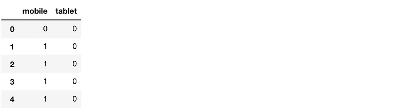

这是谈论分类特征时最自然的想法，并且在许多情况下效果良好。

**OrdinalEncoding**

有时类别之间是有顺序的。在这种情况下，我通常使用 pandas 中的简单 map/apply 函数来创建一个新的序数列。

例如，如果我有一个数据框包含温度的三个级别：高、中、低，我会将其编码为：

```py
map_dict = {'low':0,'medium':1,'high':2}
def map_values(x):
    return map_dict[x]
df['Temperature_oe'] = df['Temperature'].apply(lambda x: map_values(x))
```

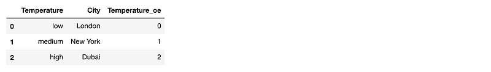

使用这种方法，我保留了信息：低<中<高。

**LabelEncoder**

我们也可以使用 ***LabelEncoder*** 将变量编码为数字。标签编码器的基本功能是将列中的第一个值转换为 0，接下来的值转换为 1，以此类推。这种方法在树模型中效果相当好，***当我在分类变量中有很多级别时，我最终会使用它。*** 我们可以这样使用：

```py
from sklearn.preprocessing import LabelEncoder
# create a labelencoder object
le = LabelEncoder()
# fit and transform on the data
sessions_df['device_le'] = le.fit_transform(sessions_df['device'])
sessions_df.head()
```

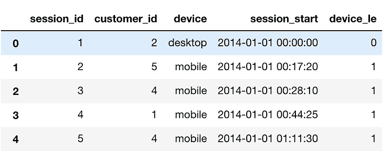

**BinaryEncoder**

BinaryEncoder 是另一种可以用来编码分类变量的方法。如果你有很多级别的列，它是一个很好的方法。虽然我们可以使用 One Hot Encoding 用 1023 列来编码一个有 1024 个级别的列，但使用 Binary 编码，我们只需使用十列即可完成。

假设我们在 FIFA 19 球员数据中有一个包含所有俱乐部名称的列。这个列有 652 个唯一值。One Hot 编码意味着创建 651 列，这将导致大量内存使用和很多稀疏列。

如果我们使用二进制编码，我们只需要十列，因为 2⁹ < 652 < 2¹⁰。

我们可以通过使用 category_encoders 中的 BinaryEncoder 对象来轻松地对这个变量进行二进制编码。

```py
from category_encoders.binary import BinaryEncoder
# create a Binaryencoder object
be = BinaryEncoder(cols = ['Club'])
# fit and transform on the data
players = be.fit_transform(players)
```

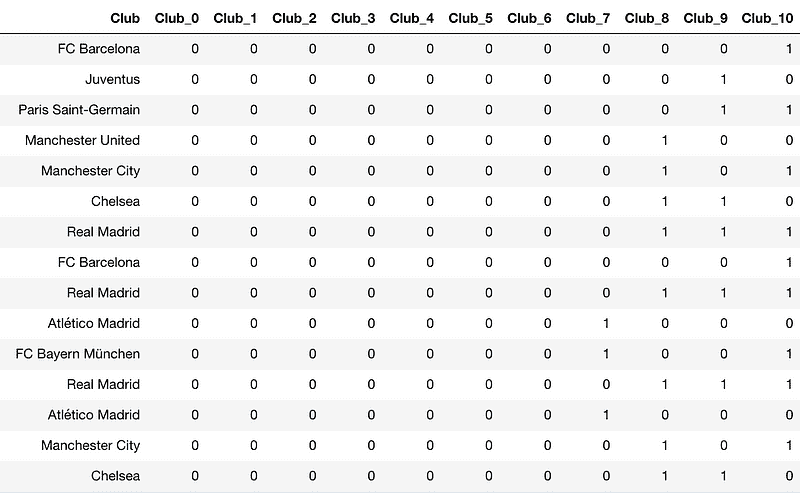

**HashingEncoder**


***可以将 Hashing Encoder 视为一个黑箱函数，它将字符串转换为 0 到某个预定值之间的数字。***

它与二进制编码不同，因为在二进制编码中，两个或更多的俱乐部参数可能都为 1，而在哈希编码中只有一个值为 1。

我们可以这样使用哈希编码：

```py
players = pd.read_csv("../input/fifa19/data.csv")

from category_encoders.hashing import HashingEncoder
# create a HashingEncoder object
he = HashingEncoder(cols = ['Club'])
# fit and transform on the data
players = he.fit_transform(players)
```

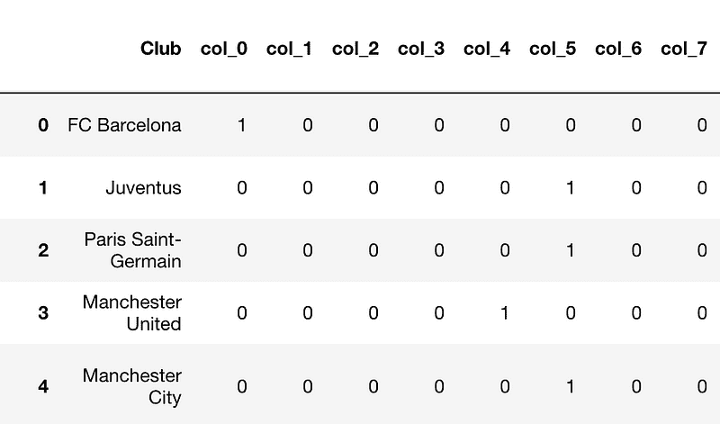

可能会出现碰撞（例如，尤文图斯和 PSG 具有相同的编码），但有时这种技术效果不错。

**Target/Mean Encoding**


这是我在 Kaggle 比赛中发现效果不错的一种技术。如果训练/测试数据来自同一数据集的同一时间段（横截面），我们可以巧妙地使用特征。

例如：在 Titanic 知识挑战中，测试数据是从训练数据中随机抽样的。在这种情况下，我们可以使用在不同分类变量上的目标变量平均值作为特征。

在 Titanic 中，我们可以在 PassengerClass 变量上创建一个目标编码特征。

***我们在使用目标编码时必须小心，因为它可能会导致模型过拟合。*** 因此，当我们使用目标编码时，我们会使用 k 折目标编码。

我们可以创建一个均值编码特征，如下所示：

```py
targetc = KFoldTargetEncoderTrain('Pclass','Survived',n_fold=5)
new_train = targetc.fit_transform(train)

new_train[['Pclass_Kfold_Target_Enc','Pclass']]
```

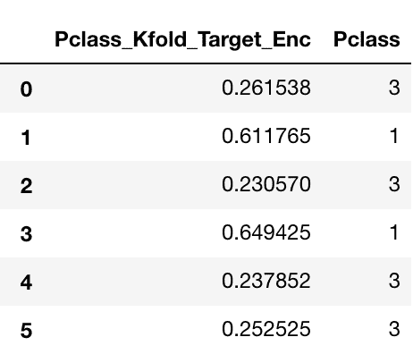

你可以看到乘客类别 3 是如何被编码为 0.261538 和 0.230570，具体取决于平均值是从哪个折叠中得出的。

这个特征非常有用，因为它编码了目标类别的值。仅通过这个特征，我们可以说，类别 1 的乘客比类别 3 的乘客有更高的生存倾向。

### 3\. 一些 Kaggle 小技巧：

虽然这些不一定是特征创建技术，但有一些后处理技术你可能会觉得有用。

**对数损失裁剪技术：**

这是我在 Jeremy Howard 的神经网络课程中学到的。它基于一个基本的理念。

对数损失在我们非常自信却犯错时会惩罚我们。

所以在 Kaggle 上的分类问题中，我们需要预测概率时，将概率裁剪在 0.05–0.95 之间会更好，这样我们就不会对预测过于自信。这样可以减少惩罚。可以通过简单的 `np.clip` 实现。

**Kaggle 提交的 gzip 格式：**

一小段代码可以帮助你节省无数小时的上传时间。请享用。

```py
df.to_csv(‘submission.csv.gz’, index=False, compression=’gzip’)
```

### 4\. 使用纬度和经度特征：

这一部分将讲述如何很好地使用纬度和经度特征。

对于这项任务，我将使用来自 Playground 比赛的数据：[纽约市出租车旅行时长](https://www.kaggle.com/c/nyc-taxi-trip-duration/data)

训练数据如下：

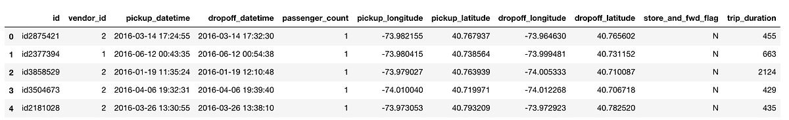

我将在这里编写的大部分函数都受到 [Kernel](https://www.kaggle.com/gaborfodor/from-eda-to-the-top-lb-0-368) 的启发，该 Kernel 是由 Beluga 编写的。

在这次比赛中，我们需要预测旅行时长。我们提供了许多特征，其中包括接送地点的纬度和经度。我们创建了如下特征：

**A. 两个经纬度之间的哈弗辛距离：**

> **哈弗辛** 公式用于计算球面上两点之间的大圆 **距离**，给定它们的经纬度。

```py
def haversine_array(lat1, lng1, lat2, lng2): 
    lat1, lng1, lat2, lng2 = map(np.radians, (lat1, lng1, lat2, lng2)) 
    AVG_EARTH_RADIUS = 6371 # in km 
    lat = lat2 - lat1 
    lng = lng2 - lng1 
    d = np.sin(lat * 0.5) ** 2 + np.cos(lat1) * np.cos(lat2) *      np.sin(lng * 0.5) ** 2 
    h = 2 * AVG_EARTH_RADIUS * np.arcsin(np.sqrt(d)) 
    return h
```

我们可以这样使用这个函数：

```py
train['haversine_distance'] = train.apply(lambda x: haversine_array(x['pickup_latitude'], x['pickup_longitude'], x['dropoff_latitude'], x['dropoff_longitude']),axis=1)
```

**B. 两个经纬度之间的曼哈顿距离：**


曼哈顿天际线

> 沿着直角轴测量的两点之间的距离

```py
def dummy_manhattan_distance(lat1, lng1, lat2, lng2): 
    a = haversine_array(lat1, lng1, lat1, lng2) 
    b = haversine_array(lat1, lng1, lat2, lng1) 
    return a + b
```

我们可以这样使用这个函数：

```py
train['manhattan_distance'] = train.apply(lambda x: dummy_manhattan_distance(x['pickup_latitude'], x['pickup_longitude'], x['dropoff_latitude'], x['dropoff_longitude']),axis=1)
```

**C. 两个经纬度之间的方位角：**

**方位角** 用于表示 **一个点** 相对于另一个 **点** 的方向。

```py
def bearing_array(lat1, lng1, lat2, lng2): 
    AVG_EARTH_RADIUS = 6371 # in km 
    lng_delta_rad = np.radians(lng2 - lng1) 
    lat1, lng1, lat2, lng2 = map(np.radians, (lat1, lng1, lat2, lng2)) 
    y = np.sin(lng_delta_rad) * np.cos(lat2) 
    x = np.cos(lat1) * np.sin(lat2) - np.sin(lat1) * np.cos(lat2) * np.cos(lng_delta_rad) 
    return np.degrees(np.arctan2(y, x))
```

我们可以这样使用这个函数：

```py
train['bearing'] = train.apply(lambda x: bearing_array(x['pickup_latitude'], x['pickup_longitude'], x['dropoff_latitude'], x['dropoff_longitude']),axis=1)
```

**D. 接送之间的中心纬度和经度：**

```py
train.loc[:, 'center_latitude'] = (train['pickup_latitude'].values + train['dropoff_latitude'].values) / 2 
train.loc[:, 'center_longitude'] = (train['pickup_longitude'].values + train['dropoff_longitude'].values) / 2
```

这些是我们创建的新列：


### 5\. 自编码器：

有时人们也使用自编码器来创建自动特征。

***什么是自编码器？***

编码器是深度学习函数，近似于从 X 到 X 的映射，即输入=输出。它们首先将输入特征压缩到较低维度的*表示*中，然后从这种表示中重建输出。

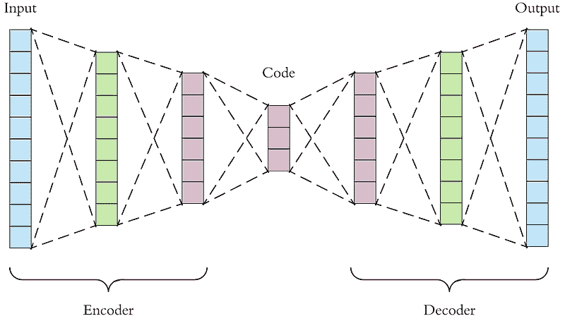

我们可以使用这种*表示*向量作为我们模型的特征。

### 6. 你可以对特征做的一些常见操作：

+   ***最大最小缩放：*** 这是对线性模型、神经网络等常见且通常必需的预处理方法。

+   ***标准差归一化：*** 这是对线性模型、神经网络等常见且通常必需的预处理方法。

+   ***基于对数的特征/目标：*** 使用基于对数的特征或对数目标函数。如果使用的是假设特征呈正态分布的线性模型，对数转换可能使特征变为正态分布。在处理如收入等偏态变量时也很有用。

或者在我们的情况下，就是旅行时长。下面是没有对数转换的旅行时长图。

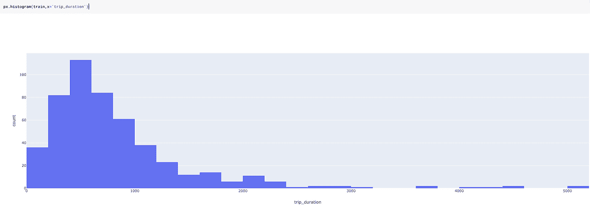

进行对数转换后：

```py
train['log_trip_duration'] = train['trip_duration'].apply(lambda x: np.log(1+x))
```

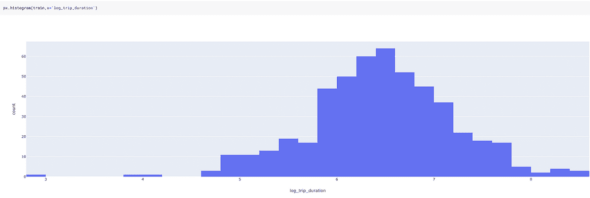

对旅行时长进行对数转换后，数据的偏态性大大减小，因此对模型的帮助更大。

### 7. 基于直觉的一些附加特征：

**日期时间特征：**

可以基于领域知识和直觉创建额外的日期时间特征。例如，像“晚上”、“中午”、“夜晚”、“上月购买”、“上周购买”等时间特征可能适用于特定应用。

**领域特定特征：**


风格很重要

假设你有一些购物车数据，并且你想要对 TripType 进行分类。这正是 Walmart 招聘中的问题：在 [Kaggle](https://www.kaggle.com/c/walmart-recruiting-trip-type-classification/)上的 Trip Type 分类。

旅行类型的一些示例：顾客可能会进行一次小型的每日晚餐旅行，一次每周的大型购物旅行，一次购买节日礼物的旅行，或一次季节性购物旅行。

为了解决这个问题，你可以考虑创建一个像“时尚”的特征，通过将属于“男士时尚”、“女士时尚”、“青少年时尚”类别的商品数量相加来创建这个变量。

***或者你可以创建一个像“稀有”的特征***，通过标记一些项目为稀有，基于我们拥有的数据，然后计算购物车中这些稀有项目的数量来创建。

这些特征可能有效，也可能无效。从我的观察来看，它们通常提供了很大的价值。

***我觉得这就是 Target 的“怀孕青少年模型”是如何制作的。*** 他们可能会有一个变量，其中包含所有怀孕青少年可能购买的商品，并将其放入分类算法中。

**交互特征：**

如果你有特征 A 和 B，可以创建特征 A*B、A+B、A/B、A-B 等。

例如，为了预测房价，如果我们有两个特征：长度和宽度，更好的方法是创建一个面积（长度 x 宽度）特征。

在某些情况下，比起单独拥有两个特征，一个比率可能更有价值。例如：信用卡使用率比拥有信用额度和已使用额度的变量更有价值。

### 结论


创造力是 ***至关重要的！！！***

这些只是我用来创建特征的一些方法。

***但在特征工程方面确实没有限制，唯一限制你的只有你的想象力。***

在这方面，我总是会考虑特征工程，同时记住我将使用的模型。随机森林中的特征可能在逻辑回归中效果不好。

特征创建是一个试错的领域。你在尝试之前无法知道什么变换或编码效果最好。这始终是时间和效用之间的权衡。

有时候，特征创建过程可能会耗费大量时间。在这种情况下，你可能需要 [并行化你的 Pandas 函数](https://medium.com/me/stats/post/1c04f41944a1)。

尽管我尽力使这篇文章尽可能详尽（这可能是我在 Medium 上写的最大的一篇文章），我可能还是遗漏了一些有用的方法。请在评论中告诉我。

你可以在这个 [Kaggle Kernel](https://www.kaggle.com/mlwhiz/feature-creation/)找到所有相关代码并自行运行。

查看 [如何赢得数据科学比赛：向顶级 Kagglers 学习](https://www.coursera.org/specializations/aml?siteID=lVarvwc5BD0-AqkGMb7JzoCMW0Np1uLfCA&utm_content=2&utm_medium=partners&utm_source=linkshare&utm_campaign=lVarvwc5BD0) 课程，该课程是由 Kazanova 提供的 [高级机器学习专业](https://www.coursera.org/specializations/aml?siteID=lVarvwc5BD0-AqkGMb7JzoCMW0Np1uLfCA&utm_content=2&utm_medium=partners&utm_source=linkshare&utm_campaign=lVarvwc5BD0)中的一部分。该课程讨论了许多改进模型的直观方法，强烈推荐。

我未来也会写更多适合初学者的文章。请告诉我你对这个系列的看法。关注我在 [**Medium**](https://medium.com/@rahul_agarwal) 或订阅我的 [**博客**](http://eepurl.com/dbQnuX)以获取更新。欢迎反馈和建设性批评，可以通过 Twitter [@mlwhiz](https://twitter.com/MLWhiz)与我联系。

**个人简介：[Rahul Agarwal](https://www.linkedin.com/in/rahulagwl/)** 是 WalmartLabs 的高级统计分析师。关注他的 Twitter [@mlwhiz](https://twitter.com/MLWhiz)。

[原文](https://towardsdatascience.com/the-hitchhikers-guide-to-feature-extraction-b4c157e96631)。经授权转载。

**相关：**

+   使用正则化线性模型与 XGBoost 进行价格建模

+   数据科学实战：Kaggle 实战教程第四部分 – 数据转换与特征提取

+   scikit-feature：Python 中的开源特征选择库

* * *

## 我们的三大课程推荐

 1\. [谷歌网络安全证书](https://www.kdnuggets.com/google-cybersecurity) - 快速进入网络安全职业生涯。

 2\. [谷歌数据分析专业证书](https://www.kdnuggets.com/google-data-analytics) - 提升你的数据分析技能

 3\. [谷歌 IT 支持专业证书](https://www.kdnuggets.com/google-itsupport) - 为你的组织提供 IT 支持

* * *

### 更多相关主题

+   [特征存储峰会 2022：关于特征工程的免费会议](https://www.kdnuggets.com/2022/10/hopsworks-feature-store-summit-2022-free-conference-feature-engineering.html)

+   [特征选择：科学与艺术的交汇](https://www.kdnuggets.com/2021/12/feature-selection-science-meets-art.html)

+   [机器学习中的替代特征选择方法](https://www.kdnuggets.com/2021/12/alternative-feature-selection-methods-machine-learning.html)

+   [为多变量时间序列构建可操作的特征工程管道](https://www.kdnuggets.com/2022/03/building-tractable-feature-engineering-pipeline-multivariate-time-series.html)

+   [实时 AI 与机器学习的特征存储](https://www.kdnuggets.com/2022/03/feature-stores-realtime-ai-machine-learning.html)

+   [机器学习模型的高级特征选择技术](https://www.kdnuggets.com/2023/06/advanced-feature-selection-techniques-machine-learning-models.html)
