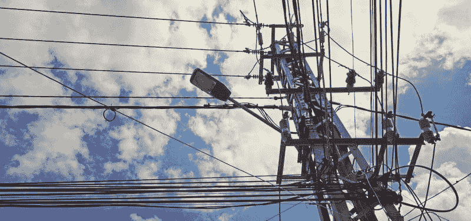

# 人工智能和数据科学如何改变公用事业行业

> 原文：[`www.kdnuggets.com/2019/01/how-ai-data-science-changing-utilities-industry.html`](https://www.kdnuggets.com/2019/01/how-ai-data-science-changing-utilities-industry.html)

 评论

公用事业行业是一个依赖于提供稳定电力和水等资源的领域。

* * *

## 我们的前三大课程推荐

 1\. [Google Cybersecurity Certificate](https://www.kdnuggets.com/google-cybersecurity) - 快速进入网络安全职业的快车道

 2\. [Google Data Analytics Professional Certificate](https://www.kdnuggets.com/google-data-analytics) - 提升你的数据分析技能

 3\. [Google IT Support Professional Certificate](https://www.kdnuggets.com/google-itsupport) - 支持你的组织的 IT

* * *

否则，家庭和企业级客户可能会发现他们无法获得那些本应帮助他们生活和开展业务的资源。

人工智能（AI）和数据科学正为选择探讨这些领域的公用事业提供商带来积极的发展。以下是一些技术应用的例子。

### 1\. 促进向可再生能源的过渡

人们对可再生能源的潜力越来越感到兴奋。除了可持续性好处外，一些个人希望利用联邦或州的税收抵免来购买如太阳能设备等产品。

然而，从化石燃料过渡到可再生能源的成功意味着[首先分析关键数据点](http://www.innoenergy.com/moving-the-world-to-renewable-energy-is-hard-how-ai-can-smooth-the-process/)。公用事业提供商必须评估当前或计划中的可再生能源项目的输出，并将预期的总量与所有使用可再生能源的客户带来的需求进行配对。

除了使用大数据平台来检查这两个变量和其他因素外，还可以依赖人工智能采取预测性的方法来分析这些指标。这种系统可能会确定在一天中的某些时段内可再生能源的使用最多，或者社区中特定区域的使用量异常高。

一项对[26,000 名受访者的全球调查](https://www.vox.com/energy-and-environment/2017/11/20/16678350/global-support-clean-energy)发现，大多数受访者认为向完全由可再生能源驱动的世界转型非常重要。报告的另一个发现突显了人们希望减少对煤炭的依赖。

很明显，消费者有需求，但如果公用事业公司不先检查数据，他们可能会面临意外和可预防的后果。更糟糕的是，如果这些问题让企业得出可再生项目失败的结论，他们将不会被鼓励投资未来的可再生能源机会。

### 2\. 防止停电

停电对客户来说是极其破坏性的，对公用事业公司修复也非常昂贵，但目前正在开展项目，利用人工智能——特别是机器学习——来预测导致停电的条件。

2017 年在能源部实验室进行的一个项目[旨在识别电网的薄弱点](https://phys.org/news/2017-09-ai-minimize-electric-grid-failures.html)并在停电发生前主动修复这些问题。十个公用事业合作伙伴参与了这一多年的努力，目标是创建一个能够处理普通电力波动的自主系统，并对如风暴等重大事件作出响应。

同样，德克萨斯农工大学的一个研究团队应用大数据来改进树木维护，防止过度生长的树枝引发电力服务中断。公用事业公司传统的方法是安排定期和轮流的修剪，但这种方法既耗时又耗费成本。

这种新的数据驱动选项告诉公用事业公司哪些树木[最有可能引发问题](https://engineering.tamu.edu/news/2017/07/researchers-develop-model-to-predict-and-prevent-power-outages-using-big-data.html)。然后，这些实体可以优先考虑某些区域。创建的模型还接受来自多个来源的信息。例如，公用事业品牌可以用操作数据或已知的植物和生长模式统计数据来填充系统。

### 3\. 了解更多关于客户及其需求的信息

消费者可以使用各种高科技恒温器来帮助降低公用事业费用。统计数据显示，使用 Ecobee3 智能恒温器的[23%家庭](https://www.shipleyenergy.com/energy-101-guides/guide/2016/02/19/smart-thermostat-comparison)能够节省接近四分之一的能源费用。此外，还存在一些选项，允许人们通过手机发送短信来控制恒温器，或在房屋空置时将其设置为节能模式。

此外，只要公用事业公司获得客户的许可，他们可以访问那些恒温器的数据，并利用这些数据来了解更多关于需求和使用模式的信息。获取数据可以帮助他们对营销信息进行有意义的调整，包括提到新产品如何满足与客户相关的特征。

美国最大的公用事业公司之一 Exelon 正在通过聊天机器人迎合客户需求。该公司[在不到两周的时间里建立了一个原型](https://www.forbes.com/sites/oracle/2017/09/20/how-a-huge-utility-is-innovating-with-chatbots-for-better-customer-connections/#c20cce554152)，该机器人回答有关停电和账单问题的查询。理论上，公司也可以将大数据应用于聊天机器人的互动历史，以做出商业决策。

例如，如果重新设计账单后，客户中有更高比例的查询，企业可能会恢复旧设计或做出更改以消除困惑。

或者，如果一个小区或公寓复杂中的大量客户在风暴导致停电后询问聊天机器人何时恢复供电，公司可能会决定优先派遣团队到这些地方。

### 4. 减少浪费

如果公用事业公司无法找到有效的废物处理方式，它们很可能会面临盈利困难。数据分析平台可以揭示低效领域，使提供者能够迅速采取行动，降低成本。

同样，这些提供者可以提供品牌应用程序，帮助客户通过跟踪用水和用电量来减少浪费。

然而，如果问题与隐藏泄漏相关，发现它们并不容易。滑铁卢大学的一个项目应用人工智能通过声音处理能力来监测水管中的声音，寻找可能表示水滴的声音。这个系统特别有用，因为它甚至能在实验室测试中定位每分钟少于 4.5 加仑的[相当于 17 升的缓慢泄漏](https://www.sciencedaily.com/releases/2018/11/181128082646.htm)。

目前，处理泄漏的团队会在出现大规模洪水后被派遣，或检查由于老化可能即将失效的管道。但滑铁卢大学基于人工智能的方法可能会导致更积极的努力来遏制浪费。

### 吸引公用事业提供者实施大数据和人工智能的理由

本列表概述了一些大数据、人工智能或两者结合以实现单一目标的最引人注目的用例。

然而，随着技术的发展，公用事业公司将有更多理由投资这些技术，以解决已知问题并改善运营。

**简介: [凯拉·马修斯](http://productivitybytes.com/subscribe-to-productivity-bytes/)** 在《The Week》、《数据中心期刊》和《VentureBeat》等出版物上讨论技术和大数据，已有五年以上的写作经验。要阅读更多凯拉的文章，[**订阅她的博客 Productivity Bytes**](http://productivitybytes.com/subscribe-to-productivity-bytes/)。

原创。经许可转载。

**相关:**

+   数据科学如何改善高等教育

+   机器学习和机器人技术正在改变的 4 个行业

+   每个数据科学新手在 2019 年应该设定的 6 个目标

### 更多相关主题

+   [IT 人员补充：人工智能如何改变软件开发行业](https://www.kdnuggets.com/2023/05/staff-augmentation-ai-changing-software-development-industry.html)

+   [如何在不断变化的世界中成长为数据科学家](https://www.kdnuggets.com/2022/01/grow-data-scientist-everchanging-world.html)

+   [Python f-Strings 魔法：每个编码者需要了解的 5 个改变游戏规则的技巧](https://www.kdnuggets.com/python-fstrings-magic-5-gamechanging-tricks-every-coder-needs-to-know)

+   [ChatGPT 如何改变编程的面貌](https://www.kdnuggets.com/how-chatgpt-is-changing-the-face-of-programming)

+   [工作的未来：人工智能如何改变工作格局](https://www.kdnuggets.com/2023/04/future-work-ai-changing-job-landscape.html)

+   [数据科学与分析行业在 2021 年的主要发展及关键预测](https://www.kdnuggets.com/2021/12/developments-predictions-data-science-analytics-industry.html)
