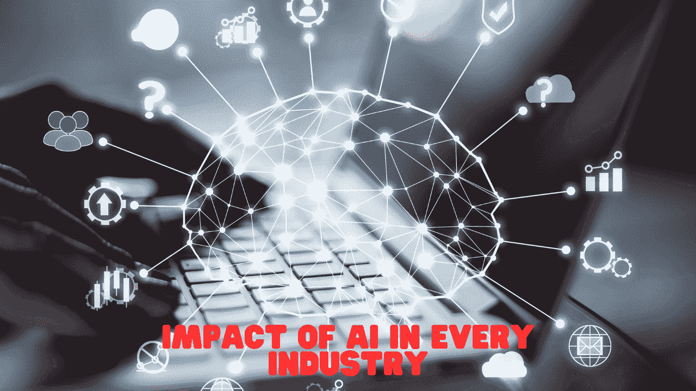
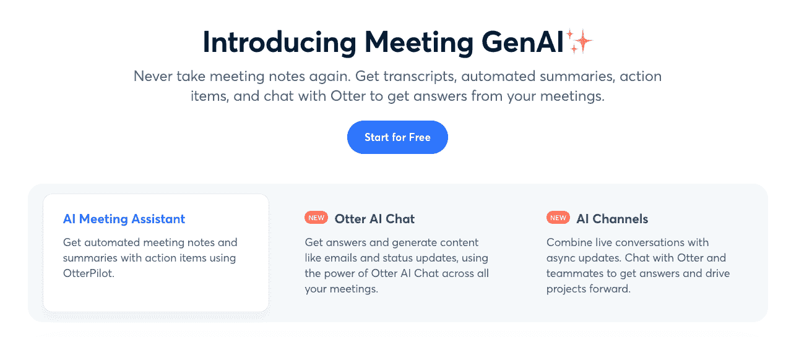
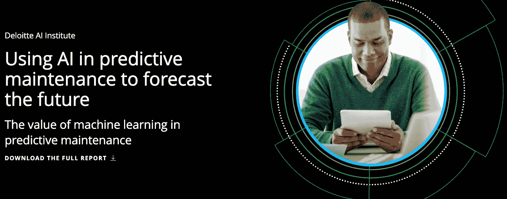

# AI 如何革新传统行业？

> 原文：[`www.kdnuggets.com/how-ai-is-revolutionizing-the-legacy-industries`](https://www.kdnuggets.com/how-ai-is-revolutionizing-the-legacy-industries)

来源：Canva

AI 在解决以前被认为是虚构的难题方面展示了巨大的潜力和前景。让我们探讨一下它对科技行业的各种影响。随着 AI 以一种几乎无缝的方式进入我们的生活——例如面部识别帮助解锁手机，或者 Alexa 和 Siri 通过语音技术丰富体验，它确实无处不在。

* * *

## 我们的前三个课程推荐

 1\. [谷歌网络安全证书](https://www.kdnuggets.com/google-cybersecurity) - 快速进入网络安全职业的快车道。

 2\. [谷歌数据分析专业证书](https://www.kdnuggets.com/google-data-analytics) - 提升你的数据分析技能

 3\. [谷歌 IT 支持专业证书](https://www.kdnuggets.com/google-itsupport) - 支持你组织的 IT 需求

* * *

本文突出了技术领域一些突破性的 AI 创新。

## 推荐

我们生活在一个非常迷人的超个性化世界中。根据历史购买记录和用户特征，我们不仅会看到广告，还会在信息流中看到反映我们兴趣的新闻。打开社交媒体，你的整个体验都经过量身定制——无论是你看到的内容还是推荐的联系人。

这感觉令人不堪重负，但几乎等同于拥有一个为你精心策划的小世界，这也延伸到回音室的概念。超个性化创建了过滤气泡，使用户对多元观点的接受度降低，强化了他们已有的信念。

## 笔记记录与总结

如果说之前你还需要自己记录会议笔记，那么现在欢迎来到 AI 的世界，它将数字化提升到一个全新的水平。它免去了你创建、收集或整理会议笔记的需要。

AI 提供会议总结和记录，列出行动项并突出重点。Otter.ai 是其中一个应用程序，能够帮助你跟进项目进展。

来源：otter.ai

## 远见者

### 质量控制

从推荐和自动总结转变，AI 现在还作为你的质量控制助手，检测织物的磨损或褪色等缺陷，并对原材料如蔬菜（农民）或木材（家具制造商）进行全面质量评估。

### 医疗保健

继续探讨计算机视觉应用，AI 是分析医疗图像（如 X 光片和 CT 扫描）以诊断患者潜在健康状况的极其强大的工具。这些先进的算法擅长识别模式和异常，从而帮助医疗专业人员加快诊断过程，提升患者的治疗效果。

值得注意的是，AI 在医疗保健中的使用属于高风险和高影响类别，因此 AI 模型的概率输出仅应被视为一种增强点。假阳性和假阴性可能意味着误诊，如果在没有医疗专业人员监督的情况下采取行动，可能会对患者的生活产生重大影响。

## 预防永远胜于治疗

### 欺诈检测

与传统的基于签名的技术相比，AI 驱动的欺诈检测系统在预测潜在欺诈方面已证明更为准确。随着数字银行和在线支付的增加，稍有疏忽可能会对客户造成巨大损失，损害在线平台的声誉。

来源：Canva

引用 Infosys BPM 的统计数据，“网络犯罪每年使全球经济损失 6000 亿美元，占全球 GDP 的 0.8%。研究表明，仅在 2021 年第一季度，欺诈尝试就比去年上升了 149%——这无疑受到疫情后在线交易增加的推动。对此，超过一半的金融机构已采取措施在 2022 年使用 AI 来检测和防止欺诈。”

### 预测性维护

无论是资产密集型制造业还是一般机械，停机是不可避免的。处理这些停机时，往往发现公司没有准备好，导致修复时间延长，这在生产、收入损失以及与设备维修或更换相关的额外费用上都可能成本高昂。

这就是 AI 预测能力发挥作用的地方。它分析大量数据以检测指示潜在设备故障的模式和异常。

来源：德勤

德勤简洁地强调了通过利用 AI 来最小化和管理停机时间的必要性——“无论是担忧系统广泛损害、产品质量、过程和设施安全，还是其他因老化或故障资产带来的后果，建立预测资产故障并防止其发生的能力可能很重要。”

## 信息获取

### 智能助手

人工智能通过智能助手帮助用户比以往更容易找到信息。用户不需要为获取信息而感到焦虑，可以简单地在指尖访问信息。这种信息获取的便利性减少了手动搜索的需求，并且绕过了许多传统的客户支持渠道。这些助手开启了新的效率前沿，节省了用户时间，提高了生产力。

来源：Canva

结果是，用户可以专注于更具战略性和意义的活动。然而，这种便利性也带来了数据隐私、安全性或个人信息潜在滥用的风险。因此，用户必须检查隐私设置，并对与人工智能系统共享信息保持谨慎。

## 自动化的另一面

尽管我们永远无法完成分享自动化带来的效率好处，但另一方面却涉及到劳动力替代的问题。许多早期被人工智能自动化所覆盖的重复性任务，推动了不断提升技能和保持自身在不断变化的就业市场中相关性的需求。

目前，仍然需要情感智能和创造力的领域尚未完全掌握在人工智能的强项之内，并可能吸引更多的人才。尽管如此，先进人工智能模型的发展也带来了许多新角色，创造了新的职位。此外，负责任的人工智能专家、政策制定者、人工智能伦理学家以及网络安全专家是当今需求量大的技能之一。

## 还有更多内容!!!

此外，有大量应用程序利用人工智能，使人类生活更轻松，并促进商业增长。例如，客户流失预测、信用风险违约模型、用户评论情感分析、自动化数据清理、客户细分以及量身定制的内容教育改革等，都是人工智能产生持久影响的诸多方式之一。

虽然潜力无限，但用户需要在使用这些人工智能应用程序时具备意识，以做出适当的权衡。通过在创新与负责任的发展及利用之间取得平衡，人工智能可以解锁前所未有的机会，为全人类塑造更美好的未来。

****[Vidhi Chugh](https://vidhi-chugh.medium.com/)****是一位人工智能战略家和数字化转型领导者，她在产品、科学和工程的交汇处工作，致力于构建可扩展的机器学习系统。她是一位屡获殊荣的创新领导者、作者以及国际演讲者。她的使命是使机器学习大众化，并打破术语，让每个人都能参与到这一转型中。

### 更多相关话题

+   [用 PandasGUI 革新数据分析](https://www.kdnuggets.com/2023/06/revolutionizing-data-analysis-pandasgui.html)

+   [预测分析如何革新技术领域的决策制定](https://www.kdnuggets.com/how-predictive-analytics-is-revolutionizing-decisionmaking-in-tech)

+   [2022 年数据科学家招聘的顶级行业和雇主](https://www.kdnuggets.com/2022/06/top-industries-employers-hiring-data-scientists-2022.html)
