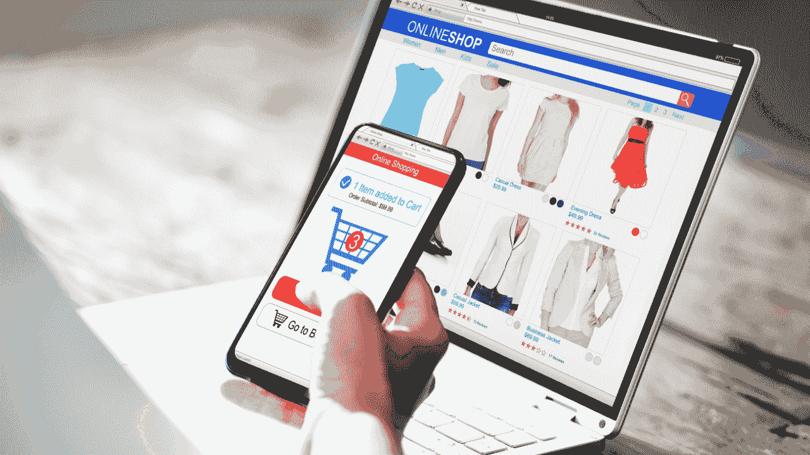

# AI 如何改变零售行业

> 原文：[`www.kdnuggets.com/how-ai-is-transforming-the-retail-industry`](https://www.kdnuggets.com/how-ai-is-transforming-the-retail-industry)

来源：Canva

直到最近，需求预测和库存优化是一些关键的 AI 应用之一。然而，最近 AI 的发展带来了各种创新的 AI 解决方案，这些解决方案彻底改变了零售业务。

* * *

## 我们的三大课程推荐

 1\. [谷歌网络安全证书](https://www.kdnuggets.com/google-cybersecurity) - 快速进入网络安全职业生涯。

 2\. [谷歌数据分析专业证书](https://www.kdnuggets.com/google-data-analytics) - 提升数据分析技能

 3\. [谷歌 IT 支持专业证书](https://www.kdnuggets.com/google-itsupport) - 支持组织的 IT 需求

* * *

## 跳出框框思考！！！

一个独特的用例涉及优化产品图像的质量以提高销售转化率。在这种情况下，零售商利用 AI，特别是计算机视觉技术，来提升产品图像的视觉吸引力，从而增加买家点击产品的可能性。

作为销售漏斗结构的一部分，点击次数的增加通常会流向更高的转化率，即销售。进一步扩展，零售商可以进行假设测试并尝试不同的图像质量，确定哪些图像属性，如高分辨率像素和适当的照明，能够推动转化。

来源：Canva

计算机视觉技术使零售商能够自动化地实施修复以改善图像质量，确保它们能够与客户产生共鸣。

## 产品描述

大多数电子商务网站托管来自不同卖家的产品，导致产品描述的列出方式各异，往往不一致且不完整。

对于什么构成有吸引力的购物体验缺乏意识和洞察，导致风格、长度、语调和完整性不一致，可能影响用户的购买决策。

然而，通过生成式 AI——一种基于大数据集生成内容（如文本、图像、视频等）的 AI 技术，公司可以生成有效的产品描述，从而增加点击率，并进而提高转化率。

这样的 AI 生成内容不仅确保信息全面，而且引人入胜且具有说服力，吸引用户的注意。更进一步，算法甚至可以学习用户的偏好，并提供与他们最相关的产品描述。值得注意的是，零售商可以继续根据模型结果的响应情况来提升和完善这些 AI 系统。

这一迭代过程使公司能够随着时间的推移完善产品描述，优化其在推动转化中的最大效果。

## 卖家风险管理

说到卖家，电子商务平台还可以建立一个基于 AI 的卖家风险管理系统，以监控与产品质量、客户服务和道德标准遵守相关的风险。

AI 可以从过去的卖家行为、客户反馈和交易记录等因素中学习，以检测异常或偏离预期规范的情况。这些偏差会标记出可能不符合平台政策和行为规范的卖家。

分析及时发货、准确的产品描述、公平定价和对客户询问的响应等因素，以突出卖家的行为。那些不断收到负面评价或投诉、参与欺诈活动或违反服务条款的卖家可能会导致糟糕的客户体验，并且损害平台的声誉。

因此，电子商务平台可以通过利用 AI 主动识别这些卖家并暂停他们的参与。除了确保可靠卖家的质量外，这些 AI 系统还促进了客户之间的信任和建立了信心。

虽然卖家的行为可能会随着时间变化，但基于 AI 的风险管理系统可以根据不断变化的不合规模式持续学习和适应。

## 欺诈检测

通常，欺诈检测被认为是银行的责任，这在一定程度上是正确的。但是，试想一个在零售平台上成为欺诈交易受害者的客户，并试图与零售商联系以撤销交易。

来源：Canva

通常情况下，零售商无法提供帮助，并且被认为没有过错。然而，对客户来说，零售商是信任的第一层防线。试想一下，如果零售商拥有一个基于 AI 的算法，能够根据买家的购买历史识别潜在的欺诈行为，并引入额外的身份验证步骤来继续销售，那么欺诈就会在第一层防线被阻止。

我们生活在一个竞争激烈的世界中，拥有一个差异化因素至关重要。管理和缓解欺诈风险突显了零售商对以客户为中心的承诺，从而提高了客户的信任和品牌忠诚度。

## 质量控制

想象一下人工智能作为你的质量控制助理，检查每一个产品在到达货架之前，尤其是在易腐烂产品的情况下，保持新鲜和确保消费者安全尤为重要。

同样，计算机视觉可以通过检测缝合缺陷、面料一致性和印刷对齐来分析衣物的质量。通过自动化质量控制流程，零售商可以维持一致的产品标准，为顾客提供优质的产品。

## 认知过载

不同品牌有不同的尺码指南，顾客常常很难记住特定品牌的尺码。人工智能以减轻顾客的认知负担而著称，可以帮助提供相关建议，提升购物体验。例如，如果算法基于购买历史、用户特征以及可能的尺码偏好反馈来建议尺码。那么，这样顾客的满意度就会得到极大的提升。

## 摘要

从优化产品图片和生成引人注目的产品描述，到管理卖家风险和检测欺诈，人工智能有潜力彻底改变零售行业的各个方面。随着更多 AI 产品和预训练模型的开源，免费 AI 时代对各行各业而言将持续存在。

****[Vidhi Chugh](https://vidhi-chugh.medium.com/)**是人工智能策略师和数字化转型领袖，致力于在产品、科学和工程交汇点上构建可扩展的机器学习系统。她是一位屡获殊荣的创新领袖、作者和国际演讲者。她的使命是普及机器学习，打破术语，让每个人都能参与这场转型。**

### 更多相关话题

+   [打破数据障碍：零样本、单样本和少样本学习如何…](https://www.kdnuggets.com/2023/08/breaking-data-barrier-zeroshot-oneshot-fewshot-learning-transforming-machine-learning.html)

+   [AIoT 革命：AI 和 IoT 如何改变我们的世界](https://www.kdnuggets.com/2022/07/aiot-revolution-ai-iot-transforming-world.html)

+   [用 LangChain 转型人工智能：文本数据的游戏规则改变者](https://www.kdnuggets.com/2023/08/transforming-ai-langchain-text-data-game-changer.html)

+   [KDnuggets 新闻，7 月 27 日：AIoT 革命：AI 和 IoT 如何…](https://www.kdnuggets.com/2022/n30.html)

+   [数据科学与分析行业在 2021 年的主要发展及关键…](https://www.kdnuggets.com/2021/12/developments-predictions-data-science-analytics-industry.html)

+   [模型罕见部署：机器学习领域的行业失败…](https://www.kdnuggets.com/2022/01/models-rarely-deployed-industrywide-failure-machine-learning-leadership.html)
