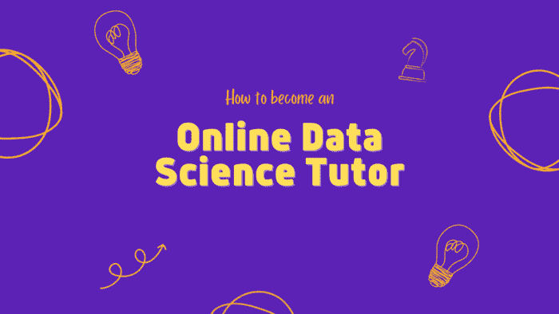
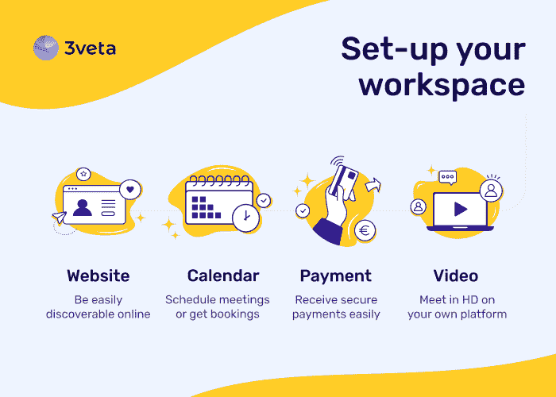

# 如何成为在线数据科学导师

> 原文：[`www.kdnuggets.com/2021/05/how-become-online-data-science-tutor.html`](https://www.kdnuggets.com/2021/05/how-become-online-data-science-tutor.html)

评论

在数据科学领域工作了几年后，我尝试理解学习和教授数据科学的最佳方法。

我希望我们的团队在通过 MOOC 进行教学方面做得很好。

*“超过 50 万学生不可能错，”* 广告如是说。

虽然在线课程是最实惠的学习方式，但在线辅导不应被低估。

在需求方面，这是一种更昂贵但极其有效的方式，任何人都可以通过它来推进他们的数据科学职业。

在供应方面，许多专业人士在他们的数据科学团队中是出色的导师，但没有考虑过辅导作为额外收入的来源。

在这篇文章中，我们将探讨这个问题，作为“在线数据科学辅导”的商业案例。

### 问题

TikTok 热门但简单。我花了一个小时就“掌握”了它。

数据科学热门但困难。我花了几年才“掌握”它。然而，我仍然觉得说“我懂数据科学”不太自在。

主要原因是数据科学确实是一个无尽的话题。

没有人可以说：“我对数据科学了解一切。”

它有许多不同的方面：

+   设计惊艳的数据可视化的创意方面

+   通过 BI 工具将数据源整合到仪表板中的业务方面

+   机器学习和人工智能的艰难数学方面

+   大数据管道的计算机科学方面

+   沟通发现的销售人员方面

你明白了。

要成为一名优秀的数据科学家，必须具备这些技能的组合。还有更多。

有些人可以自学，其他人则不太行。

在过程中会出现许多问题，如果有人能够回答这些问题，将会是极大的帮助。

### 解决方案

你可以成为那个人！当然，要付出一定的费用。

你有资格吗？如果你理解 KDnuggets 上写的博客的一半，你绝对有资格通过帮助有志数据科学家来赚取额外收入。

辅导有志者的不同方式包括：

+   *书面回答* 这是我们多年来通过在线课程所做的：通过电子邮件或问答空间回答问题。这项活动具有很大的规模经济，因为经过一段时间，你会看到大多数人提出的问题，你会变得更加迅速和高效。

+   *实时聊天回答* 这与上面相同。问题是，当你实时回答问题时，你没有时间准备或进行额外的研究。这是一个大忌。

+   *实时视频聊天回答* 这是过去一年大家一直在做的事情。确保提前获得问题或代码，以便你可以提前准备好所有可能的答案。你可以进行对话、共享屏幕、配对编码——所有成功辅导课程所需的内容。

这是一种双赢的局面，你可以将对数据科学的热情转化为额外收入，同时在过程中可能学到一些新东西。

### 目标客户

谁会对你的服务感兴趣？

有志于成为数据科学家的大学生、在线课程学习者或读书学习者，他们总是需要额外的帮助。

但不仅仅是它们。

每个愿意学习新知识的数据科学家，即每个*理智的*数据科学家，都可以真正从你提供的服务中受益。

也不要低估经验丰富的数据科学家。

如果他们是‘硬数学’型的人，他们肯定需要一些数据科学沟通技巧。

如果他们是那种‘创意型’的数据可视化专家，他们可能需要‘销售型’人员的帮助，将他们的工作从极美化到极具说服力。

而且放心，你也会在这个过程中学到很多东西。

### 如何将这项业务开始

你需要 3 件事：

+   建立一个基础设施来主持会议并获得报酬。

+   学习在线授课的基础知识。

+   联系你的目标客户。

**建立一个基础设施来主持会议并获得报酬**

如何确保视频通话发生并获得报酬？

1.  你需要一个网站。

为什么？因为人们必须能够在网上找到你。**更重要的是，你需要记录有关找到你的人的数据**。无论是简单的预订页面还是辅导市场，你必须在互联网上存在。如果你寻找的是更个人化但又简单的解决方案，[Wix](https://www.wix.com/)和[Squarespace](https://www.squarespace.com/)将会是不错的选择。

1.  一个调度工具。

在你开始的时候，你可以自己安排会议。但这不是自动化的。作为数据科学家，你可能更愿意自动化或至少半自动化安排。你可以使用[Calendly](https://calendly.com/)或[Hubspot](https://www.hubspot.com/)。

1.  一个视频会议工具。

这已经是旧闻了：[Zoom](https://zoom.us/)、[Google Meet](https://meet.google.com/)和[Microsoft Teams](https://www.microsoft.com/en-ww/microsoft-teams/group-chat-software)拯救了局面！

1.  一个支付工具。

[PayPal](https://www.paypal.com/bg/business)、[Stripe](https://stripe.com/)和[Revolut](https://www.revolut.com/)都是很好的选择。

将这 4 种工具集成在一起，或者至少视频和支付部分，将构成你的技术基础设施。

如果你太忙或者不想麻烦，你可以选择一款端到端的付费在线会议解决方案。我鼓励你试试[3veta.com](https://3veta.com/)。

**学习在线教学的基础知识**

确保不要跳过这个步骤。它可能听起来平凡，但并非如此。

首先，你必须学习如何准备会议并主持会议。所有类型的在线咨询规则都是一样的。步骤很简单——都是与设置、准备设备、收集材料等有关。充分熟悉这一阶段，我强烈推荐你拥有一个 [清单](https://www.dropbox.com/s/rfyw94rsufgsogb/The%20Ultimate%20Checklist%20to%20Provide%20Services%20Online.pdf?dl=0)。

其次，了解对方遇到的问题。

你不是在那里教授他们“所有的数据科学”。你在那里是因为他们有一个特定的数据科学问题，而你有解决这个问题的专业知识。

提出许多问题。运用你的数据科学技能，深入挖掘，直到找到问题的根本原因。一个人不过是一个极其庞大的数据集合。

例如，他们告诉你：“我需要帮助创建图表。”那么对话可能会是这样的：

> *你在使用什么软件？你在编码，啊哈。*
> 
> *用什么编程语言？Python！不错的选择。*
> 
> *你喜欢什么 IDE？嗯，Jupyter 对初学者很好，但你可以考虑未来换用其他工具。*
> 
> *你觉得哪些库很有用？MatPlotLib 是一个非常可靠的库，但你试过 Seaborn 吗？我觉得它可能更适合你的情况。另一个有趣的选择是 plotly。不过，如果你想在 MatPlotLib 上更进一步，我听到了，我会帮助你的。*
> 
> *那么，你到底想要创造什么？是创建它还是设计它时遇到困难？设计很重要。如果你追求的是外观，那么 MatPlotLib 可能不适合你。也许 Python 也不是正确的选择。如何尝试在 Tableau 或 PowerBI 中实现呢？我可以给你展示。*

你是专家。引导他们成为更好的数据科学家，并分享你的错误或偏见。

**联系目标客户**

你需要对目标客户提供帮助。了解他们在哪里存在或在线上。

+   *KDnuggets？*

    你已经在这里了。尝试 [撰写一篇高质量的文章](https://www.kdnuggets.com/news/submissions.html)，人们肯定会联系你进一步探讨。

+   *在线课程讨论（问答环节）。*

    我从个人经验中知道：在线课程创建者在回答他们课程中的所有问题时感到困难。尽量帮助他人。你很快会发现学生和讲师都在注意你，这就是你向他们推销的机会。

+   *像 Quora、Reddit、StackOverflow 这样的论坛。*

    这些问题确实“泛滥”了未回答的数据科学问题。在你的个人资料中放置一个指向你服务的链接，并尽可能提供帮助。

### 额外的想法

+   教学是非常值得的。如果你帮助了一个人解决他们的问题，你会对自己感到无比满意。

+   不要担心他们会问你不知道的问题。通过提前请求问题来减轻这种情况。如果你没有做到这一点，你总是可以要求他们稍后再回来问。这就是会议上的讲者所做的，没有人会因此生气。

+   [你有冒名顶替综合症吗？](https://www.kdnuggets.com/2017/09/data-science-imposter-syndrome.html#:~:text=Imposter%20syndrome%20is%20feeling%20like,of%20us%20feel%20below%20average.) 如果你在咨询过程中或之后对自己感到不满，你可以随时提供退款。

+   如果你比较内向，你可能需要考虑更开放一点。不要害怕被关注。如果人们知道你对数据科学如此感兴趣，甚至还进行辅导，这对你的职业生涯只有好处。记住，你在这个过程中会学到很多东西。实际上，最糟糕的情况就是被在线忽视，这并不是坏结果。

+   作为一名课程讲师，在处理课程的问答时，我迫切需要帮助。每当有学生回答超过 5 个问题时，我会联系他们并邀请他们与我们合作。

**你真的能让这件事成功吗？**

在线赚取额外收入从未如此简单，而 [我一直是这方面的倡导者](https://iliyavalchanov.substack.com/p/online-side-hustle-ideas)。

听起来可能很难，但你知道吗？你是数据科学专家，而不是 TikToker！

你的努力通常更困难，但总是更有回报！

**相关：**

+   [2021 年十大数据科学课程](https://www.kdnuggets.com/2021/04/coursera2-top-10-data-science-courses.html)

+   [专业人员的数据科学课程](https://www.kdnuggets.com/2021/03/data-science-curriculum-professionals.html)

+   [对有志成为数据科学家的建议——解答你最常见的问题](https://www.kdnuggets.com/2021/01/advice-aspiring-data-scientists.html)

### 更多相关主题

+   [ChatGPT 作为个性化数据科学概念学习辅导员](https://www.kdnuggets.com/2023/05/chatgpt-personalized-tutor-learning-data-science-concepts.html)

+   [KDnuggets 新闻 2022 年 3 月 16 日：学习数据科学基础与 5…](https://www.kdnuggets.com/2022/n11.html)

+   [如何在 2022 年成为成功的数据科学自由职业者](https://www.kdnuggets.com/2022/02/become-successful-data-science-freelancer-2022.html)

+   [五步成为数据科学专业人士](https://www.kdnuggets.com/2022/03/become-data-science-professional-five-steps.html)

+   [成为一名出色数据科学家所需的 5 项关键技能](https://www.kdnuggets.com/2021/12/5-key-skills-needed-become-great-data-scientist.html)

+   [成为数据工程师需要的 9 项技能](https://www.kdnuggets.com/2021/03/9-skills-become-data-engineer.html)
