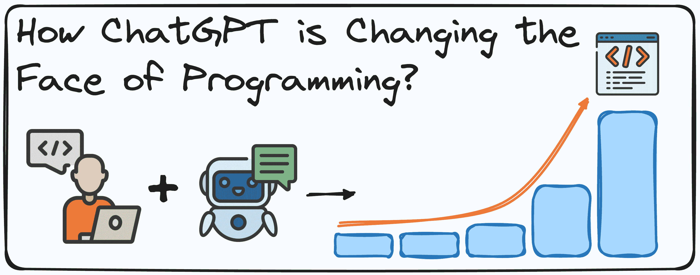
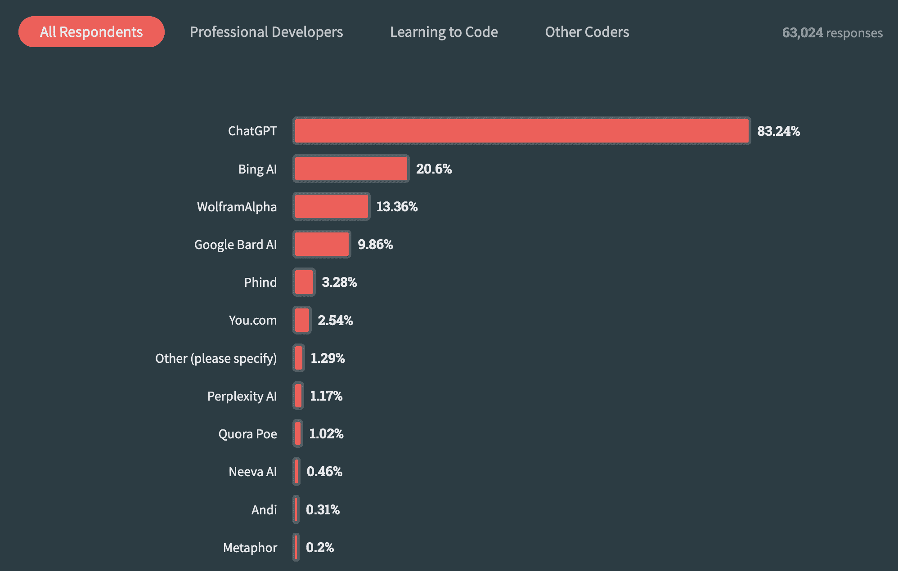
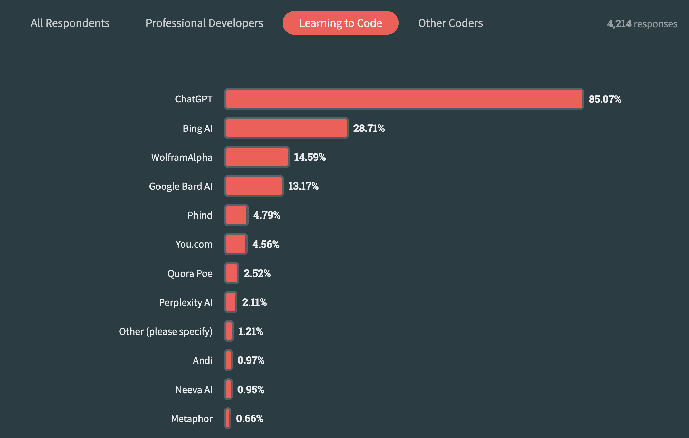

# ChatGPT 如何改变编程的面貌

> 原文：[`www.kdnuggets.com/how-chatgpt-is-changing-the-face-of-programming`](https://www.kdnuggets.com/how-chatgpt-is-changing-the-face-of-programming)

作者提供的图片

自从 OpenAI 的 ChatGPT 发布以来，编程领域进入了一个新纪元。通过利用先进的自然语言处理能力，初学者和经验丰富的开发者现在拥有强大的工具来简化编码过程。

* * *

## 我们的三大课程推荐

1\. [Google 网络安全证书](https://www.kdnuggets.com/google-cybersecurity) - 快速进入网络安全职业领域。

2\. [Google 数据分析专业证书](https://www.kdnuggets.com/google-data-analytics) - 提升您的数据分析能力

3\. [Google IT 支持专业证书](https://www.kdnuggets.com/google-itsupport) - 支持您的组织 IT

* * *

像 ChatGPT 或 Gemini 这样的 AI 驱动聊天机器人改变了开发者解决复杂问题和学习新技术的方式。这就是为什么 OpenAI 发布 GPT-4 时，许多用户测试其从零开始创建功能性程序的能力。

结果是什么？

它表现得非常出色。例如，Ammaar Reshi 完全使用 GPT-4 创建了一个《贪吃蛇》游戏，他的演示视频获得了超过 300 万次的观看。[点击这里观看视频。](https://x.com/ammaar/status/1635754631228952576)

从那时起，AI 编程工具有了显著的发展，从简单的代码补全进化到基于自然语言指令生成代码，如 GitHub Copilot 所示。这些进步不仅简化了开发者的编码工作，也让没有编程经验的人变得更容易上手。

如果未来世界有确定性的话，那就是 AI 工具将深刻改变人们学习编程和日常编程的方式。本文旨在预测未来几年这一领域将经历的主要变化。

## 1\. 缩小知识差距

ChatGPT 的一个最显著的影响是它能够普及编程知识。无论你是经验丰富的开发者还是初学者，ChatGPT 都是一个易于获取的信息来源。

例如，[根据去年的 StackOverflow 调查](https://survey.stackoverflow.co/2023/#most-popular-technologies-ai-search)，所有受访者都在使用至少一种 AI 工具作为知识搜索工具，并且明显偏向于 ChatGPT。超过 83% 的受访者每天都在使用 ChatGPT（专业开发者为 83%，学习者为 85%）。

Stack Overflow 2023 调查的截图。受访者使用了哪些 AI 搜索工具？

**ChatGPT**可以提供清晰的解释、代码片段和逐步指南。这意味着如果今天一个人需要理解一个新的 ML 模型或想要快速掌握一门新的编程语言，AI 工具如 **ChatGPT** 可以作为个性化的老师。

例如，一个新手试图理解面向对象编程的概念，可以轻松地向 **ChatGPT** 请求清晰的解释。这在学习曲线中真正改变了游戏规则。之前学习者必须阅读密集的教科书或观看无尽的在线教程，而现在用户可以获得针对自然语言提示的即时、量身定制的响应。

这种即时获取知识的能力降低了新手的入门门槛，并提高了有经验程序员的学习速度。

## 2\. 提升代码质量和效率

编写干净、高效且无错误的代码仍然是许多开发者面临的挑战。这就是为什么像**ChatGPT**这样的 AI 驱动工具可以通过建议最佳实践、提供代码评审，甚至生成符合行业标准的代码片段来提供帮助。

想象一下你正在编写一个 Python 脚本，需要一个快速的函数来解析 JSON 数据。**ChatGPT**可以为你生成这个函数，包含错误处理和优化建议。

此外，**ChatGPT** 也可以帮助调试代码。

之前我们大多数人都花费了数小时尝试找出代码为何不起作用，现在我们可以将代码片段分享给 **ChatGPT** 并获得直接的评审。

像 GitHub Copilot 这样的新工具正在变得越来越受欢迎，以加速开发过程。[根据 Stack Overflow 调查](https://survey.stackoverflow.co/2023/#most-popular-technologies-ai-search-learn)，近 80% 的开发者在日常工作中使用基于 AI 的编码辅助工具。

2023 年 Stack Overflow 调查的截图。使用 AI 驱动的编码辅助工具

AI 工具改善了编码过程，使它们在现代软件开发中成为无价的资产。

## 3\. 促进协作与沟通

编程通常需要同事之间的协作和清晰的沟通。最佳实践之一是记录任何正在开发的过程，不是吗？

**ChatGPT** 可以通过生成文档、编写有用的代码注释，甚至将技术术语翻译成易于理解的词汇，来帮助我们服务于没有技术知识的同事。

让我们假设你正在与一个远程团队合作生成一个工作的 API 端点。你可以轻松使用 **ChatGPT** 草拟关于你的 API 端点进展的完整文档，确保每个人都在同一页上。

目前甚至有一些 AI 工具已经集成到 Teams 或 Slack 等呼叫软件中，用于记录会议记录，并确保每个人都对相同的要点和主要目标有一致的认识。这进一步提升了团队的生产力，并确保知识被很好地记录下来且易于传递。

## 4\. 自动化重复任务

重复任务可能会耗尽开发者的创造力和生产力。ChatGPT 和 AI 驱动工具可以自动化许多这些枯燥的任务，让开发者可以专注于项目中更复杂和更有价值的方面。这包括生成样板代码和设置项目模板。

让我们考虑一下设置新项目的任务。这通常涉及创建目录、初始化版本控制、设置虚拟环境和安装依赖项。

工作量很大，对吧？

借助像 ChatGPT 这样的 AI 驱动工具，你可以通过接收一个处理设置过程的脚本来自动化这些步骤，从而节省宝贵的时间并减少人为错误的风险。

## 5\. 学习与适应

目前像 ChatGPT 或 Gemini 这样的 AI 驱动工具已经连接到互联网。这意味着它们不断更新新编程语言、框架和工具，使得开发者可以依赖它们获取最新的事实和信息。

此外，模型微调甚至个性化 GPT 可以调整模型，以进一步符合个人用户的偏好和编码风格，从而提供更个性化的帮助。

例如，如果你经常使用某个特定的 JavaScript 框架，比如 React，ChatGPT 可以调整其推荐或示例，以对应当前 React 开发中的最新进展。

这种持续的学习和适应确保了 ChatGPT 即使在编程世界不断演变的情况下，仍然是一个宝贵的资源。

## 结论

这些 AI 驱动工具不仅仅是聊天机器人，它们是强大的助手，能够简化开发过程。在知识触手可及方面，包括代码质量改进措施、协作增强步骤和任务自动化流程。这使得编码对所有人都变得更加可及，无论是业余编码者还是经验丰富的开发者。将 ChatGPT 集成到工作流程中可以提升生产力水平并增加创新能力。

通过这些新型的 AI 驱动工具迎接编程的未来。这将改变你对编码的看法，使其比以往任何时候都更容易和更具协作性。

****[Josep Ferrer](https://www.linkedin.com/in/josep-ferrer-sanchez)**** 是一位来自巴塞罗那的分析工程师。他拥有物理工程学位，目前在应用于人类流动性的领域从事数据科学工作。他还是一名兼职内容创作者，专注于数据科学和技术。Josep 涉及 AI 的所有事宜，涵盖了该领域的持续爆炸性发展。

### 更多相关内容

+   [ChatGPT 作为 Python 编程助手](https://www.kdnuggets.com/2023/01/chatgpt-python-programming-assistant.html)

+   [DataLang: 为数据科学家创造的新编程语言… 详细介绍…](https://www.kdnuggets.com/2023/04/datalang-new-programming-language-data-scientists-chatgpt.html)

+   [如何在不断变化的世界中成长为数据科学家](https://www.kdnuggets.com/2022/01/grow-data-scientist-everchanging-world.html)

+   [Python f-Strings 魔法：每个编码员都需要知道的 5 个改变游戏规则的技巧](https://www.kdnuggets.com/python-fstrings-magic-5-gamechanging-tricks-every-coder-needs-to-know)

+   [工作的未来：人工智能如何改变工作环境](https://www.kdnuggets.com/2023/04/future-work-ai-changing-job-landscape.html)

+   [IT 人员补充：人工智能如何改变软件开发行业](https://www.kdnuggets.com/2023/05/staff-augmentation-ai-changing-software-development-industry.html)
