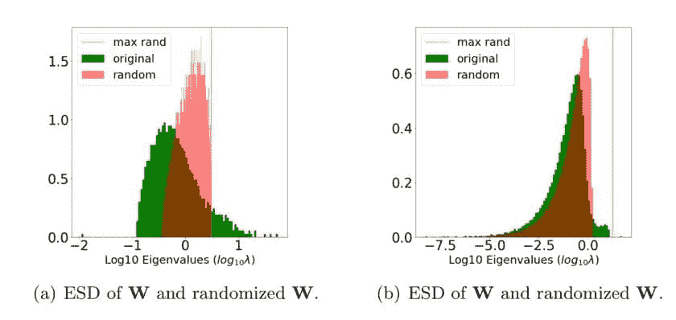
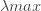
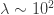

# 如何确定你的机器学习模型是否过拟合

> 原文：[`www.kdnuggets.com/2021/05/how-determine-machine-learning-model-overtrained.html`](https://www.kdnuggets.com/2021/05/how-determine-machine-learning-model-overtrained.html)

评论

**作者 [Charles Martin](http://linkedin.com/in/charlesmartin14)，Calculation Consulting**



你的模型是否过拟合？Weightwatcher 工具可以检测预训练或训练深度神经网络中特定层的过拟合特征。

在上面的图中，图 (a) 是训练良好的，而图 (b) 可能已经过拟合。右侧的橙色峰值是明显的线索；这就是我们所说的*相关性陷阱*。

Weightwatcher 可以检测预训练或训练深度神经网络中特定层的过拟合特征。在这篇文章中，我们展示了如何使用 Weightwatcher 工具来实现这一点。

### WeightWatcher

**WeightWatcher** (WW)：是一个开源的诊断工具，用于分析深度神经网络（DNN），无需访问训练数据或测试数据。它逐层分析预训练或训练的 DNN 的权重矩阵，以帮助你检测潜在问题。这些问题是通过仅查看测试准确性或训练损失无法发现的。

**安装：**

```py
pip install weightwatcher
```

**使用：**

```py
import weightwatcher as ww
import torchvision.models as models

model = models.vgg19_bn(pretrained=True)
watcher = ww.WeightWatcher(model=model)
details = watcher.analyze(plot=True, randomize=True)
```

对于每一层，Weightwatcher 绘制了经验谱密度（ESD）。这只是该层相关矩阵**X=W^TW**的特征值的直方图。

```py
import numpy as np
import matplotlib,pyplot as plt
...
X = np.dot(W,W.T)
evals, evecs = np.linalg.eig(X(
plt.hist(evals, bin=100, density=True)
...
```

通过指定随机化选项，WW 随机化权重矩阵**W**的元素，然后计算其 ESD。这个随机化的 ESD 会叠加在**X**的原始 ESD 上，并绘制在对数刻度上。

这在上面展示了。原始层 ESD 为**绿色**；随机化的 ESD 为**红色**，**橙色线**表示随机化 ESD 的最大特征值 。

如果层是良好训练的矩阵，那么当**W**被随机化时，其 ESD 会类似于正态分布的随机矩阵。这在上面的图 (a) 中有所展示。

但如果该层已过拟合，则其权重矩阵**W**可能包含一些异常大的元素，其中相关性可能集中或*被困*。在这种情况下，ESD 可能会有一个或多个异常大的特征值。这在上面的图 (b) 中有所展示，其中**橙色线**延伸到**红色** ESD 的右侧。

还要注意，在图 (a) 中，**绿色** 的 ESD 具有非常重尾的特性，直方图延伸到 log10=2，或最大特征值接近 100: 。但在图 (b) 中，绿色 ESD 的形状明显不同，规模比图 (a) 小。实际上，在 (b) 中，**绿色**（原始）和**红色**（随机化）的层 ESD 看起来几乎相同，除了一个较大的 **绿色** 特征值的小阶梯，延伸到并集中在 **橙色线** 附近。

**在这种情况下，我们可以将 橙色线 识别为 *相关性陷阱*。**

这表明在训练这一层时出现了问题，模型未能以一种能很好地泛化到其他示例的方式捕捉到这一层的相关性。

### 结论

使用 Weight Watcher 工具，你可以在训练或微调深度神经网络时检测到此类及其他潜在问题。

你可以在[WeightWatcher GitHub 网站](https://github.com/CalculatedContent/WeightWatcher)上了解更多信息。

**简介: [查尔斯·马丁博士](http://linkedin.com/in/charlesmartin14)** 与加州大学伯克利分校共同开发了 Weight Watcher 项目。他在加利福尼亚州旧金山经营一家精品咨询公司，帮助客户开发人工智能解决方案。他曾与 eBay、Blackrock、GoDaddy 和沃尔玛等大型公司合作，也与 Aardvark（被谷歌收购）和 Demand Media（自谷歌以来的首个十亿美元 IPO）等非常成功的初创公司合作。他还通过人类世研究所向 Page 家族办公室提供关于人工智能、核物理和量子力学/计算领域的建议。

[原文](https://calculatedcontent.com/2021/04/04/are-your-models-overtrained/)。经许可转载。

**相关:**

+   微软使用变换器网络以最少的训练回答关于图像的问题

+   教 AI 像人类一样看待事物

+   如何加速 Scikit-Learn 模型训练

* * *

## 我们的前三个课程推荐

 1\. [谷歌网络安全证书](https://www.kdnuggets.com/google-cybersecurity) - 快速进入网络安全职业轨道。

 2\. [谷歌数据分析专业证书](https://www.kdnuggets.com/google-data-analytics) - 提升你的数据分析技能

 3\. [谷歌 IT 支持专业证书](https://www.kdnuggets.com/google-itsupport) - 支持你的组织的 IT 需求

* * *

### 更多相关话题

+   [停止学习数据科学以寻找目的，并通过找到目的来…](https://www.kdnuggets.com/2021/12/stop-learning-data-science-find-purpose.html)

+   [学习数据科学统计的顶级资源](https://www.kdnuggets.com/2021/12/springboard-top-resources-learn-data-science-statistics.html)

+   [一个 90 亿美元的 AI 失败案例分析](https://www.kdnuggets.com/2021/12/9b-ai-failure-examined.html)

+   [成功数据科学家的 5 个特征](https://www.kdnuggets.com/2021/12/5-characteristics-successful-data-scientist.html)

+   [是什么让 Python 成为初创公司的理想编程语言](https://www.kdnuggets.com/2021/12/makes-python-ideal-programming-language-startups.html)

+   [每个数据科学家都应该知道的三个 R 语言库（即使你使用 Python）](https://www.kdnuggets.com/2021/12/three-r-libraries-every-data-scientist-know-even-python.html)
