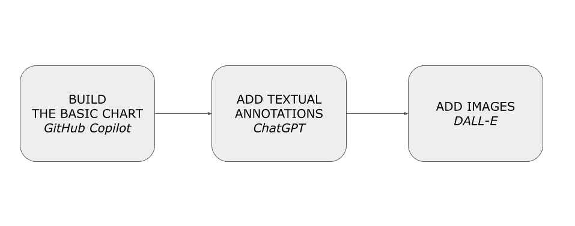
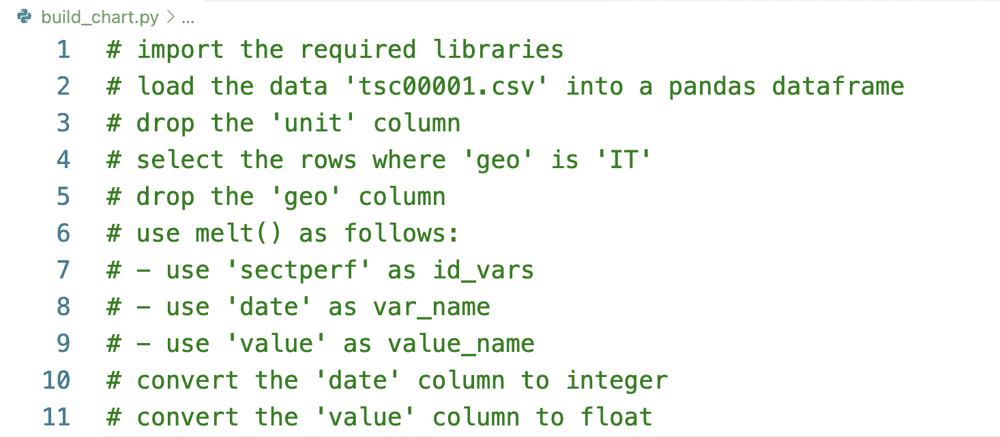
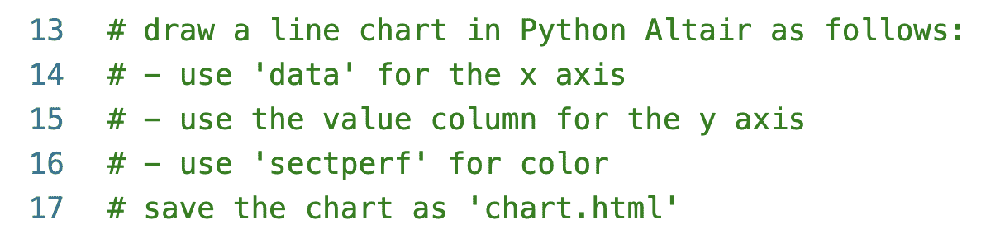
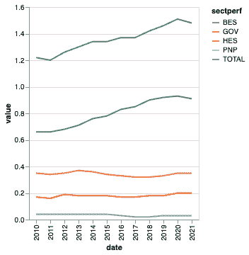
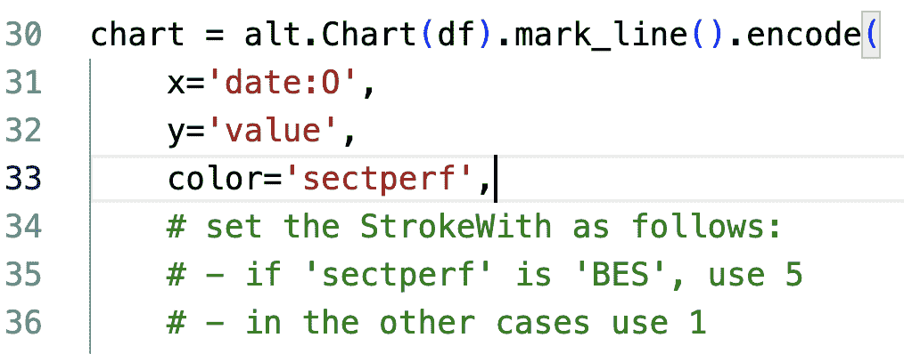
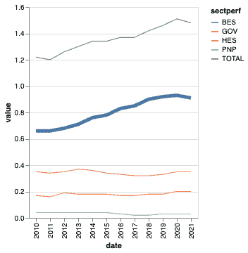
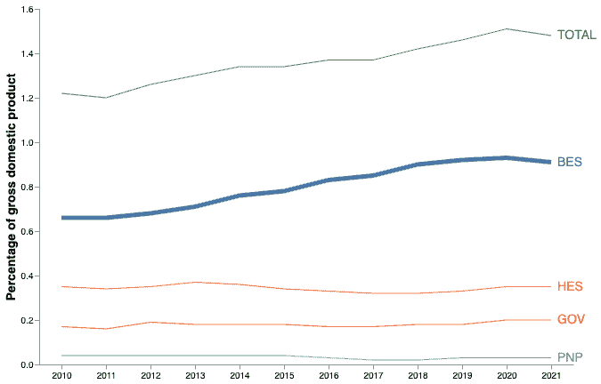
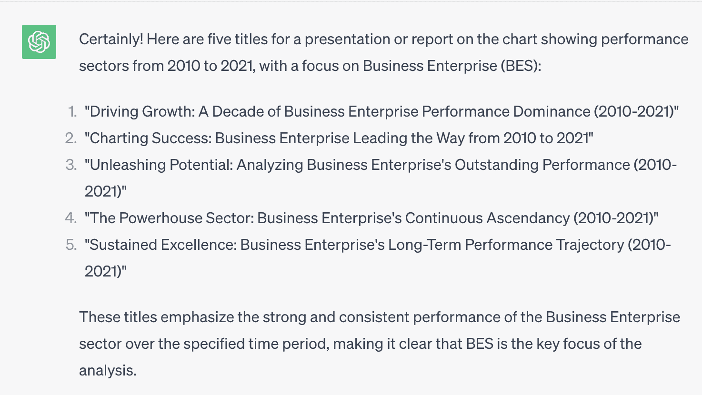
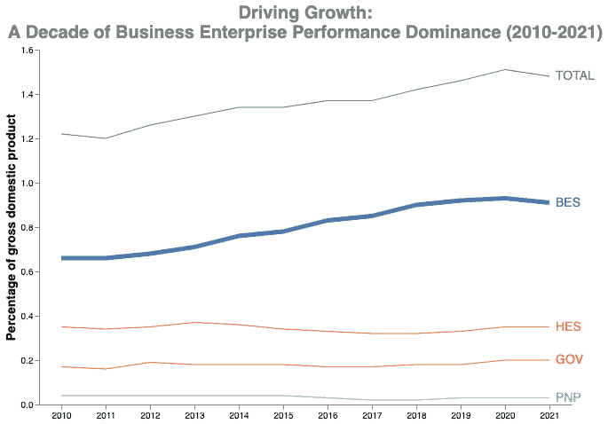
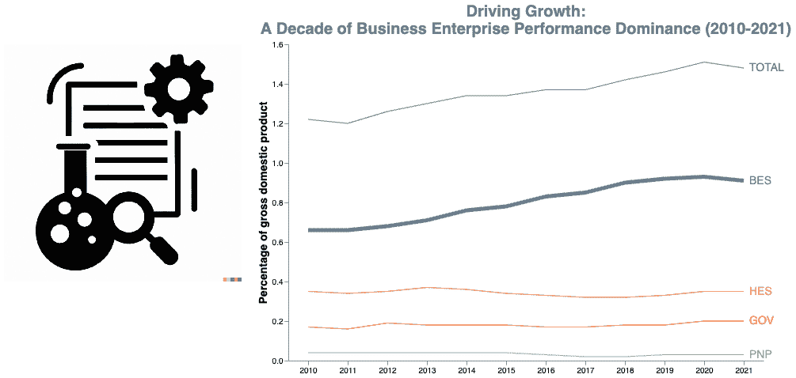

# 生成式 AI 如何帮助您改进数据可视化图表

> 原文：[`www.kdnuggets.com/how-generative-ai-can-help-you-improve-your-data-visualization-charts`](https://www.kdnuggets.com/how-generative-ai-can-help-you-improve-your-data-visualization-charts)


图片来自 DALLE 3

**5 个关键要点：**

+   数据可视化图表的基本结构

+   使用 Python Altair 构建数据可视化图表

+   使用 GitHub Copilot 加速图表生成

+   使用 ChatGPT 为您的图表生成相关内容

+   使用 DALL-E 为您的图表添加吸引人的图片

* * *

## 我们的三大课程推荐

 1\. [谷歌网络安全证书](https://www.kdnuggets.com/google-cybersecurity) - 快速入门网络安全职业。

 2\. [谷歌数据分析专业证书](https://www.kdnuggets.com/google-data-analytics) - 提升您的数据分析技能

 3\. [谷歌 IT 支持专业证书](https://www.kdnuggets.com/google-itsupport) - 支持您的组织进行 IT 支持

* * *

是否厌倦了花费数小时创建乏味的数据可视化图表？利用生成式 AI 的力量来改进您的数据可视化。在本文中，我们将探讨如何使用生成式 AI 来丰富您的图表。我们将使用前沿工具，如 Python Altair、GitHub Copilot、ChatGPT 和 DALL-E，通过生成式 AI 的支持来实现我们的图表。

首先，让我们使用 GitHub Copilot 实现基本图表。接下来，我们将使用 ChatGPT 添加文本注释（例如标题）。最后，我们将使用 DALL-E 为图表添加图片。作为编程语言，我们将使用 Python 和 [Python Altair](https://www.google.com/url?q=https://altair-viz.github.io/&sa=D&source=editors&ust=1705858646282599&usg=AOvVaw2-EwwZx5EneBOMdQcbg9pS) 可视化库。

我们将涵盖：

+   定义用例

+   基本图表构建：使用 GitHub Copilot

+   添加注释：ChatGPT

+   添加图片：DALL-E。

# 用例：意大利的研发支出

作为一个用例，我们将绘制一个图表，表示按绩效领域划分的研发支出，使用 [数据集](https://www.google.com/url?q=https://ec.europa.eu/eurostat/databrowser//product/view/TSC00001&sa=D&source=editors&ust=1705858646283879&usg=AOvVaw31i-cSJocvLruW34S1sIrB) ，该数据集由 Eurostat 以开放数据许可证发布。为了使过程更易于访问，我们将使用一个简化版的 [数据集](https://www.google.com/url?q=https://github.com/alod83/data-science/blob/master/DataVisualization/GenerativeAI/tsc00001.csv&sa=D&source=editors&ust=1705858646284229&usg=AOvVaw1qT46T8PePILI7HSzIW7xe)，该数据集已经转换为 CSV 格式。下表显示了数据集的一个摘录：

| unit | sectperf | geo | 2010 | 2011 | 2012 | 2013 | 2014 | 2015 | 2016 | 2017 | 2018 | 2019 | 2020 | 2021 |
| --- | --- | --- | --- | --- | --- | --- | --- | --- | --- | --- | --- | --- | --- | --- |
| PC_GDP | BES | AT | 1.87 | 1.84 | 2.05 | 2.09 | 2.2 | 2.18 | 2.19 | 2.14 | 2.16 | 2.2 | 2.23 | 2.22 |
| PC_GDP | BES | BA |  |  | 0.16 | 0.19 | 0.05 |  |  |  |  | 0.07 | 0.08 |  |
| PC_GDP | BES | BE | 1.38 | 1.49 | 1.59 | 1.62 | 1.66 | 1.7 | 1.73 | 1.87 | 2.05 | 2.33 | 2.48 | 2.42 p |
| PC_GDP | BES | BG | 0.28 | 0.28 | 0.36 | 0.39 | 0.52 | 0.7 | 0.56 | 0.52 | 0.54 | 0.56 | 0.57 | 0.51 |

数据集包含以下列：

+   unit - 该列的值始终设为国内生产总值百分比（PC_GDP）

+   sectperf - 绩效领域。可能的值包括：商业企业（BES）；政府（GOV）；高等教育（HES）；私人非营利（PNP），以及 TOTAL

+   geo - 欧洲国家

+   2010-2021 - 指定年份的支出值。

作为一个具体案例，让我们关注意大利的 BES，并使用 Python Altair（一个数据可视化库）绘制图表。

# 构建基本图表：使用 GitHub Copilot

GitHub Copilot 是一个生成性 AI 工具，您可以在编写代码时将其作为助手使用。在 GitHub Copilot 中，您描述软件必须执行的操作序列，GitHub Copilot 将其转换为您所需编程语言的可执行代码。使用 GitHub Copilot 的能力在于学习如何描述操作序列。

## 安装 Copilot

在使用 GitHub Copilot 之前，您必须首先为您的个人 GitHub 帐户设置免费试用或订阅。如果您是教师或学生，可以通过以下链接设置免费订阅计划：[`education.github.com/discount_requests/pack_application`](https://www.google.com/url?q=https://education.github.com/discount_requests/pack_application&sa=D&source=editors&ust=1705858646306016&usg=AOvVaw1vvkxavgy9HPMBwsYs2AxK)。

一旦激活订阅计划，您可以将 Copilot 配置为 [Visual Studio Code](https://www.google.com/url?q=https://code.visualstudio.com/&sa=D&source=editors&ust=1705858646306454&usg=AOvVaw085uAFghr9pIkDh4p-Vw8V) (VSC) 的扩展，这是一个免费的开源代码编辑器，旨在帮助开发人员编写和调试代码。

按照以下步骤配置 VSC 与 Copilot：

+   从其官方网站下载 VSC: [`visualstudio.microsoft.com/it/downloads/`](https://www.google.com/url?q=https://visualstudio.microsoft.com/it/downloads/&sa=D&source=editors&ust=1705858646306920&usg=AOvVaw3wQlZYS_k0SjRgyx3ZutW5)

+   打开 Visual Studio 并导航到扩展选项卡

+   下载并安装 GitHub Copilot 扩展，并从仪表板中选择连接到你的帐户。

+   输入你的 GitHub 凭证。

+   登录后，扩展程序会检测到现有的仓库并提供配置新项目的选项。

## 使用 Copilot 作为代码助手

使用 Copilot，让我们为可视化生成基本图表。为了构建图表，我们执行两个步骤：

+   加载和预处理数据 - 将数据集加载为 Pandas DataFrame，删除不必要的列，选择仅与意大利相关的行，并使用 Pandas melt() 将与 2010-2021 相关的列转换为行。

+   将图表构建为折线图。

让我们从第一步开始，加载和预处理数据。为 Copilot 编写以下指示：



按下键盘上的 ENTER 按钮，Copilot 开始生成与所写指示相对应的代码。以下代码片段展示了 Copilot 生成的一个可能输出：

```py
import pandas as pd
import altair as alt

df = pd.read_csv('tsc00001.csv')
df = df.drop(columns=['unit'])
df = df[df['geo'] == 'IT']
df = df.drop(columns=['geo'])
df = pd.melt(df, id_vars=['sectperf'], var_name='date', value_name='value')
df['date'] = df['date'].astype(int)
df['value'] = df['value'].astype(float) 
```

记住，Copilot 是一个生成模型，因此你得到的输出可能与之前的不同。

现在，让我们继续进行构建图表的指示。为 Copilot 编写以下指示：



Copilot 将生成类似于下面代码片段的 Python 代码：

```py
chart = alt.Chart(df).mark_line().encode(
    x='date:O',
    y='value',
    color='sectperf'
)

chart.save('chart.html') 
```

保存脚本，并从命令行运行它。作为输出，脚本会生成一个名为 chart.html 的 HTML 文件。使用你喜欢的浏览器打开它。以下图形展示了生成的图表：



现在你已经构建了基本图表，你可以手动改进它或使用 Copilot。例如，你可以让 Copilot 生成增加 BES 笔画宽度的代码。在颜色行后添加逗号，并开始编写如下指示：



按下 ENTER 并等待 Copilot 为你编写代码。以下代码片段展示了 Copilot 生成的一个可能输出：

```py
strokeWidth=alt.condition(
        alt.datum.sectperf == 'BES',
        alt.value(5),
        alt.value(1)
    ) 
```

以下图形展示了改进后的图表：



你可以通过让 Copilot 旋转 X 标签、设置标题等进一步改善图表。你可以在[1]中了解更多关于如何改善图表的详细信息。下图显示了清理后的图表版本。你可以在 [这个链接](https://www.google.com/url?q=https://github.com/alod83/data-science/tree/master/DataVisualization/GenerativeAI&sa=D&source=editors&ust=1705858646311408&usg=AOvVaw2hrxA1TGf9q_ncbi1988re) 找到完整代码。



一旦基础图表准备好，我们可以继续下一步，使用 ChatGPT 设置图表标题。

## 添加注释：ChatGPT

ChatGPT 是由 OpenAI 开发的高级语言模型。它旨在进行类似人类的对话并提供智能响应。我们可以利用 ChatGPT 为我们的图表生成文本，包括标题和注释。

要使用 ChatGPT，请访问 [`chat.openai.com/`](https://www.google.com/url?q=https://chat.openai.com/&sa=D&source=editors&ust=1705858646312232&usg=AOvVaw0d1gHayHcNfHg4_20T6Cp_)，登录你的账户或创建一个新账户，然后像实时聊天一样在输入文本框中开始编写提示。每当你想开始一个新话题时，通过点击左上角的“新聊天”按钮创建一个新聊天会话。

网页界面还提供了一个付费账户，提供一些额外功能，例如使用高级模型的可能性，以及一套额外功能，如优先支持、扩展的自定义选项和对 beta 功能和更新的独占访问权限。

要与 ChatGPT 互动，请编写一个定义要执行的指令的输入文本（提示）。为 ChatGPT 结构化提示有多种方式。在本文中，我们考虑一个由三个主要连续文本组成的提示：

+   告诉 ChatGPT 扮演一个特定的[角色]——例如，“你是一个正在查看高中生英语试卷的考官。”

+   告诉 ChatGPT 根据预期的[受众]量身定制其输出——例如，“以高中生能理解的方式解释你的评分。”

+   确定[任务]——例如，“对这段文本进行评分并解释你的推理。”

在我们的示例中，我们可以将提示格式化如下：

以数据分析师的身份与决策者沟通。为以下主题生成 5 个标题：一张显示 2010 年至 2021 年绩效部门的图表。绩效部门包括商业企业（BES）；政府（GOV）；高等教育（HES）；和私人非营利组织（PNP）。你希望关注 BES，因为它在时间上具有最高的值。

ChatGPT 生成了五个标题，如下图所示：



如果你再次运行相同的提示，ChatGPT 将生成另外五个标题。例如，我们可以选择第一个标题，*Driving Growth: A Decade of Business Enterprise Performance Dominance (2010-2021)*，并将其设为图表标题：

```py
chart = alt.Chart(df).mark_line().encode(
   …
).properties(
    width=600,
    height=400,
    **title=['Driving Growth:',
        'A Decade of Business Enterprise Performance Dominance (2010-2021)']**
) 
```

下图显示了结果图表：



图表几乎完成了。为了提高图表的可读性并引起观众的情感共鸣，我们可以添加一张图像。

## 添加图像：DALL-E

DALL-E 是由 OpenAI 创建的生成型 AI 模型。它结合了 GPT-3 的强大功能和图像生成能力，使其能够根据文本描述生成逼真的图像。要使用 DALL-E，你必须在 [Open AI 网站](https://www.google.com/url?q=https://labs.openai.com/&sa=D&source=editors&ust=1705858646315282&usg=AOvVaw10MLi2b2UdVaSaiPZyf5rh) 上注册账户并购买一些积分。

存在不同的方式来结构化 DALL-E 的提示。在本文中，我们考虑一个由以下内容组成的提示：

+   [主题]

+   [风格]。

在我们的案例中，我们可以生成一个主题为：代表研发支出的黑白图标的通用图像。

下图显示了 DALL-E 生成的一个可能输出：


让我们选择第三张图像并将其添加到图表中，如下代码片段所示：

```py
df_red = pd.DataFrame({'url': ['red.png']})

red = alt.Chart(df_red).mark_image(
    align='center',
    baseline='top',
    width=300,
    height=300
).encode(
    url='url'
)

chart = (red | chart + text) 
```

要查看图表中的图像，你必须在 Web 服务器上运行它。从包含 HTML 文件的目录中运行以下 Python 命令以启动简单的 Web 服务器：`python3 -m http.server`，然后指向 localhost:8000/chart.html。你应该会看到一个类似于以下的图表：



你可以根据自己的喜好自定义图表。例如，你可以为每个表现部门生成一个图标。

# 总结

恭喜你！你刚刚学会了如何使用生成型 AI 工具来增强你的数据可视化图表！

+   首先，使用 GitHub Copilot 编写你的基本图表。

+   接下来，使用 ChatGPT 为你的图表生成文本描述，例如标题和注释。

+   最后，使用 DALL-E 生成图像以包含在图表中，以提高可读性并吸引观众。

你可以从这个 [GitHub 仓库](https://www.google.com/url?q=https://github.com/alod83/data-science/tree/master/DataVisualization/GenerativeAI&sa=D&source=editors&ust=1705858646318016&usg=AOvVaw3vJB5N_aYNNvIo9xGQDbCg) 下载本示例中描述的完整代码。此外，你可以在 [1] 中找到关于如何在数据讲述中使用生成型 AI 的更多详细信息。

## 参考资料

[1] A. Lo Duca.[使用生成 AI 进行数据讲述，利用 Python 和 Altair](https://www.google.com/url?q=https://www.manning.com/books/data-storytelling-with-generative-ai&sa=D&source=editors&ust=1705858646318426&usg=AOvVaw0wcK-1OhSybbfj9jaNMRyK). Manning Publications.

[2] A. Lo Duca. [使用 Python Altair 进行数据讲述](https://www.google.com/url?q=https://www.educative.io/courses/using-python-altair-for-data-storytelling&sa=D&source=editors&ust=1705858646318658&usg=AOvVaw1hNtdyrwtUUuL948zPkbA1). Educative Inc.

**[](https://www.linkedin.com/in/angelicaloduca/)**[Angelica Lo Duca](https://www.linkedin.com/in/angelicaloduca/)**** ([Medium](https://alod83.medium.com/)) (@alod83) 是意大利比萨国家研究委员会（IIT-CNR）信息学与电信研究所的研究员。她是比萨大学数字人文学科硕士课程中“数据新闻学”课程的教授。她的研究兴趣包括数据科学、数据分析、文本分析、开放数据、网络应用、数据工程和数据新闻学，应用于社会、旅游和文化遗产领域。她是由 Packt Ltd. 出版的《数据科学的彗星》一书的作者，Manning 出版的即将出版的《Python Altair 和生成 AI 中的数据讲述》一书的作者，以及即将出版的 O'Reilly Media 出版的《学习和操作 Presto》一书的合著者。Angelica 还是一位热情的技术作家。

### 更多相关主题

+   [SQL 用于数据可视化：如何准备数据以供图表和图形使用](https://www.kdnuggets.com/sql-for-data-visualization-how-to-prepare-data-for-charts-and-graphs)

+   [7 种 GPT 以提升你的数据科学工作流](https://www.kdnuggets.com/7-gpts-to-help-improve-your-data-science-workflow)

+   [数据科学项目可以帮助你解决现实世界中的问题](https://www.kdnuggets.com/2022/11/data-science-projects-help-solve-real-world-problems.html)

+   [5 种稀有的数据科学技能可以帮助你找到工作](https://www.kdnuggets.com/5-rare-data-science-skills-that-can-help-you-get-employed)

+   [免费的 Python 资源可以帮助你成为专家](https://www.kdnuggets.com/free-python-resources-that-can-help-you-become-a-pro)

+   [大多数公司数据访问严重不足，71%的人认为…](https://www.kdnuggets.com/2023/07/mostly-data-access-severely-lacking-synthetic-data-help.html)
