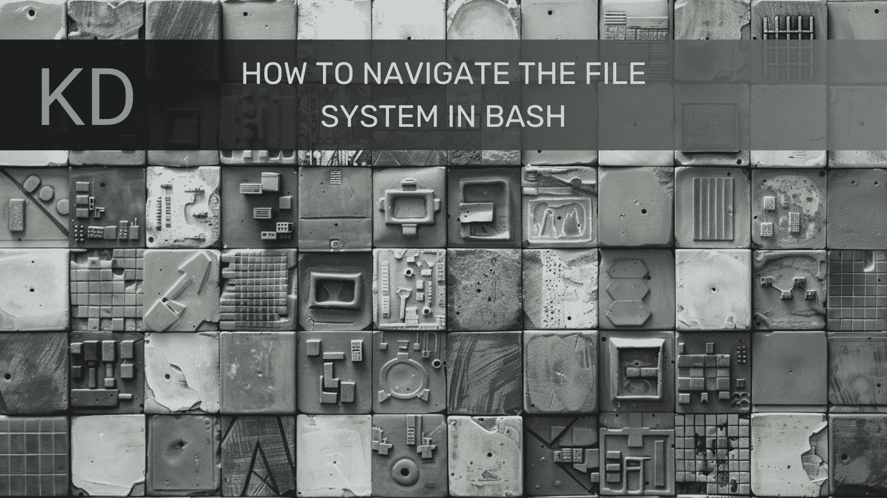

# 如何使用 Bash 导航文件系统

> 原文：[`www.kdnuggets.com/how-navigate-filesystem-bash`](https://www.kdnuggets.com/how-navigate-filesystem-bash)



作者提供的图片 | Midjourney & Canva

对于阅读此内容的人来说，Unix/Linux 文件系统以层次结构组织并不奇怪。最顶层的目录是根目录，由`/`表示。所有其他目录和文件都组织在根目录下。除此之外，每个用户都有一个主目录，通常由`~`表示，个人文件和目录存储在这里。

* * *

## 我们的前三个课程推荐

 1\. [Google 网络安全证书](https://www.kdnuggets.com/google-cybersecurity) - 快速进入网络安全职业生涯。

 2\. [Google 数据分析专业证书](https://www.kdnuggets.com/google-data-analytics) - 提升你的数据分析能力

 3\. [Google IT 支持专业证书](https://www.kdnuggets.com/google-itsupport) - 支持你的组织的 IT

* * *

虽然在 Linux 和其他类 Unix 系统上，许多文件管理可以通过图形用户界面文件管理器来处理，但使用 Bourne-Again Shell（bash）命令行提供了一种简单、灵活、快速的方式，并且能够与各种命令行工具和应用程序交互。

让我们深入了解如何使用 bash 导航 Unix/Linux 文件系统。

## `pwd` 命令

**目的**：显示当前工作目录。

**用法**：`pwd`命令使用简单。它显示你在文件系统中的当前位置的绝对路径。

```py
pwd
```

**示例**：

```py
$ pwd
/home/user
```

## 使用`cd`进行导航

**目的**：更改目录。

**基本用法**：`cd`命令允许你移动到不同的目录。

```py
cd /path/to/directory
```

**常见选项**：

+   **移动到主目录**：你可以使用`cd ~`或简单地使用`cd`快速导航到你的主目录。

+   **上移一个目录**：要移动到父目录，请使用`cd ..`。

+   **导航到子目录**：要进入当前目录下的子目录，只需使用`cd 子目录名称`。

## 使用`ls`列出文件

**目的**：列出文件和目录。

**基本用法**：`ls`命令列出当前目录中的文件和目录。

```py
ls
```

**常见选项**：

+   **详细列表**：要获取详细视图，请使用`ls -l`。这将提供文件权限、链接数量、所有者、组、文件大小和时间戳等信息。

+   **包括隐藏文件**：要包含隐藏文件（以`.`开头的文件），请使用`ls -a`。

+   **组合选项**：通过`ls -la`组合选项以获得更全面的列表。

## 使用`tree`可视化目录结构

**目的**：以树状格式显示目录。

**基本用法**：`tree`命令提供了目录结构的可视化表示。

```py
tree
```

**常用选项**：

+   **限制深度**：要限制目录树的深度，请使用`tree -L`后跟所需的级别。

+   **显示隐藏文件**：使用`tree -a`包括隐藏文件在树中。

## 实际例子

让我们通过一个实际的例子来讲解如何导航到一个目录、列出其内容并显示其结构。

```py
cd ~/projects
pwd
ls -la
tree -L 1
```

**解释**：

+   `cd ~/projects`：导航到你家目录下的`projects`目录。

+   `pwd`：确认你当前的目录。

+   `ls -la`：列出所有文件，包括隐藏文件，并附带详细信息。

+   `tree -L 1`：显示目录结构，深入到一级。

## 高效导航的命令组合

你可以使用`&&`将命令链在一起，以顺序执行多个命令。这可以简化你的工作流程。

```py
cd ~/projects && ls -la && tree -L 2
```

这个命令序列导航到`projects`目录，列出所有文件的详细信息，然后显示目录结构，深入到两级。

## 最终想法

练习本文介绍的命令将帮助你在浏览 Unix/Linux 文件系统时更加熟练。一旦你熟悉了这些基础知识，你可以深入探索更高级的导航和文件操作命令。

[](https://www.linkedin.com/in/mattmayo13/)****[Matthew Mayo](https://www.kdnuggets.com/wp-content/uploads/./profile-pic.jpg)**** ([**@mattmayo13**](https://twitter.com/mattmayo13)) 拥有计算机科学硕士学位和数据挖掘研究生文凭。作为[KDnuggets](https://www.kdnuggets.com/)和[Statology](https://www.statology.org/)的执行编辑，以及[Machine Learning Mastery](https://machinelearningmastery.com/)的贡献编辑，Matthew 致力于使复杂的数据科学概念变得易于理解。他的专业兴趣包括自然语言处理、语言模型、机器学习算法，以及探索新兴 AI。他的使命是使数据科学社区的知识变得普及。Matthew 从 6 岁起便开始编程。

### 更多相关主题

+   [如何使用 Python 的 Pathlib 导航文件系统](https://www.kdnuggets.com/how-to-navigate-the-filesystem-with-pythons-pathlib)

+   [5 个真正有用的 Bash 脚本用于数据科学](https://www.kdnuggets.com/2023/02/bash-scripts-data-science.html)

+   [如何在 Bash 中管理文件和目录](https://www.kdnuggets.com/how-to-manage-files-and-directories-in-bash)

+   [用 Bash 构建你的第一个 ETL 管道](https://www.kdnuggets.com/building-your-first-etl-pipeline-with-bash)

+   [AI Con USA: AI 的未来](https://www.kdnuggets.com/2024/02/techwell-ai-con-usa-navigate-the-future-of-ai)

+   [AI Con USA: 2024 年 AI 的未来](https://www.kdnuggets.com/2024/04/ai-con-usa-navigate-the-future-of-ai)
