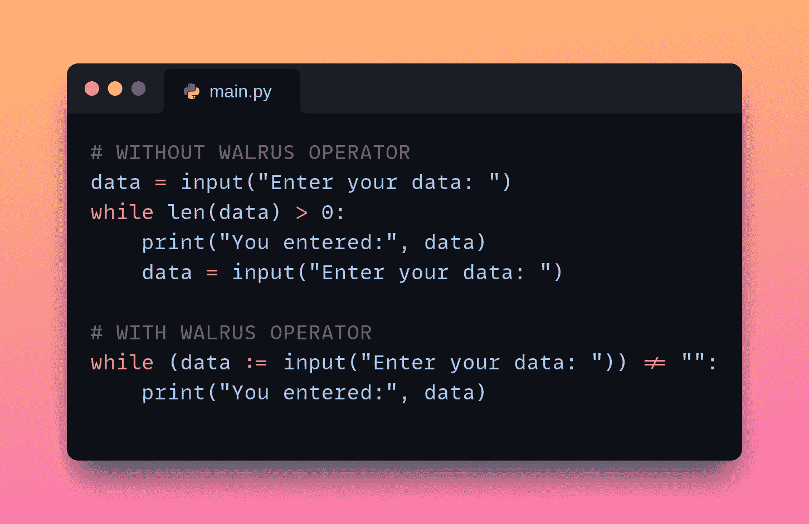

# 如何（不）使用 Python 的海象运算符

> 原文：[`www.kdnuggets.com/how-not-to-use-pythons-walrus-operator`](https://www.kdnuggets.com/how-not-to-use-pythons-walrus-operator)



图片由作者提供 | 在 Snappify 上创建

在 Python 中，如果你想在表达式内为变量赋值，你可以使用海象运算符 :=。虽然`x = 5`是一个简单的变量赋值，但`x := 5`是你将使用海象运算符的方式。

* * *

## 我们的前三大课程推荐

 1\. [Google 网络安全证书](https://www.kdnuggets.com/google-cybersecurity) - 快速入门网络安全职业

 2\. [Google 数据分析专业证书](https://www.kdnuggets.com/google-data-analytics) - 提升你的数据分析技能

 3\. [Google IT 支持专业证书](https://www.kdnuggets.com/google-itsupport) - 支持你的组织的 IT

* * *

这个运算符在 Python 3.8 中引入，它可以帮助你编写更简洁、更具可读性的代码（在某些情况下）。然而，不必要或过多地使用它也会使代码更难理解。

在本教程中，我们将通过简单的代码示例来探索海象运算符的有效使用和不那么有效的使用。让我们开始吧！

## Python 的海象运算符的使用时机与方法

让我们从看一些示例开始，这些示例中海象运算符可以使你的代码更好。

#### 1\. 更简洁的循环

循环构造中常见的情况是读取输入以在循环中处理，并且循环条件依赖于输入。在这种情况下，使用海象运算符可以帮助你保持循环更简洁。

**没有海象运算符**

请考虑以下示例：

```py
data = input("Enter your data: ")
while len(data) > 0:
    print("You entered:", data)
    data = input("Enter your data: ")
```

当你运行上述代码时，只要输入非空字符串，你会被重复提示输入一个值。

注意到有冗余的部分。你最初将输入读取到`data`变量中。在循环中，你打印出输入的值并再次提示用户输入。循环条件检查字符串是否为非空。

**使用海象运算符**

你可以去除冗余，并使用海象运算符重写上述版本。为此，你可以在循环条件中读取输入并检查它是否是非空字符串—全部在循环条件中—使用海象运算符如下：

```py
while (data := input("Enter your data: ")) != "":
    print("You entered:", data)
```

现在，这比第一版更简洁。

#### 2\. 更好的列表推导式

有时你会在列表推导式中调用函数。如果有多个开销较大的函数调用，这可能会很低效。在这些情况下，使用海象运算符重写代码可能会有帮助。

**没有海象运算符**

下面的示例中，列表推导式中有两个对`compute_profit`函数的调用：

+   要用利润值填充新列表

+   用来检查利润值是否超过指定的阈值。

```py
# Function to compute profit
def compute_profit(sales, cost):
	return sales - cost

# Without Walrus Operator
sales_data = [(100, 70), (200, 150), (150, 100), (300, 200)]
profits = [compute_profit(sales, cost) for sales, cost in sales_data if compute_profit(sales, cost) > 50]
```

**使用海象运算符**

你可以将函数调用的返回值分配给`profit`变量，然后像这样使用它来填充列表：

```py
# Function to compute profit
def compute_profit(sales, cost):
	return sales - cost

# With Walrus Operator
sales_data = [(100, 70), (200, 150), (150, 100), (300, 200)]
profits = [profit for sales, cost in sales_data if (profit := compute_profit(sales, cost)) > 50]
```

如果过滤条件涉及昂贵的函数调用，这种版本会更好。

## 如何不使用 Python 的海象运算符

现在我们已经看到了一些使用 Python 海象运算符的示例，我们来看看一些反模式。

#### 1\. 复杂的列表推导式

在前面的示例中，我们在列表推导式中使用了海象运算符，以避免重复的函数调用。但是，过度使用海象运算符可能也会有坏处。

由于多个嵌套的条件和赋值，以下列表推导式难以阅读。

```py
# Function to compute profit
def compute_profit(sales, cost):
    return sales - cost

# Messy list comprehension with nested walrus operator
sales_data = [(100, 70), (200, 150), (150, 100), (300, 200)]
results = [
	(sales, cost, profit, sales_ratio)
	for sales, cost in sales_data
	if (profit := compute_profit(sales, cost)) > 50
	if (sales_ratio := sales / cost) > 1.5
	if (profit_margin := (profit / sales)) > 0.2
]
```

作为练习，你可以尝试将逻辑分解为单独的步骤——在常规循环和 if 条件语句中。这将使代码更容易阅读和维护。

#### 2\. 嵌套的海象运算符

使用嵌套的海象运算符可能会导致代码难以阅读和维护。当逻辑涉及在单个表达式内进行多次赋值和条件判断时，这尤其成问题。

```py
# Example of nested walrus operators 
values = [5, 15, 25, 35, 45]
threshold = 20
results = []

for value in values:
    if (above_threshold := value > threshold) and (incremented := (new_value := value + 10) > 30):
        results.append(new_value)

print(results)
```

在这个例子中，嵌套的海象运算符使理解变得困难——要求读者在单行内解包多层逻辑，降低了可读性。

## 总结

在这个快速教程中，我们讨论了何时应该以及何时不应该使用 Python 的海象运算符。你可以在[GitHub](https://github.com/balapriyac/python-basics/tree/main/walrus-operator)上找到代码示例。

如果你想了解在使用 Python 编程时应该避免的常见陷阱，请阅读[5 个常见的 Python 陷阱及如何避免](https://www.kdnuggets.com/5-common-python-gotchas-and-how-to-avoid-them)。

继续编码！

**[](https://twitter.com/balawc27)**[Bala Priya C](https://www.kdnuggets.com/wp-content/uploads/bala-priya-author-image-update-230821.jpg)**** 是来自印度的开发者和技术写作者。她喜欢在数学、编程、数据科学和内容创作的交汇点上工作。她的兴趣和专长领域包括 DevOps、数据科学和自然语言处理。她喜欢阅读、写作、编码和喝咖啡！目前，她正在通过编写教程、操作指南、观点文章等与开发者社区分享她的知识。Bala 还创建了引人入胜的资源概述和编码教程。

### 更多相关主题

+   [SQL LIKE 运算符示例](https://www.kdnuggets.com/2022/09/sql-like-operator-examples.html)

+   [为什么你不应该过度使用 Python 的列表推导式](https://www.kdnuggets.com/why-you-should-not-overuse-list-comprehensions-in-python)

+   [Dask DataFrame 不是 Pandas](https://www.kdnuggets.com/2021/11/dask-dataframe-not-pandas.html)

+   [机器学习为何未能为我的业务创造价值？](https://www.kdnuggets.com/2021/12/machine-learning-produce-value-business.html)

+   [那些不太炫酷但能让你脱颖而出的 SQL 概念](https://www.kdnuggets.com/2022/02/not-so-sexy-sql-concepts-stand-out.html)

+   [别害怕，AI 编程来帮你了！](https://www.kdnuggets.com/2023/03/manning-fear-not-ai-coding-help-you.html)
