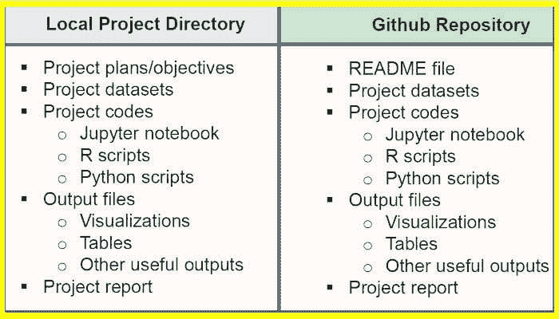

# 如何在 2021 年组织你的数据科学项目

> 原文：[`www.kdnuggets.com/2021/04/how-organize-your-data-science-project-2021.html`](https://www.kdnuggets.com/2021/04/how-organize-your-data-science-project-2021.html)

评论



*保持本地和 GitHub 上有两个版本的项目总是一个好主意。*

* * *

## 我们的前三名课程推荐

 1\. [Google 网络安全证书](https://www.kdnuggets.com/google-cybersecurity) - 快速进入网络安全职业生涯

 2\. [Google 数据分析专业证书](https://www.kdnuggets.com/google-data-analytics) - 提升你的数据分析能力

 3\. [Google IT 支持专业证书](https://www.kdnuggets.com/google-itsupport) - 支持你的组织 IT

* * *

本文将讨论一些实用的技巧，帮助你更好地组织数据科学项目。在深入探讨数据科学项目管理技巧之前，我们首先讨论一下组织项目的重要性。

### 组织项目的重要性有 4 个理由

1.  组织可以提高生产力。如果项目组织良好，所有内容都放在一个目录中，就可以更容易避免浪费时间寻找数据集、代码、输出文件等项目文件。

1.  组织良好的项目有助于你记录和维护进行中的数据科学项目和已完成的项目。

1.  完成的数据科学项目可以用于构建未来的模型。如果你将来需要解决类似的问题，可以使用相同的代码进行稍微的修改。

1.  一个组织良好的项目在分享至 GitHub 等平台时，其他数据科学专业人士可以更容易理解。

为了说明，我们将使用邮轮数据集。我们假设我们希望建立一个机器学习模型，根据预测变量（如年龄、吨位、乘客、长度、舱房等）推荐邮轮船员数量。在第一部分中，我们描述了如何在本地组织项目。然后在第二部分中，我们描述了如何为项目创建 GitHub 仓库。建议你保持本地和 GitHub 上两个版本的项目。这样做的好处是，只要你有互联网连接，就可以从世界任何地方随时访问 GitHub 上的项目版本。另一个好处是，如果你的本地计算机发生可能对计算机产生不利影响的情况，如计算机中的病毒，你可以放心，因为你仍然可以在 GitHub 上找到项目文件作为备份。

### I. 本地项目目录

为你正在进行的每个项目拥有一个项目目录是很好的。

**目录名称**

在为你的项目创建目录时，选择一个反映你项目的目录名称是好的，例如，对于推荐船员数量的机器学习模型，可以选择一个目录名称，例如 *ML_Model_for_Predicting_Ships_Crew_Size*。

**目录内容**

你的项目目录应包含以下内容：

(1) **项目计划：** 这可以是一个世界文档，你在其中描述你的项目内容。你可以先提供一个简要的概要，然后是你想要完成的逐步计划。例如，在构建模型之前，你可以问自己：

1.  预测变量是什么？

1.  目标变量是什么？我的目标变量是离散的还是连续的？

1.  我应该使用分类分析还是回归分析？

1.  我该如何处理数据集中的缺失值？

1.  当将变量调整到相同的尺度时，我应该使用归一化还是标准化？

1.  我应该使用主成分分析吗？

1.  我该如何调整模型中的超参数？

1.  我该如何评估模型以检测数据集中的偏差？

1.  我应该使用集成方法吗？即使用不同的模型进行训练，然后进行集成平均，例如，使用 SVM、KNN、逻辑回归等分类器，然后对 3 个模型进行平均？

1.  我该如何选择最终模型？

(2) **项目数据集**：你应该包括所有用于项目的数据集的逗号分隔值（CSV）文件。在这个例子中，只有一个 CSV 文件：[cruise_ship_info.csv](https://github.com/bot13956/ML_Model_for_Predicting_Ships_Crew_Size/blob/master/cruise_ship_info.csv)。

(3) **项目代码：** 一旦你弄清楚了你的项目计划和目标，就可以开始编码了。根据你解决的问题类型，你可能决定使用 jupyter 笔记本或 R 脚本来编写代码。我们假设我们将使用 jupyter 笔记本。

在你的 jupyter 笔记本上，开始添加项目标题或标题，例如：

```py
Machine Learning Model for Predicting a Ship’s Crew Size

```

然后，你可以提供一个简要的项目概要，接着是作者姓名和日期，例如：

```py
We build a simple model using the cruise_ship_info.csv data set for predicting a ship’s crew size. 
This project is organized as follows: 
(a) data preprocessing and variable selection; 
(b) basic regression model; 
(c) hyper-parameters tuning; and 
(d) techniques for dimensionality reduction.

Author: Benjamin O. Tayo
Date: 4/8/2019

```

在你开发代码时，你要确保 jupyter 笔记本被组织成强调机器学习模型构建工作流程的各个部分，例如：

```py
Importation of necessary python libraries

Importation of dataset

Exploratory data analysis

Feature selection and dimensionality reduction

Feature scaling and data partitioning into train and test sets

Model building, testing, and evaluation

```

对于示例项目的 jupyter 笔记本和 R 脚本文件，请参见以下 Github 库，[bot13956/ML_Model_for_Predicting_Ships_Crew_Size](https://github.com/bot13956/ML_Model_for_Predicting_Ships_Crew_Size/blob/master/Ship_Crew_Size_ML_Model.ipynb) 和 [bot13956/weather_pattern](https://github.com/bot13956/weather_pattern)。

(4) **项目输出：** 你也可以将关键项目输出存储在本地目录中。一些关键项目输出可能是数据可视化图表、显示模型误差与不同参数的函数关系的图形，或者包含关键输出的表格，如 R2 值、均方误差或回归系数。项目输出非常方便，因为它们可以用来准备项目报告或 PowerPoint 演示文稿，以便向数据科学团队或公司业务管理员展示。

(5) **项目报告**：在某些情况下，你可能需要编写一个项目报告，以描述项目成果，并根据模型的发现和见解提供建议行动方案。在这种情况下，你需要使用 MS Word 编写项目报告。在撰写项目报告时，你可以充分利用从主代码生成的一些可视化图表。你可以将这些图表添加到报告中。你的主代码可以作为项目报告的附录添加。

一个项目报告文件的示例可以在 [bot13956/Monte_Carlo_Simulation_Loan_Status](https://github.com/bot13956/Monte_Carlo_Simulation_Loan_Status) 找到。

### II. GitHub 项目目录

一旦你解决了感兴趣的问题，你需要在 GitHub 上创建一个项目仓库，并上传项目文件，如数据集、jupyter notebooks、R 程序脚本和示例输出。为任何数据科学项目创建 GitHub 仓库是极其重要的。它使你能够随时访问你的代码。你可以与程序员和其他数据科学家社区分享你的代码。此外，它还是展示你数据科学技能的一种方式。

**创建 GitHub 仓库的提示：** 确保你为你的仓库选择一个合适的标题。例如：

```py
Repository Name: bot13956/ML_Model_for_Predicting_Ships_Crew_Size

```

然后包含一个 README 文件，以提供项目的概要介绍。

```py
Author: Benjamin O. Tayo
Date: 4/8/2019

We build a simple model using the cruise_ship_info.csv data set for predicting a ship's crew size. 
This project is organized as follows: 
(a) data preprocessing and variable selection; 
(b) basic regression model; 
(c) hyper-parameters tuning; and 
(d) techniques for dimensionality reduction.

cruise_ship_info.csv: dataset used for model building.

Ship_Crew_Size_ML_Model.ipynb: the jupyter notebook containing code.

```

然后你可以上传你的项目文件，包括数据集、jupyter notebook 和示例输出。

这是一个机器学习项目的 GitHub 仓库示例：

**仓库** **网址**： [`github.com/bot13956/ML_Model_for_Predicting_Ships_Crew_Size`](https://github.com/bot13956/ML_Model_for_Predicting_Ships_Crew_Size)。

总之，我们讨论了数据科学项目的组织方式。良好的组织有助于提高生产力和效率。当你下次需要处理新项目时，请花时间组织你的项目。这不仅有助于提高效率和生产力，还能帮助减少错误。此外，保持对所有当前和已完成项目的良好记录使你能够创建一个仓库，在其中保存所有项目以备将来使用。

[原文](https://towardsdatascience.com/how-to-organize-your-data-science-project-dd6599cf000a)。经许可转载。

**相关：**

+   [学习如何构建一个端到端的数据科学项目](https://www.kdnuggets.com/2020/11/build-data-science-project.html)

+   [数据科学家的自动版本控制](https://www.kdnuggets.com/2019/09/automatic-version-control-data-scientists.html)

+   [数据科学家的软件工程基础](https://www.kdnuggets.com/2020/06/software-engineering-fundamentals-data-scientists.html)

### 更多相关内容

+   [2021 年最佳 ETL 工具](https://www.kdnuggets.com/2021/12/mozart-best-etl-tools-2021.html)

+   [成为优秀数据科学家的 5 项关键技能](https://www.kdnuggets.com/2021/12/5-key-skills-needed-become-great-data-scientist.html)

+   [每个初学者数据科学家都应该掌握的 6 种预测模型](https://www.kdnuggets.com/2021/12/6-predictive-models-every-beginner-data-scientist-master.html)

+   [停止学习数据科学，寻找目的和……](https://www.kdnuggets.com/2021/12/stop-learning-data-science-find-purpose.html)

+   [学习数据科学统计学的顶级资源](https://www.kdnuggets.com/2021/12/springboard-top-resources-learn-data-science-statistics.html)

+   [建立一个稳固的数据团队](https://www.kdnuggets.com/2021/12/build-solid-data-team.html)
