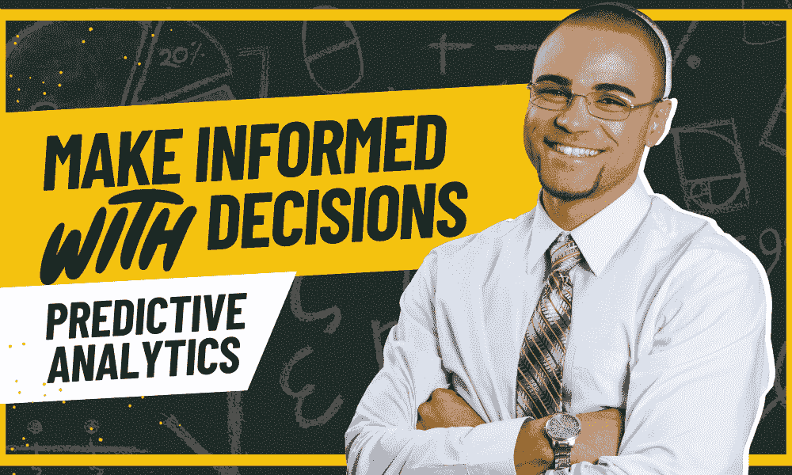
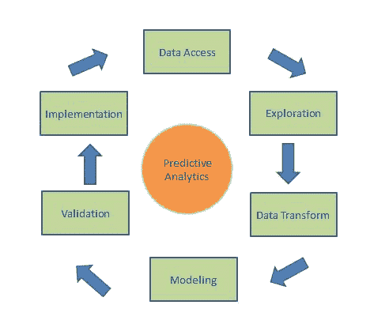

# 预测分析如何革新科技决策

> 原文：[`www.kdnuggets.com/how-predictive-analytics-is-revolutionizing-decisionmaking-in-tech`](https://www.kdnuggets.com/how-predictive-analytics-is-revolutionizing-decisionmaking-in-tech)

图片由编辑提供

预测分析将在 2023 年的商业决策中发挥关键作用，AI、机器学习以及数据科学将被大大小小的企业利用，以推动收入增长并实现最大化发展。预测分析能够处理大量数据，发现隐藏的有价值的见解，是挖掘潜力的关键。

* * *

## 我们的前三大课程推荐

 1\. [谷歌网络安全证书](https://www.kdnuggets.com/google-cybersecurity) - 快速进入网络安全职业领域

 2\. [谷歌数据分析专业证书](https://www.kdnuggets.com/google-data-analytics) - 提升你的数据分析能力

 3\. [谷歌 IT 支持专业证书](https://www.kdnuggets.com/google-itsupport) - 支持你的组织 IT 工作

* * *

在这篇文章中，我们将重点关注预测分析在商业环境中的运作方式，利用数据做出明智的决策，这些决策可以产生重大影响。

## 什么是预测分析？

预测分析处理大量数据，分析以找出有用且相关的信息，然后开发预测模型，提供与不同情境（包括过去和现在）相关的宝贵见解。通过这些基于情境的见解，可以对未来事件进行预测，使企业能够在识别新趋势、改变产品供应等方面做出更好的决策。

图片来自[Qualtrics](https://www.qualtrics.com/experience-management/research/predictive-analytics/)

预测分析是一个先进的工具，但仍需专家的知识才能有效使用。分析提供事实和相关数据，而如何将这些数据应用于实际的未来情境则由用户决定。预测分析与决策过程结合，能够帮助企业实现切实的成果。

### 预测分析的实际应用

一个常见的[预测分析](https://www.ibm.com/topics/predictive-analytics#:~:text=Predictive%20analytics%20models%20are%20designed,clustering%2C%20and%20time%20series%20models.)应用场景是市场营销，常见的例子是行为定位。这涉及利用消费者数据来创建更好的营销策略，无论是网页内容、社交媒体活动还是直接广告，从而帮助企业接触新客户。

通过评估历史行为数据并使用它来预测客户未来可能的行为。这有助于提供准确的销售趋势预测，例如节假日期间的销售趋势，帮助营销人员制定更好、更具针对性的活动。

除了查看销售趋势外，预测分析还可以评估销售漏斗，检查每个阶段的有效性，从最初的意识到完成购买。例如，算法可以确定潜在客户通常会与多少内容/广告互动，以及何时互动，之后才会完成购买或关键行动。这有助于改进未来的定向广告活动，为了解客户在生命周期中更可能互动的时机提供洞察。

此方法还可以识别哪些类型的内容被定期互动，无论是社交媒体帖子还是应用程序中的 PDF 下载。通过[PDF SDKs](https://apryse.com/blog/pdf-sdk-guide)，客户可以快速将 PDF 内容如优惠券或产品信息下载到手机上，这是购买意图的明确迹象。

## 结合预测分析和决策制定

在商业中，将预测分析与决策结合起来已成为一种常见做法，依赖于先进的算法、过去的行为数据和统计数据来准确预测未来的行为。这不仅有助于企业做出更准确的决策，还允许它们快速做出决策，从而提供竞争优势。

图片来源于[Analytica](https://analytica.com/applying-predictive-analytics-in-enterprise-decision-making/)

决策可以涉及市场趋势、客户互动、营销活动、投资相关风险以及任何可能对业务产生重大影响的事项。

### 结合预测分析和决策制定：好处

对于一些人来说，预测分析的好处可能不明显，他们更愿意依赖现有的流程来塑造业务的未来。然而，有一些好处是不容忽视的，特别是当公司旨在在现代竞争激烈的数字环境中快速增长时。

预测分析与决策制定相结合的好处包括：

+   机器学习和人工智能的使用使得预测未来结果和趋势成为可能，从而使决策过程能够确定最佳行动方案。

+   通过准确的预测，企业可以保持领先地位，迅速采取行动以启动营销活动或新产品。

+   准确预测客户需求和市场变化，以便进行必要的调整。

+   可以分析极大规模的数据集，这些数据集是手动技术无法处理的。这些数据集可以包括客户人口统计信息或购买趋势，帮助识别新的、以前未开发的机会。

+   在潜在威胁成为问题之前进行识别，有助于保护操作，并使企业采取更主动的方式。

+   有助于更好地分配营销资源，仅针对相关客户，从而避免在不符合目标人群标准或不可能转换的潜在客户上浪费时间或金钱。

## 利用数据做出明智决策：最佳实践

在创建基于预测分析的预测模型时，有一些注意事项和禁忌，这些可能会对模型的有效性产生重大影响。

以下是创建预测模型时应遵循的五项最佳实践。

1.  确保在将数据集应用于预测模型之前完全理解它们。这包括了解数据的来源、收集方式及其结构。确保所用数据完全可靠对于保证模型做出准确且相关的预测至关重要。

1.  你还必须采用适合你业务的模型，以便与正在处理的数据相匹配。选择一个可以在整个业务中使用的单一模型，以便于优化，而不是使用多个可能变得复杂且低效的模型。

1.  在推出模型之前，必须对其进行彻底评估和验证，以确保其训练正确并生成预期结果。为此，对模型进行各种数据集的测试，并根据需要进行改进，同时确保模型也使用最新的技术和方法。

1.  模型上线后，需要持续监控其性能。始终彻底测试任何新数据集，并花时间根据研究结果将结果与最新趋势和市场变化进行比较。

1.  安排定期测试，以评估模型的准确性，应用各种交叉验证技术来确定训练数据中显示的模式是否适用于实际场景。

## 结论

预测分析 [是现代商业世界中不可或缺的工具](https://online.hbs.edu/blog/post/predictive-analytics)，帮助公司做出明智的决策，从而对其运营的未来产生重大影响。

预测分析通过使用先进的机器学习算法来提供对未来客户行为和市场事件的洞察，从而协助营销活动、销售漏斗和产品管理。没有这些洞察，企业面临被竞争对手抛在后头的风险，可能会错失有利机会，无法理解其客户基础。

[**Nahla Davies**](http://nahlawrites.com/) 是一名软件开发人员和技术作家。在全职从事技术写作之前，她曾担任过诸如领导编程等有趣的工作，并曾在一家 Inc. 5,000 体验品牌公司担任首席程序员，该公司客户包括三星、时代华纳、Netflix 和索尼。

### 相关内容

+   [用 PandasGUI 革新数据分析](https://www.kdnuggets.com/2023/06/revolutionizing-data-analysis-pandasgui.html)

+   [人工智能如何革新传统行业？](https://www.kdnuggets.com/how-ai-is-revolutionizing-the-legacy-industries)

+   [百度研究发布 2022 年十大技术趋势预测](https://www.kdnuggets.com/2022/02/baidu-research-unveils-top-10-tech-trends-forecast-2022.html)

+   [2022 年技术专家薪资指南](https://www.kdnuggets.com/2022/07/simple-salary-guide-tech-experts-2022.html)

+   [AI for Ukraine 是 AI HOUSE 推出的一个新教育项目…](https://www.kdnuggets.com/2022/08/ai-house-ai-ukraine-new-educational-project-support-ukrainian-tech-community.html)

+   [科技行业的大规模裁员是什么情况？](https://www.kdnuggets.com/2023/02/layoffs-tech.html)
