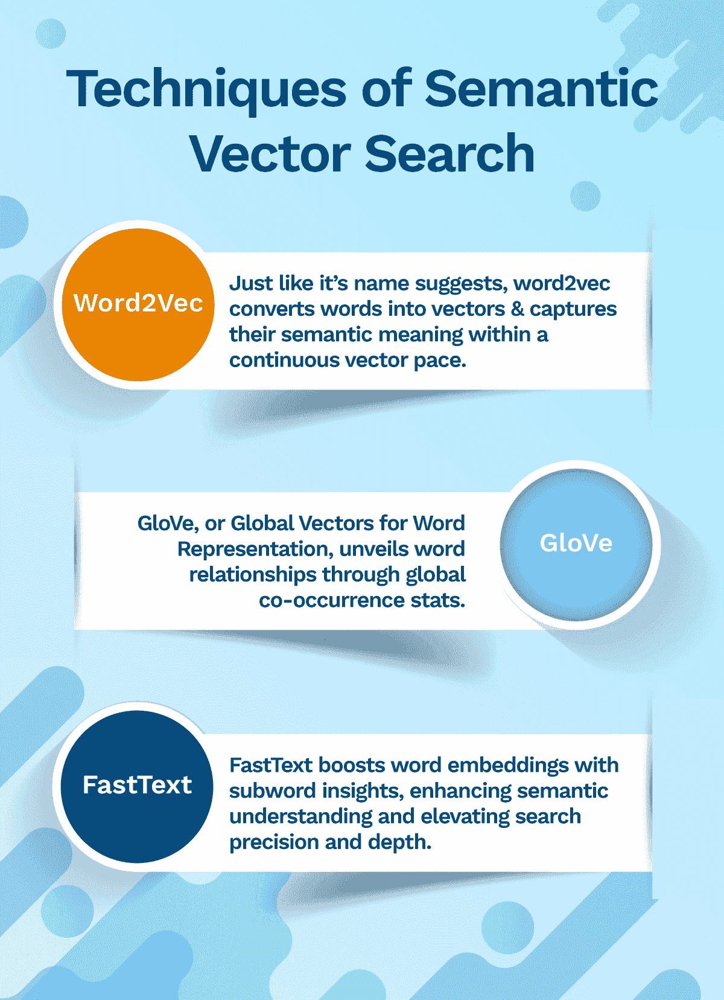
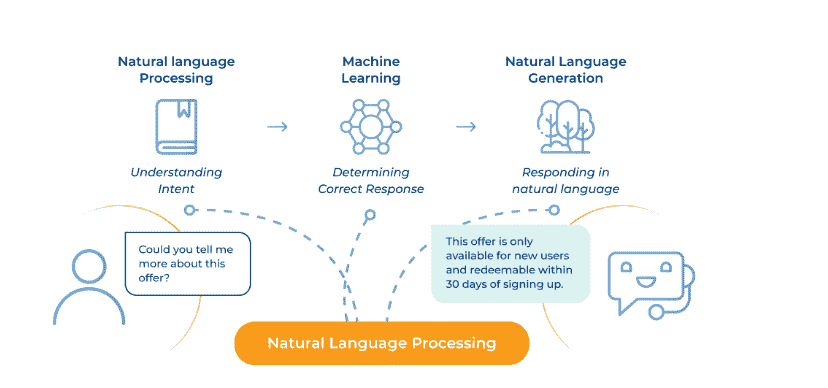

# 语义向量搜索如何变革客户支持互动

> 原文：[`www.kdnuggets.com/how-semantic-vector-search-transforms-customer-support-interactions`](https://www.kdnuggets.com/how-semantic-vector-search-transforms-customer-support-interactions)

图片由 rawpixel.com 提供，来源于 [Freepik](https://www.freepik.com/free-vector/illustration-search-box_3139727.htm#query=Vector%20Search&position=42&from_view=search&track=ais&uuid=8c4c2cdb-949e-49b8-8eb7-5f695f47fd16)

你知道吗，大约 99.5%的企业收集的数据没有被使用？事实上，这些数据甚至从未被分析过。这显示了一个巨大的差距，只有通过先进的企业搜索平台才能弥补。

* * *

## 我们的前三个课程推荐

 1\. [谷歌网络安全证书](https://www.kdnuggets.com/google-cybersecurity) - 快速进入网络安全职业生涯。

 2\. [谷歌数据分析专业证书](https://www.kdnuggets.com/google-data-analytics) - 提升你的数据分析技能

 3\. [谷歌 IT 支持专业证书](https://www.kdnuggets.com/google-itsupport) - 支持你的组织 IT

* * *

在过去的几年中，搜索技术发生了剧烈变化。从使用全文和关键词匹配机制，转变为更复杂的技术，如语义（理解单词背后的含义）和视觉（使用图片进行搜索）平台，这些定义了今天的数字化格局。

这是对不断增长的客户期望的回应——今天的个人不仅希望获得一般化的搜索结果，他们希望这些结果能够个性化并精准相关。这正是语义向量搜索的作用所在。

它无缝地利用深度度量学习来训练一个语义模型，帮助在向量空间中组织查询，使相似的事物结合在一起，而不同的事物则分开。

探索这篇博客文章，了解语义向量搜索的基础知识及更多内容。

## 首先—什么是语义向量搜索

传统的搜索引擎只关注确切的关键词，并返回围绕这些关键词的结果。相反，先进的 AI 系统超越了关键词映射，理解查询的上下文和意图。

例如，一个激动的客户联系了客户支持并抱怨，*“哇，谢谢你把我的行李送到华盛顿，同时把我送到洛杉矶。真是棒极了的服务！”* 在这种情况下，传统的搜索引擎会关注“哇”和“棒极了的服务”等词。然而，语义向量搜索引擎则更深入地理解问题——它明白了潜在的讽刺和客户的沮丧。这就像拥有一个支持代理，不仅听到关键词，还能理解它们的含义和上下文，提供更有效的帮助。

麦肯锡的研究发现，擅长个性化的公司在这些活动中产生的收入比平均水平高出 40%。在美国各行业中，转向个性化的顶尖表现将创造超过 1 万亿美元的价值。

## 但是，它是如何工作的呢？

让我们把每个单词想象成高楼大厦中的一个居民。地址为 45、46 和 47 的居民住在同一栋楼中，而地址为 55、56 和 57 的居民住在下一栋楼中。这些居民之间的距离和方向代表了单词之间的关系，其中意思相近的单词会更接近彼此。

现在，你已经了解了基本含义，让我们深入探讨细节。

当用户输入查询时，系统将其转换为一个向量。然后，它会寻找在含义上接近的其他向量。这确保了系统不仅检索到精确匹配的信息，还能找到语义相关的信息。

## 但语义在向量搜索中扮演什么角色？

语义的意义在于 AI 系统能够通过考虑同义词和上下文等因素来理解和把握单词背后的确切含义。

结果是？准确、相关、个性化的响应，能够快速启动问题解决过程，让客户感到满意。

但为了确保一切顺利运行，还有一个复杂的机制，也是一种人工智能的子集，在幕后工作，那就是——机器学习。

机器学习算法深入理解单词之间的细微相似性和差异。为此，它们将单词视为大拼图中的部分，而不是理解单一词语的含义。

人工智能（AI）算法分解了语言的复杂性。它分析数据中的上下文、模式和关联。它们通过超越表面解释，揭示了单词的含义。

> 例如，一个客户向你的公司提出了一个问题。他们想用樱桃和李子的鲜艳色彩装饰厨房。然而，你的虚拟助手误将其理解为水果。这种双重用法突显了相同术语在不同含义和上下文中的差异。

这是一个高级 AI 系统可以解读术语的固有含义及其相互关联的地方。

## 语义向量搜索技术的类型

该搜索应用了强大的词嵌入技术来理解语言的细微差别：

## 向量搜索如何改变客户支持互动？

语义向量搜索在提升客户支持体验方面的两个领域是：

**1\. 理解自然语言**

自然语言具有模糊性。机器理解人类沟通方式成为一场艰巨的战斗。这时，*自然语言处理（NLP）* 可以发挥作用。它是一种多学科过程，结合了机器学习和自然语言生成，使人类和机器的互动成为可能。语义向量搜索应用 NLP 来催化情感分析。

[情感分析](https://www.searchunify.com/sudo-technical-blogs/unlocking-the-power-of-large-language-models-in-sentiment-analysis-for-customer-support)将数据分类为积极、消极或中性。通过将情感分析纳入现有系统，组织可以获得有关客户需求和问题的宝贵见解。这使得组织能够提供主动和个性化的体验。

**2\. 促进信息检索**

由于语义向量搜索能够把握查询的潜在含义、意图和背景，它确保正确的帮助文章在正确的时间送达正确的受众。它利用人工智能获取用户旅程的全景视图，从而根据用户的浏览历史、客户情感等来进行超个性化的支持。作为附加优势，CSAT（客户满意度评分）也会显著提高。双赢，对吧？

但，等等！有智慧的地方总会有挑战。

## 实现有效向量搜索的挑战

尽管语义向量搜索的未来承诺带来深远的好处，但实现这些好处的道路上仍然存在障碍。它们是：

**1\. 语义中的模糊性处理**

由于自然语言或人类语言具有模糊性，单词和句子对不同的人可能有不同的解释。因此，正确解读用户查询的上下文和意图变得极其困难。部署先进的机器学习算法可以有所帮助。它们通过用户互动不断学习，以提高准确性。

**2\. 伦理考虑**

由于语义向量搜索系统是在大规模数据集上训练的，因此不可避免地会出现一些关于隐私、偏见和透明度的伦理考量。让我们将这些隐私问题视为垫脚石，而不是障碍。为了防止歧视性结果，必须通过定期审计和更新数据来采取措施减轻偏见。

## 寻找提升企业搜索引擎的力量倍增器吗？

市场上有大量的技术，如神经网络、向量搜索和语义搜索。在这里，神经网络提供深度，向量搜索提升精度，而语义理解揭示了意义的细微层次。

单独使用它们会使其能力未得到充分利用。这就是统一认知平台可以成为光明的一线的地方。它无缝整合了不同的搜索技术，以确保用户可以享受个性化、上下文相关且及时的搜索体验。

**[Taranjeet](https://www.linkedin.com/in/taranjeet-singh-35565837/)** 是一位数据科学家，对行为科学有浓厚的兴趣，并逐渐将重点转向相关性。他在 LLM、升级预测、意图检测、语义搜索和推荐系统等问题上交付了生产就绪的解决方案，同时利用了最先进的边缘 AI 和 NLP 技术。

### 更多相关内容

+   [使用向量数据库的语义搜索](https://www.kdnuggets.com/semantic-search-with-vector-databases)

+   [支持向量机：一种直观的方法](https://www.kdnuggets.com/2022/08/support-vector-machines-intuitive-approach.html)

+   [支持向量机的温和介绍](https://www.kdnuggets.com/2023/07/gentle-introduction-support-vector-machines.html)

+   [Python 向量数据库和向量索引：LLM 应用的架构设计](https://www.kdnuggets.com/2023/08/python-vector-databases-vector-indexes-architecting-llm-apps.html)

+   [Qdrant：具有托管云平台的开源向量搜索引擎](https://www.kdnuggets.com/2023/02/qdrant-open-source-vector-search-engine-managed-cloud-platform.html)

+   [开始使用 LLMOps：无缝交互的秘密武器](https://www.kdnuggets.com/getting-started-with-llmops-the-secret-sauce-behind-seamless-interactions)
