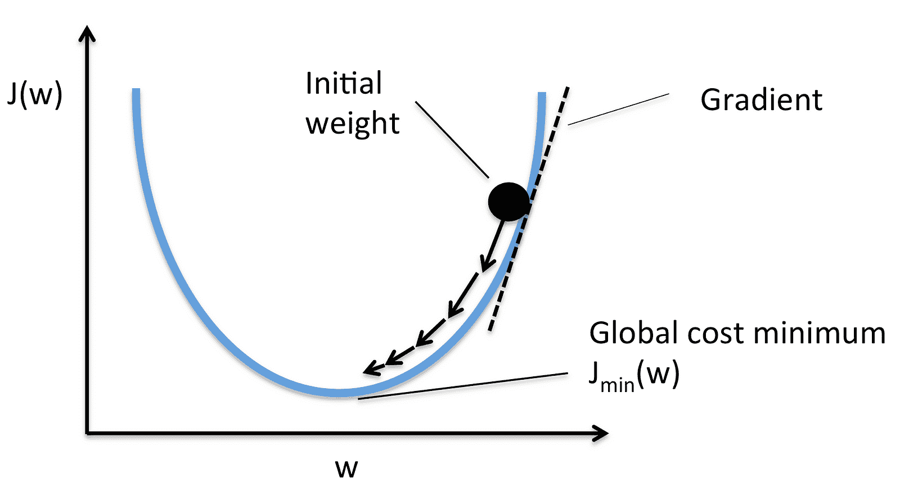
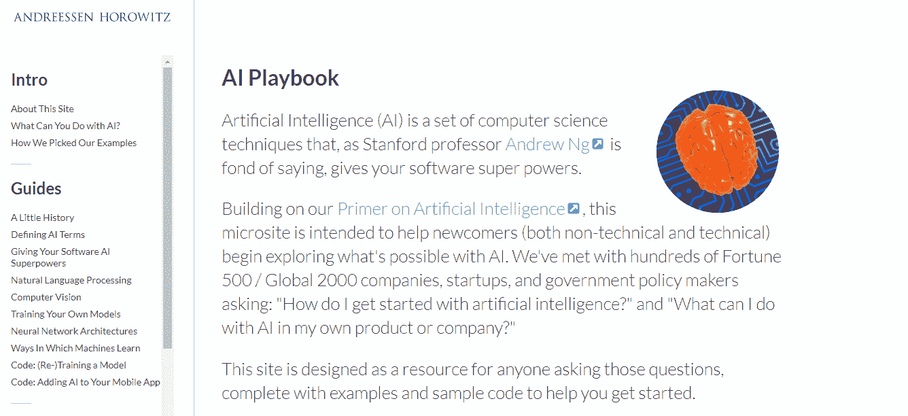

# 我在过去两个月中如何开始学习 AI

> 原文：[`www.kdnuggets.com/2017/10/how-started-learning-ai.html`](https://www.kdnuggets.com/2017/10/how-started-learning-ai.html)

评论

**由[Shival Gupta](https://twitter.com/braveproductguy)**。


图片最初由[gbksoft](http://gbksoft.com/blog/best-text-editors-for-code-review/)制作

现在每个人都非常忙。我们的个人和职业生活中有太多事情发生。更令人惊讶的是，人工智能这种东西开始获得关注，你发现自己的技能在接下来的两年里变得严重过时。

[当我关闭我的初创公司 Zeading 时](https://hackernoon.com/how-i-fucked-up-my-startup-life-lessons-from-failing-and-imploding-f3b3540f8545)，我意识到自己错过了非常独特的东西。

> 在不断变化的环境中，全栈开发者的相关性将不再足够。在接下来的两年里，没有 AI 技能的全栈将不再是全栈。

是时候采取行动了。我做了我认为现在唯一正确的行动——更新我的开发技能、作为产品负责人的心态和作为企业家的哲学，以变得更加数据导向。

正如[Spiros Margaris](https://twitter.com/SpirosMargaris)这位著名的风险投资家和 AI 及金融科技领域的思想领袖优雅地对我说，

> 如果创业公司和公司仅仅依靠尖端 AI 和机器学习算法来竞争——这将是不够的。AI 将不再是竞争优势，而是一种要求。你听到有人说他们用电力作为竞争优势吗？

### 构建我的第一个神经网络

照片由 — Unsplash 提供

常见的建议是报名参加[Andrew Ng 的 Coursera 课程](https://www.coursera.org/learn/machine-learning)。这是一个很好的起点，但我发现很难保持清醒。并不是说课程不好，只是我真的不擅长在讲座中保持注意力。我的学习方式一直是通过实践，所以我想，为什么不呢，让我们实现自己的神经网络。

我没有直接跳到神经网络，因为这不是更好的学习方法。我试图熟悉领域中的所有术语，以便我能学会说这种语言。

> 第一个任务不是学习，而是熟悉。

我来自纯粹的 Javascript 和 Nodejs 背景，不想马上换堆栈。因此，我寻找了一个简单的神经网络模块，叫做 nn，并用它实现了一个*与*门，输入为虚拟值。[受到这个教程的启发](https://medium.com/technology-invention-and-more/how-to-build-a-simple-neural-network-in-9-lines-of-python-code-cc8f23647ca1)，我选择了一个问题，即对于任何三个输入 X、Y 和 Z，输出应该是 X *与* Y。

```py
var nn = require('nn')
var opts = {
    layers: [ 4 ],
    iterations: 300000,
    errorThresh: 0.0000005,
    activation: 'logistic',
    learningRate: 0.4,
    momentum: 0.5,
    log: 100   
}
var net = nn(opts)
net.train([
    { input: [ 0,0,1 ], output: [ 0 ] },
    { input: [ 0,1,1 ], output: [ 0 ] },            
    { input: [ 1,0,1 ], output: [ 0 ] },
    { input: [ 0,1,0 ], output: [ 0 ] },
    { input: [ 1,0,0 ], output: [ 0 ] },
    { input: [ 1,1,1 ], output: [ 1 ] },
    { input: [ 0,0,0 ], output: [ 0 ] }
    ])
// send it a new input to see its trained output
var output = net.send([ 1,1,0]) 
console.log(output); //0.9971279763719718

```

真是太高兴了！

我个人认为，这是我采取的最具信心的步骤。当输出显示为 0.9971 时，我意识到网络已经学会了如何执行*AND*操作，并自行忽略额外的输入。

这基本上是机器学习的要点。你给计算机程序一组数据，它调整内部参数，以便能够对新数据做出回答，误差从原始数据中观察到的误差逐渐减少。

这种方法，后来我了解到，也被称为**[梯度下降](https://en.wikipedia.org/wiki/Gradient_descent)**。



图片由 — [塞巴斯蒂安·拉施卡](https://sebastianraschka.com/faq/docs/closed-form-vs-gd.html)提供

### 为人工智能做好心理准备


图片由 — Unsplash 提供

**一旦我在完成第一个人工智能程序后充满信心，我就想知道作为开发者我还能用机器学习做些什么**。

+   我解决了一些**[有监督学习](https://en.wikipedia.org/wiki/Supervised_learning)**问题，如**[回归](https://en.wikipedia.org/wiki/Linear_regression)**和**[分类](https://en.wikipedia.org/wiki/Logistic_regression)**。

+   我使用了一个非常有限的数据集，尝试预测哪支球队会赢得某场 IPL 比赛，使用了**[多变量线性回归](https://www.hackerearth.com/practice/machine-learning/linear-regression/multivariate-linear-regression-1/tutorial/)**。 （预测结果真的很差，但还挺酷的）

+   我试用了**[Google 机器学习云](https://cloud.google.com/products/machine-learning/)**上的**演示**，以查看今天 AI 可以做什么（显然谷歌已经将其做成了 SaaS 产品）。

+   我偶然发现了**[AI Playbook](http://aiplaybook.a16z.com/)**，这是由著名风险基金 Andreessen-Horowitz 组织的一个很棒的资源。确实是开发者和企业家最有用的资源之一。



+   我开始观看**[Siraj Rawal 的精彩 YouTube 频道](https://www.youtube.com/channel/UCWN3xxRkmTPmbKwht9FuE5A)**，这个频道专注于深度学习和机器学习。

+   我阅读了这篇**[精彩的 Hacker Noon 文章](https://hackernoon.com/how-hbos-silicon-valley-built-not-hotdog-with-mobile-tensorflow-keras-react-native-ef03260747f3)**，讲述了硅谷的制作人是如何打造**Not Hotdog 应用**的。这是我们可以做到的最容易理解的深度学习示例之一。

+   我阅读了**[Andrej Karpathy 的博客](http://karpathy.github.io/)**，他是特斯拉的 AI 总监。尽管我几乎看不懂什么，并且感到头疼，但我发现再试一段时间后，这些概念确实开始变得有意义。

+   带着一些勇气，我开始**逐字实现一些深度学习教程**（复制和粘贴），并尝试在本地机器上训练模型和运行代码。大多数时候，由于训练时间长而且我没有 GPU，效果不佳。

渐渐地，我将工具从 Javascript 切换到 Python，并在我的 Windows 机器上安装了[Tensorflow](http://shivalgupta.com/how-to-install-tensorflow-in-windows/)。

整个过程围绕着被动地消费内容，并在你的脑海中建立参考，以便在我遇到实际的消费者问题时使用。

> 正如史蒂夫·乔布斯所说，你只能回顾过去来连接点滴。

### 抓住聊天机器人列车


图片来源 — Unsplash

作为电影[她](https://www.imdb.com/title/tt1798709/)的忠实粉丝，我想构建聊天机器人。我接受了这个挑战，并在不到两小时的时间里用 Tensorflow 成功构建了一个。我在[我的一篇文章](https://hackernoon.com/i-built-a-chatbot-in-2-hours-and-this-is-what-i-learned-f5dbb4ba5fcc)中概述了这段旅程和它的业务需求。

幸运的是，这篇文章真的变得很火，并在[TechInAsia](https://www.techinasia.com/talk/built-chatbot-2-hours)、[CodeMentor](https://www.codementor.io/shivalgupta1/i-built-a-chatbot-in-2-hours-and-this-is-what-i-learned-be677twav)和 KDNuggets 上被推荐。这对我来说是一个伟大的时刻，因为我刚刚开始从事技术博客。但我认为这篇文章是我 AI 学习旅程中的一个重要时刻。

这让我在 Twitter 和 LinkedIn 上结识了许多朋友，我可以与他们深入讨论 AI 开发，并且在遇到困难时可以联系他们。我收到了一些咨询项目的邀请，最棒的是，年轻的开发者和 AI 初学者开始询问我如何开始学习 AI。

这也就是我写这篇文章的原因。为了帮助更多人从我的旅程中汲取经验，开始他们自己的旅程。

> 开始是任何旅程中最具挑战性的部分之一。

### 盐和胡椒


图片来源 — Unsplash

这绝对不容易。当我开始在 Javascript 中遇到困难时，我几乎一夜之间跳转到 Python，并学习了如何用它编程。当我的模型在 i7 机器上无法训练，或者即使经过数小时的训练，它们也会返回像 50–50 概率这样的无意义结果时，我开始感到烦躁。学习 AI 不同于学习一个网页框架。

> 这是一项需要对计算的微观层面有所了解的技能，并找出是什么对你的输出负责——是你的代码还是你的数据。

AI 也不仅仅是一个学科。它是一个统称，涵盖从简单的回归问题到可能在某天消灭我们的致命机器人。像进入任何其他学科一样，你可能会选择在 AI 领域中专注于你真正想擅长的领域，如计算机视觉或自然语言处理，或者天哪，世界统治。

在与来自 Atlantis Capital 的[Gaurav Sharma](https://twitter.com/Gaurav1105)的对话中，这位在 AI、金融科技和加密货币领域的著名行业领袖向我透露：

> 在人工智能时代，“聪明”将意味着完全不同的东西。我们需要能够进行高阶批判性、创造性和思考工作，并且需要高情感投入的工作的人。

你必须对计算机如何突然*学会*独立完成任务感到着迷。耐心和惊奇是你应该坚持的两个关键原则。

这是一次漫长、漫长的旅程。非常疲惫、非常烦人，而且异常耗时。

> 但好的一面是，像世界上所有其他的旅程一样，这次旅程也始于一步。

[原文](https://hackernoon.com/how-i-started-with-learning-ai-in-the-last-2-months-251d19b23597)。经许可转载。

**简介：[Shival Gupta](https://twitter.com/braveproductguy)** 是产品爱好者和企业家。了解一些#AI #机器学习。工程师。前 CEO @ZeadingOfficial @CourseCannon。

**相关：**

+   成功实施 AI 的 5 个主要因素

+   神经网络：无数的架构，一个基本理念

+   用于目标检测的深度学习：全面回顾

* * *

## 我们的前三大课程推荐

 1\. [Google 网络安全证书](https://www.kdnuggets.com/google-cybersecurity) - 快速进入网络安全职业生涯。

 2\. [Google 数据分析专业证书](https://www.kdnuggets.com/google-data-analytics) - 提升你的数据分析技能

 3\. [Google IT 支持专业证书](https://www.kdnuggets.com/google-itsupport) - 支持你的组织在 IT 领域

* * *

### 更多相关内容

+   [停止学习数据科学来寻找目标，并找到目标去……](https://www.kdnuggets.com/2021/12/stop-learning-data-science-find-purpose.html)

+   [学习数据科学统计学的最佳资源](https://www.kdnuggets.com/2021/12/springboard-top-resources-learn-data-science-statistics.html)

+   [一项 90 亿美元的 AI 失败，进行了检讨](https://www.kdnuggets.com/2021/12/9b-ai-failure-examined.html)

+   [成功数据科学家的 5 个特征](https://www.kdnuggets.com/2021/12/5-characteristics-successful-data-scientist.html)

+   [是什么使 Python 成为初创企业理想的编程语言](https://www.kdnuggets.com/2021/12/makes-python-ideal-programming-language-startups.html)

+   [每个数据科学家都应该了解的三个 R 库（即使你使用 Python）](https://www.kdnuggets.com/2021/12/three-r-libraries-every-data-scientist-know-even-python.html)
