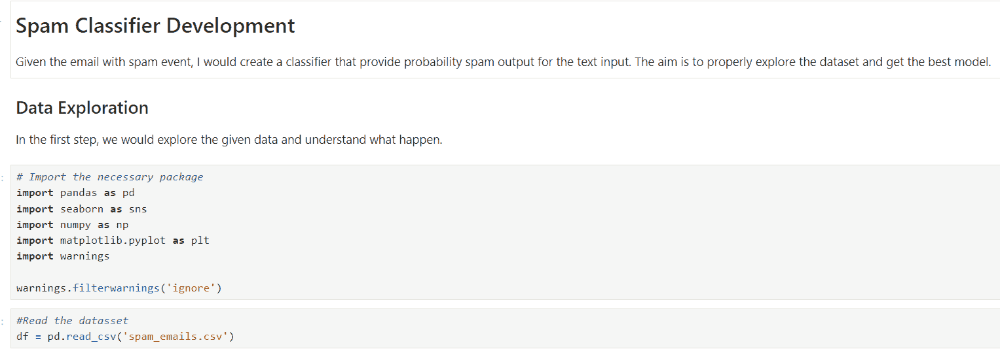

# 数据科学家如何注释你的 Python 代码

> 原文：[`www.kdnuggets.com/how-to-comment-your-python-code-as-a-data-scientist`](https://www.kdnuggets.com/how-to-comment-your-python-code-as-a-data-scientist)


图片由 DALL·E 3 生成

数据科学家面临一个令人兴奋的职位；虽然他们在现代时代的工作需要使用编程语言，但他们的工作仍然需要记住许多业务方面。这就是为什么数据科学家使用的 Python 代码通常反映了解决业务问题的故事。数据科学家的工作环境也很独特；我们使用 Jupyter Notebook IDE，它提供了一个出色的方式来进行数据处理和模型开发的实验。

* * *

## 我们的前三个课程推荐

 1\. [谷歌网络安全证书](https://www.kdnuggets.com/google-cybersecurity) - 快速进入网络安全职业生涯。

 2\. [谷歌数据分析专业证书](https://www.kdnuggets.com/google-data-analytics) - 提升你的数据分析能力

 3\. [谷歌 IT 支持专业证书](https://www.kdnuggets.com/google-itsupport) - 支持你组织的 IT

* * *

数据科学家的编程活动有所不同，这包括注释活动，即解释代码的活动。对于经常面临需求变更和进行协作的数据显示，提供适当的代码解释是至关重要的。

本文将讨论如何作为数据科学家进行 Python 代码注释。我们将探讨各种可以提升你工作效率的点，并给任何阅读你代码的人带来价值。让我们深入了解。

# 注释的类型

在进一步讨论之前，让我们了解一下两种不同的注释类型。第一种是单行注释，使用‘**#**’符号。它通常用于对代码进行简单说明。例如，下面的代码示例演示了单行注释的使用。

```py
# The code is to import the Pandas package and call it pd
import pandas as pd
```

另一种注释方式是使用多行注释方法，采用三重引号。严格来说，它们不是注释而是字符串对象，但如果我们不将其赋值给变量，Python 会忽略它们。我们可以通过以下示例看到它们的实际应用。

```py
"""
The code below would import the Pandas package, and we would call them pd throughout the whole working environment.
"""
import pandas as pd
```

# 注释的一般技巧

在本节中，我们将讨论一些注释的一般技巧。这些技巧不一定适用于数据科学家，因为它们是编程人员的最佳实践，但记住这些技巧是有益的。提示如下：

1.  考虑将注释放在我们想要解释的代码上方的单独一行，以提高可读性。

1.  在你工作的代码中保持一致的注释风格。

1.  如果你知道受众无法理解，不要使用难以理解的术语和技术术语。

1.  仅在注释能增加价值时进行注释，以避免解释显而易见的内容。

1.  如果注释不再相关，保持和更新注释。

这些是提供更好注释体验的一般指导方针。现在，让我们转向更具体的针对数据科学家的指导。

# 数据科学家的注释技巧

对于数据科学家来说，编码活动与软件工程师或网页开发人员的活动不同。这就是注释活动可能有所不同的原因。以下是一些特定于我们数据科学家的提示。

## 1\. 使用注释来澄清复杂的过程或活动

数据科学活动涉及许多实验过程，如果我们不进行解释，可能会让读者或我们自己感到困惑。代码中的注释将帮助我们更好地解释意图，尤其是当涉及多个步骤时。例如，下面的代码将解释如何通过归一化和缩放来去除离群值。

```py
# Perform data normalization (Min-Max scaling)
normalized_data = (data - np.min(data)) / (np.max(data) - np.min(data))

# Remove outliers by using the sigma rule (3 standard deviations removal)
removed_outlier_data = normalized_data[np.abs(stats.zscore(normalized_data)) < 3]
```

上面的注释解释了每个过程所做的工作及其背后的概念。指定我们在代码中使用的概念对于理解我们所做的事情至关重要。

注释不仅限于预处理，还可以在任何数据科学步骤中进行。从数据获取到模型监控，为了让每个人都能理解的注释是良好的实践。记住，作为数据科学家，我们的注释可能成为代码和分析洞察之间的桥梁。

## 2\. 拥有注释标准

数据科学活动是一个协作过程，因此拥有一个大家都理解的标准结构是有益的。即使你是单独工作，这种标准也有帮助，因为你会知道这个标准。例如，你可以为每个你制作的函数标准化注释。

```py
# Function: name of the function
# Usage: description of how to use the function
# Parameters: list the parameters and explain them
# Output: explain the output
```

上述是一个标准示例，你可以独立创建内容。不要忘记在有标准时使用相同的风格、语言和缩写。

## 3\. 使用注释来帮助工作流程

在协作环境中，注释对帮助团队理解工作流程至关重要。我们可以使用注释来帮助理解何时有新的代码更新或接下来需要做什么。例如，另一个函数中的更新导致我们的过程出现错误，因此我们需要接下来修复这些错误。

```py
# TODO: Fix this function ASAP
some_function_to_fix()
```

## 4\. 实施 Markdown 笔记本单元

数据科学家 IDE 相当出色，因为我们使用笔记本进行实验。使用笔记本中的单元，我们可以将每段代码隔离开来，以便它可以独立运行，而无需运行整个代码。笔记本单元不仅限于代码，还可以转换为 Markdown 单元。

Markdown 是一种格式语言，用于描述文本的外观。在单元中，Markdown 可以进一步解释下面的代码。使用 Markdown 的优点在于我们可以比标准注释过程更详细地进行注释。你甚至可以添加表格、图片、LaTeX 等。

例如，下面的图片展示了我们如何使用 Markdown 来解释我们的项目、目标和步骤。



你可以在他们的[文档](https://jupyter-notebook.readthedocs.io/en/stable/examples/Notebook/Working%20With%20Markdown%20Cells.html)中进一步阅读有关 Jupyter Markdown 单元的内容，以进一步了解你可以做什么。

# 结论

注释是数据科学家工作的重要组成部分，因为它有助于读者理解代码的执行过程。对于数据科学家来说，注释的过程与软件工程师或网页开发人员略有不同，因为我们的工作流程不同。这就是为什么这篇文章提供了一些你可以用于数据科学家注释的技巧。技巧包括：

1.  使用注释来澄清复杂的过程或活动

1.  制定注释标准

1.  使用注释来帮助工作流程

1.  实施 Markdown Notebook 单元

希望对你有帮助。

**[](https://www.linkedin.com/in/cornellius-yudha-wijaya/)**[Cornellius Yudha Wijaya](https://www.linkedin.com/in/cornellius-yudha-wijaya/)** 是数据科学助理经理和数据撰稿人。在全职工作于印尼安联公司期间，他喜欢通过社交媒体和写作媒体分享 Python 和数据技巧。Cornellius 撰写了各种 AI 和机器学习主题的文章。

### 更多相关话题

+   [作为数据科学家的 Python 代码管理](https://www.kdnuggets.com/2021/06/managing-reusable-python-code-data-scientist.html)

+   [KDnuggets™ 新闻 22:n01, 1 月 5 日: 追踪和可视化的 3 种工具…](https://www.kdnuggets.com/2022/n01.html)

+   [加速你的 Python 代码的 3 种简单方法](https://www.kdnuggets.com/2022/10/3-simple-ways-speed-python-code.html)

+   [3 种工具来追踪和可视化你的 Python 代码执行](https://www.kdnuggets.com/2021/12/3-tools-track-visualize-execution-python-code.html)

+   [使用 NumPy 加速你的 Python 代码](https://www.kdnuggets.com/speeding-up-your-python-code-with-numpy)

+   [优化 Python 代码性能：深入了解 Python 性能分析器](https://www.kdnuggets.com/2023/02/optimizing-python-code-performance-deep-dive-python-profilers.html)
