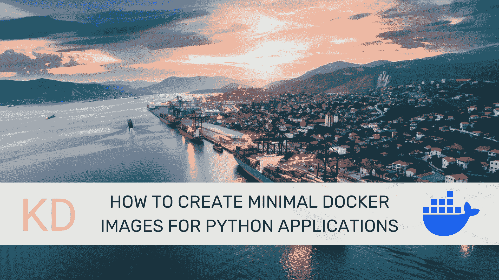
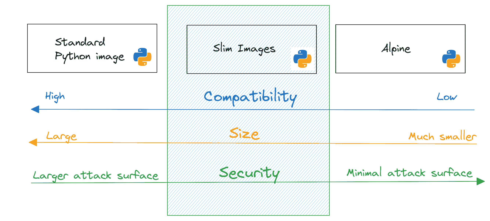

# 如何为 Python 应用创建最小的 Docker 镜像

> 原文：[`www.kdnuggets.com/how-to-create-minimal-docker-images-for-python-applications`](https://www.kdnuggets.com/how-to-create-minimal-docker-images-for-python-applications)



图片来源 | Midjourney & Canva

为 Python 应用创建最小的 Docker 镜像可以通过减少攻击面来提高安全性，加快镜像构建速度，并改善整体应用程序的可维护性。让我们来学习如何为 Python 应用创建最小的 Docker 镜像。

* * *

## 我们的前三个课程推荐

 1\. [Google 网络安全证书](https://www.kdnuggets.com/google-cybersecurity) - 快速进入网络安全领域。

 2\. [Google 数据分析专业证书](https://www.kdnuggets.com/google-data-analytics) - 提升你的数据分析技能

 3\. [Google IT 支持专业证书](https://www.kdnuggets.com/google-itsupport) - 支持你的组织在 IT 领域

* * *

## 先决条件

在你开始之前：

+   你应该安装了 Docker。如果还没有，请[获取 Docker](https://docs.docker.com/get-docker/)以适应你的操作系统。

+   你需要为最小镜像构建的示例 Python 应用。你也可以跟随我们创建的[示例应用](https://github.com/balapriyac/data-science-tutorials/tree/main/docker/minimal-img-python-apps)。

## 创建一个示例 Python 应用

让我们创建一个简单的 Flask 应用用于库存管理。这个应用允许你添加、查看、更新和删除库存项目。然后我们将使用标准的 Python 3.11 镜像将应用 Docker 化。

在你的项目目录中，你应该有 app.py、requirements.txt 和 Dockerfile：

```py
inventory_app/
├── app.py
├── Dockerfile
├── requirements.txt 
```

这里是用于库存管理的 Flask 应用的代码：

```py
# app.py
from flask import Flask, request, jsonify

app = Flask(__name__)

# In-memory database for simplicity
inventory = {}

@app.route('/inventory', methods=['POST'])
def add_item():
    item = request.get_json()
    item_id = item.get('id')
    if not item_id:
        return jsonify({"error": "Item ID is required"}), 400
    if item_id in inventory:
    	return jsonify({"error": "Item already exists"}), 400
    inventory[item_id] = item
    return jsonify(item), 201

@app.route('/inventory/<item_id>', methods=['GET'])
def get_item(item_id):
    item = inventory.get(item_id)
    if not item:
        return jsonify({"error": "Item not found"}), 404
    return jsonify(item)

@app.route('/inventory/<item_id>', methods=['PUT'])
def update_item(item_id):
    if item_id not in inventory:
        return jsonify({"error": "Item not found"}), 404
    updated_item = request.get_json()
    inventory[item_id] = updated_item
    return jsonify(updated_item)

@app.route('/inventory/<item_id>', methods=['DELETE'])
def delete_item(item_id):
    if item_id not in inventory:
        return jsonify({"error": "Item not found"}), 404
    del inventory[item_id]
    return '', 204

if __name__ == '__main__':
	app.run(host='0.0.0.0', port=5000)</item_id></item_id></item_id> 
```

这是一个最小的 Flask 应用，实现了基本的 CRUD（创建、读取、更新、删除）操作，用于内存中的库存数据库。它使用 Flask 创建一个 web 服务器，监听端口 5000 上的 HTTP 请求。当收到请求时：

+   对于 POST 请求 `/inventory`，它将新项目添加到库存中。

+   对于 GET 请求 `/inventory/<item_id>`，它从库存中检索具有指定 ID 的项目。

+   对于 PUT 请求 `/inventory/<item_id>`，它更新库存中具有指定 ID 的项目。

+   对于 DELETE 请求 `/inventory/<item_id>`，它从库存中删除具有指定 ID 的项目。

现在创建 requirements.txt 文件：

```py
Flask==3.0.3 
```

接下来创建 Dockerfile：

```py
# Use the official Python 3.11 image
FROM python:3.11

# Set the working directory
WORKDIR /app

# Install dependencies
COPY requirements.txt requirements.txt
RUN pip install --no-cache-dir -r requirements.txt

# Copy the current directory contents into the container at /app
COPY . .

# Expose the port the app runs on
EXPOSE 5000

# Run the application
CMD ["python3", "app.py"] 
```

最后构建镜像（我们使用标签`full`来标识这是使用默认 Python 镜像的）：

```py
$ docker build -t inventory-app:full . 
```

构建完成后，你可以运行`docker images`命令：

```py
$ docker images
REPOSITORY      TAG                 IMAGE ID       CREATED             SIZE
inventory-app   full                4e623743f556   2 hours ago         1.02GB 
```

你会发现这个超级简单的应用大约有 1.02 GB 大小。这是因为我们使用的默认 Python 3.11 镜像包含了大量的 Debian 包，大小约为 1.01 GB。**所以我们需要找到一个更小的基础镜像。**

好了，这里是选项：

+   `python:version-alpine` 镜像基于 Alpine Linux，会给你最小的最终镜像。但你需要能够安装包，对吧？不过，这在 Alpine 镜像中是个挑战。

+   `python:version-slim` 带有运行 Python 所需的最少 Debian 包。你（几乎总是）能够使用 `pip` 安装大多数所需的 Python 包。

所以你的基础镜像应该足够小，但也不要小到遇到兼容性问题或者在安装依赖项时绞尽脑汁（这在 Python 应用中很常见）。这就是为什么我们在下一步将使用 `python:3.11-slim` 基础镜像并构建我们的镜像。



选择最佳基础镜像 | 作者图片

## 使用 Slim Python 基础镜像

现在将 Dockerfile 重写为使用 `python:3.11-slim` 基础镜像，如下所示：

```py
# Use the official lightweight Python 3.11-slim image
FROM python:3.11-slim

# Set the working directory
WORKDIR /app

# Install dependencies
COPY requirements.txt requirements.txt
RUN pip install --no-cache-dir -r requirements.txt

# Copy the current directory contents into the container at /app
COPY . .

# Expose the port the app runs on
EXPOSE 5000

# Run the application
CMD ["python3", "app.py"] 
```

让我们构建镜像（标记为 `slim`）：

```py
$ docker build -t inventory-app:slim . 
```

`python:3.11-slim` 基础镜像的大小为 131 MB。而 `inventory-app:slim` 镜像的大小约为 146 MB，比我们之前的 1.02 GB 镜像小得多：

```py
$ docker images
REPOSITORY      TAG                 IMAGE ID       CREATED             SIZE
inventory-app   slim                32784c60a992   About an hour ago   146MB
inventory-app   full                4e623743f556   2 hours ago         1.02GB 
```

你还可以使用多阶段构建来使最终镜像更小。但那是另一个教程的内容！

## 额外资源

这里有一些有用的资源：

+   [使用 Docker 在 5 个简单步骤中容器化 Python 应用](https://www.kdnuggets.com/containerize-python-apps-with-docker-in-5-easy-steps)

+   [python - 官方镜像 | Docker Hub](https://hub.docker.com/_/python)

+   [标准 Docker 镜像与 Alpine \ Slim 版本之间的差异](https://forums.docker.com/t/differences-between-standard-docker-images-and-alpine-slim-versions/134973)

**[](https://twitter.com/balawc27)**[Bala Priya C](https://www.kdnuggets.com/wp-content/uploads/bala-priya-author-image-update-230821.jpg)** 是来自印度的开发者和技术作家。她喜欢在数学、编程、数据科学和内容创作的交汇点上工作。她的兴趣和专长领域包括 DevOps、数据科学和自然语言处理。她喜欢阅读、写作、编程和喝咖啡！目前，她正在通过撰写教程、操作指南、评论文章等与开发者社区分享她的知识。Bala 还创建引人入胜的资源概述和编码教程。

### 更多相关话题

+   [使用 Python 和 Dash 创建仪表盘](https://www.kdnuggets.com/2023/08/create-dashboard-python-dash.html)

+   [如何在 Python 中创建自定义上下文管理器](https://www.kdnuggets.com/how-to-create-custom-context-managers-in-python)

+   [使用 Docker 在 5 个简单步骤中容器化 Python 应用](https://www.kdnuggets.com/containerize-python-apps-with-docker-in-5-easy-steps)

+   [构建生成性 AI 应用程序的最佳 Python 工具备忘单](https://www.kdnuggets.com/2023/08/best-python-tools-generative-ai-cheat-sheet.html)

+   [如何为您的数据项目创建采样计划](https://www.kdnuggets.com/2022/11/create-sampling-plan-data-project.html)

+   [如何为机器学习创建数据集](https://www.kdnuggets.com/2022/02/create-dataset-machine-learning.html)
