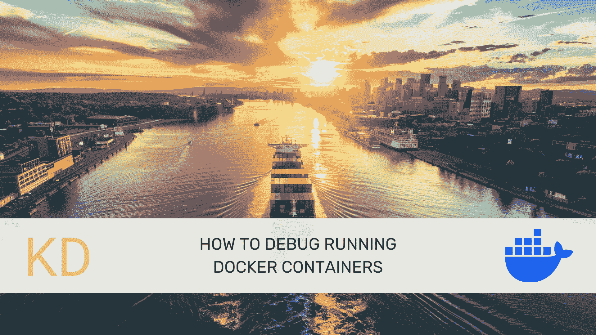
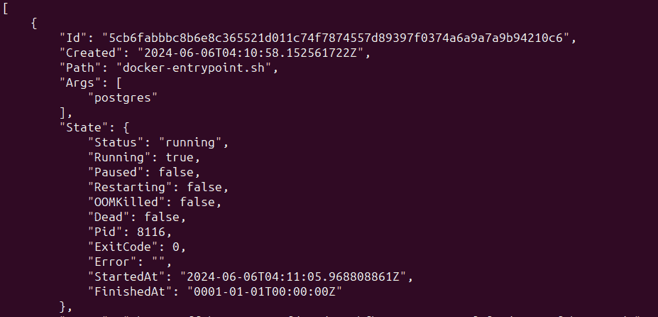
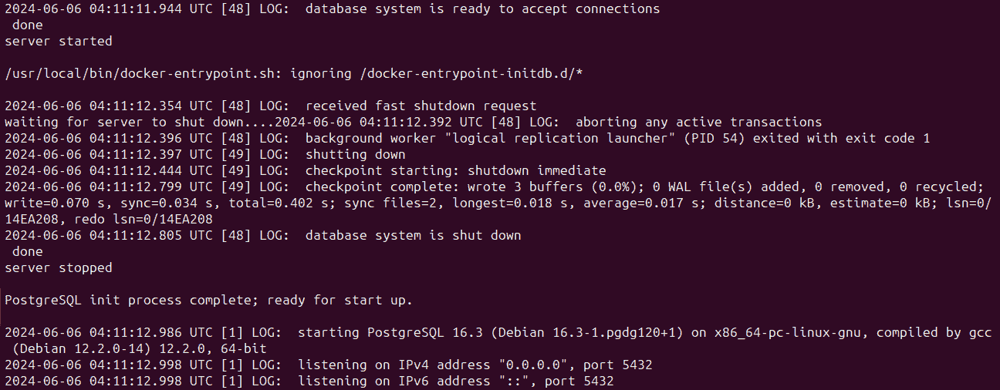

# 如何调试运行中的 Docker 容器

> 原文：[`www.kdnuggets.com/how-to-debug-running-docker-containers`](https://www.kdnuggets.com/how-to-debug-running-docker-containers)



图片由编辑 | Midjourney & Canva

容器有时由于配置问题、应用程序错误或资源限制而表现得异常。在本教程中，我们将通过以 Postgres 容器为例，讲解不同的调试方法。

* * *

## 我们的前三大课程推荐

 1\. [谷歌网络安全证书](https://www.kdnuggets.com/google-cybersecurity) - 快速进入网络安全职业生涯。

 2\. [谷歌数据分析专业证书](https://www.kdnuggets.com/google-data-analytics) - 提升你的数据分析技能

 3\. [谷歌 IT 支持专业证书](https://www.kdnuggets.com/google-itsupport) - 支持你的组织进行 IT

* * *

## 先决条件

要跟随本教程：

+   你应该在你的开发环境中安装 Docker。如果还没有，[获取 Docker](https://docs.docker.com/get-docker/)。

+   你应该对 Docker 的工作原理和基本命令（如拉取镜像、启动、停止以及管理容器）感到熟悉。

## 拉取并启动一个 PostgreSQL 容器

首先，让我们从 DockerHub 拉取最新的 PostgreSQL 镜像并启动一个容器。这里，我们使用 `docker pull` 命令拉取 postgres:16：

```py
$ docker pull postgres:16
```

一旦拉取完成，你可以使用以下 docker run 命令来启动 postgres 容器。请注意，`POSTGRES_PASSWORD` 是启动容器所需的环境变量：

```py
$ docker run --name my_postgres -e POSTGRES_PASSWORD=my_postgres_password -d postgres
```

该命令启动一个名为 `my_postgres` 的新容器，容器内运行 PostgreSQL。你可以通过运行 `docker ps` 命令来验证：

```py
$ docker ps
```

输出结果：

```py
CONTAINER ID   IMAGE         COMMAND                  CREATED          STATUS         PORTS      NAMES
5cb6fabbbc8b   postgres:16   "docker-entrypoint.s…"   18 seconds ago   Up 9 seconds   5432/tcp   my_postgres
```

## 1\. 检查容器

你可以使用 `docker inspect` 命令来获取容器的详细信息。这对于检查容器的配置、网络设置和状态非常有用：

```py
$ docker inspect my_postgres 
```

该命令输出一个包含容器所有详细信息的 JSON 对象。你可以使用像 [jq](https://jqlang.github.io/jq/) 这样的工具来解析和提取这个输出中的特定信息。



docker inspect my_postgres 的截断输出

## 2\. 查看容器日志

`docker logs` 命令可以获取正在运行的容器的日志。这对于排查与容器内应用程序相关的问题非常有用。

```py
$ docker logs my_postgres
```



docker logs my_postgres 的截断输出

## 3\. 在容器内执行命令

有时进入容器并运行一堆诊断命令是有帮助的。你可以使用 `docker exec` 命令在运行中的容器内执行命令。这对于检查容器的文件系统、环境变量等非常有用。

下面是如何在运行中的容器内启动交互式 shell 会话：

```py
$ docker exec -it my_postgres /bin/bash
```

此命令在 `my_postgres` 容器内打开一个交互式 bash shell。这样你可以在容器内运行命令。

## 4\. 检查运行中的进程

`docker top` 命令显示容器内运行的进程。这有助于识别是否有进程消耗的资源超过预期或是否有任何意外进程正在运行：

```py
$ docker top my_postgres
```

```py
UID                 PID                 PPID                C                   STIME               TTY                 TIME                CMD
ollama              8116                8096                0                   09:41               ?                   00:00:00            postgres
ollama              8196                8116                0                   09:41               ?                   00:00:00            postgres: checkpointer
ollama              8197                8116                0                   09:41               ?                   00:00:00            postgres: background writer
ollama              8199                8116                0                   09:41               ?                   00:00:00            postgres: walwriter
ollama              8200                8116                0                   09:41               ?                   00:00:00            postgres: autovacuum launcher
ollama              8201                8116                0                   09:41               ?                   00:00:00            postgres: logical replication launcher
```

## 5\. 附加到容器

`docker attach` 命令允许你将终端附加到运行中的容器的主进程。这对于调试交互式进程很有用：

```py
$ docker attach my_postgres
```

注意，附加到容器与 `docker exec` 不同，因为它连接到容器的主进程并将其标准输出和标准错误流传输到你的终端。

## 6\. 查看资源使用情况

使用 `docker stats` 命令，你可以获取容器资源使用的实时统计数据，包括 CPU、内存和网络。这对于分析性能问题非常有帮助：

```py
$ docker stats my_postgres
```

这是一个示例输出：

```py
CONTAINER ID   NAME          CPU %     MEM USAGE / LIMIT     MEM %     NET I/O       BLOCK I/O         PIDS
5cb6fabbbc8b   my_postgres   0.03%     34.63MiB / 3.617GiB   0.94%     10.6kB / 0B   38.4MB / 53.1MB   6

CONTAINER ID   NAME          CPU %     MEM USAGE / LIMIT     MEM %     NET I/O       BLOCK I/O         PIDS
5cb6fabbbc8b   my_postgres   0.03%     34.63MiB / 3.617GiB   0.94%     10.6kB / 0B   38.4MB / 53.1MB   6

CONTAINER ID   NAME          CPU %     MEM USAGE / LIMIT     MEM %     NET I/O       BLOCK I/O         PIDS
5cb6fabbbc8b   my_postgres   0.03%     34.63MiB / 3.617GiB   0.94%     10.6kB / 0B   38.4MB / 53.1MB   6

...
```

调试 Docker 容器涉及检查容器配置、查看日志、在容器内执行命令以及监控资源使用情况。运用这些技术，你可以有效地排查和解决容器化应用中的问题。祝你调试愉快！

## 额外资源

如果你想进一步探索，请查看以下资源：

+   [如何像超级英雄一样修复和调试 Docker 容器](https://www.docker.com/blog/how-to-fix-and-debug-docker-containers-like-a-superhero/)

+   [查看容器日志 | Docker 文档](https://docs.docker.com/config/containers/logging/)

**[](https://twitter.com/balawc27)**[Bala Priya C](https://www.kdnuggets.com/wp-content/uploads/bala-priya-author-image-update-230821.jpg)**** 是一位来自印度的开发者和技术作家。她喜欢在数学、编程、数据科学和内容创作的交汇点上工作。她的兴趣和专长领域包括 DevOps、数据科学和自然语言处理。她喜欢阅读、写作、编程和喝咖啡！目前，她正在通过编写教程、操作指南、观点文章等方式学习和分享她的知识，服务开发者社区。Bala 还创建了引人入胜的资源概述和编码教程。

### 更多相关话题

+   [Kubernetes 中的高可用 SQL Server Docker 容器](https://www.kdnuggets.com/2022/04/high-availability-sql-server-docker-containers-kubernetes.html)

+   [如何开始使用 SQL - 免费学习资源列表](https://www.kdnuggets.com/2022/10/get-running-sql-list-free-learning-resources.html)

+   [在本地 CPU 上运行小型语言模型的 7 个步骤](https://www.kdnuggets.com/7-steps-to-running-a-small-language-model-on-a-local-cpu)

+   [在 Google Colab 上免费运行 Mixtral 8x7b](https://www.kdnuggets.com/running-mixtral-8x7b-on-google-colab-for-free)

+   [Ollama 教程：本地运行 LLM 变得超级简单](https://www.kdnuggets.com/ollama-tutorial-running-llms-locally-made-super-simple)

+   [在 Google Colab 上运行 Redis](https://www.kdnuggets.com/2022/01/running-redis-google-colab.html)
