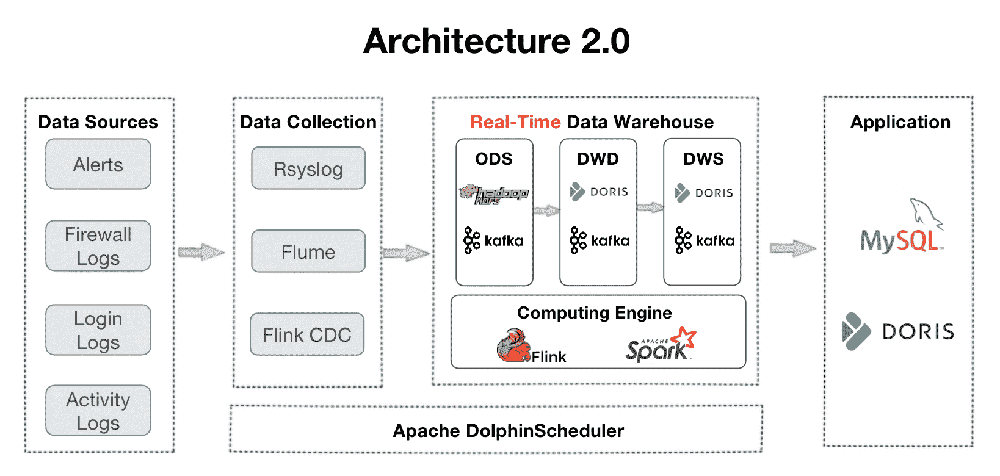
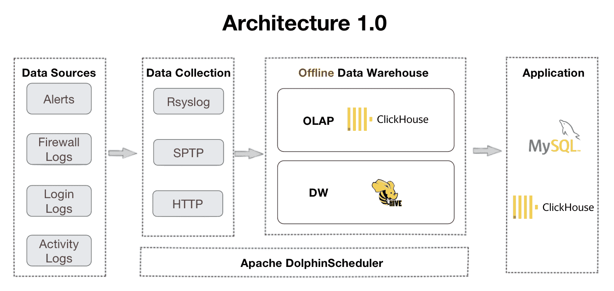

# 如何在一天内处理 150 亿条日志并保持大查询在 1 秒内完成

> 原文：[`www.kdnuggets.com/how-to-digest-15-billion-logs-per-day-and-keep-big-queries-within-1-second`](https://www.kdnuggets.com/how-to-digest-15-billion-logs-per-day-and-keep-big-queries-within-1-second)

这个数据仓储用例涉及到**规模**。用户是[中国联通](https://en.wikipedia.org/wiki/China_Unicom)，世界上最大的电信服务提供商之一。利用 Apache Doris，他们在数十台机器上部署了多个 PB 级别的集群，以支持其来自 30 多条业务线的 150 亿条日志的每日添加。这样一个庞大的日志分析系统是其网络安全管理的一部分。为了实现实时监控、威胁追踪和警报，他们需要一个能够自动收集、存储、分析和可视化日志及事件记录的日志分析系统。

从架构角度来看，系统应能够实时分析各种格式的日志，并且当然要具备可扩展性，以支持庞大且不断增长的数据量。本文的其余部分将介绍他们的日志处理架构是什么样的，以及他们如何实现稳定的数据摄取、低成本存储和快速查询。

* * *

## 我们的前三大课程推荐

 1\. [谷歌网络安全证书](https://www.kdnuggets.com/google-cybersecurity) - 快速进入网络安全职业的快车道

 2\. [谷歌数据分析专业证书](https://www.kdnuggets.com/google-data-analytics) - 提升你的数据分析技能

 3\. [谷歌 IT 支持专业证书](https://www.kdnuggets.com/google-itsupport) - 支持组织的 IT 需求

* * *

# 系统架构

这是他们数据管道的概述。日志被收集到数据仓库中，并经过几层处理。

+   **ODS**：所有来源的原始日志和警报被汇总到 Apache Kafka 中。同时，它们的副本将存储在 HDFS 中，以便进行数据验证或重放。

+   **DWD**：这里存放着事实表。Apache Flink 清洗、标准化、回填和去标识化数据，并将其写回 Kafka。这些事实表还会被放入 Apache Doris 中，以便 Doris 能够跟踪某一项或用于仪表盘和报告。由于日志不怕重复，事实表将按照 Apache Doris 的[Duplicate Key model](https://doris.apache.org/docs/dev/data-table/data-model#duplicate-model)进行安排。

+   **DWS**：这一层聚合 DWD 中的数据，为查询和分析奠定基础。

+   **ADS**：在这一层，Apache Doris 使用其聚合键模型自动聚合数据，并使用其唯一键模型自动更新数据。

Architecture 2.0 由 Architecture 1.0 发展而来，后者由 ClickHouse 和 Apache Hive 支持。这一过渡源于用户对实时数据处理和多表联接查询的需求。在他们使用旧架构的经验中，他们发现对并发和多表联接的支持不足，这表现在仪表板中的频繁超时和分布式联接中的 OOM 错误。

现在让我们来看看他们在数据摄取、存储和查询方面的 Architecture 2.0 实践。

# 实际案例实践

## 每天稳定摄取 150 亿条日志

在用户的案例中，他们的业务每天生成 150 亿条日志。快速且稳定地摄取如此大规模的数据量确实是一个问题。使用 Apache Doris，推荐的方式是使用 Flink-Doris-Connector。它由 Apache Doris 社区为大规模数据写入开发。该组件需要简单配置。它实现了流加载，并且可以达到每秒 200,000~300,000 条日志的写入速度，不会中断数据分析工作负载。

一项经验教训是，当使用 Flink 进行高频写入时，需要为你的案例找到合适的参数配置，以避免数据版本积累。在这种情况下，用户进行了以下优化：

+   **Flink Checkpoint**：他们将检查点间隔从 15 秒增加到 60 秒，以减少写入频率和 Doris 每单位时间处理的事务数量。这可以减轻数据写入压力，避免生成过多的数据版本。

+   **数据预聚合**：对于来自不同表但 ID 相同的数据，Flink 将根据主键 ID 进行预聚合，并创建一个平面表，以避免因多源数据写入而导致的资源过度消耗。

+   **Doris Compaction**：这里的技巧包括找到合适的 Doris 后端（BE）参数，以分配适量的 CPU 资源用于数据压缩，设置适当的数据分区、桶和副本数量（过多的数据平板会带来巨大的开销），以及将 max_tablet_version_num 调高以避免版本积累。

这些措施共同确保了每日摄取的稳定性。用户在 Doris 后端见证了稳定的性能和低的压缩分数。此外，Flink 中的数据预处理和 Doris 中的 [唯一键模型](https://doris.apache.org/docs/dev/data-table/data-model#unique-model) 的结合可以确保更快的数据更新。

## 降低成本 50%的存储策略

日志的大小和生成速率也对存储造成压力。在庞大的日志数据中，只有一部分具有较高的信息价值，因此存储应该有所区分。用户有三种存储策略来降低成本。

+   **ZSTD（ZStandard）压缩算法**：对于大于 1TB 的表，在表创建时指定压缩方法为“ZSTD”，可以实现 10:1 的压缩比。

+   **冷热数据分层存储**：这由 Doris 的[新功能](https://blog.devgenius.io/hot-cold-data-separation-what-why-and-how-5f7c73e7a3cf)支持。用户设置了数据“冷却”期为 7 天。这意味着过去 7 天的数据（即热数据）将存储在 SSD 中。随着时间的推移，热数据会“冷却”（超过 7 天），它将自动转移到成本较低的 HDD 中。随着数据变得更加“冷”，它将被转移到对象存储中以进一步降低存储成本。此外，在对象存储中，数据将以单副本存储，而不是三副本。这进一步减少了成本和冗余存储带来的开销。

+   **不同数据分区的副本数量**：用户按照时间范围对数据进行了分区。原则是对较新的数据分区有更多副本，对较旧的数据分区有较少副本。在他们的情况下，过去 3 个月的数据被频繁访问，因此该分区有 2 个副本。3~6 个月的数据有两个副本，6 个月前的数据只有一个副本。

通过这三种策略，用户将存储成本降低了 50%。

## 基于数据大小的差异化查询策略

某些日志必须立即跟踪和定位，例如异常事件或故障日志。为了确保对这些查询的实时响应，用户针对不同的数据大小采用了不同的查询策略：

+   **少于 100G**：用户利用 Doris 的动态分区功能。小表按日期分区，大表按小时分区。这可以避免数据倾斜。为了进一步确保数据分区内的平衡，他们使用 snowflake ID 作为分桶字段。他们还设置了起始偏移量。最近 20 天的数据将被保留。这是在数据积压和分析需求之间的平衡点。

+   **100G~1T**：这些表有其物化视图，这些视图是在 Doris 中存储的预计算结果集。因此，对这些表的查询将会更快且资源消耗更少。Doris 中的物化视图 DDL 语法与 PostgreSQL 和 Oracle 中的相同。

+   **超过 100T**：这些表被放入 Apache Doris 的聚合键模型中，并进行预聚合。**这样，我们可以使 20 亿条日志记录的查询在 1~2 秒内完成。**

这些策略缩短了查询的响应时间。例如，以前查询特定数据项需要几分钟，但现在可以在毫秒内完成。此外，对于包含 100 亿条数据记录的大表，查询不同维度的数据都可以在几秒钟内完成。

# 进行中的计划

用户现在正在测试 Apache Doris 中新增的[倒排索引](https://blog.devgenius.io/what-is-inverted-index-and-how-we-made-log-analysis-10-times-more-cost-effective-with-it-6afc6cc81d20)。该索引旨在加快字符串的全文搜索以及数值和日期时间的等效性和范围查询。他们还提供了关于 Doris 自动分桶逻辑的宝贵反馈：目前，Doris 根据前一个分区的数据大小来决定一个分区的桶数。用户的问题是，他们的大部分新数据在白天到达，而夜间的数据很少。因此，在他们的情况下，Doris 在夜间创建了过多的桶，而在白天则创建了过少的桶，这与他们的需求相反。他们希望添加一种新的自动分桶逻辑，使 Doris 决定桶数的参考依据为前一天的数据大小和分布。他们已经来到了[Apache Doris 社区](https://join.slack.com/t/apachedoriscommunity/shared_invite/zt-1t3wfymur-0soNPATWQ~gbU8xutFOLog)，我们现在正在进行这一优化。

**[扎基·卢](https://www.linkedin.com/in/zaki-lu-99a06b148/)** 曾是百度的产品经理，现在是 Apache Doris 开源社区的 DevRel。

### 更多相关内容

+   [《Python 深度学习：第二版》by François Chollet](https://www.kdnuggets.com/2022/01/manning-deep-learning-python-second-edition-francois-chollet.html)

+   [《Kubernetes 实战：第二版》](https://www.kdnuggets.com/2022/03/manning-kubernetes-action-second-edition.html)

+   [Rotten Tomatoes 电影评分预测的数据科学项目：…](https://www.kdnuggets.com/2023/07/data-science-project-rotten-tomatoes-movie-rating-prediction-second-approach.html)

+   [金融中的 Python：Jupyter Notebook 中的实时数据流](https://www.kdnuggets.com/python-in-finance-real-time-data-streaming-within-jupyter-notebook)

+   [高效的小型语言模型：微软的 13 亿参数 phi-1.5](https://www.kdnuggets.com/effective-small-language-models-microsoft-phi-15)

+   [选择下一个数据科学职位前需要考虑的 5 件事](https://www.kdnuggets.com/2022/01/5-things-keep-mind-selecting-next-job.html)
