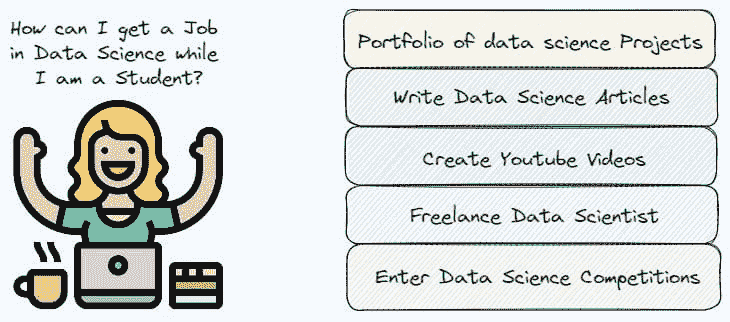

# 如何作为学生获得数据科学职位

> 原文：[`www.kdnuggets.com/how-to-get-a-job-in-data-science-as-a-student`](https://www.kdnuggets.com/how-to-get-a-job-in-data-science-as-a-student)

插图作者。来源：[Flaticon](https://www.flaticon.com/free-icon/working_3195123?term=excited&related_id=3195123)

数据科学是一个具有挑战性的领域，单凭拥有认证或大学学位是不够的，无法在行业中获得工作。招聘人员需要了解你相比其他候选人能够为公司带来什么价值。

由于资格本身不足以在数据科学领域获得工作，开始尝试不同的经历的最佳时机是在你还是学生的时候。你仍然年轻，比你想象的有更多时间和精力，这些都可以用来增加你获得首份数据科学工作的机会。

在这篇文章中，我想展示五种不同的方式来展示你的技能，甚至赚取收入。让我们开始吧！

# 构建数据科学项目组合

当我开始申请我的第一份数据科学工作时，显然我在这一领域没有任何经验。我在硕士学位期间做的项目帮助我向公司展示了我的技能。

展示你的编码能力的最佳方式是将你的项目分享到 GitHub。你当然不应该只关注 python 脚本/jupyter notebooks，还应包括一个 READ.me 文件，详细解释项目的组织方式和获得的结果。

例如，我的一个个人项目引起了经理们的兴趣，[BERTopic 主题建模](https://github.com/eugeniaring/topic-modeling-reviews)，在该项目中，我训练了一个 BERTopic 模型来识别来自电子商务服装评论的主题，并通过互动数据可视化解释结果。这有助于展示我能够解决一个自然语言处理问题。

# 撰写数据科学文章

当我还是学生时，我开始在不同的出版物中撰写数据科学文章，如 Towards AI 和 Towards Data Science，这让我能够接触到来自不同国家的大量读者，将我在大学课程中学到的知识付诸实践，深入探讨我感兴趣的未知领域，收到工作提议，甚至赚取收入。

最好的老师是来自社区的反馈，刚开始时，尤其是负面评论可能会让人感到害怕，但它确实有助于提升你的批判性思维，并让你对解决问题的其他可能方案保持开放的心态。

你还可以从零开始创建自己的博客，而不是在出版物上发布，但你应该考虑到建立网站所需的时间。无论如何，多亏了 Chat-GPT 和其他基于大型语言模型的 AI 工具，这一切变得更加容易。

# 创建 YouTube 视频

文章可以是展示你沟通能力的好方法，这对于数据科学家来说是一项重要技能，但录制 YouTube 视频也可以证明你的能力。

这可以与文章结合进行，但单独制作视频也可能足够。有很多知名的数据科学领域的影响者以其出色的视频内容建设能力而闻名，如 StatQuest 的 Josh Starmer、Data Professor 和 Patrick Loeber。

# 作为自由职业数据科学家工作

教育内容并不是进入数据科学领域的唯一途径。另一种获得经验的可能性是作为自由职业数据科学家工作。这是对传统的 9 到 5 工作的一个良好替代方案：它可以保证自由和灵活性，尤其是当你还是学生并且需要时间参加和学习大学课程时。

你可以从现有平台开始，比如 [Upwork](https://www.upwork.com/) 和 [Fiverr](https://www.fiverr.com/)，在这些平台上你需要创建个人资料，并申请客户发布的数据科学自由职业任务。你也可以在 LinkedIn 上联系客户或被客户联系，这被认为是与数据科学社区相关人士建立联系的最佳社交网络。

# 参加数据科学竞赛

提高获得工作的机会的另一种方式是参加数据科学竞赛。我想强调的是，参加大量竞赛并不重要，更重要的是专注于对面试公司有价值的现实项目。质量总是比数量更重要。

最知名和受欢迎的竞赛平台是 [Kaggle](https://www.kaggle.com/)。你在搜索数据科学主题、数据集和其他内容时肯定查阅过这个网站。其他竞赛可以在 [DrivenData](https://www.drivendata.org/competitions/)、[TopCoder](https://www.topcoder.com/) 和 [DevPost](https://devpost.com/) 上找到。

# 最终思考

我希望这篇文章能激励你采取行动，从而改善你的简历。这也是将你在学习过程中获得的知识付诸实践的好方法，克服冒名顶替综合症，并变得更加灵活。

当然，你不应该仅仅为了改善你的简历而这样做，还应该为了我之前列出的其他好处，这些好处可以让你在不同的经验中变得更加自信。感谢阅读！祝你有美好的一天。

**[尤金妮亚·安内洛](https://www.linkedin.com/in/eugenia-anello/)** 目前是意大利帕多瓦大学信息工程系的研究员。她的研究项目专注于持续学习结合异常检测。

### 更多相关主题

+   [从学生到专业人士：在 AI 领域建立职业生涯](https://www.kdnuggets.com/building-a-career-in-ai-from-student-to-professional)

+   [如何在没有任何工作经验的情况下获得你的第一份数据科学工作](https://www.kdnuggets.com/2021/02/first-job-data-science-without-work-experience.html)

+   [数据分析中的职位趋势：用于职位趋势分析的自然语言处理](https://www.kdnuggets.com/job-trends-in-data-analytics-nlp-for-job-trend-analysis)

+   [10 个网站获取惊人的数据用于数据科学项目](https://www.kdnuggets.com/2023/04/10-websites-get-amazing-data-data-science-projects.html)

+   [5 种稀有的数据科学技能可以帮助你获得就业机会](https://www.kdnuggets.com/5-rare-data-science-skills-that-can-help-you-get-employed)

+   [10 门必修的免费数据科学课程以便入门](https://www.kdnuggets.com/10-free-must-take-data-science-courses-to-get-started)
