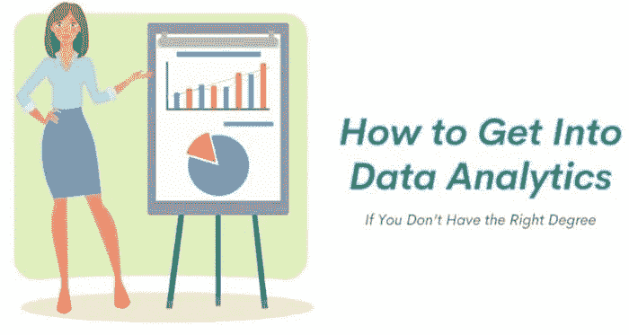
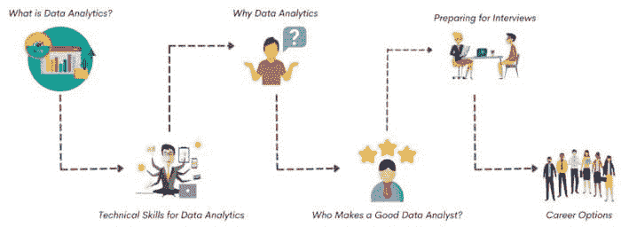
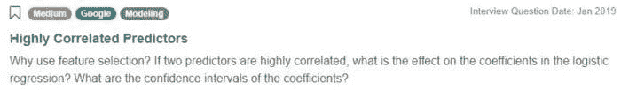

# 如何在没有相关学位的情况下进入数据分析领域

> 原文：[`www.kdnuggets.com/2021/12/how-to-get-into-data-analytics.html`](https://www.kdnuggets.com/2021/12/how-to-get-into-data-analytics.html)

评论

**作者 [Zulie Rane](https://www.linkedin.com/in/zulie-rane-2a225a185/)，自由撰稿人及编程爱好者**。

数据分析是一个非常酷的、蓬勃发展的行业。它已经存在了很长时间，这也解释了为什么如此多人在考虑如何进入数据分析领域。自互联网和智能手机的广泛应用以来，数据量激增。2020 年初，全球的数据量估计为 [44 zettabytes](https://seedscientific.com/how-much-data-is-created-every-day/)，即 44 x [10²¹ bytes](https://en.wikipedia.org/wiki/Zettabyte_Era)。这些数据包含大量有用的信息，例如消费者的购买模式或疾病的指标。

数据分析师处理数据集，并负责理解它们。数据在说什么，公司应该如何应对？一个简单的例子是你将商品放入购物车后，出现的包含常被一起购买的商品的横幅。数据分析师可能负责确定哪些产品应该关联在一起，以提高转化率。

数据分析是 [分析原始数据](https://www.mastersindatascience.org/learning/what-is-data-analytics/) 以发现趋势和回答问题的过程。这涉及大量的单独工作在屏幕前，但如果你喜欢数学和编程，这是一个很好的机会。你需要获取和收集数据，以及清理、组织、可视化和分析数据。

一个简单的 [区别](https://www.kdnuggets.com/2021/09/7-differences-between-data-analyst-data-scientist.html)说明：数据科学家负责设计和构建新的数据模型。他们创建原型、算法、预测模型。数据分析师则按照名字的意思——查看数据，尝试预测趋势，制作可视化，并传达结果。换句话说，数据分析师分析数据。在美国，数据科学家的年薪比数据分析师高出 $30K-$40K，因此这是一个重要的区别。

这篇文章将带你了解获得第一个数据分析师职位所需的一切知识。

### 什么是数据分析？

在你开始考虑如何进入数据分析领域之前，你应该确保你理解这个领域。数据分析是从大量数据中提取意义的艺术。根据[DOMO](https://www.domo.com/solution/data-never-sleeps-6)的说法，自 2020 年以来，每个人每秒钟产生 1.7MB 的数据。数据分析师的任务是找到与他们的业务应用相关的数据，理解这些数据，并找到将这些知识应用于改善业务的方法。

数据分析领域内有许多子领域。这些包括描述性、诊断性、预测性和规范性分析。你可以通过以下方式理解这些不同类型的分析。

+   描述性分析是弄清楚发生了什么。

+   诊断性分析回答的问题是：为什么会发生这种情况？

+   预测性分析尝试利用现有数据预测未来会发生什么。

+   规范性分析旨在弄清楚应该如何处理这些情况。

数据分析师在日常工作中可能会涵盖所有这些子领域。通常，数据分析师会通过所有这些分析形式来充分利用数据集，并优化其业务影响。如果你想进入数据分析领域，理解这些不同的分析形式并知道如何应用它们是非常重要的。

数据分析师的任务是帮助企业做出数据驱动的决策。由于数据收集相对简单，数据分析师可以测试他们的假设，并修正他们制定的规范性模型，以提高其性能，并调整基于数据洞察制定的行动项。基于数据制定假设、实施预测并分析结果，就是进入数据分析领域的方式。

### 数据分析需要哪些技术技能？

由于数据分析是数学和编程的交叉领域，因此它是一个极其技术性的领域。你需要使用许多不同的工具和[技术技能](https://www.stratascratch.com/blog/most-in-demand-data-science-technical-skills/)来完成工作。一位软件工程师玛格丽塔·哈马彻（Margarita Hamacher）整理了一个数据分析师所需的[7 项技术技能](https://margarita-hamacher.medium.com/7-crucial-technical-skills-for-data-analysts-e56525b648b0)的综合清单。数据分析不仅仅是硬技能。但对于任何想要进入数据分析领域的人来说，这些技术技能将是一个很好的起点。

这些技能包括数学、数据可视化、机器学习、编码等。数学要求可以进一步分解为线性代数、统计学和概率论，这些都是数据分析师非常重要的理论基础。值得强调的是如何分离用于训练和测试的数据，以及列举你应该熟悉的基本机器学习算法，如果不能实现这些算法也没关系。

如果你想了解如何进入数据分析领域，掌握这些技能非常重要，因为你需要每一项技能来正确理解数据并准确分析数据。此外，这些技能中的许多都是面试问题的绝佳素材。

我会建议你创建一些使用这些技能的个人项目，并在简历中提供这些项目的链接。如果你遇到以下问题：

*[链接到问题](https://platform.stratascratch.com/technical/2017-highly-correlated-predictors)*

如果你在项目中用实际数据解决过类似的问题，你的回答会更具说服力和信息量。你可以讨论这些相关特征对你分析项目数据集的影响。

### 如何进入数据分析领域：为什么数据分析值得进入？

数据分析是一个真正迷人的领域。例如，大多数经典经济理论基于人类个体做出理性决策的假设。这个假设是错误的，因此使得许多经典经济理论完全过时。例如，有一种旧的经济理论认为消费者喜欢选择，尽管在某些情况下这是真的，但做决定可能是身体上令人疲惫的。Mark Lepper 和 Sheen Iyengar 发现了选择悖论。他们发现，当客户面临 6 种选择时，更可能购买果酱，而不是 24 种选择。然而，基于数据的经济理论要准确得多。虽然数据分析仍然需要偶尔做一些小假设，但由于它完全基于收集的数据，如果你的数据是全面和具有代表性的，数据分析提供了一种优雅且准确的方式来理解世界及其决策或习惯。

数据分析是一个快速发展的领域。美国劳工统计局预测到 2026 年数据科学领域将会有[28%的增长](https://www.bls.gov/opub/btn/volume-7/big-data-adds-up.htm)。如果你关心薪水，美国数据分析师的平均工资是[$70K](https://www.glassdoor.com/Salaries/data-analyst-salary-SRCH_KO0,12.htm)，随着对数据分析师需求的增加，这个数字只会有上涨趋势。现在是进入数据分析领域的绝佳时机，你可以采取一些简单的步骤来实现这一目标。

### 谁是优秀的数据分析师？

数据分析是一个非常技术性的领域，所以任何想进入数据分析领域的人都需要对多种高级数学概念有深入理解，并且需要成为一个合格的程序员。如果你对数字及其所揭示的内容充满热情，只要确保你掌握了上述[技术技能](https://www.stratascratch.com/blog/most-in-demand-data-science-technical-skills/)以符合职位要求，数据分析就是适合你的工作。

数据分析师工作中的一个重要因素是许多人未曾考虑的上下文业务知识。如果你是一名处理树木生长数据的数据分析师，而你的数据集中缺少某些值，你需要对树木及其生长方式有足够的了解，以确定这些数据是否可以丢弃或补充的最佳方式是什么。你还需要能够理解数据集中特征的含义。如果你有两个在意义上非常相似的特征，你可能会想要丢弃其中一个。你可以通过利用上下文知识来评估特征之间的依赖关系以及哪些特征与当前问题最相关，从而避免对特征依赖性进行深入分析的麻烦。

思考一下你的兴趣或已有的知识领域，以及你如何将数据分析应用于这些领域。许多进入数据分析领域的人没有正式的数据分析背景或学位，因此你可以考虑成为一名处理你所学领域数据的数据分析师。

### 如何准备数据分析面试

如何进入数据分析领域的一个重要部分是成功完成数据分析师职位的面试。除了精通 Python 并能够解释中心极限定理之外，你还可能被要求演示如何比较不同后端引擎在自动生成推荐中的表现。查看下面的面试问题示例：

*[问题链接](https://platform.stratascratch.com/technical/2006-comparing-performance-of-engines)*

准备技术面试的[最佳方式](https://www.stratascratch.com/blog/5-tips-to-prepare-for-a-data-science-interview/)是练习。回答技术问题是一种技能，就像其他技能一样。不断练习编码和非编码问题。你可以使用像 StrataScratch 这样的网站，它提供了大量的数据分析师面试问题，包括编码和非编码问题。

除了回答编码问题，比如找出每个 Facebook 用户的[受欢迎程度百分比](https://platform.stratascratch.com/coding/10284-popularity-percentage?python=)，以及技术、理论性、非编码问题，比如解释不同的[时间序列预测技术](https://platform.stratascratch.com/technical/2022-time-series-forecasting-techniques)，你还需要准备与数据分析师相关的内容，以应对行为面试问题。虽然你大多数面试将是技术面试，无论是编码问题还是非编码问题，但你仍然需要有相关的实例来展示你经历过的失败或特别骄傲的成就，这些都与数据分析有关。

这就是为什么拥有与数据分析相关的个人项目如此重要的原因。也许你对拯救动物充满热情。你可以创建一个模型，预测哪些策略对于让动物被领养最为有效。如果有机会应用你的模型，例如让一个动物收容所按照你的推荐策略操作，并观察这是否会对领养率产生影响，那就更好了。数据分析可以应用于任何有数据的领域。肯定有一个与你热情所在的主题相关的数据集。用它来练习你的数据分析师技能，以便在面试时突出显示这些技能。

### 数据分析职业选择

许多程序员和非程序员可能担心如何进入数据分析领域，但他们应该知道，正式的教育，特别是在数据分析领域，并不是必需的。并不是很多大学提供完整的数据科学或数据分析学位课程。虽然越来越多的大学在增加数据分析课程，但数据分析师的需求仍然太高，以至于雇主不要求正式的数据分析或数据科学背景。如果你有数学或计算机科学的背景，这将非常有帮助，但不是必需的。

要获得入门级的数据分析师职位，你的最佳选择是精通 Python，并对 SQL 非常自信，同时熟悉 SAS、R、Tableau 或其他数据库接口工具和语言。如果你没有计算机科学或数学背景，可以在业余时间发展这些技能，并将其应用于展示你能力的个人项目中。

由于背景知识的重要性，数据分析是从其他行业进入的一个极好的领域。根据你分析的数据所在的行业，无论是医学影像还是在线零售行业中小型企业的购买模式，了解你分析数据的领域可能是有帮助的，有时甚至是必要的。

美国的数据分析师的平均工资为$70K，但在职业后期，这个数字可以高达$106K。我们的文章 [*数据科学家赚多少钱*](https://www.stratascratch.com/blog/how-much-do-data-scientists-make/) 可以帮助你了解数据分析领域的薪资情况以及这些薪资如何受到各种因素的影响。

数据分析师的常见工作职责包括收集和组织数据，确保遵守数据政策，执行质量控制功能以确保数据的完整性，优化利润建议，或制定价格和投资组合折扣计划。具体的职责在不同公司之间可能差异很大，因此请检查具体的职位描述，以找到与你最感兴趣的任务相匹配的工作。

### 关于如何进入数据分析领域的最终思考

数据分析是一个充满潜力的领域，前景广阔。数据分析师的需求迅速增长，这意味着你将享有相对较高的工作安全性。由于这个行业还较为年轻，职业发展的潜力巨大。所需的技能多种多样，因此绝对不适合那些已经不想再学习的人。由于这个行业正在迅速扩张，未来几年必然会有很多工具和新应用的变化。

如果你想进入技术和编程领域，但不想回到学校或成为软件工程师，数据分析是一个很好的选择。数据分析师仍然可以进行编码，但你不需要处理待命或运维的麻烦。数据分析的应用通常很吸引人，通过指导企业做出基于数据的决策，你可以对业务的成功产生很大的影响。

[原文](https://www.stratascratch.com/blog/how-to-get-into-data-analytics-if-you-don-t-have-the-right-degree/)。转载经许可。

**简介: [Zulie Rane](https://www.zuliewrites.com/)** 是一位博主、代笔作家、YouTuber 和猫妈妈。她喜欢创作有关数据科学、流行文化和猫的内容。

### 更多相关话题

+   [9 个能帮助你获得学位的专业证书... 如果…](https://www.kdnuggets.com/9-professional-certificates-that-can-take-you-onto-a-degree-if-you-really-want-to)

+   [5 个需求高但不被足够重视的 IT 职位](https://www.kdnuggets.com/5-it-jobs-that-are-high-in-demand-but-dont-get-enough-recognition)

+   [进入数据科学的三种可能途径](https://www.kdnuggets.com/2022/03/3-possible-ways-get-data-science.html)

+   [进入 FAANG 公司的难度有多大](https://www.kdnuggets.com/2023/05/hard-get-faang-companies.html)

+   [通过西北大学的数据科学学位开启你的职业生涯](https://www.kdnuggets.com/2022/04/nwu-launch-career-northwestern-data-science-degree.html)

+   [哪种最佳：数据科学训练营 vs 学位 vs 在线课程](https://www.kdnuggets.com/2022/09/best-data-science-bootcamp-degree-online-course.html)
