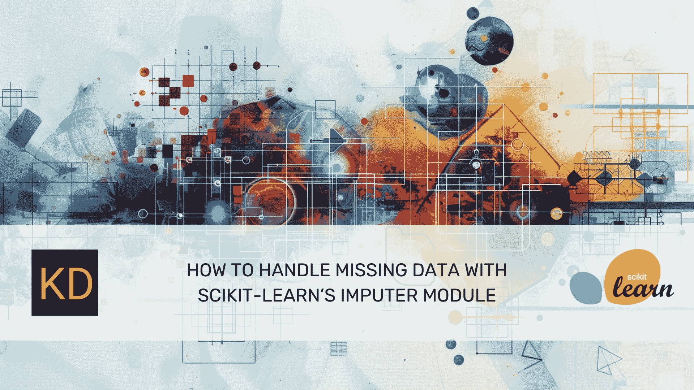

# 如何使用 Scikit-learn 的 Imputer 模块处理缺失数据

> 原文：[`www.kdnuggets.com/how-to-handle-missing-data-with-scikit-learns-imputer-module`](https://www.kdnuggets.com/how-to-handle-missing-data-with-scikit-learns-imputer-module)



图片来源于编辑 | Midjourney & Canva

让我们学习如何使用 Scikit-learn 的 imputer 来处理缺失数据。

## 准备工作

* * *

## 我们的前三个课程推荐

 1\. [Google 网络安全证书](https://www.kdnuggets.com/google-cybersecurity) - 快速进入网络安全职业生涯

 2\. [Google 数据分析专业证书](https://www.kdnuggets.com/google-data-analytics) - 提升你的数据分析技能

 3\. [Google IT 支持专业证书](https://www.kdnuggets.com/google-itsupport) - 支持你所在组织的 IT

* * *

确保你的环境中安装了 Numpy、Pandas 和 Scikit-Learn。如果没有，你可以通过以下代码使用 pip 安装它们：

```py
pip install numpy pandas scikit-learn
```

然后，我们可以将包导入到你的环境中：

```py
import numpy as np
import pandas as pd
import sklearn
from sklearn.experimental import enable_iterative_imputer
```

## 使用 Imputer 处理缺失数据

Scikit-Learn 插补器是一个用于用特定值替换缺失数据的类。它可以简化你的数据预处理过程。我们将探索几种处理缺失数据的策略。

让我们为示例创建一个数据示例：

```py
sample_data = {'First': [1, 2, 3, 4, 5, 6, 7, np.nan,9], 'Second': [np.nan, 2, 3, 4, 5, 6, np.nan, 8,9]}
df = pd.DataFrame(sample_data)
print(df)
```

```py
 First  Second
0    1.0     NaN
1    2.0     2.0
2    3.0     3.0
3    4.0     4.0
4    5.0     5.0
5    6.0     6.0
6    7.0     NaN
7    NaN     8.0
8    9.0     9.0
```

你可以使用 Scikit-Learn Simple Imputer 用相应列的均值填充列中的缺失值。

```py
 First  Second
0   1.00    5.29
1   2.00    2.00
2   3.00    3.00
3   4.00    4.00
4   5.00    5.00
5   6.00    6.00
6   7.00    5.29
7   4.62    8.00
8   9.00    9.00
```

需要注意的是，我们将结果四舍五入到两位小数。

也可以使用 Simple Imputer 用中位数插补缺失数据。

```py
imputer = sklearn.SimpleImputer(strategy='median')
df_imputed = round(pd.DataFrame(imputer.fit_transform(df), columns=df.columns),2)

print(df_imputed)
```

```py
 First  Second
0    1.0     5.0
1    2.0     2.0
2    3.0     3.0
3    4.0     4.0
4    5.0     5.0
5    6.0     6.0
6    7.0     5.0
7    4.5     8.0
8    9.0     9.0
```

均值和中位数插补的方法很简单，但它可能会扭曲数据分布并在数据关系中产生偏差。

还可以使用 K-NN 插补器通过最近邻居方法填充缺失数据。

```py
knn_imputer = sklearn.KNNImputer(n_neighbors=2)
knn_imputed_data = knn_imputer.fit_transform(df)
knn_imputed_df = pd.DataFrame(knn_imputed_data, columns=df.columns)

print(knn_imputed_df)
```

```py
 First  Second
0    1.0     2.5
1    2.0     2.0
2    3.0     3.0
3    4.0     4.0
4    5.0     5.0
5    6.0     6.0
6    7.0     5.5
7    7.5     8.0
8    9.0     9.0
```

KNN 插补器将使用 *k* 个最近邻居的均值或中位数来填补缺失数据。

最后，还有迭代插补方法，它基于将每个缺失值的特征建模为其他特征的函数。正如本文所述，这是一个实验性功能，因此我们需要首先启用它。

```py
iterative_imputer = IterativeImputer(max_iter=10, random_state=0)
iterative_imputed_data = iterative_imputer.fit_transform(df)
iterative_imputed_df = round(pd.DataFrame(iterative_imputed_data, columns=df.columns),2)

print(iterative_imputed_df)
```

```py
 First  Second
0    1.0     1.0
1    2.0     2.0
2    3.0     3.0
3    4.0     4.0
4    5.0     5.0
5    6.0     6.0
6    7.0     7.0
7    8.0     8.0
8    9.0     9.0
```

如果你能够正确使用插补器，它可能有助于提高你的数据科学项目的质量。

## 额外资源

+   [如何处理数据集中的缺失值](https://www.kdnuggets.com/2020/06/missing-values-dataset.html)

+   [如何使用 Python 处理缺失数据](https://machinelearningmastery.com/handle-missing-data-python/)

+   [使用 Pandas 清理数据](https://www.kdnuggets.com/data-cleaning-with-pandas)

**[](https://www.linkedin.com/in/cornellius-yudha-wijaya/)**[Cornellius Yudha Wijaya](https://www.linkedin.com/in/cornellius-yudha-wijaya/)**** 是数据科学助理经理和数据撰稿人。他在印尼安联全职工作时，喜欢通过社交媒体和写作媒体分享 Python 和数据技巧。Cornellius 在各种 AI 和机器学习话题上都有所涉猎。

### 更多相关主题

+   [NumPy 中的掩码数组以处理缺失数据](https://www.kdnuggets.com/masked-arrays-in-numpy-to-handle-missing-data)

+   [使用 Scikit-learn 的 Imputer](https://www.kdnuggets.com/2022/07/scikitlearn-imputer.html)

+   [告别 Print()：使用 Logging 模块进行有效调试](https://www.kdnuggets.com/say-goodbye-to-print-use-logging-module-for-effective-debugging)

+   [KDnuggets 新闻，8 月 31 日：完整的数据科学学习路线图…](https://www.kdnuggets.com/2022/n35.html)

+   [处理不平衡数据的 7 种技巧](https://www.kdnuggets.com/2017/06/7-techniques-handle-imbalanced-data.html)

+   [如何使用 Pandas 精确处理时区和时间戳](https://www.kdnuggets.com/how-to-handle-time-zones-and-timestamps-accurately-with-pandas)
