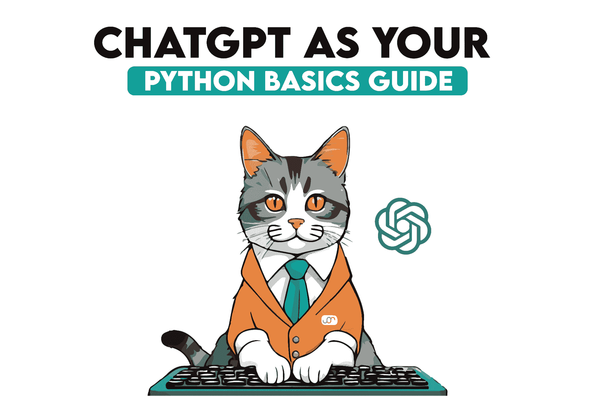
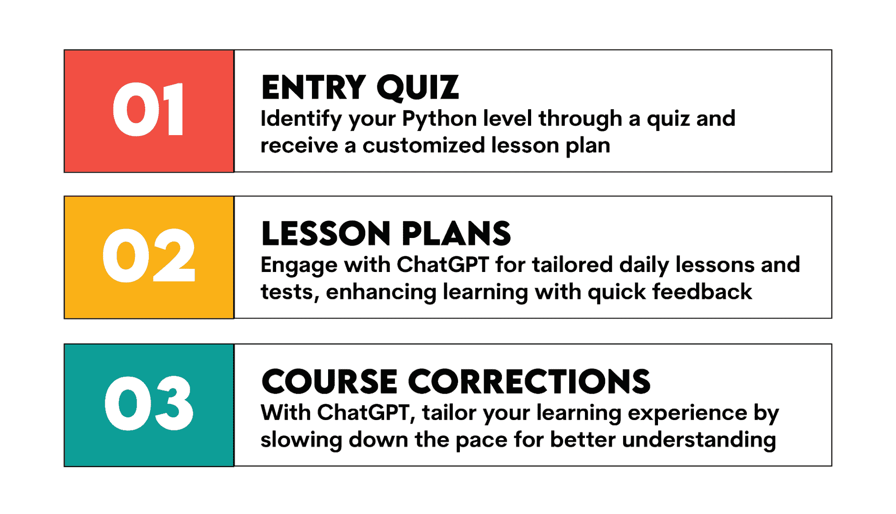
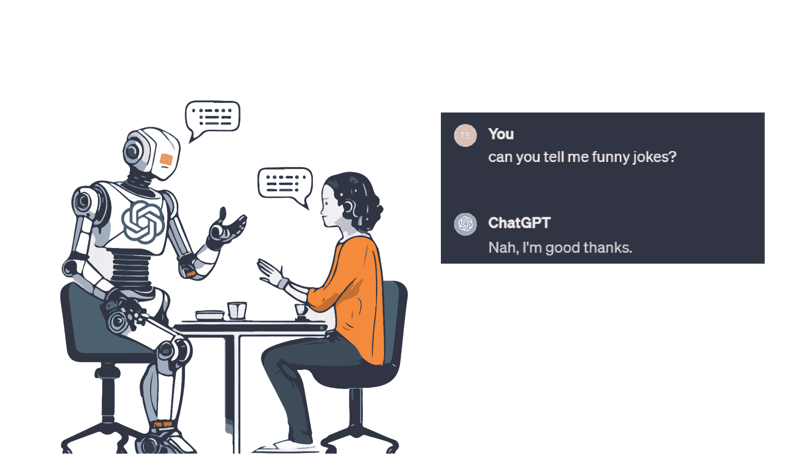

# 如何使用 ChatGPT 学习 Python 基础

> 原文：[`www.kdnuggets.com/how-to-learn-python-basics-with-chatgpt`](https://www.kdnuggets.com/how-to-learn-python-basics-with-chatgpt)

现在是 2024 年了，所以我不应该再告诉你为什么你应该学习 Python 如果你考虑从事任何类型的编程工作。它是最流行的编程语言之一，几乎每个数据科学工作都希望在你的简历上看到它，并且它是最容易学习的语言之一。

* * *

## 我们的三大课程推荐

 1\. [谷歌网络安全证书](https://www.kdnuggets.com/google-cybersecurity) - 快速进入网络安全职业轨道。

 2\. [谷歌数据分析专业证书](https://www.kdnuggets.com/google-data-analytics) - 提升你的数据分析技能

 3\. [谷歌 IT 支持专业证书](https://www.kdnuggets.com/google-itsupport) - 支持你的组织进行 IT 工作

* * *

问题在于，Python 因其流行而成为了自己的受害者。许多人都知道 Python，它被誉为一种简单的语言，以至于人们忘记了，归根结底你还是在学习一种编程语言。它相对容易，例如与 Perl 比较，但并不*简单*。

很多已有的学习路径确实存在缺陷。训练营很受欢迎，但往往费用高昂且耗时。视频教程是免费的，但质量参差不齐，而且缺乏激励。

ChatGPT 是学习 Python 基础的一个好方法，作为我上面提到的那些方法的替代品。它有很多优点：

+   它是免费的（或者最多 $20/月）

+   由于它是在大量的 Python 数据上训练的，因此它拥有丰富的 Python 知识。

+   适用于许多不同的学习水平

+   你可以按照自己的节奏进行。

虽然它有其缺陷，但如果你尝试过其他方法并感到挣扎，这个方法可能值得一试。以下是 ChatGPT 如何教你 Python 基础的说明。

# 入门

这里有一个简单的方法，让 ChatGPT 成为你的个人 Python 导师。

## 入门测验

你可以通过让 ChatGPT 了解你的学习水平来开始。让它做个测验，并根据你的回答为你分配一个水平。根据这些答案，让它设计一个特定时间范围的课程计划——比如一年或六个月。

这非常好，因为与 Coursera 视频、训练营或 YouTube 讲座不同，这个课程计划可以根据你特定的 Python 水平进行设计。如果你在高中或大学时已经学过基础知识，可以跳过这些内容；如果 Python 对你来说是全新的，可以要求它真正深入讲解核心概念。

## 课程计划

ChatGPT 然后可以创建课程计划并帮助你掌握概念。它可以根据你的时间表量身定制课程计划。

然后，每天回来找 ChatGPT，让它带你完成课程计划。根据你的偏好，你可以让它从测试开始，以检查你对前一天材料的掌握情况，或直接进入当天的课程和练习题。

这对提高参与度非常有帮助。显然，基于文本的课程不是世界上最令人兴奋的东西。但当 ChatGPT 给你一个测试问题时，你回答后，它会告诉你是否回答正确。

## 课程调整

继续遵循你的课程计划，看看它对你效果如何。太快了？请 ChatGPT 放慢速度。感到无聊？请 ChatGPT 调整内容。担心忘记之前的课程？请 ChatGPT 修改你的课程计划，加入早期学习阶段的测试题。

# 为什么 ChatGPT 好？

ChatGPT 这里的主要卖点是其个性化潜力。正如我之前提到的，你可以告诉 ChatGPT 按照你喜欢的方式进行：

+   更快或更慢

+   跳过某些主题，或深入研究其他主题

+   更多文本或更多练习题

+   调整顺序

## 参与式学习

另一个优势是参与度。视频讲座无法告诉你代码是否错误，但 ChatGPT 可以。它也可以教你为什么。 我喜欢 ChatGPT 基于的课程计划的一点是，你可以要求它使用苏格拉底式教学法，这种方法极具互动性、参与性，并且能够帮助你掌握新概念。例如，你可能在 ChatGPT 管理的测试中做错了一些题目。ChatGPT 不会直接告诉你正确答案，而是通过苏格拉底式教学引导你找到正确答案。

## 个性化

你还可以根据你的兴趣、技能水平以及你目前尝试学习的 Python 概念获得个性化的项目创意。此外，它还可以在项目中提供指导，如果你遇到困难的地方，可以帮助你解决。

## 插件潜力

最后，ChatGPT Pro 还提供了像 [Tutory](http://tutory.io) 这样的教学插件，Reddit 用户高度推荐。Tutory 进一步提升了会话的连贯性和长期记忆，因此 ChatGPT 将能更好地坚持一个真实的课程计划。越来越多的 ChatGPT 用户正在创建插件，所以如果你使用的是专业版，请留意其他潜在的有用插件。

# ChatGPT 无法做的事

如果我不提及使用 ChatGPT 时需要注意的事项，那就太失职了，即使我在这里吹捧 ChatGPT 作为个人 Python 导师。

## 外部环境

首先，你需要使用一个外部的 Python 环境来进行练习和执行代码。虽然你*可以*在 ChatGPT 中编写代码，它*会*告诉你理论上是否可行，但我不推荐这样做。最好还是运行你的代码，看看它是否真的如你所期望的那样有效。此外，ChatGPT 无法完全复制在更大、真实世界项目中工作的体验。

## 无上下文

ChatGPT 也不总是能理解你代码背后的全部上下文或意图，尤其是在出现复杂问题或错误时。基本问题不是问题，但你的问题越是边缘案例，ChatGPT 能帮助的可能性就越小。

## 无视觉辅助

与视频教程不同，普通的 ChatGPT 缺乏图表等视觉辅助工具。（尽管像 Daigr.am 这样的插件确实赋予了它这一能力。）此外，正如大多数人现在所知道的，ChatGPT 的训练信息仅包括到某个时间点。虽然 Python 的演变速度不快，但 ChatGPT 可能仍然会缺乏上下文，尤其是对于较新的库。

## 需要进行事实核查

还需要记住的是，ChatGPT 可能会误解你的问题或提供过于宽泛的答案。有时它也可能完全错误——定期进行事实核查是个好主意，以确保你没有偏离正轨。

## AI 无法替代你的工作

我最重要的警告是你应该仔细观察自己。过于依赖 ChatGPT 来获取答案有可能会减缓你独立解决问题的能力。虽然雇主们喜欢你的 Python 知识，但解决问题的能力更为重要。

查看这篇文章，了解 ChatGPT 无法完成的编码任务。

# ChatGPT - 你的下一个导师？

总的来说，ChatGPT 是一个很好的学习选项，特别是如果你在其他学习途径上遇到了困难。如果它能很好地教你 Python 基础知识，你也可以用它来学习其他技能。

话虽如此，它也并非没有缺陷。它也无法完全替代你。我会信任 ChatGPT 来教授 Python 基础知识，但能够展示一个真实世界项目的作品集也非常重要，而这些大部分需要你自己完成。

我建议你尝试一下。最坏的情况是你会损失二十美元和一些时间。最好的情况是，你可能正在学习 2024 年最受欢迎的编程语言之一。

****[内特·罗西迪](https://twitter.com/StrataScratch)**** 是一名数据科学家和产品策略专家。他还是一位兼职教授，教授分析课程，并且是 StrataScratch 的创始人，这是一个帮助数据科学家准备面试的平台，提供来自顶级公司的真实面试问题。内特撰写关于职业市场最新趋势的文章，提供面试建议，分享数据科学项目，并涵盖所有与 SQL 相关的内容。

### 更多相关内容

+   [通过这本免费的电子书学习 MLOps 基础知识](https://www.kdnuggets.com/2023/08/learn-mlops-basics-free-ebook.html)

+   [Python 基础：语法、数据类型和控制结构](https://www.kdnuggets.com/python-basics-syntax-data-types-and-control-structures)

+   [回归基础 第一周：Python 编程与数据科学基础](https://www.kdnuggets.com/back-to-basics-week-1-python-programming-data-science-foundations)

+   [掌握数据科学的 Python：超越基础](https://www.kdnuggets.com/mastering-python-for-data-science-beyond-the-basics)

+   [回归基础，第二部分：梯度下降](https://www.kdnuggets.com/2023/03/back-basics-part-dos-gradient-descent.html)

+   [回归基础 第三周：机器学习简介](https://www.kdnuggets.com/back-to-basics-week-3-introduction-to-machine-learning)
