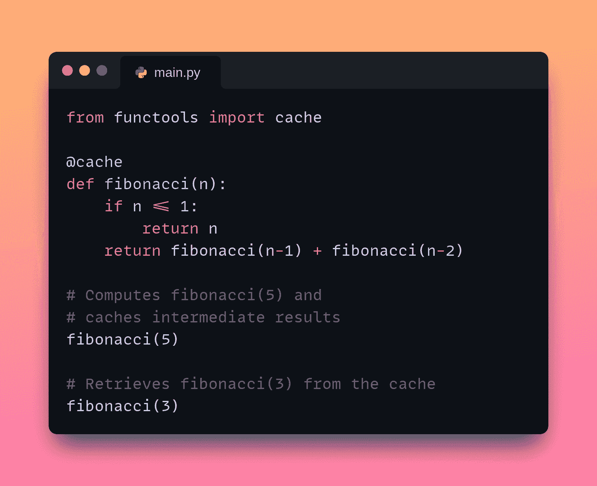

# 如何通过缓存加速 Python 代码

> 原文：[`www.kdnuggets.com/how-to-speed-up-python-code-with-caching`](https://www.kdnuggets.com/how-to-speed-up-python-code-with-caching)



图片来源：作者

在 Python 中，你可以使用缓存来存储昂贵函数调用的结果，并在函数使用相同参数再次调用时重复使用这些结果。这使你的代码更高效。

* * *

## 我们的前三大课程推荐

 1\. [谷歌网络安全证书](https://www.kdnuggets.com/google-cybersecurity) - 快速进入网络安全领域。

 2\. [谷歌数据分析专业证书](https://www.kdnuggets.com/google-data-analytics) - 提升你的数据分析技能

 3\. [谷歌 IT 支持专业证书](https://www.kdnuggets.com/google-itsupport) - 支持你的组织的 IT

* * *

Python 提供了通过 `functools` 模块内建的缓存支持：`@cache` 和 `@lru_cache` 装饰器。在本教程中我们将学习如何缓存函数调用。

## 为什么缓存有帮助？

缓存函数调用可以显著提高你代码的性能。以下是缓存函数调用可能有益的一些原因：

+   **性能提升**：当函数使用相同参数多次调用时，缓存结果可以消除冗余计算。这样，缓存的值可以被返回，导致执行速度更快。

+   **减少资源使用**：一些函数调用可能计算密集或需要大量资源（如数据库查询或网络请求）。缓存结果减少了重复这些操作的需求。

+   **响应性改善**：在响应性至关重要的应用程序中，例如 Web 服务器或 GUI 应用程序，缓存可以通过避免重复计算或 I/O 操作来减少延迟。

现在让我们开始编程吧。

## 使用 `@cache` 装饰器进行缓存

让我们编写一个计算第 n 个斐波那契数的函数。以下是斐波那契数列的递归实现：

```py
def fibonacci(n):
    if n <= 1:
        return n
    return fibonacci(n-1) + fibonacci(n-2) 
```

如果没有缓存，递归调用会导致冗余计算。如果缓存了值，查找缓存值会更高效。为此，你可以使用 `@cache` 装饰器。

Python 3.9+ 的 `functools` 模块中的 `@cache` 装饰器用于缓存函数的结果。它通过存储昂贵函数调用的结果并在函数用相同参数调用时重复使用这些结果来工作。现在让我们用 `@cache` 装饰器来包装函数：

```py
from functools import cache

@cache
def fibonacci(n):
    if n <= 1:
        return n
    return fibonacci(n-1) + fibonacci(n-2) 
```

我们稍后会进行性能比较。现在让我们看看另一种使用 `@lru_cache` 装饰器缓存返回值的方法。

## 使用 `@lru_cache` 装饰器进行缓存

你也可以使用内置的`functools.lru_cache`装饰器进行缓存。这使用了**最近最少使用 (LRU) 缓存机制**来处理函数调用。在 LRU 缓存中，当缓存满时需要添加新项时，会删除缓存中最近最少使用的项，以腾出空间给新项。这确保了最常用的项保留在缓存中，而较少使用的项被丢弃。

`@lru_cache`装饰器类似于`@cache`，但允许你指定缓存的最大大小——即`maxsize`参数。一旦缓存达到这个大小，最少使用的项会被丢弃。这在你想限制内存使用时非常有用。

在这里，`fibonacci`函数缓存了最多 7 个最近计算的值：

```py
from functools import lru_cache

@lru_cache(maxsize=7)  # Cache up to 7 most recent results
def fibonacci(n):
    if n <= 1:
        return n
    return fibonacci(n-1) + fibonacci(n-2)

fibonacci(5)  # Computes Fibonacci(5) and caches intermediate results
fibonacci(3)  # Retrieves Fibonacci(3) from the cache 
```

在这里，`fibonacci`函数使用`@lru_cache(maxsize=7)`装饰器，这指定了它应该缓存最多 7 个最近的结果。

当调用`fibonacci(5)`时，`fibonacci(4)`、`fibonacci(3)`和`fibonacci(2)`的结果被缓存。当随后调用`fibonacci(3)`时，由于`fibonacci(3)`是最近计算的七个值之一，它会从缓存中检索，避免了重复计算。

## 比较函数调用的时间

现在让我们比较有缓存和没有缓存的函数的执行时间。在这个示例中，我们没有为`maxsize`设置明确的值。因此，`maxsize`将被设置为默认值 128：

```py
from functools import cache, lru_cache
import timeit

# without caching
def fibonacci_no_cache(n):
    if n <= 1:
        return n
    return fibonacci_no_cache(n-1) + fibonacci_no_cache(n-2)

# with cache
@cache
def fibonacci_cache(n):
    if n <= 1:
        return n
    return fibonacci_cache(n-1) + fibonacci_cache(n-2)

# with LRU cache
@lru_cache
def fibonacci_lru_cache(n):
    if n <= 1:
        return n
    return fibonacci_lru_cache(n-1) + fibonacci_lru_cache(n-2) 
```

为了比较执行时间，我们将使用`timeit`模块中的`timeit`函数：

```py
# Compute the n-th Fibonacci number
n = 35  

no_cache_time = timeit.timeit(lambda: fibonacci_no_cache(n), number=1)
cache_time = timeit.timeit(lambda: fibonacci_cache(n), number=1)
lru_cache_time = timeit.timeit(lambda: fibonacci_lru_cache(n), number=1)

print(f"Time without cache: {no_cache_time:.6f} seconds")
print(f"Time with cache: {cache_time:.6f} seconds")
print(f"Time with LRU cache: {lru_cache_time:.6f} seconds") 
```

运行上述代码应该会得到类似的输出：

```py
Output >>>
Time without cache: 2.373220 seconds
Time with cache: 0.000029 seconds
Time with LRU cache: 0.000017 seconds 
```

我们看到执行时间有显著差异。没有缓存的函数调用执行时间更长，特别是对于较大的`n`值。而缓存版本（包括`@cache`和`@lru_cache`）的执行速度要快得多，且执行时间相当。

## 总结

通过使用`@cache`和`@lru_cache`装饰器，你可以显著加快涉及复杂计算或递归调用的函数的执行速度。你可以在 [GitHub](https://github.com/balapriyac/python-basics/tree/main/caching) 上找到完整的代码。

如果你在寻找关于使用 Python 进行数据科学的最佳实践的全面指南，请阅读 [5 Python Best Practices for Data Science](https://www.kdnuggets.com/5-python-best-practices-for-data-science)。

**[](https://twitter.com/balawc27)**[Bala Priya C](https://www.kdnuggets.com/wp-content/uploads/bala-priya-author-image-update-230821.jpg)**** 是一位来自印度的开发者和技术作家。她喜欢在数学、编程、数据科学和内容创作的交汇处工作。她的兴趣和专长领域包括 DevOps、数据科学和自然语言处理。她喜欢阅读、写作、编程和喝咖啡！目前，她正在通过撰写教程、操作指南、观点文章等方式，学习并与开发者社区分享她的知识。Bala 还创建了引人入胜的资源概述和编程教程。

### 相关话题

+   [加速 Python 代码的 3 种简单方法](https://www.kdnuggets.com/2022/10/3-simple-ways-speed-python-code.html)

+   [如何通过索引加速 SQL 查询[Python 版]](https://www.kdnuggets.com/2023/08/speed-sql-queries-indexes-python-edition.html)

+   [如何将 Python Pandas 加速超过 300 倍](https://www.kdnuggets.com/how-to-speed-up-python-pandas-by-over-300x)

+   [提高数据处理效率和速度的 5 个 Python 技巧](https://www.kdnuggets.com/5-python-tips-for-data-efficiency-and-speed)

+   [如何加速 XGBoost 模型训练](https://www.kdnuggets.com/2021/12/speed-xgboost-model-training.html)

+   [通过快速克里金（FKR）加速机器学习](https://www.kdnuggets.com/2022/06/vmc-speed-machine-learning-fast-kriging.html)
